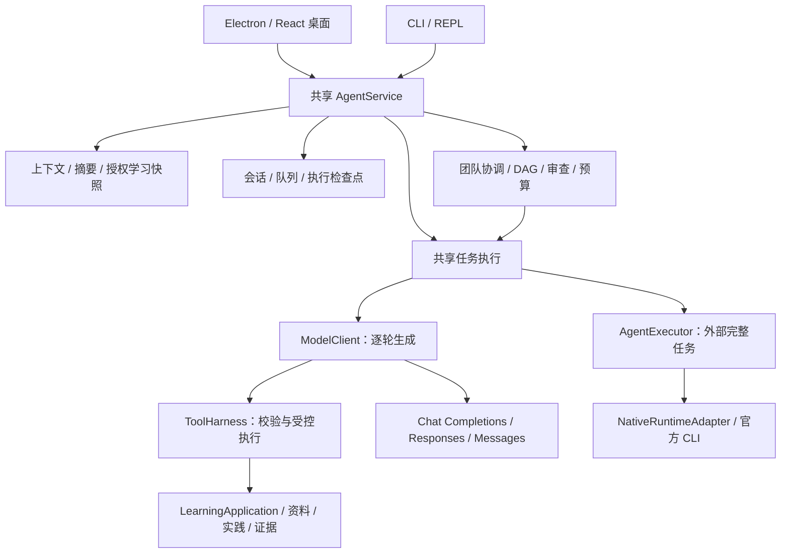

# 知行 Agent：设计与开发导航

知行是本地优先的学习 Agent。它用通用 Agent 的执行、工具、记忆和恢复能力，服务于学习者的独立解释、实践应用与延迟复习。本文是面向开发者和面试讲解的项目入口；仓库协作约束由 [AGENTS.md](AGENTS.md) 管理，本文不依赖任何工具自动加载。

本文按 `60570bc` 的代码核对。具体版本、已验证结果和待完成项统一见[当前状态](docs/current-status.md)，使用导航见[文档索引](docs/README.md)。

## 设计原则

1. **模型提出建议，程序执行并核实。** 模型生成答案、计划或工具请求；权限、输入校验、真实执行结果、完成条件和持久化由程序负责。
2. **入口共享策略。** 桌面与 CLI 都经过 AgentService；相同会话、主题、授权和模型配置应采用相同策略。入口差异仅限 UI、配置注入和存储位置，不复制一套教学或记忆算法。
3. **接入协议与学习领域解耦。** 同协议厂商通过配置加入；新协议或官方运行时通过适配器加入。模板数量不是接入白名单，也不是实测厂商数量。
4. **连续性优先。** 目标、消息、步骤、审批、模型绑定和失败状态可追踪；恢复需要新的请求，不能恢复已断开的网络流，也不能擅自重放结果未知的写操作。
5. **效果要有证据。** 文本完成、程序测试通过、答案正确、解释质量、学习者掌握是不同结论。团队模式默认不被认定优于单 Agent。
6. **本地优先与最小外发。** 普通会话按选定 Provider 发送，学习资料、项目、外部工具分别授权；密钥通过安全存储使用，不进入提示或报告。

## 系统分层



注意：CLI 宿主仍会提前拒绝超过 8,000 字符的输入，桌面/共享契约为 20,000；这是已发现待统一的入口限制，不能宣称所有入口行为完全一致。

这是模块化单体，不是部署在云端的多租户微服务集群。进程隔离用于模型 worker、官方运行时和受限工具，不意味着所有模块都是独立服务。当前官方运行时只接收有界文本上下文；知行没有因此开放官方 Agent 的任意本机工具。

## 核心模块与代码入口

| 领域 | 主要代码 | 应保持的约束 |
| --- | --- | --- |
| 会话与生命周期 | [AgentService](src/agent-service.ts)、[会话存储](src/agent-session-store.ts) | 单前台生成、排队、纠正、停止与恢复保持会话身份 |
| 模型执行 | [模型契约](src/model.ts)、[AgentExecutor](src/agent-executor.ts)、[模型工厂](src/agent-model-factory.ts) | 逐轮模型请求与外部任务执行分开表达 |
| 动态接入 | [API 模板](src/provider-catalog.ts)、[协议客户端](src/protocol-model-client.ts)、[原生目录](src/native-runtime-catalog.ts)、[适配器注册](src/native-runtime-adapters.ts) | 明确能力与认证；不静默改用其他账号或付费通道 |
| 长对话与记忆 | [会话上下文](src/conversation-context.ts)、[窗口预算](src/context-window.ts)、[摘要](src/conversation-summary.ts)、[学习上下文](src/learning-context.ts) | 保存原文与选择模型输入分离，工具请求/结果成对保留 |
| 工具与权限 | [ToolHarness](src/tool-harness.ts)、[权限](src/agent-permissions.ts)、[应用工具](src/application-tools.ts) | 模型输出不授予权限，工具回执必须来自实际执行 |
| 恢复与幂等 | [执行存储](src/agent-execution-store.ts)、[任务执行](src/task-execution.ts)、[连续性](src/task-continuity.ts) | 区分失败、已完成和结果未知，避免重复副作用 |
| 三种模式 | [团队协调](src/team-coordinator.ts)、[任务图](src/team-task-graph.ts)、[资源策略](src/team-resource-policy.ts) | 默认单 Agent；团队固定成员身份、受预算/权限约束、可定向恢复 |
| 学习与资料 | [学习应用](src/learning-application.ts)、[资料库](src/library.ts)、[检索](src/semantic-retrieval.ts) | 主题隔离、可定位引用、资料来源与授权可追溯 |
| 实践与验收 | [实践项目](src/practice-projects.ts)、[证据](src/evidence-store.ts)、[学习结果](src/learning-outcomes.ts) | 产物完整性、测试成绩与掌握程度分开记录 |
| 桌面边界 | [IPC 契约](desktop/core/contracts.ts)、[主进程](desktop/electron/main.ts)、[preload](desktop/electron/preload.ts) | renderer 通过受校验桥接调用，不获得任意文件与凭据访问 |

详细契约见[架构](docs/architecture.md)、[记忆设计](docs/agent-memory.md)、[团队设计](docs/agent-team-kernel.md)和[模型接入](docs/provider-architecture.md)。

## 一次任务如何运行

1. 入口把用户输入、模型选择和显式授权交给共享服务；服务保存用户消息和执行状态。
2. 固定本轮模型身份，选择有界历史、目标与摘要；按授权加入当前主题学习信息。
3. API 模型通过受控循环生成文本或工具请求；工具经校验和权限检查后执行，真实观察反馈给模型。原生执行器使用自身协议完成文本任务。
4. 团队模式在同一内核上增加分工、成员执行、逐项核查和综合；失败可触发有界补做，成员完成不等于结论正确。
5. 应用核对终止条件与执行证据，保存 completed、failed、interrupted 或 blocked 等状态；界面显示对应消息与可用后续操作。
6. 恢复时读取检查点并重新检查权限、模型和产物有效性；对不能确认的外部副作用保守处理。

## 如何扩展

同协议 API 在设置里添加连接即可。新的协议需要实现 ModelClient；新的官方 CLI 需要 NativeRuntimeAdapter、目录与注册项，以及认证、版本、取消、隔离和解码测试。SDK / App Server 可以实现 AgentExecutor，不必伪装成 CLI。当前实现不支持从任意远程地址加载可执行插件。

新教学能力优先扩展共享领域契约和工具，随后连接两端 UI。不得在 renderer 或 CLI 中各写一套最终 prompt、记忆选择或审批规则。新增团队策略必须与同模型单 Agent、额外自检和等预算方案比较，保留失败样本与实际资源消耗。

## 开发与验证

Node.js 版本要求为 `24.8.x`。项目有根目录与桌面两套依赖：

```bash
npm ci
npm ci --prefix desktop
npm run verify
```

桌面交互变更还需 `npm --prefix desktop run test:ui`；交付包需要针对实际构建验证。行为变更先写能复现失败或边界的测试，再实现和回归。纯文档任务核对源码、命令、引用、链接及版本，按项目约束运行 verify，不把历史 UI 或真实模型记录说成重跑。

关键测试入口：[两端架构边界](tests/agent-architecture-boundary.test.ts)、[统一策略](tests/unified-agent-policy.test.ts)、[原生扩展](tests/native-extensibility.test.ts)、[协议](tests/provider-protocols.test.ts)、[团队恢复](tests/team-task-recovery.test.ts)、[预算](tests/team-resource-policy.test.ts)。

## 能证明与不能证明的内容

可以展示共享内核、动态多协议接入、官方 Codex 文本执行、三模式团队、上下文预算、受控工具和持久恢复的实现与测试。三家最小真实连接、固定题质量对照和实际包 UI 有各自独立证据。

不能据此宣称已实现任意订阅通用登录、所有厂商账号可用、团队普遍提高正确率、云端高并发生产服务或已证明教学效果。正式分发签名/公证、安装状态和最新 CI 也必须分别查询。[面试资料](docs/interview/README.md)提供基于这些边界的讲解与追问题。
