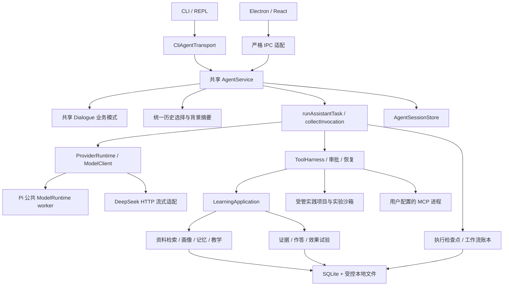

> 本文保留 2026-09-08 修复前的架构评审快照。后续 N01–N10 的修复与条件性扩展结论见[实施计划](architecture-remediation-plan.md)和[执行证据](evidence/architecture-remediation.md)；当前设计以[统一记忆文档](agent-memory.md)等维护文档为准。

> 后续实现与当前验收见[0.9 收口记录](evidence/completion-0.9.md)；本文保留评审时点，不将已完成项目重新标为待开发。

# 知行核心设计评审：与 Codex、Claude Code 的架构对比

> 历史计划或版本记录：下文保留当时的设计、范围及验证结果，不是当前功能清单或新的开发指令。现行实现、已完成的后续改动与待验收项见 [当前状态](current-status.md) 和 [文档导航](README.md)。

> 核对日期：2026-09-08。对象：本地 Zhixing 源码，桌面包 0.7.0、根包 0.1.0。
> Git 基线：`32decd4fdb21f9a473d033fc71ef2045a5912e20`，包含尚未提交的 0.7 改造。
> 源码 codeHash：`ec289e9aacd254316322629ee1176a96dbbb3d6df797446d89dc07b090c3c511`，337 个受构建来源规则管理的文件。
> 本文中的“当前”指上述源码快照，不代表 GitHub、已安装应用或未来版本。本文是设计评审，没有实施下文的新优化建议。

## 1. 结论与评审口径

**知行适合继续采用“共享 Agent 内核 + 教学领域服务 + 多模型适配 + 薄交互入口”的架构。当前方向合理，但还不能称为最佳实现，更没有证据证明教学效果优于直接使用 Codex 或 Claude Code。**

已经完成的统一内核、原生工具调用、持久检查点、审批恢复、独立权限、任务验证，不应重新列成“从零开发”的任务。进一步优化应集中在真实边界和效果证据上：摘要覆盖完整性、记忆召回、模型预算、教学策略评价、长任务调度、外部进程边界和日常使用体验。

“最佳”需要说明适用条件。本文按以下标准评估，而不做缺乏测量依据的百分制排名：

| 判断标准 | 对知行的含义 |
| --- | --- |
| 教学收益 | 用户能独立解释、迁移应用，并在之后保留理解；模型完成任务不能代替用户学会 |
| 正确与可恢复 | 记录对应真实输入和工具结果；取消、崩溃和重试不会伪造成功或重复不确定写入 |
| 自然与可控 | 能直接回答、接受纠正、调整帮助程度；权限和学习状态有明确边界 |
| 连续性与性能 | 长对话仍保留目标、纠正和必要依据；速度、费用、信息损失可测量 |
| 可维护性 | 两端共用策略；新 Provider、工具和领域规则不要求复制整条执行链 |
| 适度复杂度 | 新机制带来的收益足以抵偿调试、平台适配和维护成本 |

本文将“核心模型”同时展开为三类：**大模型与嵌入模型、核心数据/状态模型、执行与教学策略模块**。知行没有自行训练基础大模型；其自主设计主要在运行时、状态、工具和教学闭环。

证据分为：**源码事实**、**官方公开行为**、**评审判断/改进建议**。设计原因中，README 已明确的目标属于产品决策；对具体实现为何采用某种写法的解释属于基于代码的工程推断，不冒充作者历史决策。

Codex 对比采用公开 App Server 协议及官方产品文档；Claude Code 对比采用官方产品文档和 Agent SDK 契约。没有逐行审计两个商业产品的全部实现，也无法验证其未公开的服务端、训练和调度算法。OpenAI 部分原 `developers.openai.com/codex/` 页面已跳转到 `learn.chatgpt.com/docs/`；下文使用实际核对后的地址。不同客户端、平台、账号及配置的可用功能不一定相同。

## 2. 三者的设计理念

| 产品 | 公开定位或本地明确目标 | 可以借鉴的原则 | 对知行的启示 |
| --- | --- | --- | --- |
| 知行 | 本地优先，帮助自主学习者形成独立能力；模型灵活教学，程序保证记录可靠 | 将学习表现、帮助程度与任务产物分别记录 | 教学状态与效果验证应成为一等业务对象，见 [README](../README.md) |
| Codex | 在工作环境中执行任务，通过工具、上下文和可验证目标持续推进 | 清晰的会话/执行边界；可控自主性；长任务可纠正 | 借鉴运行工程，不把增加工具数量当成教学收益。[长期任务][O7] |
| Claude Code | 围绕任务反复获取上下文、行动和验证；多种界面使用同一底层 Agent 循环 | 界面与执行循环分离；可扩展工具与工作流程 | 桌面和 CLI 共用策略是架构基础；界面可以各自适配。[工作原理][A1] |

通用 Agent 可以通过技能和工具完成教学；知行的差异在于将教学记录、练习、复习和效果评价做成默认产品闭环。只有这个闭环带来实际学习收益，专用 Agent 的持续维护成本才有充分理由。

## 3. 当前架构与数据流

图表示主要调用关系，不表示所有组件都在同一 OS 进程：Pi 模型调用、实验、MCP 是不同子进程边界；其中实验沙箱的限制不会自动覆盖 MCP。两端共享代码和业务策略，也不等于自动共享全部聊天文件、偏好和当前模型配置。

### 3.1 核心数据模型

| 数据模型 | 关键内容 | 主要事实来源/存储 | 不能混淆的概念 |
| --- | --- | --- | --- |
| `ChatSession / ChatMessage` | 会话、消息状态、目标、约束、摘要、权限、待处理输入、教学模式 | [agent-session-contracts.ts](../src/agent-session-contracts.ts)、[AgentSessionStore](../src/agent-session-store.ts)，会话 JSON v6 | 持久历史不等于每次全部进入模型 |
| 执行检查点 | task/session/topic 身份、工具调用 ID、历史结果、pending 阶段、决策和租约 | [AgentExecutionStore](../src/agent-execution-store.ts)，SQLite | “准备执行”与“已执行但结果未知”必须区分 |
| 任务与操作记录 | 计划、步骤、产物、运行状态、操作凭据 | [TaskExecutionStore](../src/task-execution.ts)、[WorkflowLedger](../src/workflow-ledger.ts) | 计划文本、运行事件和最终完成状态各有职责 |
| 权限模型 | 学习资料许可、项目 ID、外部配置修订号、具体写入许可 | [agent-permissions.ts](../src/agent-permissions.ts) | 对话中的同意文字本身不能绕过程序校验 |
| 主题/课程/进度 | topic、day、任务、前置依赖、进度 | [runtime.ts](../src/runtime.ts)、[plan-schema.ts](../src/plan-schema.ts)、[topic-store.ts](../src/topic-store.ts) | 完成课程工作流不等于掌握知识 |
| 教学检查点 | 当前 day、阶段、题目、练习轮次、学习者尝试 | [teaching-session-store.ts](../src/teaching-session-store.ts) | 当前主要按主题保存，不是每个聊天分支各自一份 |
| 画像/显式记忆/学习观察 | 用户目标与基础、带来源的记忆、真实检查作答及修订 | [learning-profile.ts](../src/learning-profile.ts)、[database.ts](../src/database.ts)、[learning-observations.ts](../src/learning-observations.ts) | 用户自报、模型摘要、实际作答是不同证据等级 |
| 资料与引用 | 文档、片段、页码/锚点、内容版本/哈希、索引 | [library.ts](../src/library.ts)、[source-version.ts](../src/source-version.ts) | 引用位置有效，不代表该来源支持整段结论 |
| 实践产物 | 文件树、版本、差异、快照、测试对应的 treeHash | [practice-projects.ts](../src/practice-projects.ts)、[evidence-store.ts](../src/evidence-store.ts) | 旧版本测试通过不能证明新版本通过 |
| 评估与效果试验 | 前/后/延迟检查、帮助程度、协议、构建和模型条件 | [outcome-contracts.ts](../src/outcome-contracts.ts)、[learning-outcomes.ts](../src/learning-outcomes.ts) | 合成测试、模型回答评分和真实学习效果分别评价 |

### 3.2 全部核心设计的评审索引

下文按职责覆盖 28 个模块组；同组中的小工具函数、序列化和路径辅助文件不另立一个“核心模型”。

| 编号 | 核心模块 | 本次判断 |
| --- | --- | --- |
| M01 | 共享应用内核与入口边界 | 保留；已经完成策略统一，继续强化边界门禁 |
| M02 | 契约、事件与结果模型 | 保留；统一结果语义和兼容返回值 |
| M03 | 基础模型与 Provider 适配 | 保留；模型服务与 Agent 运行时分工正确 |
| M04 | 推理档位、延迟与成本策略 | 优化；按任务测量，避免固定映射替代校准 |
| M05 | 模型—工具执行循环 | 保留；预算应支持可控续航 |
| M06 | 计划、任务和完成判断 | 保留；收敛旧交互草案与任务状态的表达 |
| M07 | 工具契约与按需发现 | 保留；不需要为成熟度而引入任意工具执行 |
| M08 | 权限与信任边界 | 保留；明确应用权限与 OS 进程权限的区别 |
| M09 | 检查点、恢复和副作用核对 | 保留；继续以故障注入验证，不承诺普遍恰好一次 |
| M10 | 短期记忆与历史回读 | 优化；有界上下文正确，但截断仍会丢失模型可见信息 |
| M11 | 摘要与 Token 预算 | 优先修正覆盖边界，再改进触发策略 |
| M12 | 长期记忆与画像 | 优化召回；不急于全面自动记忆 |
| M13 | 教学对话状态机 | 保留；逐步减少意图歧义和额外分类请求 |
| M14 | 学习者状态与教学决策 | 保留可解释基线；最优教学策略尚未验证 |
| M15 | 实践证据与课程 Review | 保留；增加证据充分性和评阅质量验证 |
| M16 | 学习效果试验 | 重点投入；实现流程不能代替真实研究结果 |
| M17 | 资料导入与检索 | 保留小规模本地方案；根据召回实测升级 |
| M18 | 引用、事实支持与回答修复 | 保留明确边界；补语义质量评测 |
| M19 | 实践项目、版本与实验沙箱 | 对入门练习适用；跨平台和复杂实践仍有限 |
| M20 | Skill 与课程扩展 | 保留版本机制；是否扩成插件体系取决于需求 |
| M21 | MCP 外部工具 | 能力可用；信任与隔离需分层说明 |
| M22 | 桌面/终端交互与输出 | 已有完整基础；用用户任务衡量自然程度 |
| M23 | 持久化、迁移与备份 | 保留本地优先；减少跨存储协调复杂度 |
| M24 | 可观测性、质量 Eval 与回归 | 保留；完善在线真实性和独立质量评价 |
| M25 | 桌面封装与分发 | 适合预览交付；尚非完整商业分发方案 |
| M26 | 队列、后台维护与并发 | 对单人教学适用；长期任务需要明确调度策略 |
| M27 | 命令路由与兼容层 | 继续收敛；不能再次在入口复制核心策略 |
| M28 | 本地同步与提醒 | 范围有限；不要当作多端同步和后台调度系统 |

## 4. 通用 Agent 内核

### M01. 共享应用内核与入口边界

**当前设计。** `desktop/core/service.ts` 直接将 `AgentService` 导出为 `DesktopService`；CLI 经 `CliAgentTransport` 调同一个服务。普通问答、教学与规划的业务模式进入共享请求，前端不能提供最终 prompt、历史或自定义 runtime。[源码](../src/agent-service.ts)、[CLI 适配](../src/cli-agent-transport.ts)、[架构门禁测试](../tests/agent-architecture-boundary.test.ts)。

**理念与原因。** 将状态、权限、上下文和执行生命周期放在一个事实来源中，使交互入口增加时不再产生两套策略。这正是 0.7 已完成的架构改造。

**对比。** Codex App Server 提供面向丰富客户端的认证、历史、审批和事件接口；Claude Code 官方说明各界面使用相同底层执行循环。[Codex App Server][O1]、[Claude Code 工作原理][A1]。

**是否最佳。** 对当前规模属于优先保留的方案。共享类已经保证主要逻辑一致，但不是完整的模块封装证明：`AgentService` 为 691 行，CLI 为 961 行，桌面主视图为 1,524 行，说明职责仍较集中；行数本身不证明缺陷。后续可在共享内核内部拆出生命周期、维护和交互协调，保持一个公共入口。现有静态门禁检查指定入口及直接依赖，不能代替任意未来模块的全依赖图约束。

### M02. 契约、事件与结果模型

**当前设计。** TypeScript/Zod 校验请求、会话、工具、模型事件和 IPC；持久消息区分 completed、waiting、blocked、failed、interrupted。`invoke` 是 `send` 的阻塞适配，观察回调失败被隔离。[契约](../src/agent-session-contracts.ts)、[服务](../src/agent-service.ts)。

**理念与原因。** 用程序协议表达状态，让界面不必从自然语言猜“是否完成”。

**对比。** Codex 公开协议采用 thread、turn、item 生命周期；Claude Agent SDK 提供不同消息类型及结果状态。[Codex 协议][O1]、[Claude SDK 循环][A2]。

**是否最佳。** 方向合理，结果契约有具体改进点：`AgentService.invoke` 第 66 行仍返回 `events: 0, toolResults: []` 作为兼容值，真实统计在消息 timings、执行记录与审计中。应改为显式的摘要结果或引用持久结果，避免未来调用方把兼容值理解为“实际没有调用工具”；不能据此说现有全部遥测不真实。

### M03. 基础模型与 Provider 适配

**当前设计。** 两端通过 `createAgentModel` 装配 Pi Codex / DeepSeek。Pi 共用 `src/pi-model-worker.ts`，使用 Pi 0.85.0 公共 `ModelRuntime.streamSimple`，只传模型消息和工具 schema，工具由知行执行。DeepSeek 使用 HTTP 流式与原生工具续轮；当前源码默认字符串为 `deepseek-v4-flash`，并非本次对线上模型可用性的实测。CLI 还保留 mock 和 `codex-cli` 文本兼容，桌面提供 demo。[模型工厂](../src/agent-model-factory.ts)、[Pi worker](../src/pi-model-worker.ts)、[DeepSeek](../src/deepseek-client.ts)。

**理念与原因。** 复用模型和认证生态，自己掌握领域状态及工具权限。**接入 Codex 模型不等于接入完整 Codex Agent**；Pi worker 没有承接 Codex App Server 的整个运行时。

| 模型/适配类型 | 当前选择方式 | 职责与限制 |
| --- | --- | --- |
| Pi Codex 基础模型 | 从 Pi 设置读取 `defaultProvider/defaultModel/defaultThinkingLevel`，要求 Provider 为 `openai-codex`；知行不写死某个 GPT 型号 | 生成文本和工具调用；本文只核对设置读取代码，没有读取用户当前设置或验证账号 |
| DeepSeek 基础模型 | 构造参数/配置选择；适配器默认 `deepseek-v4-flash` | 流式文本与工具；实际可用模型、余额及延迟需另做真实请求验证 |
| `codex-cli` 兼容适配 | 旧 CLI Provider 路径 | 文本兼容能力，不能与当前 Pi 公共 SDK 工具路径混为一谈 |
| mock / desktop demo | 本地合成输出 | 验证产品流程，不代表真实教学或推理能力 |
| HashEmbedding / 可选 Ollama | 本地确定性投影 / 用户配置的真实嵌入模型 | 检索辅助，不负责教学对话，详见 M17 |

认证与模型配置分开：Pi 认证由其 SDK 处理；DeepSeek 经 `SecretStore` 使用密钥，CLI 使用 macOS Keychain，桌面通过 Electron safeStorage 加密并保留受控的 macOS 旧 Keychain 兼容；Linux 桌面加密可用性在当前实现中被禁用。路由文件只保存非敏感 Provider 选择。`ZHIXING_ALLOW_LIVE_PROVIDER=0` 阻止真实模型请求；它不是隔离所有本地进程网络访问的 OS 防火墙。[Pi 选择规则](../src/pi-client.ts)、[密钥适配](../desktop/electron/secrets.ts)、[路由](../src/model-routing-store.ts)、[联网开关](../src/provider-policy.ts)。

**对比。** Codex 可以通过 App Server 嵌入完整执行能力；Claude Agent SDK 也提供现成 Agent 循环。Claude Code 允许配置模型及推理档位。[Codex 集成][O1]、[Claude SDK][A2]、[Claude 模型设置][A8]。

**是否最佳。** 在“必须支持 Pi 订阅路径和 DeepSeek，并统一教学策略”的约束下，这个分工合理。正常聊天/教学不静默切换 Provider，能避免上下文外发对象和行为悄然变化。将来若引入另一完整 Agent SDK，应明确谁拥有工具与恢复状态；两个运行时都管理同一任务会显著增加协调难度。当前不建议全面替换。

### M04. 推理档位、延迟与成本策略

**当前设计。** quick/balanced/deep 和基于关键词、长度、执行场景的 auto 选择；两种 Provider 做各自映射。Pi 每次模型请求启动 worker，记录启动、请求、首事件、首文本和进程尾部耗时；DeepSeek 直接走网络流。Pi 外层默认 150 秒、worker 145 秒，DeepSeek 默认 60 秒，上层调用还有总预算。[效率策略](../src/agent-efficiency.ts)、[Pi 客户端](../src/pi-application-client.ts)、[遥测](../src/model-telemetry.ts)。

**理念与原因。** 独立 worker 便于取消和故障隔离；简单档位易于理解。代价是重复启动及粗粒度推理选择。

具体映射也影响可比较性：当前 Pi quick 改为 low、deep 改为 high，balanced 保留 Pi 中已选 thinking；DeepSeek quick 关闭 thinking，balanced/deep 使用不同 reasoning_effort。档位名称一样，不保证两条链路推理量一样；Pi 的 deep 也不表示其 SDK 可支持的最高强度。[Pi 映射](../src/pi-application-client.ts)、[DeepSeek 请求](../src/deepseek-client.ts)。

**对比。** Codex 有模型、推理和上下文配置；Claude Code 也区分模型与 effort，官方明确相同档位名称不代表跨模型相同强度。[Codex 配置][O4]、[Claude effort][A8]。

**是否最佳。** 未经相同问题、相同模型和相同网络条件的测量，无法判断哪条链路更快。应按问题类型测量首文本、总耗时、Token 和回答质量的分布，再考虑复用 worker。若启动只占很小比例，常驻化收益有限；若长任务有多次显著启动成本，可尝试单会话 worker，并验证取消、空闲回收、配置刷新和故障重启。不要把网络等待全部归因于知行架构。

### M05. 模型—工具执行循环

**当前设计。** `runAssistantTask → collectInvocation → ProviderRuntime`；先校验完整模型轮次，再执行工具，把结果按调用 ID 回传。默认最多 6 轮；连接项目的任务可到 12 轮；共同受 32 次工具请求、10,000 事件、64,000 输出字符、128,000 上下文字符和 180 秒调用预算限制。`LoopGuard` 识别重复行为，读取状态改变后可以再次读取。[执行装配](../src/assistant-runtime.ts)、[循环](../src/model-invocation.ts)、[循环守卫](../src/loop-guard.ts)。

**理念与原因。** 保证模型能够行动、观察和修复，同时给开放式任务设资源边界。

**对比。** Claude SDK 公开模型决策与工具结果回送循环及轮次/费用限制；Codex 长期目标支持持续执行与过程纠正。[Claude SDK][A2]、[Codex 长期任务][O7]。

**是否最佳。** 对一轮教学或小练习合适，对复杂实践固定配额可能过早终止。改进应是“预算耗尽后保留检查点，按明确规则续航”，而非直接移除上限。时间、Token、操作数、目标进度应分别建模；后台任务不能仅靠不断重试来模拟持久调度。

### M06. 计划、任务和完成判断

**当前设计。** 任务计划、步骤、产物、操作及测试结果进入持久状态；模型不能仅靠一句“已完成”越过未完成计划和实际产物检查。CLI 还保留自然语言草案解析、预览、确认等交互状态。[任务状态](../src/task-execution.ts)、[应用工具](../src/application-tools.ts)、[CLI](../src/cli.ts)。

**理念与原因。** 可执行计划与最后的文字说明分离，防止对话成功掩盖操作失败。

**对比。** Codex 的目标强调结果、约束和验证；Claude Code 通过执行与验证迭代完成任务，并提供任务编排工具。[Codex 目标][O7]、[Claude 扩展机制][A6]。

**是否最佳。** 完成门禁应保留；进一步把“课程计划”“当前任务计划”“尚未确认的界面草案”清楚命名，减少用户和维护者混淆。CLI 草案确认保存在入口的部分状态，不应被说成桌面/CLI 所有业务交互已逐项等价；它也不意味着记忆策略仍然分叉。

### M07. 工具契约与按需发现

**当前设计。** `ToolHarness` 负责 schema、风险、超时、回放与并行策略，输出截断后可分页回读；practice/skills/project/external 分类按需发现。默认仅明确可并行的安全读取允许小规模并发。[ToolHarness](../src/tool-harness.ts)、[按需目录](../src/agent-efficiency.ts)、[结果存储](../src/tool-result-store.ts)。

**理念与原因。** 把工具使用从“模型输出一段命令”升级为受检查的能力调用；按需目录减少上下文成本。

**对比。** Codex Skills 渐进加载，MCP 扩展外部能力；Claude Code 的扩展与工具发现也强调按需加载。[Codex Skills][O8]、[Codex MCP][O9]、[Claude 扩展][A6]。

**是否最佳。** 适合当前几十个领域工具。更大的工具库才需要检索式发现和权限域索引；不应为了像编程 Agent 就立即开放任意 shell。需要持续验证分类发现不会增加不必要轮次或使模型找不到工具。

### M08. 权限与信任边界

**当前设计。** 资料、选定项目、外部配置分别授权；写入审批与工具输入、资源绑定，撤权会处理未执行的旧许可。资料和工具输出作为低信任观察，权限由程序执行。路径受 `PathPolicy` 及受控 Store 限制。[权限](../src/agent-permissions.ts)、[路径](../src/paths.ts)、[权限说明](session-permissions.md)。

**理念与原因。** 让用户能授权连续工作，同时阻止资料中的指令改变工具权限。

**对比。** Codex 区分 OS 沙箱和审批政策；Claude Code 也明确权限由运行程序执行，提示文件不能授予权限。[Codex 沙箱][O5]、[Claude 权限][A3]。

**是否最佳。** 领域权限模型应保留。它控制知行允许调用什么，不等于所有外部程序都受 OS 限制。尤其 MCP 是用户选择启动的程序，必须单独评估其文件/网络访问面，见 M21。提示注入不能仅凭“低信任观察”标记宣称完全解决；测试应覆盖真实工具权限绕过路径。

### M09. 检查点、恢复和副作用核对

**当前设计。** 保存完整工具调用 ID 与结果配对、pending 的 ready/executing/waiting 阶段；任务与会话租约防止并发覆盖。失败后可恢复同一 task，未知外部写入先核对服务端结果或操作凭据，不能直接重放。[执行存储](../src/agent-execution-store.ts)、[任务连续性](../src/task-continuity.ts)、[MCP 核对](../src/mcp-recovery.ts)。

**理念与原因。** 将“模型不知道结果”和“操作没有发生”分开，防止重试产生重复副作用。

**对比。** Codex 公开线程恢复/分支接口；Claude Code 支持会话恢复和文件检查点，但其检查点不覆盖任意 Bash 修改，更不能撤销远程副作用。[Codex 协议][O1]、[Claude 检查点][A5]。

**是否最佳。** 当前是应保留的关键能力。不能推断知行恢复比商业 Agent 更可靠，也不能把本地事务扩展为任意外部服务“恰好一次”。持续增加执行前、执行中、执行后未保存三个阶段的故障注入和人工核对场景，比重写恢复框架更有价值。

## 5. 记忆、上下文和教学

### M10. 短期记忆与历史回读

**当前设计。** 共享 `buildMessages` 组织系统规则、目标/约束、摘要、近期历史、当前问题；近期最多 24 条，目标与历史约 40,000 字符，单条摘录最多 6,000 字符。保留最近明确 steer 纠正和未完成任务提示，提供对话原文和执行历史分页工具。CLI 六轮历史只作兼容投影。[历史选择](../src/conversation-context.ts)、[共享消息](../src/learning-agent-profile.ts)、[回读](../src/execution-history.ts)。

**理念与原因。** 持久记录完整保存到存储限额；模型只拿本次有用的有界视图，避免每次发送全部历史。

**对比。** Codex 支持持久线程及历史压缩；Claude Code 区分持久会话与当前模型上下文，也允许恢复和分支。[Codex 协议][O1]、[Claude 会话与上下文][A1]。

**是否最佳。** 有界模型视图是合适设计，但首尾摘录仍可能省掉消息中间的关键约束；原文可回读也依赖模型主动发现缺失。应以“较早纠正、长代码中段事实、多次需求改变”评价召回，逐步增加结构化约束与任务事实索引。会话最多 1,000 条、文件最多 12,000,000 字节，不应称为无限历史。

### M11. 摘要与 Token 预算

**当前设计。** 正常会话完成且队列为空后后台摘要；新输入取消维护，保存时核对消息/目标/约束，避免旧结果覆盖新状态。效果试验会话不参与该维护。摘要读取排除最新两条后的历史，达到 20 条且满足尝试间隔才触发；再排除最近 6 条，对更早历史中的最后 24 条各摘录 1,200 字符，连同旧摘要生成新摘要。摘要上限 4,000 字符、20 秒。[`compact`，第 526 行起](../src/agent-service.ts)。

Token 预算默认 48,000，预留输出 16,384；使用字符估算及用量反馈校准，按完整工具轮次移出旧内容，必要上下文超限时在工具副作用前停止。共享能力声明属于 adapter policy；Pi worker 还会依据实际模型元数据取较小上限，故不能说完全忽略真实窗口，也不能把 48,000 说成基础模型的最大窗口。[预算](../src/context-window.ts)、[能力声明](../src/model-capabilities.ts)、[worker](../src/pi-model-worker.ts)。

**理念与原因。** 摘要在后台降低后续请求负担，预算门禁防止超限后再发生工具副作用；两者都保留原始持久记录。后台机制改善响应路径，但必须准确表达究竟整理了哪些历史。

**对比。** Codex 配置公开基于 Token 阈值的自动压缩；Claude Code 在接近上下文上限时清理旧工具输出并按需摘要。二者的存在不证明摘要无损。[Codex 配置][O4]、[Claude 上下文][A1]。

**是否最佳。** 当前还不是最佳实现，存在已复现的覆盖边界：在 50 条消息、没有旧摘要时，实际调用现有 `compact`，合成模型收到 **M19–M42 共 24 条**，但 `summaryThroughId` 标为 **M42**。后续 `buildMessages` 按该位置过滤历史，摘要来源元信息却表达从第一条到 M42；M1–M18 没被这次摘要读取。原来的 50 条消息仍保存，问题是模型可见摘要及覆盖标记，不是磁盘删除。积压历史、连续排队或多次摘要未成功后可能触达此条件；本次使用合成输入，没有真实模型请求。

优先改为**只标记实际连续覆盖的区间**，分批消化未摘要历史，缺口显式记录；再用预算压力与任务阶段触发补充现有条数策略。应分别验证覆盖完整性、纠正保留、取消竞态和摘要费用。背景摘要和预算门禁本身已经实现，建议不等于重新开发这两个模块。

### M12. 长期记忆与画像

**当前设计。** 画像按主题保存；显式记忆保留来源，并要求用户记忆经确认，支持软删除；学习观察来自实际检查提交，支持修订/撤回。授权后每轮重新读取，记忆最多 3 条、每条最多 1,500 字符。当前记忆检索将整个 query 放入 SQL `LIKE`，没有命中则取最近记录。[快照](../src/learning-context.ts)、[记忆表与查询](../src/database.ts)、[学习观察](../src/learning-observations.ts)。

**理念与原因。** 避免把模型推断直接变成长期掌握结论，让记忆可以追溯和纠正。

**对比。** Codex 本地记忆可从符合条件的旧会话后台生成，使用与贡献可分别控制；官方当前说明本地记忆默认关闭。Claude Code 区分人工 `CLAUDE.md` 和自动记忆，后者记录偏好及工作经验。[Codex Memories][O3]、[Claude Memory][A4]。

**是否最佳。** 对学习者状态，保守写入优于默认把对话理解成事实；但整句包含匹配加最近记录回退过于粗糙，容易漏掉相关旧记忆。优先做关键词/概念召回、来源有效性、纠正冲突和撤回测试。自动记忆可以先做“候选记录 → 可检查确认 → 有来源生效”，不必照搬通用 Agent 的默认策略。删除长期记忆也不会自动改写已经发送过的聊天历史，应在产品中解释清楚。

### M13. 教学对话状态机

**当前设计。** `mode=chat|lesson` 与 `purpose=answer|planning|intent|guidance` 是共享契约；教学模块仅追加领域指令，不重新选择历史。教学动作区分讲解、提示、练习、参考答案和学习者作答，模糊输入可经过有界模型分类；只有成功完成的相应教学响应才提交后续状态，参考答案不算用户作答。按主题租约防止两端同时推进同一检查点。[教学接入](../src/agent-dialogue.ts)、[动作解释](../src/teaching-dialogue.ts)、[轮次提交](../src/teaching-turn.ts)。

**理念与原因。** 让自然对话保持自由，同时保护作答归属和教学进度。

**对比。** Codex 可借助 Skills、Claude Code 可借助 Skills/子任务组织教学，但本文所核对的公开文档没有提供与知行相同的内置课程状态契约。[Codex Skills][O8]、[Claude 扩展][A6]。这表示产品默认模型不同，不表示商业 Agent 不能教学。

**是否最佳。** 状态机应保留，模糊意图的额外分类请求可能影响延迟和自然程度，应测量触发率及误判。当前教学检查点按主题共享，适合“一主题一条学习进度”，但并行开两个教学聊天或分支时不是独立课堂；若用户需要独立学习路径，应显式引入 learningSession 身份，不能只复制聊天消息。

### M14. 学习者状态与教学决策

**当前设计。** 知识点目录和真实作答形成可解释状态：未观察、需要练习、独立作答证据、借助帮助、需要复核等；据此建议解释、正反例、引导练习或迁移练习。当前请求提示/答案优先。它是规则策略，不是训练过的知识追踪模型；读取的观察及每概念来源数量都有上限。[教学策略](../src/teaching-policy.ts)、[知识点](../src/learning-concepts.ts)、[变式题](../src/assessment-variants.ts)。

**理念与原因。** 在样本有限时保持可解释，不用一个不透明“掌握分数”替代具体证据。

**对比。** Codex 与 Claude Code 的公开记忆主要用于后续任务上下文和工作经验；本文未发现可直接对照的、内置学习者知识追踪契约。[Codex 记忆][O3]、[Claude 记忆][A4]。

**是否最佳。** 这是合理基线，不是已证实最有效的教学政策。最新一次答错/答对和自报帮助程度有噪声；规则匹配、题库覆盖及有限观察窗口也会影响建议。应优先通过真实教学数据比较“当前规则”“固定教学流程”“仅回答用户问题”，再决定是否增加遗忘模型或统计知识追踪。没有校准数据时，更复杂模型未必更好。

### M15. 实践证据与课程 Review

**当前设计。** 实现、测试输出、失败案例、复盘等通过实际产物保存和校验，再进入确定性 Reviewer 与课程状态更新。`reviewEvidence` 内部仍接收布尔型验证结果，但这些结果应由上游实际产物校验产生；这不等于产品继续接受旧的用户布尔声明作为证据。[证据存储](../src/evidence-store.ts)、[Reviewer](../src/reviewer.ts)、[课程运行时](../src/runtime.ts)、[证据测试](../tests/evidence-application.test.ts)。

**理念与原因。** 模型可以解释和建议，但不能单方面认证文件存在、实验成功或课程完成。

**对比。** Codex 以可检查的任务结果作为目标；Claude Code 的工作循环包含运行检查和验证结果。知行进一步将教学产物种类和课程状态固化成领域契约。[Codex 目标][O7]、[Claude 工作循环][A1]。

**是否最佳。** 确定性证据门禁适合保留，但当前分数主要表达证据完整程度。文件齐全、内容足够长、测试通过，都不能保证解释正确、测试充分或学习者独立完成。应扩充反例测试、产物内容评价和独立解释复核，而不是删除门禁、让另一个模型直接判“掌握”。

### M16. 学习效果试验

**当前设计。** 前测、学习、后测、3 天延迟复习；区分完整产品协议与仅提示方式协议，记录帮助程度、模型、推理档位、协议及构建来源；试验作答与教学模型输入隔离，结束后可署名复核解释。当前题库覆盖 Agent 执行边界和 RAG 证据判断。分组由学习者选择，帮助程度含自报信息。[效果流程](../src/learning-outcomes.ts)、[报告](../src/outcome-report.ts)、[设计说明](learning-outcomes.md)。

**理念与原因。** 直接验证专用学习 Agent 的价值，而不把生成流畅或工具执行成功当成教学有效。

**对比。** 从本文核对的 Codex 任务工作流和 Claude Agent SDK 看，它们提供可执行能力及结果信息，没有给出与知行同构的默认学习效果试验契约。[Codex 任务][O7]、[Claude SDK][A2]。不能因此判断它们的教学效果较差。

**是否最佳。** 这是知行最值得投入的产品模块，但当前协议仍不足以支持因果结论：自选分组有选择偏差，重复题目有熟悉效应，失访和自报独立性影响解释。建议先校准平行题卷、制定独立评阅标准、明确缺失数据处理，再开展规模适当的真实试验。结果需按相同模型/预算/构建比较，并报告不确定性；本次未访问用户作答，也没有新增真实效果结论。

## 6. 资料、工具和扩展

### M17. 资料导入与检索

**当前设计。** Markdown/PDF 本地导入，扫描件可选本地 OCR；资料分片、主题隔离、来源版本、取消和导入回滚。数据库包含 FTS5 和历史 HashEmbedding；**当前 `DocumentLibrary.search` 主路径为查询词扩展、候选召回与 `rankEvidence`，不能简单描述成主流程全部使用 FTS5 或神经向量库**。可选 loopback Ollama 真实嵌入与词法结果融合，失败明确回退。学习上下文取相关片段及邻居，有数量和字符上限。[资料库](../src/library.ts)、[查询与排序](../src/retrieval-query.ts)、[语义检索](../src/semantic-retrieval.ts)、[检索装配](../src/learning-application.ts)。

**模型细分。** HashEmbedding 是确定性的词元哈希投影，不是理解语义的训练模型；Ollama 嵌入属于可选语义模型，按模型标识/摘要和片段内容哈希维护有效性。实际采用哪个本地模型取决于配置，本文没有读取用户配置。

**理念与原因。** 默认用易部署、可解释的本地检索处理有限资料，允许需要语义召回的用户增加本地模型。来源版本和导入事务保证检索结果能够追溯到实际资料。

**对比。** Codex 可以通过文件/外部工具取得资料，Claude Code 提供文件搜索、读取和 Web 工具；官方公开行为不足以推断它们底层全部使用哪种向量索引。[Codex MCP][O9]、[Claude 工具分类][A1]。

**是否最佳。** 对有限主题、本地资料和小规模用户，当前方案降低部署成本，适合保留。Ollama 索引/搜索有 5,000 片段规模边界且搜索计算在本地完成；资料规模增加或跨段推理失败率上升后，再评估索引、重排、章节结构和缓存。优先测量正确片段召回、同义表达、OCR 错误及无答案问题；没有这些数据时，引入大型向量库不能证明更优。

### M18. 引用、事实支持与回答修复

**当前设计。** 引用带页码/锚点与来源版本；独立检查数值、引号、过强措辞和来源可用性。发现问题可要求模型修复；格式、续写重复、回答约束也有检查。[引用](../src/citation-marker.ts)、[支持检查](../src/evidence-support.ts)、[回答质量](../src/response-quality.ts)。

**理念与原因。** 将“能定位到资料”和“资料支持这句话”分开，减少装饰性引用。

**对比。** 两个商业 Agent 都可经工具检查资料和产物；本文所读公开接口没有暴露与知行这些规则逐条对应的内部真实性判定算法，不作实现强弱排名。[Codex MCP][O9]、[Claude 工具循环][A2]。

**是否最佳。** 窄规则具有可解释性，适合作为辅助检查。源码明确说明通过规则不代表语义蕴含、数学推导或代码正确；不能把它命名成通用事实验证器。未来应建立无关引用、相反结论、跨段限定和正确计算派生数值等留出集，评价误报/漏报以及修复是否损伤回答。

### M19. 实践项目、版本与实验沙箱

**当前设计。** 独立受管项目、多文件修改、预览 diff、expectedHash 冲突检查、文件树版本、快照和独立 Git 记录。限制 40 个文件、总计 256,000 字节，单次文件内容受 24,000 字符及后续文件校验约束；保留最近 20 个项目快照。支持受控 JS/Python 测试，代码改变后旧测试失效。macOS `LocalSandbox` 限制命令、文件和网络，其他平台当前返回 unavailable。[项目](../src/practice-projects.ts)、[沙箱](../src/local-sandbox.ts)、[Python](../src/python-runner.ts)。

**理念与原因。** 给学习者可恢复的练习环境，避免模型修改任意用户目录或安装任意依赖。

**对比。** Codex 有平台沙箱和 Git worktree 工作流；Claude Code 有 Bash 沙箱及文件检查点。Claude 检查点不覆盖任意命令造成的修改，因此检查点不等于完整事务回滚。[Codex 沙箱][O5]、[Codex Worktrees][O10]、[Claude 沙箱][A7]、[Claude 检查点][A5]。

**是否最佳。** 对小型入门练习合理，对真实 RAG 工程、依赖复杂的项目和非 macOS 用户能力不足。先按教学需求增加受控模板、依赖环境及平台 runner；若要访问真实用户仓库，再另建明确的项目权限模式。不要以去掉沙箱作为跨平台方案。

### M20. Skill 与课程扩展

**当前设计。** Skill 有元信息、版本/hash、触发条件和评价关联；按需读取及分页时检查版本，解析失败可返回此前有效缓存并标 stale。生成的课程和 Skill 需显式启用；Skill 是参考，不能提升权限。[目录](../src/skill-catalog.ts)、[生成 Skill](../src/generated-skill-store.ts)、[定制课程](../src/custom-course-store.ts)。

**理念与原因。** 将可迭代教学内容与稳定执行代码分开，保留版本追溯。

**对比。** Codex 分层加载 `AGENTS.md` 和 Skills；Claude Code 以指令、Skills、hooks、子 Agent、MCP 和插件组合扩展。[Codex 指令][O6]、[Codex Skills][O8]、[Claude 扩展][A6]。

**是否最佳。** 对少量受控课程足够；当前不是通用插件市场，也没有等价的用户脚本 hooks 和子 Agent 生命周期。只有出现多个独立课程维护者、版本依赖和分发需求时，才值得增加内容包清单与兼容校验。自动生成 Skill 并不等于其教学质量已验证。

### M21. MCP 外部工具

**当前设计。** 用户显式配置本地 stdio 进程，最多 4 个 server、每个最多 20 个配置工具；工具别名绑定服务器配置及 schema 摘要，区分 read/write 和 replaySafe，可配置外部结果核对。使用受限环境变量、临时工作目录、超时和有界协议输出；当前没有同等完整的远程 HTTP/OAuth 连接产品流程。[设置](../src/mcp-settings.ts)、[进程连接](../src/mcp-connection.ts)、[工具装配](../src/mcp-tools.ts)。

**理念与原因。** 小范围开放外部能力，将配置变化和旧审批失效联系起来。

**对比。** Codex 支持 stdio、Streamable HTTP 与 OAuth 相关配置；Claude Code 支持本地及远程 MCP，并明确提醒连接前确认服务器可信。[Codex MCP][O9]、[Claude MCP][A9]。

**是否最佳。** 对可信本地集成可用，但不能宣称第三方进程已被知行实验沙箱隔离。`McpConnection.open` 第 43 行附近直接 `spawn`；临时 cwd、清理环境和工具只读标签都不能阻止服务器用自身 OS 权限访问文件或网络。现有 consent 已表明授权本地进程与主题输入；若面向普通用户扩展生态，应增加隔离策略、明确访问范围和已验证的连接模板。这里指出的是当前信任边界，没有发现或执行恶意服务器攻击。

## 7. 产品运行、数据和工程体系

### M22. 桌面/终端交互与输出

**当前设计。** Electron/React 与 CLI/REPL 都有流式显示、停止、继续、重试、纠正和队列；桌面有 Markdown/KaTeX、交互卡、引用、任务、学习、效果、项目面板及草稿，流增量批处理降低刷新开销。终端使用自己的 Markdown 显示。当前共享模型输入策略声明为 text-only，PDF 导入不等于支持图片视觉输入。[桌面视图](../desktop/renderer/index.tsx)、[交互卡](../desktop/renderer/interaction-cards.tsx)、[增量处理](../desktop/renderer/delta-batcher.ts)、[终端](../src/terminal-markdown.ts)。

**理念与原因。** 让状态可见、控制及时、输出易读，并保留两种入口的交互习惯。

**对比。** Codex 丰富客户端采用结构化流事件，并公开支持图片输入的产品流程；Claude Code 有终端、桌面和 IDE 等界面。[Codex App Server][O1]、[Codex 图片输入][O11]、[Claude 界面][A1]。

**是否最佳。** 已具备完整交互基础，不能据此称为与商业产品同等自然。下一步应针对“纠正上一条回答”“长公式讲解”“练习求提示”“模型失败后切换”做真实用户任务评价。数学截图、课程图表的视觉输入可能比新增通用工具更有教学价值，但必须从消息契约、权限、存储、模型能力到输出一并设计。

### M23. 持久化、迁移与备份

**当前设计。** 会话 JSON、SQLite 业务/执行记录、Markdown 学习资料分工；原子写入、schema 版本、索引缓存与重建。会话写 v6、读 v1–v6，旧版本首次保存保留备份；未来版本拒绝打开。桌面完整备份有清单/hash/大小限制，恢复到新范围并重映射身份、撤销许可及清理租约。[会话存储](../src/agent-session-store.ts)、[数据库](../src/database.ts)、[完整备份](../desktop/core/workspace-backup.ts)。

**理念与原因。** 本地可检查、可迁移，恢复过程不沿用失效环境里的权限。

**对比。** Codex 公开持久线程操作；Claude Code 保存本地会话记录并支持恢复。其完整内部数据库、备份协议与知行并非公开同构，不能比较为谁“完全不丢数据”。[Codex 协议][O1]、[Claude 会话][A1]。

**是否最佳。** 对单机应用合理，不宜为了架构名词改成分布式数据库。代价是跨 JSON/SQLite/文件树修改需要协调；应继续验证断电式中断、磁盘满、版本不支持和多进程占用。会话正文达到上限后需要清楚的归档/分段体验，不能依赖保存失败才提示用户复制内容。CLI 的数据库备份与桌面完整工作区备份范围不同，策略统一并未消除这个功能差别。

### M24. 可观测性、质量 Eval 与回归

**当前设计。** 工作流账本、模型调用审计、累计用量、上下文估算、分段耗时、运行恢复与构建来源；回答质量样本/留出集、人工或开发助手署名复核。root verify 覆盖 lint、两套类型检查、单元/集成、Eval 和 mock smoke。[遥测](../src/model-telemetry.ts)、[质量评价](../src/quality-evaluation.ts)、[质量复核](../src/quality-review.ts)、[来源标识](../src/build-provenance.ts)。

**理念与原因。** 让“更快、更好、已完成”都能回到实际记录和明确评价条件。

CLI 的 `RunManager/RunContext` 还记录本地管理命令生命周期；它与共享 Agent 的工作流账本属于不同观察范围。后续汇总应关联 run/task 身份，避免重复计算或把管理命令事件当作模型工具调用。[CLI 运行记录](../src/run-manager.ts)、[审计上下文](../src/run-context.ts)。

**对比。** Codex App Server 有可消费的执行事件；Claude SDK 给出结果、用量和会话信息。商业产品内部完整评价体系未在这些接口中公开，不能据此评定其覆盖率。[Codex 事件][O1]、[Claude SDK][A2]。

**是否最佳。** 工程回归基础值得保留；567 个测试不是自然度、推理正确性和教学有效性的综合认证。应分别记录合成协议测试、真实 Provider 性能、独立回答评阅和真实学习效果。现有质量复核区分 human 与 development_assistant，后者不能自称独立评审，这一约束是正确设计。

### M25. 桌面封装与分发

**当前设计。** Electron 44.2.0、React、隔离 preload/IPC，内附 Pi worker 与运行依赖；macOS arm64 DMG/ZIP 已有前轮实包验证。Windows NSIS 有构建配置，但未完成实机验证；当前产物无 Developer ID 签名及公证。更新功能只主动查询公开 release 元信息，用户手动安装。[打包设置](../desktop/package.json)、[主进程](../desktop/electron/main.ts)、[更新检查](../desktop/core/updates.ts)。

**理念与原因。** 快速交付统一桌面体验，减少最终用户对 Node/Pi 可执行文件的依赖；Pi 账号准备仍属于外部配置。

**对比。** Codex 的公开生态有丰富客户端集成，Claude Code 支持多个界面和执行环境；仅凭公开文档不能推断知行应该使用相同 UI 框架或私有更新实现。[Codex 集成][O1]、[Claude 环境][A1]。

**是否最佳。** Electron 对小团队和现有 TypeScript 栈合理；是否改原生需有启动/内存/交互测量。商业交付差距主要是签名、公证、安装/升级可靠性、故障诊断和平台实测，尚无证据表明换 UI 技术栈是最优优先级。本次未重新打包，也未替换电脑上安装的版本。

### M26. 队列、后台维护与并发

**当前设计。** 一个 AgentService 同时有一个活动任务，最多 10 个持久待处理请求；停止会暂停队列，可纠正并续接同一任务。后台摘要可取消，工具并行只用于明确安全的小规模读取；没有知行产品级子 Agent 编排器或独立的长期后台任务守护进程。[服务](../src/agent-service.ts)、[并行测试](../tests/agent-parallel.test.ts)、[队列测试](../tests/desktop-tasks.test.ts)。

**理念与原因。** 单人教学优先顺序可理解、状态无冲突，不让并发修改同一学习进度。

**对比。** Codex 有子 Agent 工作流；Claude Code 自定义子 Agent 可以使用隔离上下文。它们增加并发与上下文隔离能力，也增加资源及协调成本。[Codex 子 Agent][O12]、[Claude 子 Agent][A10]。

**是否最佳。** 对对话教学，单主 Agent 是合适默认。复杂实践可先分离“保持对话响应”与“执行中的有界实验”；如需子 Agent，优先用于只读材料分析、生成候选练习和独立评阅，限制写入权限、预算和合并方式。当前没必要把多 Agent 当作成熟度必选项。

### M27. 命令路由与兼容层

**当前设计。** 结构化命令、自然输入、共享教学请求并存；CLI 保留本地管理、草案确认、角色路由及历史兼容投影。默认 Provider、设置存储目录和部分输入上限与桌面不同，设置相同业务模式和规范化配置后才有共同策略语义。[CLI](../src/cli.ts)、[输入分类](../src/intent-parser.ts)、[交互协议](../src/interaction-protocol.ts)、[CLI 适配](../src/cli-agent-transport.ts)。

**理念与原因。** 在保留既有脚本和操作习惯的同时迁入共享内核。

**对比。** Codex 以客户端协议及项目指令提供统一基础；Claude Code 将界面差别与底层循环分开。[Codex 指令][O6]、[Claude 入口][A1]。

**是否最佳。** 兼容期合理，长期应减少重复路由和隐式模式切换。验收对象应是相同用户任务经过两端规范化后产生相同业务请求与权限结果，而不是要求每个按钮都和 CLI 命令长得一样。当前架构一致性测试不是所有管理功能逐项同构的证明。

### M28. 本地同步与提醒

**当前设计。** `LocalSyncServer` 显式启动，监听 127.0.0.1，提供按主题的进度读取和 SSE 事件；提醒保存时间/启用状态，CLI 明确提示没有后台通知。[本地服务](../src/sync-server.ts)、[提醒](../src/reminder-store.ts)、[CLI 入口](../src/cli.ts)。

**理念与原因。** 为本地状态联动和提醒设置提供小范围接口，避免过早引入账号和云端基础设施。

**对比。** Codex 有计划任务产品流程；Claude Code 扩展文档提供自动化与定时工作流入口。这些都比保存一个提醒配置范围更大。[Codex 计划任务][O13]、[Claude 扩展][A6]。

**是否最佳。** 当前适合有限本地协作，不能称为多设备同步、会话双向同步或可靠通知调度。若后续需要真实复习提醒，先做本机通知、错过后的补偿和隐私设置；若扩大本地 HTTP 使用，需另行设计访问验证和浏览器来源边界。Loopback 监听本身不能当作完整身份认证。

## 8. 是否应该直接使用商业 Agent 的完整内核

以下为基于前述源码与官方接口的工程判断，不是新增实施计划。

| 方案 | 主要收益 | 对知行的代价/约束 | 当前建议 |
| --- | --- | --- | --- |
| 保留共享内核，通过 Pi/DeepSeek 接模型 | 同一权限、教学和恢复语义；Provider 可换；复用当前大量回归 | 自己维护上下文、工具协议、恢复与调度 | **主方案**；修正具体缺口，持续减少内核复杂度 |
| 全面换成 Codex App Server | 复用完整 Codex 会话和工具执行能力 | DeepSeek 路径、教学状态、现有领域工具及恢复语义需要重新适配；不能假定无缝等价 | 当前不推荐全面替换；有真实开发环境需求时可独立验证适配边界。[官方接口][O1] |
| 全面换成 Claude Agent SDK | 复用 Claude 的循环、工具和权限机制 | 改变当前两种模型接入目标；知行仍需自己维护教学领域；已有验证需要重新建立 | 可作为效果/工程对照，不是当前默认迁移方案。[SDK][A2] |
| 外部 Agent 作为一个受控执行器 | 保留教学核心，局部获得更强开发环境能力 | 两套任务状态、权限和费用的协调；必须明确执行器输出不是学习者成绩 | 按真实复杂实践需求再做有界试点 |
| 提前引入通用多 Agent/复杂编排框架 | 预留编排能力 | 当前主要问题是覆盖、召回和教学证据，框架不会自动解决 | 暂不引入；先证明具体瓶颈 |

因此，架构对齐应体现为：清晰的状态协议、可信的工具执行、可恢复的任务、可纠正的记忆、按需上下文和可验证结果。代码语言、类名、工具数量和模型品牌不是充分条件。

## 9. 建议顺序与完成标准

这里使用 **N01–N10**，避免与已经完成的历史 P0/P1/P2 重名。均为本次评审建议，未自动修改任务台账，未宣称已开发。

| 顺序 | 建议 | 依据与收益 | 完成时必须验证 | 成本/主要风险 |
| --- | --- | --- | --- | --- |
| N01，优先修正 | 摘要连续覆盖与来源范围 | M11 合成复现；避免漏读区间被标成已摘要 | 无旧摘要的 50/200 条积压、部分成功、连续排队、取消；覆盖区间无缺口伪标，原文不丢 | 中；涉及摘要标记兼容与历史回归 |
| N02，下一步 | 记忆召回与上下文质量基准 | M10/M12；已保存的纠正不应因整句匹配而失去相关性 | 同义提问、旧偏好、冲突、删除、跨主题、长消息中段；对照召回和回答正确性 | 中；引入更多信息也可能增加噪声 |
| N03，重点持续 | 真实教学效果与题卷校准 | M14–M16；直接检验专用 Agent 价值 | 平行题卷、独立评阅一致性、前后/延迟结果、帮助与失访披露；同条件对照 | 较高，主要是研究与用户时间；小样本不确定性 |
| N04，测量后优化 | Provider 能力/预算与请求延迟 | M03/M04/M11；固定预算和多次启动可能限制长任务 | 两种 Provider、推理档位、长短任务；首文本/总时长/Token 与质量；必要输入超限不发生副作用 | 中；缓存、常驻进程与配置变更的协调 |
| N05，随后收敛 | 服务职责、结果契约和入口路由 | M01/M02/M27；兼容统计占位和大入口增加误用风险 | 同请求两端一致、结果含真实统计或显式缺失、任意入口不能注入历史/runtime | 中；必须保持已完成 0.7 语义 |
| N06，生态扩张前 | MCP 信任展示与执行隔离选项 | M08/M21；当前隔离 cwd 不等于隔离 OS 能力 | 可信模板；配置变更失效；文件/网络越界测试；错误标记 read 的工具不被误称安全 | 中至高；依赖平台能力与服务器兼容性 |
| N07，随交付推进 | 平台 runner 和可靠安装升级 | M19/M25；Windows 可打包不等于实践可运行 | 目标平台实机安装、更新、密钥使用、实践测试、失败保留数据；签名/公证流程 | 较高；平台与发布基础设施 |
| N08，用户需求触发 | 教学会话身份与历史分段 | M13/M23；主题检查点与多聊天、千条上限的体验问题 | 分支不串题、不污染成绩；跨段检索、恢复、导出及上限预警 | 中至高；数据迁移与产品语义 |
| N09，用户任务评价 | 自然对话、图像输入和实际提醒 | M22/M28；技术学习常涉及图表与间隔复习 | 用户任务成功率、打断次数、格式遵从、截图解释正确性；提醒不重复扰民 | 中；不同子项应独立立项 |
| N10，条件性扩展 | 长任务调度与只读子 Agent | M05/M26；复杂实践才可能受当前串行限制 | 相同预算的净收益；父子取消、状态合并、权限继承和工具副作用边界 | 高；若没有收益，不实施 |

这些建议有三种性质：N01 是已定位并合成复现的具体边界；N02/N04/N05 是源码可见的策略或契约限制；其他多为产品目标与规模变化下的条件性改进。不能把它们全部解释成“此前任务没做完”。

## 10. 验证证据与结论边界

### 10.1 本次核对

本次读取仓库源码、现有测试与历史证据，在线打开官方文档，重新计算来源标识。未读取认证文件、用户学习资料或实际会话，未请求真实 Pi/DeepSeek 模型。

| 核对 | 结果 |
| --- | --- |
| `sourceProvenance` | 337 文件，codeHash 与文首一致；dirty=true；Node v24.8.0 / darwin-arm64 |
| 摘要覆盖合成探针 | 调用现有 `AgentService.compact`，50 条消息无旧摘要；输入 M19–M42，through=M42，50 条原文保留；退出 0 |
| 文档本地链接/结构 | 路径、28 个模块及 22 个官方引用定义已检查；结果见[本次证据](evidence/architecture-comparison-20260908.md) |
| `npm run verify` | 退出 0；114 文件 / 567 测试、integration 9、eval 6、mock smoke、lint、两套类型检查、敏感扫描与 diff 检查通过；见[本次证据](evidence/architecture-comparison-20260908.md) |

摘要探针使用内存对象和合成 ModelClient，未写入用户会话。可复现的核心输入是 50 条交替 user/assistant、completed 状态、文本 M1…M50，context 的 goal/notes 为空；摘要模型只返回一条固定文本和 done。它证明摘要输入与覆盖标记的边界，不证明真实模型一定回答错误。

### 10.2 既有 0.7 验收与本次评审的区别

[0.7 统一改造证据](evidence/unified-agent.md)记录：114 个测试文件 / 567 个测试、integration 9、eval 6、mock smoke，以及开发环境与实际包各五组 UI 验证、两套生产依赖审计无漏洞、DMG 校验。当时模型一致性使用合成 SDK/HTTP，而非真实 Provider 请求。

本文不把前轮 UI、打包和生产审计当成本次重跑，也不把测试通过当成未发现设计边界的证明。本次没有复测真实模型速度，没有验证商业 Agent 的内部恢复算法，没有开展独立学习效果试验。安装包、签名和平台边界仍以对应交付证据为准。

## 11. 资料来源

所有下列外部页面均在 2026-09-08 打开核对。只据其公开内容进行比较，未引用第三方测评作为产品内部实现证据；官方能力随版本和配置变化。链接后的编号仅用于本文引用。

| 编号 | 官方页面 | 本文使用范围 |
| --- | --- | --- |
| O1 | [Codex App Server][O1] | 丰富客户端接口、thread/turn/item、恢复、事件与压缩接口 |
| O3 | [Codex Memories][O3] | 本地记忆生成与控制，不与 ChatGPT Web 记忆混淆 |
| O4 | [Codex Configuration Reference][O4] | 模型设置、上下文窗口与自动压缩阈值 |
| O5 | [Codex Sandbox][O5] | OS 边界与审批政策的分工 |
| O6 | [Codex AGENTS.md][O6] | 分层项目指令 |
| O7 | [Codex Long-running work][O7] | 持久目标、约束、验证和过程纠正 |
| O8 | [Codex Build skills][O8] | 按需加载与工作流扩展 |
| O9 | [Codex MCP][O9] | stdio/HTTP、连接与认证配置 |
| O10 | [Codex Worktrees][O10] | 项目隔离工作流 |
| O11 | [Codex Image inputs][O11] | 图片输入产品能力 |
| O12 | [Codex Subagents][O12] | 子 Agent、上下文隔离与并行取舍 |
| O13 | [Codex Scheduled tasks][O13] | 计划任务产品范围 |
| A1 | [How Claude Code works][A1] | 循环、多入口、工具、会话和上下文 |
| A2 | [Claude Agent SDK loop][A2] | SDK 可复用循环、消息与结果、执行预算 |
| A3 | [Claude Code permissions][A3] | 程序强制权限与配置 |
| A4 | [Claude Code memory][A4] | CLAUDE.md 与自动记忆 |
| A5 | [Claude Code checkpointing][A5] | 文件恢复与 Bash/远程副作用边界 |
| A6 | [Extend Claude Code][A6] | Skills、hooks、插件等扩展 |
| A7 | [Claude Code sandboxing][A7] | Bash 沙箱 |
| A8 | [Claude Code model configuration][A8] | 模型与推理强度，跨模型档位不可直接等同 |
| A9 | [Claude Code MCP][A9] | 本地/远程工具与服务器信任 |
| A10 | [Claude Code subagents][A10] | 自定义子 Agent 和隔离上下文 |

[O1]: https://learn.chatgpt.com/docs/app-server
[O3]: https://learn.chatgpt.com/docs/customization/memories
[O4]: https://learn.chatgpt.com/docs/config-file/config-reference
[O5]: https://learn.chatgpt.com/docs/sandboxing
[O6]: https://learn.chatgpt.com/docs/agent-configuration/agents-md
[O7]: https://learn.chatgpt.com/docs/long-running-work
[O8]: https://learn.chatgpt.com/docs/build-skills
[O9]: https://learn.chatgpt.com/docs/extend/mcp
[O10]: https://learn.chatgpt.com/docs/environments/git-worktrees
[O11]: https://learn.chatgpt.com/docs/image-inputs
[O12]: https://learn.chatgpt.com/docs/agent-configuration/subagents
[O13]: https://learn.chatgpt.com/docs/automations
[A1]: https://code.claude.com/docs/en/how-claude-code-works
[A2]: https://code.claude.com/docs/en/agent-sdk/agent-loop
[A3]: https://code.claude.com/docs/en/permissions
[A4]: https://code.claude.com/docs/en/memory
[A5]: https://code.claude.com/docs/en/checkpointing
[A6]: https://code.claude.com/docs/en/features-overview
[A7]: https://code.claude.com/docs/en/sandboxing
[A8]: https://code.claude.com/docs/en/model-config
[A9]: https://code.claude.com/docs/en/mcp
[A10]: https://code.claude.com/docs/en/sub-agents
