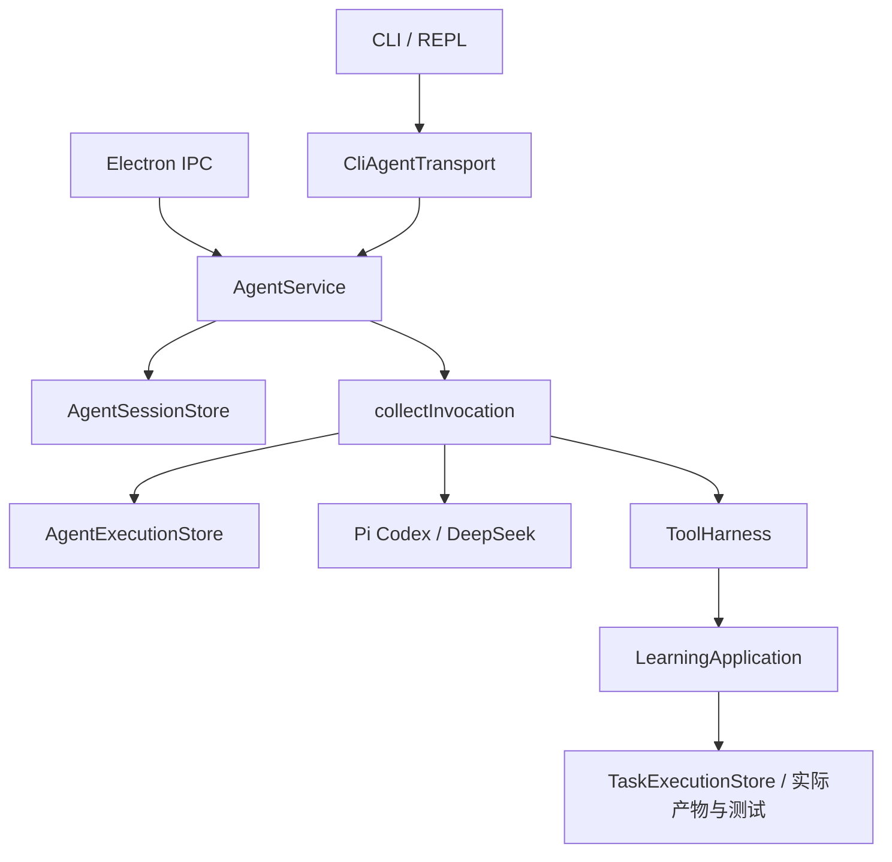

# 共享 Agent 内核与恢复

2026-09-07 源码更新。架构以成熟 Agent 的任务连续性、受控执行和真实验证为目标；默认功能继续服务学习、实践与反馈。当前改动随 0.5.0 本地预览交付，安装包验证见 [P1/P2 记录](evidence/agent-p1-p2-20260907.md)。

## 共用入口

CLI 的 `CliAgentTransport` 与 Electron 的 `DesktopService` 都调用 `src/agent-service.ts` 中的 `AgentService`。`DesktopService` 是兼容导出，同一服务提供 `send`、`invoke`、`enqueue`、`stop`、`answerInteraction`、`resumeQueue`、`load`、`subscribe` 和 `executionEvents`。

`AgentSessionStore` 保存会话快照；`AgentExecutionStore` 保存执行过程；`collectInvocation` 负责有界模型/工具循环。教学提示词在 `learning-agent-profile.ts`，课程、资料与证据由 `LearningApplication` 负责。CLI 本地命令仍经 REPL 和 RunManager 串行处理，分类与计划草案属于学习领域流程。



## 执行与完成规则

- 工具调用必须等本轮协议完整校验后，才能进入持久待执行列表。每个调用保留原 callId、输入与实际结果；Provider 私有思考状态只在进程内使用。
- 审批前保存等待状态。一次授权绑定当前调用；拒绝同样作为原生工具结果返回。先保存授权决定，再更新交互卡；保存失败可重试同一个决定，不能改写成另一种授权。
- 交互卡以 taskId 与 callId 共同确定身份，不会合并不同任务的同名调用。回复已保存、后续执行未启动时，重新加载会显示“继续回答”，仍续接原任务，不在加载时自动执行工具。
- 多工具调用按游标恢复。已保存的结果直接用于 Provider 续接；执行中结果不确定的操作只在 ToolHarness 声明可安全重试时恢复。产物保存再由任务操作键去重。
- 立即调整、继续和失败重试保留 taskId。运行中的会话和执行记录持有进程租约，其他入口不能覆盖；进程死亡后可重新取得租约。
- 重命名、上下文编辑、撤回队列和恢复队列也遵守会话租约。后台摘要只在锁内更新仍匹配的历史，保留其他入口的新消息及标题。
- 事件订阅者的同步异常或异步拒绝单独隔离并移除，不中断任务、不影响其他订阅者；前端恢复后可重新订阅并加载持久会话。
- 失败测试之后实际修改产物，允许相同参数重测；本次自动执行中状态没有变化的重复调用仍停止；用户明确重试可开始新的有界尝试。计划未完成时最多连续纠正两次提前结束；取得实际进展会重置计数。仍不能推进时返回 `blocked`。
- 排队请求保留主题、上下文和执行权限；重启后的队列继续也使用这些选项。CLI 应用任务续接会响应调用方取消，并返回取消状态。
- 立即调整以持久 `steerId` 标记：保留已保存结果，未开始的旧调用以取消结果返回模型；执行中结果不确定时明确标记未知，不伪造完成。重启不会重复应用同一次调整，不确定且不可安全重试的操作仍停止。
- 循环检查在完整协议校验后的每次实际分发前执行；同一批次内的修复也能改变后续测试状态。产物保存和真实测试通过均计入进展，各调用结果保存对应状态，普通重复调用仍被限制。
- 被纠正取消的调用附带 Runtime 的 `dispatch` 标记；恢复时明确未开始的调用不算已执行，结果未知的调用仍受防循环约束。工具输出不能自行改变此标记；没有标记的旧记录按保守规则处理。
- 完成计划只依据保存产物或测试结果。通过代码测试与学习者掌握程度仍分别记录。
- 模型可以补充、重排或解释计划，不能删除既有步骤或更改其完成条件；目标范围变化应建立新任务。完成步骤绑定实际操作，结束前重新核对产物完整性及通过测试的实现/脚本哈希，代码变更使旧通过结果失效，包含通过其他入口保存的变更。
- 异步完成检查受同一取消和超时约束，取消后不写回完成状态。核验发现旧结果失效时，在事务中读取最新计划，只更新仍绑定原操作的步骤，保留期间新增的步骤、标题和完成结果。

默认单轮任务上限为 6 个模型回合，用户已连接项目时为 12 个；两者均最多 32 次工具调用、10,000 个模型事件、64,000 输出字符、128,000 上下文字符和 180 秒。检查点最多 1 MB、128 轮记录、10,000 条执行事件；它不是无限续航。流式文字约每 750 ms 保存一次，强杀可能丢失这段窗口内的增量；未通过完整协议校验的工具不会因此执行。

恢复时，尚需分发的工具与本轮新调用共享次数预算，待执行批次计入上下文体积；每次工具分发前重新检查空间，超限保留已完成结果和游标，不继续执行后续副作用。

## CLI 使用与兼容

普通聊天、工具问答和教学回答使用共享服务。普通对话生成中最多持久排队 10 条；`/queue` 查看，`/queue clear` 撤回，`/queue resume` 手动恢复。`/steer 新要求` 或“等等，……”调整同一任务。本地命令的 REPL 队列仍最多 16 条。

DeepSeek 路由下可显式启动受控应用任务：

```text
/agent 保存当前示例并运行测试 --允许外发
/answer <卡片 ID> allow
/answer <卡片 ID> deny
/answer <卡片 ID> 使用数组举例
```

课程产物保存和实验针对已开始的当前主题学习日；独立实践项目使用用户显式选择的当前主题项目，不要求先开始课程。审批会展示实际文件差异或操作输入。`--允许外发` 允许主题学习上下文，具体写入仍需逐次审批；桌面也可显式授予会话执行权限。CLI Pi 保持原有空原生工具限制，支持文本任务；桌面 Pi SDK 与 DeepSeek 支持原生应用工具恢复。

CLI 旧的每主题最近 6 轮历史继续读写，作为兼容投影；完整会话现在保存在工作根目录的 `zhixing/agent/conversations/`，该目录被 Git 和源码扫描排除。桌面会话仍存于系统应用数据目录。两端使用相同契约，但不会自动合并聊天列表。

新会话格式为 v4；读取 v1/v2/v3 不改写文件，首次保存前保留对应 `.v1.bak`、`.v2.bak` 或 `.v3.bak`。旧版应用拒绝 v4，避免静默丢失项目/MCP 审批预览、诊断及恢复字段。执行检查点另有 v1/v2 格式：最多两个显式纯只读工具并行时保存 v2 的已启动范围，保持模型请求顺序记录结果；恢复重新检查范围内每个调用的可重放权限。

完整工作区备份包含执行 SQLite 和 CLI/桌面会话。恢复在新工作区进行，桌面会话 ID 重新映射；CLI ID 保留以衔接旧历史指针。两者均清除执行授权、上下文授权、队列和旧租约，待执行交互重新确认。旧版无 callId 的交互卡保留兼容处理路径，新卡使用原生工具续接。

## 验证范围

见[开发验收记录](evidence/p0-development-20260907.md)和[最新恢复边界核查](evidence/p0-recovery-audit-20260907.md)。验证覆盖真实本地实验、进程 SIGKILL、两个入口、双 Provider 工具协议、备份授权和 Electron UI。这些链接保留 P0 当轮证据；本轮真实双模型质量集、项目执行、五组开发/实包 UI 与安装器验证另见 [P1/P2 记录](evidence/agent-p1-p2-20260907.md)。合成任务不证明开放任务成功率、教学效果或与商业 Agent 全面相当；Windows/Intel 实机、签名、公证仍待验。
