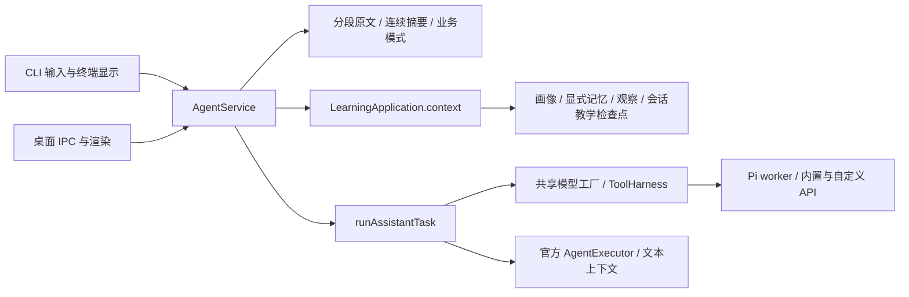

<!-- generated-by: gsd-doc-writer -->
# 统一 Agent 记忆与上下文

核对日期：2026-09-11；当前存储与后端能力见下文。

桌面和 CLI 使用同一套记忆策略。请求通过入口校验后，给定相同工作区状态、完整会话、业务模式、请求、授权和模型配置，共享服务的输入组装、历史选择、摘要、工具回读与教学状态更新一致。CLI当前仍有比共享契约更低的输入长度前置限制，见下方兼容投影行。模型随机采样的回答不要求逐字相同；不同工作区、独立会话或不同模型设置也不代表同一份输入。

## 架构边界

`DesktopService` 是 `AgentService` 的别名；`CliAgentTransport` 只转换会话入口、订阅输出和恢复兼容投影。`AgentService.invoke` 封装同一 `send` 方法，只等待自身请求的完成事件、按自身消息 ID 返回，排队任务不会替换结果或阻延本次返回。`AgentReply` 与底层 `InvocationResult` 分开：轮数/工具数取持久消息，缺少的统计保留为空，不伪造零事件或空工具结果；实际工具结果从执行历史查询。观察回调不能传入 prompt、模型历史或另一个 runtime，请求 schema 拒绝这些字段。

教学开始、追问分类、出题/索要答案规则及检查点提交集中在 `agent-dialogue.ts`。问答、教学、计划预览（`purpose=planning`）和资料问答（`purpose=evidence`）使用同一历史构建器；资料问答保留来源与证据不足约束。无资料时可本地提示；真实 Provider 失败不悄悄冒充离线成功，需显式切换。终端草案确认与本地管理命令是界面功能，不维护另一套模型历史。效果验证的受限模式由共享 `study` 契约控制。

## 状态及边界

| 状态 | 唯一策略与来源 |
| --- | --- |
| 完整会话 | `AgentSessionStore`：最多 20,000 条、完整会话合计 12 MB。v8 及后续格式主清单保存尾部最多 250 条；更早原文按 250 条分段，以内容哈希命名和校验，先保存片段再原子提交清单。加载仍还原完整有序历史，分段不是无限容量或数据库式按需加载。 |
| 模型最近历史 | `learning-agent-profile.ts` / `conversation-context.ts`：最多 24 条，目标与历史片段合计约 40,000 字符。长消息优先保留首尾与当前问题匹配的中段，带来源位置；无匹配时退回首尾摘录。 |
| 摘要覆盖 | `conversation-summary.ts` 从最早未覆盖的合格消息开始，每批最多 24 条；保留最近六条既有历史和本次两条消息。首次整理需总消息至少 22 条且待整理至少 12 条；已有有效摘要时，待整理至少 12 条即可继续。任一阶段估算待整理 token 达到 12,000 可提前触发，仍受失败冷却限制。旧摘要与新批次连续累积，不能跳过中间原文却标记已覆盖。 |
| 摘要可信度 | 消息 ID 标记覆盖终点，原文哈希验证该连续前缀。缺少哈希、原文更正或来源不一致时，摘要只能作为低可信补充，不允许据此隐藏原文。哈希证明来源一致，不证明模型概括正确；内容始终是未独立核验的模型摘要。 |
| 摘要运行 | 后台输出最多 4,000 字符，20 秒超时；失败不扩大覆盖，按新增消息间隔限频。新请求取消旧整理；提交前核对取消和原会话快照，防止覆盖新状态。普通与教学共用规则。 |
| 总输入预算 | `context-window.ts`：默认 48,000 个估算 token，预留 16,384 输出 token；每次模型请求和工具分发前检查，按完整工具轮次裁剪。必须内容超限则停止；Pi 再按 SDK 实际模型元数据收紧。 |
| 原文回读 | `read_conversation_history` 读取完整会话的有界页；`read_execution_history` 读取本任务真实记录。兼容投影不是来源，摘要不作为执行成功证据。 |
| 主题长期记忆 | `LearningApplication.memory.snapshot`：当前画像、最多三条相关或最近确认记忆，带 ID 与来源，每条最多 1,500 字符并按问题摘录。SQL 先按分词/同义词匹配数排序，再限制候选十条，避免仅从最近十条召回；无命中明确标注最近回退。每轮重读，更正/撤回与主题隔离生效。 |
| 学习观察 | 当前主题实际作答与更正/撤回后的观察；模型参考答案不冒充学习者作答。 |
| 教学检查点 | `ChatSession.teaching` 属于当前会话，保存学习日、阶段、当前练习与真实作答。共享 `teachingCheckpoint` 限定转录/作答长度；完成且未等待/阻塞后才提交。新对话和分支以空检查点开始，旧对话恢复自己的状态。 |
| 旧教学兼容 | 旧会话中 teaching 缺省时，在授权后一次复制旧主题检查点或记为空；旧文件保留。新会话显式空值阻止继承。旧转录按兼容逻辑一次加入共享历史，不补造未保存原文。 |
| 教学并发 | 保留主题级跨进程租约，保守串行化共享课程进度；它不再代表多个会话共用练习状态。 |
| CLI 兼容投影 | 最近六轮、每项 8,000 字符只用于旧格式、列表和兼容恢复；输入与模型历史不受该投影独立裁剪。共享请求契约和桌面上限为20,000字符，但CLI的 `execute` 仍有8,000字符前置限制；这是尚待修复的入口差异，不能宣称当前实际输入上限一致。 |

## 授权、迁移与配置

两端默认只发送当前会话输入和有界历史。画像、显式记忆、学习观察、教学卡和本地资料受会话学习上下文授权控制。CLI 使用 `/permissions --允许外发` 或问题后的 `--允许外发`，授权延续到本会话；`/permissions --撤回全部` 撤回访问及已记住的操作权限。项目、外部工具分别授权，材料标志不会增加这两类权限。选择真实模型或开启联网总开关均不等于授权学习数据。

撤权后不注入新的本地学习快照；此前已发送并写入会话的文本不会自动删除。删除长期记忆也不改写聊天。备份恢复清除访问授权及临时运行租约，保留完整原文与会话教学状态；分段丢失/篡改明确失败，不静默截短。

两端 Pi 均为 `PiApplicationClient → src/pi-model-worker.ts → ModelRuntime.streamSimple`，不开放原生文件和 shell 工具。CLI 用 Node/tsx 启动相同源码，桌面构建同一 worker；两套依赖固定 Pi 0.85.0。DeepSeek、Kimi、Pi 及兼容 API 由同一模型工厂应用预算，工具能力按适配器声明。官方执行器共用同一历史/摘要策略，但当前不开放回读工具；需要未投影的旧原文时不能声称已经自行取回。低层旧 `PiCodexClient` 保留协议兼容测试与安全启动器用途，不接入 CLI 主对话。

界面默认模型、设置/凭据存储和工作区位置可不同；解析成相同配置后才比较策略。基础会话写入 v8；团队相关字段按需升级至 v9–v13（成员资源策略需要 v13），升级前保留原文件副本，禁止降级覆盖；数据库版本仍为 6。升级不会自动合并两个入口的聊天目录。19,000 条起桌面提示保存容量，20,000 条或 12 MB 达上限时需新建会话。

## 回归门禁

- `agent-architecture-boundary.test.ts` 与 `frontend-boundary.ts`：请求旁路及直接/间接导入、再导出、动态导入门禁；批准的共享边界不把历史构建能力交给前端。
- `interaction-cli.test.ts`、`unified-agent-policy.test.ts`：真实 CLI 与桌面同配置请求等价、长普通/教学会话、撤权与并发。
- `summary-coverage.test.ts`：50/200 条连续覆盖、失败/取消、旧摘要与原文更正。
- `memory-recall-quality.test.ts`：大量近期噪声中的旧相关记忆、同义词、纠正/撤回、长文本中段及 Unicode。
- `segmented-conversation.test.ts`、`workspace-backup.test.ts`：2,000 条还原、旧格式备份、片段复用/损坏、跨段恢复。
- `teaching-session-isolation.test.ts`、`cli-workflow.test.ts`：同主题独立会话与分支、旧检查点兼容、无活动学习日。
- `agent-reply-contract.test.ts`：自身任务结果/等待、真实统计、长历史排队。
- `pi-cli.test.ts`：同一 worker 的合成 SDK 工具、取消与续接；不以此证明真实账号成功。

统一记忆首次实现的历史执行见 [架构修复证据](evidence/architecture-remediation.md)；[0.7 统一策略证据](evidence/unified-agent.md)保留历史追溯。

## 图片和长历史回读

图片附件共用两端的发送契约与持久化。每轮保留最近四张图片，按每张 2048 token 保守预留，不把 base64 当成文本 token。摘要哈希包含图片；后台摘要只记录附件存在，不编造图中内容。含图片的执行检查点为 v3，旧 v1/v2 保持可读；执行存储当前统一上限为 4,000,000 字节；完整会话仍为 12 MB。详情见[图片输入](image-input.md)。

原文回读的 message 序号上限使用同一 20,000 条配额，已修复原 999 的独立限制。包含 2400 条历史的真实 DeepSeek 会话已准确回读第 1500 条，见[验收记录](evidence/completion-0.9.md)。

团队成员收到的是同一内核按授权裁出的有界任务包，并非父会话的无限复制：默认仅当前题设/图片，显式共享后加入有界历史及获准工具。每名成员的工作产物和任务执行 ID 独立；这属于同一策略下的作用域收窄，不是另一套记忆真相。官方原生后端不支持图片时仍明确拒绝，详见[团队内核](agent-team-kernel.md)。
