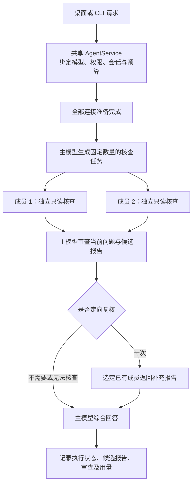
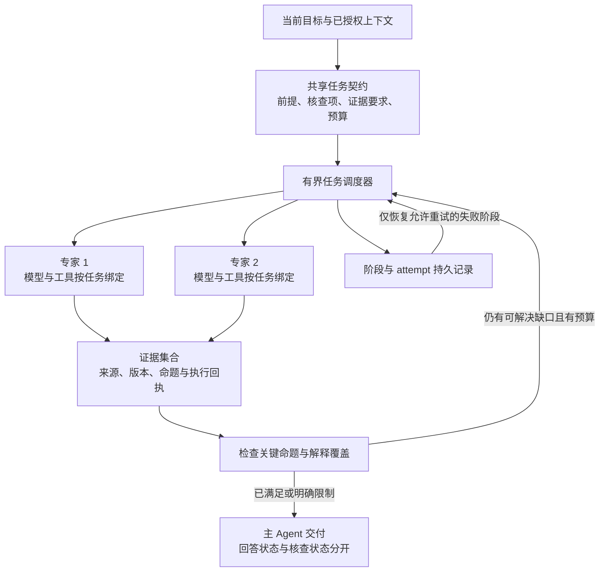

# 知行同模型与异模型团队：架构对比及质量归因报告

> 本文为2026-09-10本轮开发前诊断快照；后续 TK01–TK05 的源码变更与验证见[团队内核设计](agent-team-kernel.md)及[实施记录](evidence/team-kernel-alignment-20260910.md)。历史分数与诊断不回填。
日期：2026-09-10。范围：当前工作区源码、已有真实评测、当前源码的本地诊断，以及 Codex、Claude Code 和相关工程框架的官方公开资料。本轮交付为分析与证据，不实施下文的架构改造。

## 1. 核心判断

**设计和架构确实限制了当前团队的能力，并放大了执行失败与等待时间；但现有数据不能证明“异模型天生比同模型差”，也不能把所有扣分归为架构造成的推理错误。**

当前同模型与异模型团队共用一个有界核查流程：主模型分工 → 成员独立报告 → 主模型审查 → 最多一次定向复核 → 主模型综合。两者主要改变模型绑定、思考档位和并发调度。异模型模式尚未形成按实测专长分配工作、按证据缺口调整任务、局部失败后继续补证的协作机制。

这个方案适合作为受控的核查起点。问题不在于采用“主 Agent + 专家”的结构，而在于目前专家工作、证据交换、验收与恢复的边界过窄：团队增加了调用和故障依赖，却不一定增加独立信息、可执行验证或可核对的证明。

| 用户关心的问题 | 本次判断 | 证据强度 |
| --- | --- | --- |
| 能力是否被架构限制？ | 是。固定成员与阶段、短工具循环、上下文不对称、缺少补证循环，限制复杂连续任务 | 源码直接确认；部分行为已本地复现 |
| 正确性下降是否由架构造成？ | 部分机制有明确风险；Q04 证明不足说明现有核查未兜住解释质量，但尚未隔离各机制的因果贡献 | 真实样本支持问题存在，不能量化归因比例 |
| 可靠性差是否与架构有关？ | 是。准备阶段整体阻断、额外必经调用、阶段级恢复不足，会把局部失败扩大到整题 | 源码、本地诊断和历史运行共同支持 |
| 异模型是否必然更差？ | 否。当前对照同时改变模型、思考档位、协议适配和时延；样本也偏小 | 不具备推出普遍结论的实验条件 |
| 是否需要重写整个 Agent？ | 不需要。保留共享内核、权限、预算和持久化，增量补齐任务契约、证据与恢复 | 基于现有工程结构的设计建议 |

## 2. 版本与证据边界

### 2.1 三个状态不能混用

| 对象 | 状态 | 能说明什么 |
| --- | --- | --- |
| 本机已安装应用 | 最近交付记录为 0.10.0 | 不能把源码 0.11 的能力直接当作已安装能力；本轮未重做安装检查 |
| 32 个真实新题任务所用 0.11 包 | 内部协议补修之前；当时 718 项工程测试 | 本报告的真实质量和耗时数字只属于该构建 |
| 当前 0.11 源码及最终补修包 | 已增加内部指令隔离、专用格式修正、字段诊断和图片边界；此前 723 项门禁通过 | 本轮静态分析和六个合成诊断对应此源码；尚无补修后的真实质量结果 |

源码基准提交为 `b2ef8fa9f91e49ffd93376c9d64e8b07328ce3ea`，工作区含此前未提交修改，不能仅凭提交号重现本轮分析。

| 构建 | 源码来源 codeHash | app.asar SHA-256 |
| --- | --- | --- |
| 32 任务实测包 | `ae8f906b090cb7dcf7b77198e38d63f3e809f4561b1be13cdc6f8e719349d2ae` | `cfdf67c19462815adb117e7cd07908ff510769ac5dd3aa187da897f1d3d21199` |
| 协议补修包 | `e3c6b696ff48ad57e5cb23cd31e03d7f48f31c8ac7258c5652e5b6ed3a0eba62` | `fae1a8ee33c5853a3b20b84d3f6c0f21742af9c345143f6ee126e50bb4bd4135` |

来源：[实测构建回执](evidence/team-quality-stable-build-20260910.json)、[补修构建回执](evidence/team-quality-contract-build-20260910.json)。本轮逐项校验回执中 `src/`、`desktop/core/`、`desktop/renderer/`、`desktop/electron/` 的文件哈希，当前文件与补修回执一致。报告新增文件不属于该包原有代码来源清单。

最新包的原生加密初始化及旧题真实回归仍按[既有交付记录](evidence/team-report-contract-fix-20260910.md)保持待验收；本轮未调用真实 Provider、重装应用或操作系统授权窗口。

### 2.2 本次证据的用途

- **源码事实**：可确定实际控制流和能力边界，不能单独证明模型质量改善幅度。
- **真实评测**：32 条最终输出、142 次请求及逐条解释复核，能定位实际失败发生在哪个阶段。
- **本地合成诊断**：调用当前 `TeamCoordinator`，用内存模型客户端验证六个机制；不测模型智能。
- **官方资料**：只对照公开能力与工程经验，不推断未公开的训练、内部调度或可靠性保证。

本轮没有让 Codex、Claude Code 在同一题集上运行，因此下文不是三款产品的质量排行榜。

## 3. 当前架构还原

### 3.1 执行拓扑



图中成员箭头表示逻辑分支：Pi 成员实际串行，异模型成员可并行。图省略了准备失败、主取消、预算不足与恢复分支。确定性本地教学处理还可以直接完成本轮，并标记团队 `not-needed`；并非所有请求都一定调用模型。[协调器](../src/team-coordinator.ts)（`run`，182–215 行）、[共享入口](../src/agent-service.ts)（`generate`，597–671 行）。

### 3.2 同模型与异模型的实际区别

| 维度 | 同模型团队 | 异模型团队 |
| --- | --- | --- |
| 模型绑定 | 成员与主模型的 provider、model、connection 相同 | 校验至少有两个不同 model ID；不是强制三家，也不证明错误模式互补 |
| 本次实测组合 | Pi `gpt-5.6-terra` 主模型与两成员 | Pi 主模型，DeepSeek `deepseek-v4-flash` 与 Kimi `kimi-k3` 成员 |
| 任务分配 | 从三类核查职责选择，默认两成员；分工文本由主模型生成 | 相同；没有根据模型实测专长自动分配职责 |
| 调度 | 所有成员为 Pi 时串行；其他同模型连接可在限制内并发 | 默认最多两成员并发，但要等待成员阶段结束才审查 |
| 思考档位 | Pi 实测为 balanced；“同模型”校验不包含思考档位 | 主模型 balanced 时，内置 DeepSeek/Kimi 成员自动 quick；显式设置优先 |
| 额外可靠性负担 | 相关错误、同一连接依赖、重复核查成本 | 增加服务商、凭据准备、能力与协议差异，并叠加主模型后续依赖 |

同模型以 DeepSeek/Kimi 为主模型时，也会应用上述自动 quick 规则；不能把“同模型”理解为完全相同的推理配置。来源：[配置与身份契约](../src/team-contracts.ts)（7–35 行）、[模型绑定选择](../src/team-coordinator.ts)（40–62 行）、[连接并发限制](../src/team-budget.ts)（22–38 行）。

### 3.3 成员实际拥有多少 Agent 能力

成员运行共享 `runAssistantTask`，拥有独立 runId/taskId 和受控模型循环，并非完全没有工具的普通文本拼接。当共享上下文开启、当前会话已有相应权限、且接入学习工作区时，可以使用受控的资料、项目及外部只读工具。

但成员不是完整独立的 `AgentService` 会话：不向用户提问，不继续委派，不写入，不维护自身可执行任务计划；首轮最多 3 个模型回合。通用运行时在有 application 时可以保存执行检查点，团队恢复入口却不会继续这些成员循环。因此，“没有任何子任务检查点”和“已经支持完整子 Agent 恢复”都不准确。[成员调用](../src/team-coordinator.ts)（111–123 行）、[工具及执行状态创建](../src/assistant-runtime.ts)（80–107、158–171 行）。

默认 `shareContext=false`，成员只有当前问题与本次图片；这次真实题集又没有工作区、资料和外部工具，所以实测的团队收益主要来自额外模型推理，没有检验独立检索、运行实验或多文件任务的优势。

默认整题上限为 12 次模型请求、16,384 输出 token、192,000 估算输入 token、24 次工具调用、240 秒；成员期限 180 秒。分工单次上限 1,024，审查 2,048，其他默认 4,096 输出 token，且受整题余量约束。预算会为主回答和审查预留容量，未知用量不会被当作零消耗。[预算配置](../src/team-contracts.ts)（12–18 行）、[预算执行](../src/team-budget.ts)（36–70 行）。

## 4. 与公开领先方案的差异

### 4.1 先区分比较对象

**Codex 子 Agent**：公开文档支持专门的 Agent 线程、模型与思考配置、后续指令、等待及停止，并强调独立工具工作和上下文隔离。适合将可独立探索、测试或分析的工作交给成员。权限仍受父任务边界约束。[Codex Subagents](https://learn.chatgpt.com/docs/agent-configuration/subagents)

**Claude Code 子 Agent**：有独立上下文、工具与权限配置，支持限定回合、持久记忆及可选 worktree；可恢复的自定义成员能继续原有上下文。并非所有内置成员都可恢复，具体类型有差异。[Claude Code Subagents](https://code.claude.com/docs/en/sub-agents)

**Claude Code Agent Teams**：由独立会话、共享任务及邮箱组成，可以向成员或同伴发送消息，并通过任务依赖协调工作。该功能仍是实验功能，进程内成员恢复、任务状态和关闭行为存在已公开限制，不能当作无故障标杆。[Claude Code Agent Teams](https://code.claude.com/docs/en/agent-teams)

**Anthropic Research**：公开案例采用主 Agent 与专家循环研究，按新发现调整任务，并单独处理引用。其价值主要来自独立信息搜集和扩大覆盖。2025 年文章中的 90.2% 提升属于其内部研究评测；它比较的是 Opus 4 主模型与 Sonnet 4 成员组合，不能套用到知行题集，也不是跨厂商团队的证明。[Multi-agent research system](https://www.anthropic.com/engineering/multi-agent-research-system)

### 4.2 能力比较

下表是上述官方能力与知行源码的对应；“可配置”不表示默认开启，“未知”不推断为产品没有。

| 维度 | 知行当前团队 | Codex 子 Agent | Claude Code 子 Agent / Teams |
| --- | --- | --- | --- |
| 工作单元 | 短程只读核查，固定最多两成员 | 专门任务线程 | 子任务上下文 / 独立团队会话 |
| 调度 | 固定分工、审查、综合；最多一次追问 | 支持追加指令及线程控制 | 子任务链 / 团队任务依赖与消息 |
| 工具 | 共享内核的只读子集；依授权开启 | 按任务及权限使用工具 | 按成员配置工具；可选隔离 |
| 证据传递 | 有界 JSON，主要为自然语言依据 | 任务结果与摘要 | 子任务结果 / 成员消息 |
| 后续工作 | 单次指定成员复核；新任务才能全队重跑 | 可继续指导成员 | 可恢复成员或追加团队任务 |
| 故障处理 | 有状态与取消；恢复时主要复用报告 | 本页未给出统一故障恢复保证 | 部分输出及成员恢复机制；Teams 另有恢复限制 |
| UI | 阶段、结果、停止、全队重跑 | 可查看成员线程 | 可查看和指导成员 |
| 开放式互聊 | 没有成员邮箱 | 不将本文公开线程能力推断为任意同伴网络 | Teams 明确支持同伴消息 |

对照来源：[Codex](https://learn.chatgpt.com/docs/agent-configuration/subagents)、[Claude 子 Agent](https://code.claude.com/docs/en/sub-agents)、[Claude Teams](https://code.claude.com/docs/en/agent-teams)。这些资料没有为任何方案提供“成员一致就正确”的保证。

### 4.3 跨厂商方案应参考框架机制，而非误读产品宣传

上述 Codex 与 Claude Code 文档不足以证明其开箱即用支持“Pi 订阅 + DeepSeek + Kimi”这样的任意跨厂商团队。知行已经实现动态 API 连接与统一模型接口，这是有用的基础。

OpenAI Agents SDK 将“专家接管对话”和“主 Agent 调用专家能力”分开；后者保留主 Agent 的最终回答责任，与知行教学产品更接近。SDK 也提供模型及 Provider 适配入口，但能力、协议和传输兼容仍需核验。[编排与交接](https://developers.openai.com/api/docs/guides/agents/orchestration)、[模型与 Provider](https://developers.openai.com/api/docs/guides/agents/models)

可恢复协作可参考 LangGraph 的线程检查点、跨线程存储以及按节点配置的超时、重试和失败处理。这些是可借鉴的机制；安装框架本身不会自动补齐知行的证据标准、权限语义和教学验收。[持久化](https://docs.langchain.com/oss/javascript/langgraph/persistence)、[故障处理](https://docs.langchain.com/oss/javascript/langgraph/fault-tolerance)

**最值得对齐的是成员能够取得新证据、任务可以按结果调整、失败可以局部恢复；不应以成员数量、互聊次数或递归深度作为成熟度指标。** 这是结合知行定位作出的设计判断。

## 5. 真实数据到底说明了什么

### 5.1 四组对照

8 道题 × 4 组 × 1 次，按题轮换运行顺序。单 Agent、自检及主模型均使用 Pi `gpt-5.6-terra`；异模型成员为上述 DeepSeek、Kimi。解释由开发助手非盲逐条核对三个预设条件，并非独立人工评阅。

| 模式 | 流程完整 | 最终字段正确 | 解释通过 | 三者同时通过 | 总耗时中位数 | 模型请求总数 |
| --- | --- | --- | --- | --- | --- | --- |
| 单 Pi | 7/8 | 7/8 | 7/8 | 7/8 | 14.3 秒 | 8 |
| 单 Pi 五轮自检 | 8/8 | 8/8 | 8/8 | 8/8 | 80.5 秒 | 40 |
| 同模型团队 | 8/8 | 7/8 | 6/8 | 6/8 | 63.7 秒 | 42 |
| 异模型团队 | 2/8 | 7/8 | 6/8 | 1/8 | 98.6 秒 | 52 |

| 模式 | 已报告输入 token | 已报告输出 token | 用量未知请求 | 主回答首段文本中位数 |
| --- | --- | --- | --- | --- |
| 单 Pi | 10,830 | 4,129 | 1 | 8.5 秒 |
| 五轮自检 | 106,701 | 25,684 | 0 | 6.9 秒，仅第一轮 |
| 同模型团队 | 48,457 | 19,441 | 0 | 56.6 秒 |
| 异模型团队 | 66,479 | 34,998 | 2 | 89.9 秒 |

数据来源：[原始运行](evidence/team-evaluation-quality-20260910041023097.json)、[解释复核](evidence/team-quality-explanation-review-20260910.json)、[统计](evidence/team-quality-summary-20260910.json)、[既有分析](evidence/team-quality-v3-comparison-20260910.md)。本轮重新核验 32 条最终文本的哈希与严格通过聚合，全部吻合。

这些 token 是服务商已报告用量，不是完整账单。上限相同不等于实际算力相同；自检组用了远多于其他组的输入 token。首段文本也不是最终交付完成时间，团队此前已有进度状态显示。

### 5.2 异模型 1/8 不能解读为“八题只答对一道”

异模型有 7/8 最终字段正确、6/8 解释通过，但仅 2/8 流程完整。六个流程不完整任务可分解为：

| 失败位置 | 题目 | 实际后果 | 可以排除的误读 |
| --- | --- | --- | --- |
| DeepSeek 成员报告格式失败 | Q01、Q02、Q05、Q08 | 主回答及解释通过，必需成员未完成 | 这些 API 请求本身完成；不是四次连接或钥匙串失败 |
| Pi 最终综合请求失败 | Q03 | 两成员已完成，但没有最终答案 | 不能归为 DeepSeek/Kimi 不会解题 |
| Pi 审查请求失败 | Q06 | 最终回答与解释通过，流程仍不完整 | 多一次主模型调用增加了失败依赖 |

流程完整的两题是 Q04、Q07；Q04 又因穷尽证明不足未通过解释复核，所以严格通过只剩 Q07。严格指标有其价值，但应与答案正确性、解释质量分别展示，不能删掉内部失败来改善成绩。

### 5.3 同模型的两个扣分点性质不同

**Q04 是核查质量缺口。** 两种团队都找到了正确最优值，但未完整说明所有关键组合为何不可能更优。同模型审查为 `ready`；异模型还修正了候选中的局部算术和过时结论，最终解释仍有遗漏。这说明审查能够纠错，却没有可靠覆盖“证明是否完整”。它不能单独证明是报告压缩、提示词或主模型综合哪一步造成了全部遗漏。

**Q06 是题面与评分歧义。** 题目要求记录“循环开始时”的中点，代码却在循环体中才赋值。同模型团队经过审查后按字面时点输出首次中点为 `null`，而冻结答案按赋值后时点评分。它对非终止和修复的推导是正确的。保留原分数用于审计，未来消除题面歧义；不能将这一题当作“团队把正确答案改错”的纯粹证据。

普通 Pi 在七个成功请求上全部通过。自检组领先的唯一题 Q03 是普通组连接失败，因此没有观察到自检对成功基线答案的净推理增益。8 题一次的结果不足以判断总体优劣，也不能与旧版不同题集的 96 任务报告直接计算改进百分点。

### 5.4 延迟的架构成分

同模型 42 次请求包含：8 次分工、17 次成员请求、8 次审查、1 次定向复核、8 次最终综合。异模型 52 次包含：8 次分工、13 次 DeepSeek 成员请求、12 次 Kimi 成员请求、9 次 Pi 审查、2 次 Kimi 定向复核、8 次最终综合。额外请求包括格式修正，不能全部称为有价值的独立推理。

从成员快照重算，异模型 DeepSeek 成员阶段中位数约 8.8 秒，Kimi 约 68.3 秒；这包含该阶段的格式修正及等待，不能当作模型纯生成速度。异模型并行虽有效，整题仍被较慢成员、随后审查和综合决定。同模型则还叠加 Pi 两成员串行。

因此，约 4.4 倍与 6.9 倍的整题耗时差距有明确流程原因，但当前记录不足以把它精确拆成网络、服务端排队、推理和本地处理的占比。不能未经并发兼容与取消测试就把 Pi 限制改成 2。

## 6. 当前问题与因果分析

下文“高置信度”表示机制存在，不表示已经通过真实 A/B 证明它贡献了多少分数损失。

### A1：有分工，但缺少明确的交付及核查任务契约

分工输出只有固定数量的 `tasks: string[]`，没有任务依赖、应覆盖的命题、成功条件、所需证据和允许工具。角色有区别，但多个成员仍可能重复完整解题，也可能一起遗漏同一约束。分工模型只看到当前问题与图片，没有主会话历史。

这限制了复杂任务的覆盖与调整能力。Q04 的解释遗漏与这种缺口相符，但不是独立的因果证明。应在现有分工上增加结构化成功条件和证据要求，不需要重新开发“主模型分工”。[源码](../src/team-coordinator.ts)（87–99 行）。

### A2：上下文隔离正确，但缺少最小任务上下文的传递

默认不共享历史能保护隐私、减少首轮相互影响，应该保留。问题是当前问题可能只有“继续核对刚才的方案”，成员默认没有“刚才”的定义；即使 `shareContext=true`，规划和审查也不收到历史。成员的结果可能使用了合法上下文，审查者却无法直接核实相关前提，只能依赖报告转述。

本地诊断 AP05 直接确认：共享历史进入成员，未进入规划与审查。此机制会影响连续教学与资料问答，但此次无历史的 8 题没有测出它的质量代价。建议由共享内核生成经授权的任务包，只传相关前提、资料定位与边界；审查收到核验必需的同一任务定义，不默认复制完整历史。[源码](../src/team-coordinator.ts)（90、111、132–144、169–175 行）。

### A3：依据主要是模型文本，尚未形成团队证据链

报告有 `summary`、`claims`、`basis`、`uncertainties`，这是比无结构拼接更好的基础。但 `basis` 是字符串，没有强制绑定引用位置、资料版本、工具执行记录或测试产物；schema 校验的是结构而非事实。字符串分歧检测也不能识别语义等价、共同错误或缺失命题。

报告提示目标为 4,000 字符，硬上限 8,000 字符，最多 12 个命题，单条依据最多 1,000 字符。压缩有助于控制上下文，但复杂证明和跨文档核对需要能按引用重新取得细节；仅增大报告上限会增加主模型负担。当前没有按命题请求原始证据片段的团队协议，存在细节丢失风险，尚未实验证明它造成了 Q04 的全部缺口。

主运行时已经有引用与工具证据支持，团队成员却关闭了向主回答转交 citation/evidence 回调，审查没有独立访问原始证据的工具上下文。成员可以把依据写进报告，主模型也可以通过自身权限重新查询；当前没有程序级的报告命题到真实证据的关联。不要误写为“全项目没有证据机制”。[报告契约](../src/team-quality.ts)（3–8、59–66 行）、[成员回调](../src/team-coordinator.ts)（120–122 行）、[主运行时证据检查](../src/assistant-runtime.ts)（76–79、128–143 行）。

应复用现有引用和执行记录，增加证据 ID、来源版本、验证方式和覆盖命题。没有真实工具回执的“测试通过”不能成为已验证证据；数学或算法题可增加受控的枚举、执行或反例检查，不要求暴露模型隐藏推理。

### A4：审查流程完成，不代表问题已经核清

当前 review 可以返回 `uncertain`；后续复核也可以返回仍有 `uncertainties` 的报告。根状态检查的是阶段 `status`，不判断关键问题是否关闭；一次定向复核后没有独立的关闭检查。AP03/AP04 已复现“仍有未证实条件，但执行状态 completed”。

这不是已经证明的错误答案，也不是界面假冒正确性认证：团队卡片明确写着完成状态不代表正确性认证，并保留审查意见。真正缺口是程序不能回答“用户要求核查的哪些关键命题仍未完成”。Q04 是现有机制没有兜住完整证明的真实例子。[审查与收尾](../src/team-coordinator.ts)（144–180、205–209 行）、[团队卡片](../desktop/renderer/team-panel.tsx)。

建议分别维护执行状态、答案可交付状态和逐项核查状态。并非所有 `uncertain` 都应禁止回答；关键结论缺少证据时应保留限制或继续补证。也不能只把判断改成 `verdict === ready`，因为 `ready` 仍是模型意见。

### A5：准备阶段让可选成员也成为整题的硬依赖

执行成员失败时，代码尊重 `required=false`：最终答案可以完成，团队保留 partial。可是准备连接时使用整体 `Promise.all`，任意成员准备失败都会在分工前抛出，不检查 required。AP01/AP02 已复现这两条路径的不一致：可选成员准备失败时 0 次模型调用、整队 failed；同成员在执行阶段失败时仍可完成主回答。

这是确定的容错设计缺口。历史钥匙串阻塞导致异模型零请求，说明准备阶段也是实际故障来源，但不能拿它解释 32 任务中四次已完成 HTTP 请求后的格式失败。[准备与异常处理](../src/team-coordinator.ts)（184–190、210–214 行）、[API 准备](../src/chat-completions-client.ts)（20–24 行）。

建议逐连接记录 readiness、失败及所影响任务；可选成员准备失败允许健康分支继续，必需成员缺失则明确限制。涉及必须核查的任务不能通过偷偷改成可选来宣称成功。系统凭据授权仍由系统和用户完成，调度器不能绕过。

### A6：恢复保护已存在，但缺少失败阶段的恢复入口

当前持久化绑定、范围哈希、预算、首轮报告和审查结果；恢复不会擅自重发结果未知的请求。这是应保留的保护。

但 `previous` 恢复后跳过成员和审查，主要重新执行综合。AP06 确认：审查失败后恢复，只调用 FINAL，仍然 blocked/partial。用户可全队重跑新任务，却不能只补缺少的审查或一个失败成员，恢复成本较高。[恢复](../src/team-coordinator.ts)（64–70、184–204 行）、[当前重跑 UI](../desktop/renderer/team-panel.tsx)。

应增加阶段及 attempt 的稳定身份，区分未发出、已完成、明确失败和结果未知；安全的只读阶段可按策略重试，已完成阶段复用，结果未知仍需保守处理并保留用量预留。不要为解决成员恢复再造另一套不受共享内核控制的执行器。

### A7：跨模型接通了，但未证明专长互补，自动档位还引入混杂

当前对 DeepSeek/Kimi 的自动 quick 有明确的速度和输出预算动机。映射到请求后，DeepSeek thinking 被关闭，Kimi 使用 low，而 Pi 保持 balanced。此选择并非无条件错误，但不适合未经校准就承担深度证明核查，也不代表三个厂商的同名档位等算力。[自动档位](../src/team-coordinator.ts)（50–54 行）、[实际请求参数](../src/chat-completions-client.ts)（61–75 行）。

当前质量套件还排除了单 DeepSeek、单 Kimi 组，故缺少同题、同档位的成员能力基线。无法判断异模型差距来自协作方式、模型本身、档位还是输出协议适配。[评测组选择](../src/team-evaluation.ts)（74–88 行）。

建议先在同题上测各成员的任务正确性、证据覆盖、结构成功率与延迟，再分配职责；复杂核查不按厂商名称自动降档。跨模型多样性应以“能补出基线漏掉的有效证据”衡量，不能只数模型 ID。

### A8：当前协议补修已完成，真实兼容性仍待验

旧构建存在确定的内部指令与最终用户格式冲突，现已通过 `internalTeamMessages`、`responsePurpose` 和有界字段诊断修复；图片所需消息角色也已保留。本轮不能把这项再列为“尚未开发”，更不能将旧分数当成当前修复已失败的证据。[补修记录](evidence/team-report-contract-fix-20260910.md)。

仍需做的是实测：四次 DeepSeek `invalid_report` 的被拒绝原文没有保存，无法逐次确认具体 schema 原因；新增诊断尚未经过后续真实回归。当前 Chat Completions 请求没有携带团队 JSON 的服务端结构约束，主要依靠提示、解析和一次修正。是否接入原生结构化输出，应按连接能力验证，不能给所有兼容服务强加同一参数。[请求体](../src/chat-completions-client.ts)（69–76 行）、[校验与诊断](../src/team-quality.ts)（20–38 行）。

### A9：预算和可见性控制了成本，但尚未按任务价值分配等待

共享预算、取消、首轮隔离和限次复核都是有效基础。仍存在两个取舍：默认团队用整套阶段处理短问题；先等成员完成，再审查，再生成主回答。用户看到阶段更新，却要到综合阶段才收到主回答文本。

不应靠伪造首字、更长超时或无限辩论优化体验。可根据题目选择独立证明、反例检查、资料搜集等具体策略，并在授权范围内分阶段显示已获得的证据；未核验草稿要标清状态。Pi 串行应先补真实并发兼容验证，再决定是否改变连接调度。

### A10：当前评测更擅长发现故障，尚不能证明团队教学价值

题集覆盖计算、约束、代码执行语义等，能发现格式、解释及可靠性问题，但没有资料检索、工具实验、长对话条件或学习者表现。32 次运行只有 8 道独立题，不是 32 道独立问题；解释评阅来自非盲开发助手。

另外，学习效果研究会话当前拒绝团队模式，代码直接抛出 `team_study_unavailable`。这避免了擅自改变旧研究协议，也意味着尚不能通过已有学习研究流程直接比较三个团队模式。[共享入口](../src/agent-service.ts)（597–600 行）。应另行版本化研究方案，不能把模型题集成绩当作学生学习增益。

### A11：独立请求不等于独立判断，最终综合仍是共同瓶颈

首轮成员互相隔离，但分工、审查和综合均使用主模型。审查在同一次请求中已经看到候选内容，即使提示要求先按题目核对，也没有先保存一份不受候选影响的独立判断。隐藏候选模型品牌能减少一种偏好，却不能消除内容造成的锚定；同模型的相似错误也不因另开上下文而必然消失。[审查输入](../src/team-coordinator.ts)（136–144 行）。

最后仍由主模型重新组织答案，结构正确的成员结论可能被遗漏或错误改写；成员给出了正确证据也不保证最终输出使用了它。这是设计风险，当前样本没有单独测出“聚合引入错误”的净发生率；Q06 的歧义尤其不能用来证明这一点。

建议保留候选、证据与最终关键结论的对应关系，记录实质更正的理由；对适合的任务比较“先独立作答，再针对差异补证”的方案。可以配置不同核查模型，但仍需独立工具或外部证据，不能用另一个模型的赞同替代验证。基线答案也允许在有依据时被纠正，不应硬性锁定第一答案。

## 7. 哪些设计应该保留

| 已有设计 | 保留原因 | 扩展边界 |
| --- | --- | --- |
| CLI/桌面共用 AgentService 与 ToolHarness | 入口不会各自发明权限、记忆或执行语义 | 团队扩展仍调用同一内核 |
| 同模型身份与恢复绑定固定 | 防止任务中途悄悄换模型或访问范围 | 若将来替换失败成员，必须记录新 attempt 与新绑定 |
| 首轮不见同伴答案 | 降低直接附和，有利于独立取证 | 之后只交换与问题有关的证据和质疑 |
| 有界报告、严格解析、脱敏诊断 | 控制上下文与不可信输入传播 | 增加类型化证据引用，不能宽松接受坏 JSON |
| 只读、默认不共享私有上下文 | 符合本地优先学习产品边界 | 独立验证应通过已授权的隔离工具，不自动开放任意写入 |
| 总预算、取消、未知用量预留 | 防止任务扩张，保留失败成本 | 在预算内做局部恢复，不无限重试 |
| 首轮和复核报告分别保存 | 能追溯谁改了什么、依据是否变化 | 增加命题与证据的版本关系 |
| partial、failed、interrupted 状态 | 没有隐藏不完整结果 | 增加核查覆盖状态，不抹掉失败来提高分数 |

尤其不能把“没有成员自由聊天”单独认定为架构错误。独立分工加主协调是合理方案；更多互聊还可能增加附和、传播错误和成本。知行当前更需要可验证证据与局部恢复，而非全面复制开放式软件开发团队。

## 8. 建议的增量目标与实施顺序

以下是本轮新建议，不重新编号或重做已完成的历史 P0。它们尚未实施；已完成的协议补修只需要补验。

### 8.1 目标结构

保留用户选择的单 Agent、同模型和异模型三种模式。团队内部从固定核查流水线逐步变为“任务包 → 有界专家工作 → 证据核验 → 必要的补证 → 主 Agent 交付”。同模型与异模型使用同一个调度器，差异由模型绑定和能力策略表达。



这张图是建议架构，不是当前已实现能力。先保持最多两名成员也能实现大部分收益；动态增加团队规模可后置。

### 8.2 可验收切片

| 顺序 / ID | 必要增量 | 复用现有部分 | 验收标准 |
| --- | --- | --- | --- |
| 1 / AR01 | 补修后的真实兼容回归，固定源码与评分 | 已完成内部协议补修及诊断 | 执行已登记 H02/H04 回归，保存每次失败及 schema 类别；只声称该回归结果，不冒充新题质量优势 |
| 2 / AR02 | 逐连接准备与可选分支容错 | Provider prepare、取消与 required | 可选准备失败仍执行健康分支；必需缺失明确标记；零请求、超时、取消、用量未知路径均验证 |
| 3 / AR03 | 最小任务包与明确核查项 | 共享上下文、分工、权限 | 连续追问的相关前提进入规划、成员与审查；未授权数据不进入；每项任务有可判定交付条件 |
| 4 / AR04 | 证据引用、解释覆盖与问题关闭 | 已有引用、工具回执、结构报告 | 原始条件、反例、计算或测试可定位；未解决关键问题不会显示已核清；Q04 类缺口有确定性检查或明确保留 |
| 5 / AR05 | 阶段级恢复与有限重试 | 检查点、绑定、预算、已有报告 | 只补失败阶段；已完成成员不重跑；未知请求不自动重复；取消后不发新请求；重试计入总预算 |
| 6 / AR06 | 模型能力与思考档位校准 | 动态连接、成员独立配置 | 同题单模型基线齐全，记录实际提交档位；按任务专长选成员，复杂核查的降档有实测依据 |
| 7 / AR07 | 按任务选择协作策略并改善等待 | 原三种模式、团队状态卡 | 独立资料搜集、证明与反例分工有不同策略；不暗改用户所选模式；量化有效证据增加与端到端等待 |
| 8 / AR08 | 完整质量与教学验证 | 冻结题集、用量、解释复核、学习研究框架 | 新任务配对评测、独立评阅、工具和长对话覆盖；真实教学另建有版本的三模式研究协议 |

AR02–AR07 的本地开发及故障诊断不需要等待钥匙串。真实跨 Provider 回归、最终包原生加密与安装交付需要已有外部条件；不能因其阻塞就把全部架构工作视为不可推进。

当前不建议优先做：无限成员、无限递归、全员自由辩论、自动换厂商、直接放开成员写入、整体换框架、单纯增大 token/时间上限。这些都不能单独解决已观察到的证据、上下文与故障问题。

## 9. 如何验证“确实是架构导致”

### 9.1 先分清三个问题

1. **是否能完成流程**：所有实际请求、必需核查和授权工具是否按约完成，失败是否可恢复。
2. **是否交付正确答案**：最终结论、约束、事实依据和解释是否正确完整，即使团队部分失败也单独评分。
3. **是否有团队收益**：相比同预算单 Agent 或自检，是否补出了有效证据、修正了基线错误，是否引入了新错误。

不把三个问题压成一个“准确率”。严格端到端通过率继续保留，但加上错误引入率、纠错率、关键核查覆盖率、恢复成功率、调用/token 与延迟。

### 9.2 配对消融方案

“消融”指保持其他条件尽量相同，只改变一个设计因素，以观察该因素的影响。

| 要检验的假设 | 对照方式 | 避免的混杂 |
| --- | --- | --- |
| 内部协议冲突导致格式失败 | 补修前留存结果与补修后同旧题回归；新题另算 | 不改变题目、模型、评分和输出上限，不挑选成功重跑 |
| 异模型降档牺牲了核查质量 | 固定模型组合与工作流，仅比较 quick 与预登记档位 | 明确记录实际用量；厂商同名档位不当作等算力 |
| 固定角色导致重复和遗漏 | 固定模型、工具及上限，对比旧分工与任务契约 | 不同时加入更强模型或额外资料 |
| 文本审查不如可验证证据 | 固定任务与模型，分别加入证据关联和确定性验证 | 单 Agent 同样获得该工具，避免把工具收益冒充团队收益 |
| 信息不对称损害连续任务 | 合成多轮前提，比较当前传递与最小任务包 | 权限保持相同，不用完整私有历史换成绩 |
| 恢复机制改善可靠性 | 同一故障注入点、同一已完成状态，比较局部恢复与现状 | 401/授权拒绝、取消及结果未知请求不能按普通重试处理 |
| 跨模型确有互补 | 增加单 DeepSeek、单 Kimi 基线，再比较各团队 | 同题同角色，并区分能力、档位、协议与耗时 |

### 9.3 题集与评价建议

先用已公开旧题验证缺陷，再冻结新题。建议首轮扩展为 24 个任务：6 个封闭推理、6 个资料证据任务、6 个可执行代码/实践任务、6 个多轮教学解释任务；各题为所有组提供相同可用材料和工具。每题每组先做 3 次配对重复，按预先登记顺序交错执行，并分阶段控制成本。该规模用于发现较大差异，不保证足以证明细小提升；正式样本量应依据试运行方差和目标差异确定。

按任务而非单次输出统计不确定性，避免把同题重复当作独立新题。定义好超时、格式失败、最后一轮自检失败和预算耗尽的计分方式；保留全部运行，不因失败剔除困难样本。

数值与程序结果用可重现校验；解释和教学质量使用独立、隐藏模式信息的评阅，并核查与证据的一致性。模型评委可辅助，但不能只让担任主协调的同一个模型证明自己的团队更好。

发布“团队更优”前，至少应看到：没有新增系统性正确性退化；在预先指定的复杂任务类别上有可信的配对收益；流程可靠性、延迟和实际用量处于产品可接受范围。若团队只在部分任务受益，应公开适用条件，保持单 Agent 默认。

学生的独立解释、新情境应用和延迟复习表现仍需真实学习研究。更好的参考答案是必要条件之一，不能替代真实教学效果。

## 10. 本轮验证与交付记录

本轮新增[可重跑的诊断脚本](evidence/team-architecture-probes-20260910.mjs)及[运行结果](evidence/team-architecture-probes-20260910.json)。全部使用内存 mock/demo 客户端，真实模型请求为 0，不创建用户工作区、不读取凭据。

```bash
node --import tsx docs/evidence/team-architecture-probes-20260910.mjs
CI=1 npm run verify
git diff --check
```

| 诊断 | 观察到的当前行为 | 结论 |
| --- | --- | --- |
| AP01 | 可选成员 prepare 失败，整队 failed，0 次模型请求 | 准备与可选分支语义不一致 |
| AP02 | 相同可选成员执行失败，保留 partial，主回答可完成 | 已有执行阶段容错可复用 |
| AP03 | 审查 uncertain、存在 issue，执行仍 completed | 执行完成与核清并未合一 |
| AP04 | 复核仍有未证实事项，没有二次关闭检查，执行 completed | 缺少关键问题关闭契约 |
| AP05 | shareContext 开启时，历史进入成员而不进入规划/审查 | 当前任务定义存在信息不对称 |
| AP06 | 失败审查恢复后只运行 FINAL，仍 partial/blocked | 不重放保护存在，局部恢复不足 |

六个诊断断言均通过、命令退出 0，表示复现了当前机制，不表示这些机制已修复或真实质量达标。关键源文件哈希保存在诊断结果中。

本轮实际完成的验证：

- 32 条最终文本与解释复核哈希全部对应，四组严格通过数重新计算一致；补修回执与当前相关生产代码一致。
- `CI=1 npm run verify` 退出 0：144 个测试文件、723 项测试通过，另行执行的 integration 9 项、eval 6 项通过；两套类型检查、lint、lockfile 检查、mock smoke、敏感扫描与 diff 检查全部通过。日志：`/tmp/zhixing-team-architecture-review-verify-20260910.log`。
- 新增诊断脚本的 `node --check` 退出 0；六个机制诊断实际执行退出 0。
- 本报告、团队指南、证据索引与任务台账共 136 个本地链接检查无缺失，Markdown 代码围栏配对正确；`git diff --check` 退出 0。

上述工程测试不替代真实模型质量、实际包原生加密或学习效果验收；本轮没有重跑这三类外部验证。

本轮未修改生产实现、冻结题集或历史得分；未提交/推送 Git，未更改安装应用。后续是否实施 AR01–AR08，由下一开发任务决定；此前原生授权、真实回归和安装交付的待完成状态继续保留。
