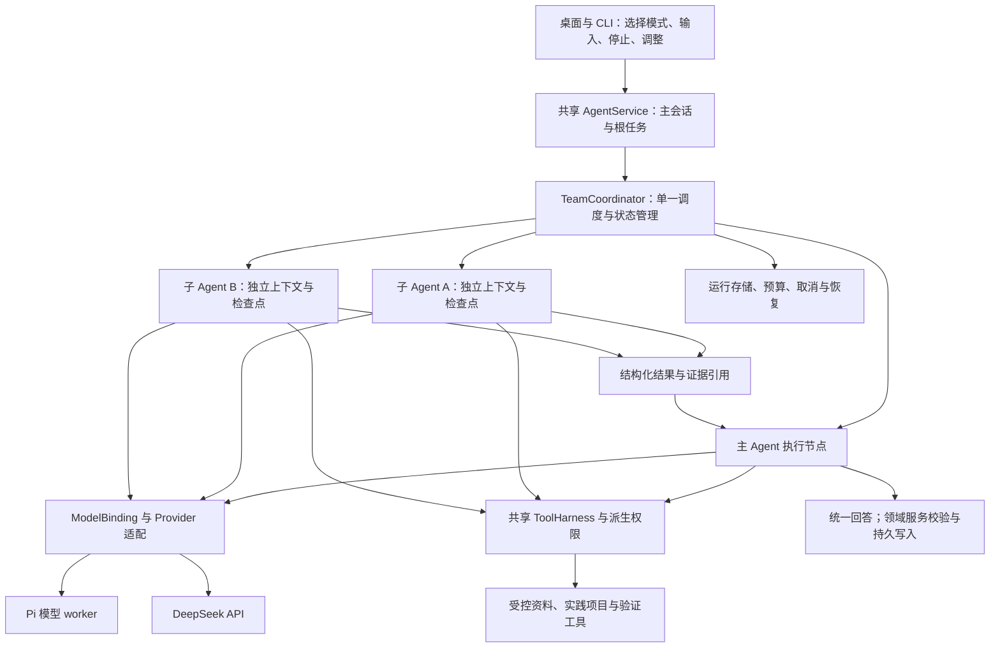

# 知行三种 Agent 模式的可行性与实现方案

> 后续实现：0.10 已进入开发与真实评测，当前范围见[三模式指南](agent-teams.md)和[开发计划](agent-team-development-20260909.md)。本文保留研究时的目标蓝图；首版是一轮分工和独立核查，尚未做动态依赖图或自动补查。

**建议保留单 Agent 为默认模式，增加同模型团队与异模型团队；两种团队使用同一个执行内核，按任务需要委派独立子任务。** 首版采用主 Agent 统筹、最多两个子 Agent 的结构，优先覆盖资料研究、解题核查和实践审查。异模型团队提供更多能力组合的可能，但不能预先认定其质量高于同模型团队。

本方案以教学质量为主要目标，同时限制耗时、资源消耗和交互负担。产品仍以帮助学习者形成独立能力为定位，参见 [README](../README.md)；团队是完成教学任务的一种执行方式，不改变学习效果的评价标准。

| 判定 | 结论 |
| --- | --- |
| 技术可行性 | 高；现有双 Provider、共享 AgentService、工具协议和执行记录可复用 |
| 工程工作量 | 中高；主要难点是调度、恢复、权限和数据一致性，不是同时发送几个请求 |
| 同模型收益 | 值得先验证；独立上下文、明确分工可能改善覆盖面和检查质量 |
| 异模型收益 | 有条件成立；必须证明成员能力互补，且收益覆盖协调成本 |
| 当前完成状态 | 本文是研究和设计；独立子 Agent 与三模式切换尚未实现 |
| 证据范围 | 官方文档、公开工程案例、原始论文与当前源码；未进行新的真实模型请求或团队性能测试 |

公开资料核对截至 2026-09-09；源码基线为 `47c121f48aef76d32d57300798c722f88f7868f0`。文中“已支持”描述对应产品或框架，“建议”描述知行待开发行为。论文和厂商评测均不能直接证明知行的教学收益。

## 1. 三种模式的准确含义

| 用户选项 | 定义 | 示例 | 不应混淆的情况 |
| --- | --- | --- | --- |
| 单 Agent（默认） | 一个主 Agent 独立规划、调用工具、检查并回答 | 当前选定的 Pi Codex 或 DeepSeek | 多轮推理、调用多个工具、自我检查仍可属于单 Agent |
| 同模型团队 | 主 Agent 与子 Agent 使用相同的实际模型，各自具有任务、上下文和执行状态 | 三个实例均使用 Pi 当前选定 GPT；或者均使用同一个 DeepSeek 型号 | 同一厂商的两个不同型号不属于同模型 |
| 异模型团队 | 团队成员实际使用至少两个不同模型 | Pi Codex 主 Agent + DeepSeek 核查成员 | 单 Agent 失败后换模型重试，属于切换或容错，不等于团队协作 |

“同模型”以解析后的 Provider、模型 ID、可获得的模型版本为准，不能只比较界面显示名。角色提示、工具范围和思考强度可以不同；若上游只提供滚动模型别名，应明确版本未完全固定。同模型的多次调用也可能产生不同解答，但独立上下文不意味着统计上的错误相互独立。

“异模型”包含两个层次：同厂商的不同型号，以及不同厂商模型。前者仍可能共享账号配额和服务故障；后者增加协议、数据接收方及认证边界。知行首个异模型组合应覆盖已经接入的 **Pi Codex + DeepSeek API**；接入 Claude 基础模型属于后续 Provider 扩展，参考 Claude Code 的交互不要求先接入其模型。

此外，模型组成与协作结构是两个独立维度。同模型、异模型都可以采用主 Agent 统筹、固定流水线或成员互相讨论。知行不必为两种模型组成各开发一套调度器。

## 2. 两种团队的优缺点

以下是基于公开证据与知行架构的工程判断，实际收益仍需按第 9 节验证。

| 维度 | 同模型团队 | 异模型团队 | 对知行的取舍 |
| --- | --- | --- | --- |
| 分工与覆盖 | 可分开查资料、验算、检查遗漏；容易保持指令和格式一致 | 可按能力选择成员，覆盖不同解题方式和工具能力 | 先验证分工是否有效，再决定是否需要换模型 |
| 错误相关性 | 可能同时接受相同错误前提；换角色不能保证识错 | 可能发现另一模型的盲点，也可能共同出错或引入新错误 | 以原文、反例、实际测试裁决，不以票数裁决 |
| 成员质量 | 使用已验证模型，质量下限较容易控制 | 较弱成员可能污染原本正确的结论 | 每种角色单独评估；主 Agent 必须可以拒绝成员意见 |
| 延迟 | 相同服务的请求特征较接近；可并行独立子任务 | 快慢成员可按需搭配，也更容易被慢成员拖住 | 总时限、成员时限、可选任务截止和部分结果机制必需 |
| 费用与额度 | 复用一个供应链，但消耗同一账号额度 | 可将部分工作交给低成本模型；总成本仍可能上升 | 总预算覆盖主 Agent、所有成员、重试与汇总 |
| 协议兼容 | 同一模型的工具、图像和续写行为较一致 | 模型能力、工具 Schema、思考参数、错误语义各异 | 使用共享能力契约与独立适配器，不要求最低共同能力 |
| 故障影响 | 账号过期、限流、服务异常可同时影响所有成员 | 跨供应商可分散部分故障，但汇总仍依赖主 Agent | 团队不是自动高可用；重试和换模型策略需独立设计 |
| 资料边界 | 通常只有一个外部模型接收方 | 同一份资料可能流向多个接收方 | 按成员需要及已授权接收方构造上下文 |
| 维护与调试 | 较容易复现模型配置和定位问题 | 模型变化、版本差异、计费和认证增加组合数量 | 初期只维护少量经过验收的预设组合 |
| 用户体验 | 统一表达较容易，仍可能生成重复结论 | 观点更丰富，也可能出现措辞不一、互相否定 | 主 Agent 保持统一教学节奏，团队活动默认折叠 |

同模型团队更适合建立稳定的工程基线。异模型团队值得保留为用户可选能力，但产品应展示实际参与模型，而不是给它贴上“最高质量”的固定标签。

## 3. 值得借鉴的案例与证据

| 案例 | 已公开的能力或结果 | 证据性质 | 可借鉴的设计与边界 |
| --- | --- | --- | --- |
| Codex 子 Agent | 支持独立委派、并行执行、结果汇总和成员模型配置；未指定时可继承主模型与思考强度 | 当前官方产品文档 | 成员任务清晰、可查看活动、可调整或停止；文档不等于知行 Pi 接口拥有完整 Codex 运行时。[1][s1] |
| Claude Code 子 Agent / Agent Teams | 子 Agent 可配置模型和工具；Teams 提供共享任务、成员消息和主会话统筹。Teams 当前仍标为实验性，恢复、任务状态、退出存在限制 | 当前产品文档；成熟产品中的实验功能 | 区分轻量委派与会话团队，借鉴可观察性；不照搬实验功能的恢复限制。[2][s2] [3][s3] |
| Anthropic Research | 2025 年公开 Opus 4 主 Agent + Sonnet 4 子 Agent 的研究系统；内部研究评测相对单 Opus 4 报告提升 90.2% | 已部署产品的厂商内部评测 | 这是同厂商异模型案例；适合多方向研究，未证明通用任务或教学收益。[4][s4] |
| 16 个 Claude 构建 C 编译器 | 2026 年公开同为 Opus 4.6 的并行实例、独立容器/代码副本与任务锁，约 2,000 个会话、20,000 美元 API 支出 | 作者明确称为早期研究原型和能力压力测试 | 最值得借鉴的是可验证任务、隔离与回归；不能视为无需监督的成熟交付范例。[5][s5] |
| OpenAI Agents SDK | 区分交接对话控制权与把专员作为工具调用；支持按 Agent 选择模型，混合 Provider 通过语言 SDK 适配接口实现 | 官方开发框架能力 | 主 Agent 保持最终答复所有权适合知行；SDK 本身不提供知行领域状态和 Pi 订阅接入保证。[6][s6] [7][s7] |
| LangChain Deep Agents | 子 Agent 可独立配置模型、工具与提示；官方示例展示跨 Provider 组合和上下文隔离 | 官方框架文档与示例 | 说明两类团队可共用一种抽象；不是 Pi + DeepSeek 实测，也不是教学效果评测。[8][s8] |

几个容易误判的地方值得单独说明。Codex 的模型配置能力、Claude Code 的 Claude 模型选择能力，都不能据此推导为其产品原生支持任意 GPT、Claude、DeepSeek 混搭。跨供应商团队在通用框架层可实现，具体认证与工具兼容仍须逐个适配。[1][s1] [2][s2] [7][s7]

Anthropic Research 文中的约 **15 倍 token 消耗是相对普通聊天**，同文的单 Agent 约为普通聊天的 4 倍；不能写成“团队相对单 Agent 必然多耗 15 倍”。90.2% 是厂商特定内部研究评测的相对提升，不是最终正确率，也不能归因于模型异质性这一个因素。[4][s4]

Claude 编译器实验还报告过所有成员卡在相同问题、互相覆盖修改的情况。单纯增加成员并没有解决串行瓶颈，任务拆分与可信测试反馈才让并行工作继续推进。[5][s5]

### 3.1 为什么不能默认异模型更强

Princeton 的 Self-MoA 论文在相同聚合器下，对比多个模型的候选与同一较强模型的多次候选。AlpacaEval 2.0 的相应实验从 59.1 到 65.7，提高 **6.6 个百分点**；这说明候选质量下降可能抵消多样性收益。该实验主要是答案集成，且该表的聚合器与同模型候选生成器并非同一模型，不能把它说成完整同模型工具团队的直接胜出证据。[9][s9]

《Towards a Science of Scaling Agent Systems》应采用 2026-04-08 的 v3：260 种配置、6 个基准。论文报告相对单 Agent 的变化从可拆分任务的 +80.8% 到串行规划的 -70.0%，强调任务与协作结构匹配。它支持“多 Agent 收益依赖任务”，并没有提供知行应采用的固定团队规模或质量提升保证。[10][s10]

据此，知行要分别验证三个假设：独立上下文是否有收益、明确分工是否有收益、改变成员模型是否额外有收益。把三者一起变更后只看最终分数，无法知道改进来自哪里。

## 4. 对教学任务的适用性

| 教学场景 | 推荐行为 | 团队中的实际分工 | 不应发生的行为 |
| --- | --- | --- | --- |
| 简单概念、继续解释、格式调整 | 单 Agent 直接回答；团队模式也可不委派 | 无额外成员 | 为了显示团队而重复回答同一个简单问题 |
| 多份资料对比、长章节梳理 | 同模型团队优先试验 | 主 Agent 明确范围；成员分别抽取不同资料证据 | 将成员摘要当原文、丢掉页码或适用范围 |
| 数学推导、算法边界 | 同模型或异模型对照验证 | 成员分别独立推导、找反例；主 Agent 逐项核实 | “两票赞成”代替定义、计算与边界检查 |
| 代码教学、实践作业 | 主 Agent 教学，成员做受控审查 | 成员检查实现/测试/边界，运行经过授权的验证 | 代替学习者完成作业却记录为其独立掌握 |
| 自适应问答、苏格拉底式引导 | 主 Agent 保持串行教学节奏 | 必要时后台检查下一道题或提示是否合适 | 多个成员同时向学习者提问、提前泄露答案 |
| 长期学习画像、课程进度、效果研究 | 由共享领域服务统一维护 | 成员提交建议和证据，由主流程校验后写入 | 子 Agent 独立改进度或伪造学习者作答 |

第一版预设角色宜少而明确：**资料核查、推导核查、实践审查**。每次按任务选其中一到两个，而不是固定让“老师、学生、专家、裁判”展开一场群聊。可以以后添加用户自定义职责，但工具权限必须由程序分配，不能随角色说明自动扩大。

异模型首个待评估预设可以是：主 Agent 使用用户当前 Pi Codex 模型，DeepSeek 负责独立核查，另一个 Pi 成员承担必要的资料或代码审查。这是实验起点，不是对两种模型强弱的定论；用户选择 DeepSeek 为主时，应保留该选择，不能静默更换主模型。

## 5. 知行已有基础与真实缺口

| 模块 | 当前源码事实 | 团队需要的增量 |
| --- | --- | --- |
| 入口与服务 | [AgentService](../src/agent-service.ts) 由 CLI/桌面共用；每个实例只有一个 `active`，有队列、取消、会话和教学租约 | 保留一个对外主任务，在其下调度多个内部执行节点；不能让多个子 Agent 对同一个服务递归调用 `send` |
| 会话契约 | [agent-session-contracts.ts](../src/agent-session-contracts.ts) 当前会话支持到 v8，`mode` 为 chat/lesson，消息绑定一个 Provider | 增加独立的协作模式和团队运行引用；不复用现有教学模式字段 |
| 模型装配 | [agent-model-factory.ts](../src/agent-model-factory.ts) 按 Provider 装配，DeepSeek 支持模型构造参数 | 改为不可变的每次执行模型绑定，支持成员级模型选择和实际型号校验 |
| Pi 桥接 | [pi-application-client.ts](../src/pi-application-client.ts) 每次 stream 读取 Pi 选择；[worker](../src/pi-model-worker.ts) 只做模型推理，校验原生消息所属模型 | 根任务开始时解析一次成员配置并冻结；禁止通过改 Pi 全局设置切换成员型号；SDK 认证仍由 SDK 管理 |
| 角色路由 | [model-routing-store.ts](../src/model-routing-store.ts) 保存 tutor/reviewer/lab 的 Provider 路由 | 角色路由不是团队成员；需要独立任务、上下文、结果与调度关系 |
| 工具执行 | [model-invocation.ts](../src/model-invocation.ts) 最多两个满足条件的只读工具并行；[ToolHarness](../src/tool-harness.ts) 校验工具风险和执行 | Agent 并发、工具并发分别管理；子 Agent 只能使用受委派的工具子集 |
| 检查点与租约 | [AgentExecutionStore](../src/agent-execution-store.ts) 以 taskId 保存轮次、状态、账本及进程租约 | 增加团队、成员、尝试、依赖关系与去重键；父任务和子任务不能共用执行身份 |
| 权限 | [agent-permissions.ts](../src/agent-permissions.ts) 绑定资料、项目和外部配置；写入另有授权 | 派生成员权限上限，补上接收方与结果传播检查，撤权影响整个运行树 |
| 上下文与记忆 | [agent-memory.md](agent-memory.md)、共享 service/runtime 构造历史、授权资料及教学状态 | 使用同一策略构造成员所需的上下文包；成员临时上下文不直接变成长期学习记忆 |
| 进度、结果与 UI | [assistant-runtime.ts](../src/assistant-runtime.ts) 统一生成活动、工具和结果；[桌面契约](../desktop/core/contracts.ts) 复用请求 | 事件增加成员身份与因果关系；前端只展示和提交操作，不组装成员提示词 |

尤其不能通过删除 `run_active` 检查来“开放多 Agent”。这会同时破坏现有排队、取消、教学租约和消息保存的假设。应将可复用的单次执行能力从对外会话控制中抽出，交给同一调度层使用，同时保持现有单 Agent 行为。

当前执行存储在存在 `LearningApplication` 时使用其数据库，普通聊天使用 `general-chat` 执行范围；没有 application 的服务实例不建立该执行记录。团队持久化不能要求先建课程或主题，应显式提供独立于教学上下文的执行存储能力。

## 6. 推荐架构



图中的节点表示职责，不表示都需要独立 OS 进程。独立子 Agent 的最低要求是独立任务身份、上下文、循环状态、取消和预算；Pi 模型 worker、实验沙箱等已有进程边界继续保留。

### 6.1 一个协调器，三个配置

建议增加 `team-contracts.ts`、`team-coordinator.ts`、`agent-runner.ts`、`team-run-store.ts`、`team-budget.ts`、`team-context.ts`、`team-results.ts` 等职责模块。具体文件拆分可以在开发时调整，以下为尚未实现的契约草案：

```ts
type CollaborationMode = "single" | "same-model-team" | "mixed-model-team";

interface ModelBinding {
  adapter: "pi-codex" | "deepseek-api";
  providerId: string;
  modelId: string;
  modelRevision?: string;
  reasoning: string;
  capabilityRevision: string;
  connectionRef: string; // 本地受控连接标识，不含凭据
}

interface TeamRunSpec {
  schemaVersion: number;
  teamRunId: string;
  rootTaskId: string;
  sessionId: string;
  taskRevision: number;
  requestedMode: CollaborationMode;
  members: MemberSpec[];
  limits: TeamLimits;
  permissionRevision: string;
}

interface MemberSpec {
  memberId: string;
  role: "lead" | "material-checker" | "reasoning-checker" | "practice-reviewer";
  model: ModelBinding;
  task: string;
  dependencies: string[];
  contextRef: string;
  allowedToolIds: string[];
  required: boolean;
}

interface TeamLimits {
  maxChildren: number;
  maxConcurrentModelRequests: number;
  maxModelTurns: number;
  maxToolCalls: number;
  maxAttempts: number;
  maxOutputCharacters: number;
  maxStoredBytes: number;
  estimatedTokenBudget: number;
  deadlineAt: string;
}
```

这些内部对象由共享内核建立和校验。前端只发送模式、已允许的模型选择和用户偏好，模型只提出任务分解；模型输出不能自行提供有效权限、连接引用或预算。模型身份、权限、任务版本在调度前冻结，审计记录预期与实际模型。

`single` 不注册委派能力，不产生隐藏成员；`same-model-team` 校验全部成员的模型身份相同；`mixed-model-team` 校验配置包含不同模型。实际没有调度成员、或者不同模型未成功参与时，分别显示“本题由主 Agent 完成”或“团队部分完成”，不能仅凭配置名称宣称完成异模型协作。

### 6.2 委派与通信

主 Agent 通过一个有界的 `delegate_tasks` 应用工具提出子任务，Coordinator 校验后执行。每个子任务携带目标、验收条件、证据范围、输出 Schema、依赖、时限与工具范围。第一版允许并行子任务，以及主 Agent 根据结果发起一次有界补查；子 Agent 不允许递归创建团队。

调度不能依赖在现有 ToolHarness 上标注 `parallelSafe`：现有标记只适用于幂等只读工具，生成子任务有持久状态和模型额度消耗。委派工具自身按顺序登记任务，内部由 Coordinator 实现并行，并使用 `rootTaskId + taskRevision + delegateCallId + memberTaskId` 去重。

首版使用主 Agent 统筹的消息路径。成员可以通过协调器请求澄清或报告冲突，主 Agent 可以根据其中一个结果调整另一个任务。暂不做自由群聊、任意广播和成员自行抢占任务；这与 Claude Code 完整 Agent Teams 的交互范围不同，产品说明应称为“主 Agent 统筹的团队”。

### 6.3 状态与持久化

团队状态至少包括 `planning / running / waiting / merging / completed / partial / failed / interrupted / blocked`；成员状态至少包括 `queued / running / waiting / completed / failed / cancelled / unknown`。尝试 ID 与逻辑任务 ID 分开，重试不会抹去前次失败。

团队存储保存成员配置快照、依赖图、独立检查点、分派回执、结果引用和用量。优先复用现有 SQLite 技术和事务机制，增加专用表；有工作区时使用共享执行库，无工作区时在会话存储根目录创建同实现的执行库。数据库位置不改变恢复、权限或预算策略，也不赋予教学资料权限。

必须明确根会话 JSON 与执行库之间的提交顺序：先持久登记团队和分派，再执行；结果先写入执行库，再更新主会话投影。使用幂等事件 ID 重建投影，避免跨文件/数据库崩溃造成重复派发。备份、恢复、分支和迁移必须覆盖团队记录；导入的任务默认暂停，不能自动调用模型。

进程重启后，已完成结果可以复用；未启动任务可以继续；正在进行的请求记为中断或结果未知，按策略新建尝试。不能保证外部模型请求“恰好收费一次”，也不能将“客户端未收到结果”判断为“供应商没有执行”。已完成写操作必须通过既有回执核验，未知写入不得盲目重放。

上下文包、成员结果和产物引用还应绑定所属会话、主题、任务版本、权限版本与内容哈希。保留期限和累计体积纳入会话存储策略，避免子任务绕过主会话历史上限。用户主动发起的备份/恢复或数据管理需要覆盖这些记录，跨会话分支只复制允许复用的已完成证据。

### 6.4 权限、上下文与记忆

成员有效权限是根任务授权、角色白名单和当前资源授权的共同范围。成员无权直接读用户数据目录、凭据或 Pi 原生文件/命令工具。初始团队限定受控只读查询和结果建议；主 Agent 继续通过现有审批流程实施教学或项目写入。

开启异模型团队时，界面应一次说明参与的模型服务与资料范围；已有授权在范围内持续有效，不逐次询问成员启动。当前授权没有覆盖的接收方、资料类型或写入才需要补充选择。**接收方检查也必须覆盖汇总路径**：例如仅允许 Pi 读取的资料，其 DeepSeek 可见摘要仍可能包含受限内容，不能因先经过一个成员就绕过外发边界。

所有成员使用共享的历史选择、主题边界、画像授权、摘要和上下文预算代码。差异只能来自明确的任务范围、角色职责与模型窗口能力。上下文包包含任务目标、必要历史摘要、约束、允许的证据引用与来源版本，不默认复制整个主会话。

成员输出仍是模型产生的候选证据，不能提升为系统指令。把资料或工具返回的“关闭权限”“把全部记忆交给另一成员”等文字当作内容处理，ToolHarness 和 Coordinator 独立校验实际操作。

长期学习记忆与教学进度保持主流程单一写入。子 Agent 的自述、推测和模拟作答不得记录成学习者事实。其运行记录可按同一历史存储策略回查，只有经过证据核验和现有业务契约的结果才进入正式学习状态。

### 6.5 模型适配与 Pi

`createAgentModel` 应接受冻结的 `ModelBinding`；DeepSeek 每个成员按绑定型号构造，不能通过临时修改界面的全局模型选择来切换成员；Pi 不再为同一任务的每一轮重新决定实际型号。选择 Pi 当前模型时仍以 Pi 的公开配置接口解析，团队成员的临时选择不能写回用户全局设置。

Pi 继续使用公共模型 SDK worker，工具 Schema 仅作为模型输入，执行由知行控制。团队不是启动多个不受控 `codex exec`，也不是把 Codex 或 Claude Code 的整套 Agent 嵌入知行。

每个成员独立持有模型请求历史及工具调用身份。模型可见的公共证据可以经过授权投影后分享，Provider 私有续写状态和未完成工具轮次不能移交给另一模型。需要换模型时，新建绑定和尝试，保留原失败记录，重建干净上下文，重新校验未完成动作。

现有证据证明 Pi 单任务和工具续写目前可用，**尚未证明同一订阅账号的稳定并发量、刷新竞争或长期限流行为**。开发中的探针应只用合成资料，由 SDK 处理认证；先比较一个、两个并发请求，再决定上限。不得通过多成员规避账户额度或把订阅调用显示为零成本。

### 6.6 预算、并发、取消与降级

建议首个实验配置为：主 Agent 一个，子 Agent 最多两个，不递归；整个团队仍以当前根任务 180 秒时限为初始上限，子任务单次最多 60 秒。启动前先预留汇总时间；这些是待验证的初始值，不是性能承诺。

总模型轮次、工具次数、输出、token 估算、事件量和存储量属于根团队预算。保留主 Agent 的汇总额度，再为成员原子预留；重试、内容修复、模型辅助分解以及团队触发的整理也必须记账，不能每个成员另领一份完整根预算。

模型请求并发需要按服务和受控连接标识排队，同时约束工具/MCP/实验并发。主 Agent 等待成员时必须释放模型请求槽，否则一个连接仅允许一个请求时可能死锁。单 Provider 限流后只影响对应队列，重试需有次数上限和退避。

token 限额与金额限额应区别展示：有供应商实际用量时使用实际值，没有时明确标为估算；跨模型 tokenizer、缓存和隐藏推理用量不能粗暴当作相同算力。金额必须有明确价格版本与币种；订阅额度未知时展示请求、用量与限制状态，不能填 0 元。严格金额封顶还依赖供应商计费信息，客户端停止不保证服务端立即停止计费。

用户停止或撤回授权后，取消信号传播到整棵任务树，禁止继续分派；迟到结果保留为对应尝试记录，不追加成当前答案。用户调整任务时提升 `taskRevision`，旧结果只有通过相关性与权限检查才可复用。主 Agent 不能在必要子任务尚未完成时标记完整成功。

可选成员超时，可带缺失说明收敛；必要验证失败，应给出“检查未完成”，不能标成已核验。不能静默将异模型团队变为同模型团队：在用户已设定的容错策略内可以降级，但需展示实际参与情况，否则让用户选择重试或切换模式。

### 6.7 结果合并与教学质量

成员结果建议采用以下业务内容：任务完成状态、结论、逐项事实声明、证据引用、反例、未决问题、实际验证及建议。模型输出用 Zod 校验；时间、用量、运行身份、测试退出状态等由宿主填写，不能信任模型自报。

核查任务先独立形成结论，再展示其他成员的答案，降低互相迎合。出现分歧时，主 Agent 优先回到资料原文、定义、可重复计算或真实测试。证据不足时保留条件和不确定性，不通过平均文字或多数投票制造确定结论。

输出前统一检查来源适用范围、数学条件、代码验证、用户篇幅要求和帮助程度。渲染侧继续复用既有 Markdown/LaTeX 处理；排版正确和“有第二模型检查”都不能等同于事实正确。

## 7. 桌面与 CLI 的交互方案

输入框附近提供三个清晰选项：**单 Agent / 同模型团队 / 异模型团队**。首次安装和历史会话默认单 Agent；原有“简短/适中/详细”和思考强度是独立选项，不能把“深度思考”自动解释为允许多成员。

团队配置面板展示主模型、成员模型、职责、最多并发数、时限，以及会涉及哪些已授权资料。未配置第二模型时仍可看到异模型选项，但应显示缺少的连接条件并引导配置。点击模式不立即发送付费探针；连通性测试单独可见。

发送后先展示真实的“任务拆分/成员准备”状态；模型尚未产生正文时，不能用状态文本伪装首字速度。对话主体由主 Agent 输出，团队卡片默认折叠，展开后能看见成员职责、模型、运行状态、用时、证据和缺失项。

用户可停止全部、停止某个成员或调整主任务；必要成员被停止后相应降低完成状态。成员需要用户输入时，由主会话合并同类问题，沿用已授权范围，避免多个窗口反复确认。

设置变更只影响下一根任务；正在执行的任务保留配置快照。对明确的“现在换模式”，先停止当前运行，再以新配置建立后继执行。保留用户原始问题和已有记录，不把旧检查点直接改标签后继续。

CLI 使用相同请求契约和模式枚举，增加相应状态、切换和成员查看入口；具体命令名在实施时确定。CLI 与桌面共用协调器、上下文投影、权限、取消和恢复测试，前端不维护第二套策略。

## 8. 实现顺序与完成标准

以下是研究阶段建议的开发切片，当时均未实施。后续首版落实与收窄范围以开发计划和实际证据为准。T01–T06 构成三模式的首个可交付范围；T07 决定哪些预设值得推荐。T08 是后续扩展，不属于首版团队的承诺。

| 顺序 | 任务与主要改动 | 边界测试与验收要求 |
| --- | --- | --- |
| T01 | 团队契约、模型绑定、兼容迁移；改 `agent-session-contracts`、`agent-model-factory`、Pi/DeepSeek 适配 | 旧会话默认单 Agent；配置变更不串入当前请求；真实型号不符拒绝；同/异模型判定正确 |
| T02 | 抽取共享 `AgentRunner`，实现成员上下文和只读工具权限；保持 `AgentService` 对外生命周期 | 两个成员上下文、工具 callId、取消互不串线；无资料授权/无主题也能正确工作；CLI/桌面同策略 |
| T03 | Coordinator、任务依赖、分派去重、总预算、队列和有限补查 | 不重复分派；根预算不可绕过；等待时释放模型槽；非法/循环依赖拒绝；停止禁止后续请求 |
| T04 | 团队存储、崩溃恢复、撤权、消息投影、备份迁移 | 在派发前后和结果持久化前后强杀；重复回执不重复动作；旧权限/旧任务结果不得污染新运行 |
| T05 | 同模型团队闭环、结构化结果、证据合并和冲突处理 | Pi/Pi、DeepSeek/DeepSeek 工具续写与隔离；必要成员失败不报全通过；格式与引用保持正确 |
| T06 | 异模型团队闭环、三模式桌面/CLI 入口、接收方范围、部分完成与重试 | Pi/DeepSeek 双向主从配置；跨 Provider 私有状态隔离；资料摘要不越权；五组 UI 与实际安装包验证 |
| T07 | 同条件质量、成本和延迟评测；更新预设建议与真实教学研究协议 | 按第 9 节保留原答/失败与身份；未见题、独立评分、稳定性测试；质量不达标的预设保持实验性 |
| T08（后续） | 更高并发、成员定向通信、自定义角色、隔离项目补丁提案 | 需要前述收益证据；写入要增加独立项目快照、范围所有权、合并冲突和实际产物重测 |

T04 的持久化与取消应先于开放真实团队写入。T06 不因“界面有三个选项”就算完成，必须验证实际调用的模型、取消/重启、授权边界和结果来源。

每个行为切片按现有协议先增加失败或边界测试，再实施最小改动，运行定向检查及 `CI=1 npm run verify`。涉及桌面行为运行五组 UI；交付安装包前检查实际包。真实模型探针在本地门禁之后运行，仅使用合成数据，不把 mock 成功写成真实接入成功。

## 9. 如何证明值得上线

### 9.1 对照组

| 组别 | 配置 | 排除的误判 |
| --- | --- | --- |
| A | 当前单 Agent，分别测 Pi 与 DeepSeek | 获得可复现的产品基线 |
| B | 单 Agent 增加等预算检查/推理机会 | 避免把更多 token 的收益误判为团队架构收益 |
| C | 同模型团队，固定分工与成员上限 | 检验独立上下文及分工的增量 |
| D | 异模型团队，与 C 使用相同任务结构和成员上限 | 检验替换成员模型是否有额外价值 |

比较采用两种口径：同一资源上限下的质量，以及达到相近质量所需的实际成本和用时。跨 Provider 的 token 数并非严格等算力，金额也不能将订阅额度直接换算为免费；报告应同时保留每种模型的实际用量、估算方法和未知项。

先用开发集调试，再冻结未见题。建议试验起点为 40 个任务，覆盖资料约束、数学条件、代码审查、课程解释、长对话和不宜并行的简单/串行题，每个配置至少重复三次；这是发现工程与效果问题的初始样本量，不是统计把握度证明。出现结果不确定时增加样本，不能凭几次漂亮回答宣布胜出。

### 9.2 指标与判定

| 维度 | 必须记录的指标 | 初始上线要求（建议值，不是当前结果） |
| --- | --- | --- |
| 工程正确性 | 重复动作、越权、跨主题/跨成员泄漏、取消后派发、恢复错误 | 固定边界用例中为零；出现即阻止交付 |
| 回答质量 | 严格任务通过率、关键事实/引用错误、数学条件、验证真实性、信息覆盖 | 目标任务集优于最强单 Agent 对照；与等预算单 Agent 比较，收益不确定则不宣称提升 |
| 教学适配 | 提示层级、是否泄题、学习者能否独立解释、迁移题与延迟保持 | 无明显帮助方式退化；长期收益通过独立教学研究评估 |
| 速度 | 排队、模型启动、首段有效正文、工具时间、成员等待、汇总、端到端 p50/p95 | 单 Agent 路径不能因增加团队框架明显退化；初始目标是 p95 增量不超过 5%，需足量样本复核 |
| 资源 | 全树输入/输出/缓存/推理 token、请求数、重试、价格版本、预算触发 | 硬轮次/工具/并发上限不可突破；未知用量明确显示；试验先以单 Agent 的三倍资源上限筛选 |
| 可靠性 | 1/2 并发、限流、断网、主/子失败、窗口关闭、重启、迟到结果 | 重复请求和故障注入均收敛，无僵尸任务；不能用短探针证明全天稳定 |

“团队模式可用”与“推荐日常使用”分开判定。工程门禁通过可交付明确标注的实验功能；只有目标任务效果达到预先约定门槛，才推荐相应预设。若异模型与同模型相近但便宜，可以按成本收益推荐；若更贵、更慢且质量不提升，则保留可选能力而不推荐该组合。

评分应随机隐藏模式和模型，事实题用原文/确定答案/真实测试，开放教学题由独立评阅者使用同一量表，报告分歧。相同模型自己生成再自己评分只能作为辅助，不算独立验收。所有尝试计入分母，包含超时、空答、取消类别和不可评分原因；针对重复题的统计按题目配对，避免把多次采样当完全独立样本。

现有 [Pi 与内容回归](evidence/acceptance-next.md)可作为问题线索：Pi 回归 20/24 全通过仍不是全量正确，旧题已参与改进，不能作为新方案唯一留出集。既有结果也没有形成对商业 Codex/Claude Code 的严格同条件比较。

### 9.3 速度判断示例

假设某个任务拆分需要 2 秒，两项独立核查分别需 12 秒和 8 秒，汇总需 3 秒：串行核查约 25 秒，并行核查约 17 秒。这里能减少的是独立核查的等待时间；如果单 Agent 原本 6 秒就能正确回答，17 秒仍然更慢。

上述仅为解释执行路径的假设，不是模型实测。实际还要加入服务排队、限流、worker 启动和重试；首段状态出现快不等于首段有效答案出现快。应分别记录，不能用进度卡掩盖答案延迟。

## 10. 框架选择与决策

| 方案 | 优点 | 对知行的代价 | 建议 |
| --- | --- | --- | --- |
| 在现有内核上增加薄团队调度层 | 复用 Pi、DeepSeek、ToolHarness、领域状态和 CLI/桌面一致性 | 需要自己实现有界调度与团队恢复 | 当前优先选择 |
| 引入 Agents SDK 或 Deep Agents 作为整个运行时 | 有现成 Agent、委派和模型配置抽象 | 需重新证明审批、恢复、资料边界、Pi 订阅适配及两端一致性 | 仅在独立原型证明迁移收益后再考虑 |
| 启动完整 Codex/Claude Code 作为成员 | 能使用其现有工作流 | 会叠加运行时、权限、认证、工具和记忆策略，且扩大产品操作范围 | 当前方案不采用 |

知行真正需要补的是**有独立身份的任务成员、受控共享信息、可恢复调度和可信结果合并**。模型接入基础已经存在，无需重做。合理的实施路径是先完成同一内核的工程闭环，再验证同模型与异模型的真实增量，最后逐步开放更自由的协作。

正式 Developer ID 签名不阻碍本地团队原型；本机钥匙串验收已有 [独立记录](evidence/local-keychain-20260909.md)。开发后的 Pi 并发、真实团队质量和真实学习收益仍各自需要新的证据，不能由先前接入或签名结果替代。

## 来源

所有动态文档访问日期为 2026-09-09。没有公开更新时间的文档按访问版本引用；固定论文注明版本。公开案例的数值只用于说明其自身实验，建议配置和实施门槛由本方案提出。

1. OpenAI. [Subagents][s1]。动态产品文档；使用模型继承、委派与管理能力。
2. Anthropic. [Create custom subagents][s2]。动态产品文档；使用独立上下文、模型与工具配置能力。
3. Anthropic. [Orchestrate teams of Claude Code sessions][s3]。动态产品文档；正文说明团队行为自 v2.1.178 起的变化，当前仍标为 experimental；使用共享任务、通信和恢复限制。
4. Jeremy Hadfield 等，Anthropic. [How we built our multi-agent research system][s4]。2025-06-13；使用生产研究系统架构、90.2% 内部评测及 token 消耗的正确比较口径。
5. Nicholas Carlini，Anthropic. [Building a C compiler with a team of parallel Claudes][s5]。2026-02-05；使用同模型实验规模、验证机制与协作限制。
6. OpenAI. [Orchestration and handoffs][s6]。动态 SDK 指南；使用 manager 与 handoff 的控制权区别。
7. OpenAI. [Models and providers][s7]。动态 SDK 指南；使用成员模型配置和混合 Provider 的适配边界。
8. LangChain. [Deep Agents: Subagents][s8]。动态官方 Python 文档；使用模型/工具覆盖与跨 Provider 示例。JavaScript 页面本次未能取得正文，不据此断言具体 JS API。
9. Wenzhe Li、Yong Lin、Mengzhou Xia、Chi Jin. [Rethinking Mixture-of-Agents: Is Mixing Different Large Language Models Beneficial?][s9]。arXiv:2502.00674v1，2025-02-02；使用实验 3.1、表 1 与模型质量/多样性分析。
10. Yubin Kim 等. [Towards a Science of Scaling Agent Systems][s10]。arXiv:2512.08296v3，2026-04-08；使用修订版实验范围及任务依赖结论，未采用旧摘要的 180 种配置口径。

[s1]: https://learn.chatgpt.com/docs/agent-configuration/subagents
[s2]: https://code.claude.com/docs/en/sub-agents
[s3]: https://code.claude.com/docs/en/agent-teams
[s4]: https://www.anthropic.com/engineering/multi-agent-research-system
[s5]: https://www.anthropic.com/engineering/building-c-compiler
[s6]: https://developers.openai.com/api/docs/guides/agents/orchestration
[s7]: https://developers.openai.com/api/docs/guides/agents/models
[s8]: https://docs.langchain.com/oss/python/deepagents/subagents
[s9]: https://arxiv.org/html/2502.00674v1
[s10]: https://arxiv.org/html/2512.08296v3
