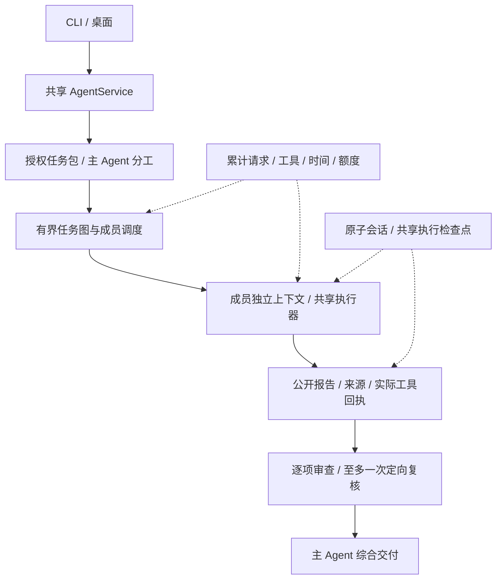

<!-- generated-by: gsd-doc-writer -->
# 知行团队内核设计

更新：2026-09-11。对应本轮源码；安装在本机的应用版本及真实 Provider 验收另行记录。

## 设计目标

架构对齐成熟 Agent 的共同能力：清晰的任务归属、独立的成员执行上下文、受控工具循环、可追溯工作产物、有限的反馈与恢复。产品继续服务教学；不以角色数量、模型品牌数或多数投票作为质量证明。

CLI 与桌面只传递用户请求、公开配置和权限选择。两端共用 AgentService、TeamCoordinator、runAssistantTask、ToolHarness、模型绑定、预算、记忆与持久执行。单 Agent 也使用同一套执行器，不另建团队专用工具、权限或记忆策略。

## 实际契约

| 层 | 本轮实现 | 设计理由 |
| --- | --- | --- |
| 数据与执行边界 | `team-work-contracts.ts` 为无 Node 依赖的共同契约；执行代码仅在主进程/CLI | 界面无需加载模型执行代码，不在前端复刻策略 |
| 任务输入 | 当前问题、当前图片；明确共享后加最多12条/24000字符历史，截断显式标记；主系统指令剔除 | 规划、成员与审查面对相同题设，权限不因委派扩大 |
| 任务图 | 最多4项初始任务，每项具备稳定 ID、负责人、依赖和1–6项交付条件；拒绝循环、未知引用、遗漏成员和越权字段 | 工作可检查、可安排依赖；兼容旧字符串计划时生成明确的基础交付条件 |
| 成员上下文 | 同一成员最近最多4项已完成公开产物，加明确依赖结果；不转发无关同伴上下文 | 持续工作同时保持隔离；不保存或展示服务商私有推理 |
| 阶段执行 | 每次尝试独立 executionId；使用公共工具循环和 SQLite 执行检查点；报告、执行状态、尝试历史保存在父团队记录 | 防止阶段相互覆盖，保留崩溃和恢复依据；当前是有界产物续接，不是无限完整会话转发 |
| 调度与失败 | 同一成员不并发，最多2个成员；实际连接也有限流；Pi 同一连接串行；失败只阻塞依赖分支 | 保留资源约束，避免一个可选连接失败使健康成员全部退出 |
| 证据 | Runtime 产生含执行 ID、调用 ID、输入/结果哈希的实际回执；保留受控检索来源；模型只能引用已观察成功回执 | 报告文字不能伪造一次工具执行；哈希仅证明记录关联，不验证语义 |
| 审查 | 每项交付条件关联命题、依据任务、实际回执和说明；定向复核后再审查；修正用 sourceTask 指向新报告 | 原报告不被覆盖；“更正了什么、为何更正”可追溯 |
| 恢复 | 继续只综合旧记录；显式补做指定失败任务及未执行的阻塞依赖分支，再审查/综合；每项最多3次 | 不自动重放计费结果未知请求；成功成员复用，历史用量和预留不清零 |
| 存储 | 团队协议3；基础任务图记录为会话v11，原生任务预算为v12，成员资源策略为v13；沿用原子会话、备份和执行日志，旧v9/v10可读且不自动重放 | 不建立第二套会话真相，不虚构旧任务缺失的验证记录 |

## 三种模式的关系

单 Agent 是共享执行器的直接调用。同模型团队与异模型团队使用相同任务图、上下文、权限、预算和验收契约，只改变成员模型绑定。同模型必须匹配实际型号和连接；异模型必须存在至少两个不同实际型号。主模型官方 Codex 或 Pi 加 DeepSeek、Kimi 两名成员可形成三家模型协作，但增加品牌不代表自动增加质量。

新团队以主 Agent 思考档位为起点，成员可逐一覆盖。对声明推理/正文共享输出额度的 DeepSeek/Kimi 适配器，自动策略先预留分工、审查和最终回答容量，再按成员数分配；快速/均衡/深入目标为4096/8192/16384，容量不足时降低自动档位，手动档位优先。默认16384整题额度下两名自动成员采用快速档。旧任务恢复沿用冻结绑定及原策略。

默认最多12次模型请求/官方任务、24次工具调用、192000输入 token 估算、16384输出 token 目标与240秒整题时限。默认成员时限180秒，后端更短时限仍有效。用户可显式提高整题输出目标（最大48000），系统不因失败自动增加。官方任务 token 仅在返回后观测，不能称为服务商硬上限；任务次数、时限和可见文本长度可强制执行。

## 完成状态的含义

执行状态回答“请求和任务是否完成”。核查状态回答“交付条件是否得到逐项审查、依据是否可追溯”：

- **待核查**：有失败任务、遗漏条件、不确定事项、缺失审查或无效引用。
- **已逐项模型审查**：有可追溯的逐项模型判断，尚不能当作外部事实认证。
- **已关联实际工具依据**：各项判断关联实际执行回执，仍不能推导出模型解释必然正确。

主 Agent 会收到上述限制及修正关系。最终回答的语义正确性仍需要客观题、实际工具测试及真实教学评估；UI 的状态不充当正确性分数。

## 与公开成熟架构的对应和差距

2026-09-10 架构研究参考了 Codex 独立子任务上下文、跟进与等待，以及 Claude Code 的独立上下文、权限控制和团队协作文档；这些是当时公开机制的设计参照，实际产品能力随版本变化。[Codex 子 Agent](https://learn.chatgpt.com/docs/agent-configuration/subagents)、[Claude 子 Agent](https://code.claude.com/docs/en/sub-agents)、[Claude 团队](https://code.claude.com/docs/en/agent-teams)。本轮对齐的是这些机制；没有依据声称复制商业产品未公开内部实现。

知行目前仍是**主 Agent 管理、有界只读成员**：先计划任务图，最多追加一次复核，不开放随时无限重新分工、成员互发消息、递归委派和成员工作树写入。调度采用有界批次；审查使用主模型，不能当作完全独立第三方裁判。通用持续会话、任意阶段单独恢复、无限团队规模都不属于已完成能力。成员有不同工具配置或并行写代码的需求出现时，再在相同权限与预算边界内扩展。

这意味着“核心结构向成熟 Agent 对齐”，不意味着功能、回答质量和可靠性已达到商业产品相同水平。过去32项模型对照使用旧架构和旧默认档位，不能作为新策略收益证据。2026-09-11 已有四道冻结题、二十次真实运行的有界对照，团队与单 Agent 都完成且答案字段正确，但仍有成员错误被审查纠正、时间接近上限和解释措辞问题，见[完整结果与限制](evidence/team-resource-budget-20260911.md)。它不替代更大独立题集或真实学习者验证。

当前评测报告为 v6，注明团队协议3及成员资源策略版本1，成员档位从实际冻结绑定统计；官方任务与 API 请求分列。旧 v3/v4/v5 报告保持原样，不能把主模型 balanced 标签当作所有成员的实际档位。

## 验收入口

内核首次对齐见[实际验证记录](evidence/team-kernel-alignment-20260910.md)，当前预算与三家真实对照见[2026-09-11 记录](evidence/team-resource-budget-20260911.md)，通用接入重构另见[验收](evidence/provider-architecture-20260911.md)。旧[架构报告](agent-team-architecture-review-20260910.md)保留开发前诊断，不回填本轮结果。真实系统钥匙串授权、真实 Provider 回归、签名安装和真实教学效果分别验收。

## 后端能力不同，业务契约相同

API/Pi 成员可在获授权后使用只读 ToolHarness；官方 Codex 成员目前仅使用任务包文本，不能检索文件、读历史或调用外部工具。原生执行器内部任务次数与知行模型循环次数不同，报告分别记录。官方 Claude 当前无法冻结确切模型身份且目录未启用团队，Gemini 仅为扩展位置；不会因为目录存在就投入协作。未来增加 SDK/App Server 需实现 AgentExecutor 并验收，团队无需复制厂商专属策略。
