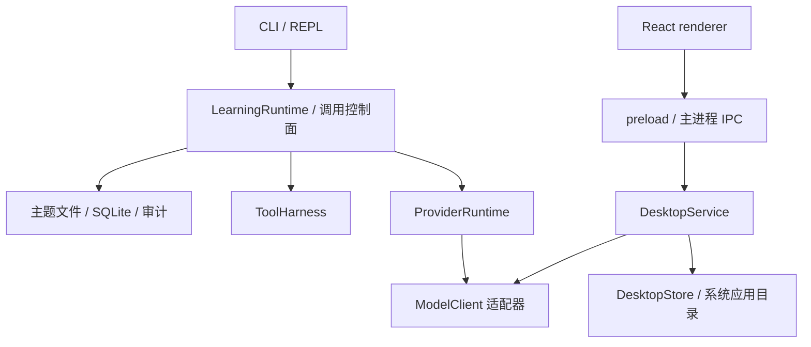

<!-- generated-by: gsd-doc-writer -->
# 知行架构（当前实现）

> 本文描述仓库当前代码，而不是目标架构。后续设想会明确标注，不能作为已交付能力。

## 系统概览与运行入口

知行有两个独立入口：CLI 提供按主题组织的课程、资料、记忆、工具调用和学习进度；Electron 桌面应用提供持续对话、模型切换与本地会话管理。两者复用 `ModelClient`、Pi Codex / DeepSeek 适配器和回答风格规则，但不共享会话存储，也没有自动同步或迁移学习数据。桌面当前不调用 `LearningRuntime`、`ToolHarness` 或 CLI 的 SQLite 数据库。



图中的 ProviderRuntime 与工具控制面属于 CLI；桌面主进程直接选择模型适配器，使用自己的文本流生命周期。

### CLI 组合根

`src/cli.ts` 是当前组合根：它初始化主题、数据库、资料库、Provider、课程、提醒和 REPL/headless 命令。`LearningRuntime` 负责确定性 Day 状态机、前置条件、进度、计划与证据 Review；模型只用于讲解、答疑、自然语言草案和资料问答，不能直接改变完成状态。

每轮输入先通过 `interaction-protocol.ts` 编译为四类受类型约束的控制决策：确定性命令、待执行计划确认、教学输入或自然输入。确定性命令不需要模型解释；模糊管理请求只能生成校验后的草案；教学输入再进入教学动作协议。内容模型不能直接执行写操作或改变状态。

```text
CLI / REPL
  -> ReplInput + ReplController + ReplOutput（持续输入、即时控制、串行队列与显示）
  -> ConversationSessionStore（按主题的新对话、历史与恢复）
  -> TopicRegistry + TopicStore（内置或用户创建的本地主题）
  -> LearningRuntime（Day gate、进度、Review）
  -> DocumentLibrary + ZhixingDatabase（PDF/Markdown、FTS5、HashEmbedding、记忆）
  -> ProviderRuntime（mock / DeepSeek / Codex CLI / Pi Codex）
  -> ActionRegistry / InteractionProtocol（输入分类与命令元数据）
  -> RunManager + WorkflowLedger（取消、单前台任务、SQLite 运行/步骤账本）
  -> AuditLogger（脱敏事件轨迹）
```

## CLI 主题、状态与数据

本节的 `zhixing/...` 与 `learning-notes/...` 相对 CLI 工作根目录：它默认是仓库的父目录，可由 `ZHIXING_ROOT` 覆盖。因此仓库内的数据库通常实际位于 `db/zhixing.sqlite`，学习笔记则在仓库旁的 `learning-notes/`；不要把 `ZHIXING_ROOT` 误设为仓库本身再重复拼接一层 `zhixing`。

- 内置主题定义在 `src/topics.ts`；`创建主题` 通过 `TopicStore` 建立受控本地主题、计划、Skill 与 inbox 目录。
- 当前主题保存在 `zhixing/settings/current-topic.local.json`；用户生成主题、学习记录和本地设置均被 `.gitignore` 排除。
- Day 状态、进度和计划由主题目录中的 Markdown/JSON 文件保存；资料元数据、Chunk、FTS5、嵌入与记忆保存在 `zhixing/db/zhixing.sqlite`。
- `TeachingSessionStore` 保存当前 Day、阶段、受限转录、当前练习和作答；`LearningContextBuilder` 仅组装当前主题画像、至多三条记忆、资料名称和教学检查点。
- `ConversationSessionStore` 保存每主题当前对话及可显式恢复的旧对话，最近 6 轮、每轮输入与回答各最多 8,000 字符；请求前保存用户输入，结束或正常中断后保存回答。强制结束可能丢失未保存增量，教学检查点不随旧聊天恢复而回滚。
- `WorkflowLedger` 将运行与步骤状态写入 SQLite；启动时会把上次进程遗留的 `running` 运行标记为 `process_interrupted`，不重放任何可能含写入的操作。用户可安全地重新发起操作。
- CLI 已有手动数据库备份、预览和确认恢复：`备份数据库` 将 SQLite 保存到 `zhixing/db/backups/`；它不包含资料原文件、主题计划、学习笔记或桌面对话。当前没有全局 `profile.md`、`MISTAKES.md`、情节记忆、主题删除、定时自动备份或完整学习数据导出。桌面对话 Markdown 导出是另一项已实现功能。

`LocalSyncServer` 由 CLI 的 `启动同步服务 [端口]` 显式启动，仅监听 `127.0.0.1`，提供按主题限定的 `GET /topics/<topicId>/progress` 与 `GET /topics/<topicId>/events`。后者是 SSE 事件流，CLI 操作完成后发布进度变更通知；没有远程身份认证、跨设备复制或云端存储，桌面也未连接该服务。实现见 `src/sync-server.ts` 与 `src/cli.ts`。

## CLI 教学闭环

真实 tutor 的单日流程为：`开始第 N 天 → 讲解 → 答疑确认 → 练习/测验 → 实验与证据 Review`。讲解、答疑和练习的检查点在每次成功阶段转换后保存；重启可恢复，但不会恢复未完成的 Provider 请求。练习中的自然语言先被约束为 `start_practice`、`answer_question`、`request_solution`、`ask_question`、`skip_question` 或 `change_plan`。模型分类只提供意图建议：索要答案有确定性优先级；“作答/批改/持久化”必须有可追溯的用户原文证据，未证实的 `answer_question` 会安全降级为答疑，不能触发虚构批改。Day 只有 `检查 DNN --实现 --测试 --失败 --复盘` 达到 reviewer 标准后才会推进。

`mock` 不调用真实模型，返回确定性学习卡；真实 Provider 默认在已配置后可用，设置 `ZHIXING_ALLOW_LIVE_PROVIDER=0` 会阻止调用。

## Provider 与外发边界

| Provider | 当前适配与入口 | 适配器超时 |
| --- | --- | --- |
| mock | CLI 本地 `MockModelClient`，也用于确定性验证 | 立即返回 |
| demo | 桌面 `DesktopDemoClient`，明确标注离线演示 | 本地分片输出 |
| deepseek-api | CLI 与桌面复用 `DeepSeekClient`；密钥来源由各入口注入 | 60 秒；SSE 单帧 64 KiB、整响应 256 KiB |
| codex-cli | 仅 CLI；`codex exec --sandbox read-only --ephemeral --json` | CLI 注入 150 秒；类构造默认值为 60 秒 |
| pi-codex | CLI 使用安全脚本，桌面使用内附 Pi 的等价启动器；均显式指定 Pi 的 Codex 模型与推理强度 | 默认 150 秒 |

CLI 资料问答发送检索证据；学习建议发送画像和资料名称；教学发送当天学习卡与受限主题上下文；自然交互发送当前会话文本。桌面只组装当前对话的受限历史和本次用户输入，不读取 CLI 资料库或跨主题上下文。应用不会自动把凭证、审计原文或其他主题资料加入模型内容；DeepSeek 密钥只用于 API 请求认证。`codex-cli` 在临时目录、只读沙箱内运行，知行只读取 assistant 文本；这不等于 Pi 适配器的运行方式。

`ProviderRuntime` 仅在调用允许 fallback、尚无事件外发且错误属于可回退类别时使用 mock；CLI 教学和自然交互显式关闭静默 fallback。桌面没有自动回退：失败保留状态和部分回答，用户可以点击切换到 DeepSeek 重试。

`PiCodexClient` 只读取 Pi 设置中的非敏感模型偏好，显式要求 `openai-codex`、模型名与推理强度，避免默认模型不可用时改用其他 Provider。全局设置来自 `PI_CODING_AGENT_DIR/settings.json` 或默认 Pi agent 目录，调用工作目录的 `.pi/settings.json` 可覆盖对应偏好。认证和 token 刷新由 Pi 自身处理；读到模型偏好不代表登录有效。

CLI 使用 `scripts/pi-safe.sh`。桌面 `packagedPiRunner` 将该请求改为 Electron 自带 Node 运行时执行内附 Pi CLI（`ELECTRON_RUN_AS_NODE=1`），无需系统 Node/Pi 可执行文件；保留 `--no-extensions`、显式加载的同一工具守卫、`--no-tools --tools ""` 等限制，prompt 从 stdin 传入。桌面的 Pi 工作目录是独立用户数据下的 `runtime/`，使用打包的 `desktop/runtime-AGENTS.md`，不是开发仓库根目录。Pi `--offline` 配置不替代应用的禁止外发开关：`ZHIXING_ALLOW_LIVE_PROVIDER=0` 仍由真实适配器强制执行。

Pi JSON 的 assistant `text_delta` 映射为知行文本事件；适配器验证返回模型一致性、最终 assistant 的 `stop` 状态、`agent_end` 及进程成功退出，并拒绝工具事件。单纯退出码 0 不等于完成。源码见 `src/pi-client.ts` 与 `desktop/core/pi-runner.ts`。

## CLI 控制面、事件与工具

`ActionRegistry` 为已识别命令声明稳定动作 ID、风险级别与确认要求；`InteractionProtocol` 先把每轮输入归为命令、待执行草案、教学输入或自然输入。共享的 `ConversationPolicy` 统一校验用户授权、高风险显式确认与用户原文证据：模型文本只能提出动作或事实建议，不能单独改变状态、触发批改或写入记忆。CLI 仍是组合根，尚未完全由注册表分派每一个旧命令处理器。

`ModelEvent` 包含文本、工具请求、工具结果与终止事件；工具请求带 `callId`。模型发出的 `tool_result` 不可信，只有控制面实际执行的结果会进入续写。`collectInvocation` 在单个调用内持有完整的模型/工具历史，固定 Provider 路由，并在收到整个合法工具批次后顺序执行。工具失败作为结构化观察反馈，模型可以调整下一步；未知工具和写权限不因模型要求而开放。

DeepSeek 实现 `ContinuableModelClient`：工具 schema、分片参数、assistant tool_calls 和 tool_call_id 成对传输，连续多次检索不会丢失早期轮次。普通自由问答在 Provider 支持工具时，以及显式 `学习助手` 命令，通过同一个 `ToolHarness` 注册进度、资料目录与按次授权的资料正文检索；每次调用保持当前主题不变。原有教学和自然计划协调器仍走文本协议，Codex CLI 与 Pi Codex 均为文本适配器。

REPL 持续读输入，普通消息串行执行，状态与取消即时响应，显式调整可抢占文本生成。短段落定时刷新；正在编辑输入时暂存新增显示。隐藏输入独占来源，不将其缓存重放进聊天。该界面仍是行式终端，未实现完整 TUI。

默认预算为 6 个模型回合、32 次工具请求、10,000 个事件、64,000 字符总文本、128,000 字符上下文估算和 180 秒总时限。超过预算明确停止；这不是 tokenizer 精确计数，也不是费用预算。SSE 按 UTF-8 字节限制单帧 64 KiB、整响应 256 KiB，支持 CRLF 和跨块分片；`[DONE]` 立即关闭读取，断流、坏帧和截断输出不报成功。取消约束覆盖取密钥、HTTP、流读取、工具 dispatch 和下一模型轮。

教学转移由 `completeTeachingTurn` 在模型成功返回后计算。索要答案、批改和澄清不会覆盖原练习；新出题才增加轮次，仍保留原有 20 轮上限。部分回答可保留为未完成转录，但不推进阶段或写入学习者作答。转录保存前有明确截断标记；切换主题时清除旧主题的内存对话和待确认草案。

这些预算属于 CLI 的 `collectInvocation`，不等于桌面服务的预算。当前没有精确 token/费用计量、语义上下文压缩、通用并行调度、自动网络重试、Claude/本地 HTTP Provider、DOCX 导入或云同步；桌面界面基于 React，但没有独立部署的浏览器 Web 产品。

## 桌面对话链路

`desktop/electron/main.ts` 是桌面组合根，创建单实例窗口、`DesktopStore`、`DesktopService` 和 Provider。`desktop/renderer/index.tsx` 负责会话侧栏、搜索、消息流、输入框与设置；Markdown 使用 `react-markdown`、GFM、`remark-math` 和本地 KaTeX 渲染，包含代码/回答复制与外链操作。

一次发送按以下顺序执行：

1. renderer 通过 preload 暴露的 `window.zhixing.invoke` 发出 `send`；主进程验证窗口、主 frame、页面 URL，并用 `desktopCommandSchema` 校验参数。
2. `DesktopService.send` 拒绝并发生成，在异步读取会话前固定本轮客户端；组装受限历史，然后先保存用户消息和 `running` 状态的助手消息。
3. 服务只接收 `text_delta` 与 `done`，通过 `zhixing:event` 广播 `session`、`delta`、`settled` 事件；事件含会话标识，浏览其他会话不会把流写到错误页面。工具请求会报错，桌面未注册任何学习或文件操作工具。
4. 收到非空文本和明确 `done` 才标记 `completed`；用户停止为 `interrupted`，超时、断流或其他错误为 `failed`。部分文本保留，首字和总耗时写入消息元数据。
5. 输出增量到达且距离上次保存超过 750 ms 时保存快照，结束再保存；退出应用会停止活动请求并等待最终保存。强制终止仍可能丢失尚未落盘的增量，重启加载时把遗留 `running` 消息转为 `interrupted`。

桌面 IPC 命令包括 `boot`、`new`、`load`、`send`、`stop`、`rename`、`settings`、`export`、`open-link`、`configure-deepseek`、`copy`。响应统一为 `{ ok: true, data }` 或 `{ ok: false, error }`；错误通过 `publicError` 转成用户可读信息，不直接转发底层异常。接口定义见 `desktop/core/contracts.ts`，不是 HTTP API。

### 历史、草稿与设置

- `DesktopStore` 在 `app.getPath("appData")/Zhixing` 保存 `conversations/<UUID>.json` 和 `preferences.json`；macOS 为 `~/Library/Application Support/Zhixing`。JSON 使用临时文件加重命名原子写入；坏会话文件保留，其他健康会话仍可列出。
- 会话按更新时间排序，可重命名、重新载入和导出 Markdown。导出由主进程弹出系统保存对话框，仅导出所选桌面对话，不是 CLI 学习数据备份。
- 草稿按会话保存在 renderer 的 localStorage，`last-session` 保存最后打开的会话；它们不属于会话 JSON，也不会随 Markdown 导出。设置保存串行化，renderer 用修订号避免旧响应覆盖新的选择。
- 设置包含 Provider、回答风格、显示主题和 DeepSeek 模型；源码默认依次为 `pi-codex`、`adaptive`、`system`、`deepseek-v4-flash`。本机已保存设置可覆盖默认值。
- 全应用同一时间只生成一个回答，期间可浏览历史和编辑草稿。停止不会清除部分文本；“继续回答”发送新的续写请求，“重试”重新发送对应用户问题。Pi 失败后点击 DeepSeek 切换按钮会保存 Provider 选择，并在原会话追加新一轮请求，旧失败记录保留。
- Enter 发送、Shift+Enter 换行，中文输入法组合输入不触发发送；只有视图处于底部时自动跟随新内容。Cmd/Ctrl+N 新对话、Cmd/Ctrl+K 搜索、Cmd/Ctrl+, 打开设置。

### 桌面资源上限

| 项目 | 当前限制 | 代码位置 |
| --- | --- | --- |
| 单次用户输入 | 20,000 字符 | `desktop/core/contracts.ts` |
| 单条回答 | 64,000 字符 | `desktop/core/service.ts` |
| 单次生成 | 最多 20,000 个模型事件，服务总时限 180 秒 | `desktop/core/service.ts` |
| 适配器时限 | DeepSeek 60 秒、Pi 150 秒；可能先于服务时限结束 | `src/deepseek-client.ts`、`src/pi-client.ts` |
| 保存的会话 | 最多 1000 条消息；单文件最多 12,000,000 字节 | `desktop/core/contracts.ts`、`desktop/core/store.ts` |
| 发给模型的历史 | 从最近消息向前收集，最多 24 条且文本累计不超过 48,000 字符；再加本次输入及提示词 | `desktop/core/service.ts` |

历史预算不等于完整显示历史；遇到下一条消息放不下时即停止向前收集，不做摘要或语义压缩。消息达到保存上限后要求新建会话，不自动删除旧消息。以上字符数按 JavaScript 字符串长度计算，不是 token 或字节预算；JSON 文件和 SSE 的字节限制独立生效。

## 安全与质量

- `PathPolicy` 控制主题路径、导入根以及现存父目录/中间目录/叶子文件符号链接越界；它不代替防并发路径替换的 OS 沙箱；资料和用户本地状态不得提交。
- CLI 的 DeepSeek API Key 通过 `MacOSKeychainSecretStore` 读写 macOS Keychain。CLI 模型审计记录 Provider、角色、耗时、状态及事件/回合/工具调用计数，不保存 prompt、回答或凭证；桌面没有接入该审计账本，使用自己的消息状态和时间元数据。
- 删除资料、写长期记忆和恢复数据库均需命令级确认；恢复会先预校验备份，并在失败时重新打开原数据库。
- 桌面新 API Key 通过主进程的 `EncryptedDesktopSecrets` 使用 Electron 异步 safeStorage 加密，保存为用户数据目录下的 `deepseek.credential`；加密不可用时拒绝保存，没有明文回退。macOS 可复用现有知行 Keychain 项，优先使用桌面加密文件。配置状态只检查文件/Keychain 元数据，实际请求才读取密钥；设置页不会回填已有密钥，密钥不进入偏好或聊天 JSON。Pi 认证仍由 Pi 独立管理。
- renderer 启用 sandbox、context isolation、禁用 Node integration，通过受限 preload 使用应用接口；本地 `zhixing://app` 协议只提供打包资源，CSP 禁止 renderer 自行联网，导航、新窗口和权限请求默认拒绝。`open-link` 仅允许不含内嵌账号密码的 HTTP(S) URL，由主进程交给系统浏览器。
- 桌面文件存储检查目标及直接父目录的符号链接，读取文件使用 `O_NOFOLLOW`；这些检查和 CLI 的 `PathPolicy` 不应描述为覆盖所有祖先目录和并发路径替换的 OS 沙箱。Electron renderer 沙箱也不意味着整个主进程或 Pi 子进程处于同一个 OS 沙箱中。
- 质量门是根目录 `npm run verify`；桌面交互另运行 `npm --prefix desktop run test:ui`，安装包还需对实际打包应用运行 UI 验证。真实 Provider smoke 为单独环境验收，不因本地协议测试通过就声称登录或联网成功。

## 关键抽象与目录职责

| 抽象 | 职责与源码 |
| --- | --- |
| `LearningRuntime` | 确定性课程状态机与 Review 入口：`src/runtime.ts` |
| `authorizeConversationTransition` / `decideInteraction` | 授权、原文证据与输入分类：`src/conversation-policy.ts`、`src/interaction-protocol.ts` |
| `ModelClient` / `ContinuableModelClient` | 文本流及可选工具续写协议：`src/model.ts` |
| `ProviderRuntime` / `collectInvocation` | CLI 路由、回退、模型/工具回合与预算：`src/provider-runtime.ts`、`src/model-invocation.ts` |
| `ToolHarness` | 当前主题受控工具注册与执行：`src/tool-harness.ts` |
| `ZhixingDatabase` / `WorkflowLedger` | 资料检索、记忆及持久运行账本：`src/database.ts`、`src/workflow-ledger.ts` |
| `DesktopService` | 单一活动生成、流式事件、停止与导出：`desktop/core/service.ts` |
| `DesktopStore` | 桌面会话与偏好存储：`desktop/core/store.ts` |
| `DesktopBridge` | renderer 到主进程的受限接口：`desktop/core/contracts.ts`、`desktop/electron/preload.ts` |
| `EncryptedDesktopSecrets` | 可注入系统加密与旧 Keychain 来源：`desktop/core/secrets.ts`、`desktop/electron/secrets.ts` |

`src/` 保存 CLI 学习域和可复用模型代码；`desktop/core/` 不依赖 Electron UI，便于使用临时存储和模型夹具验证；`desktop/electron/` 集中 OS 能力、凭据和 IPC 权限；`desktop/renderer/` 集中界面和 Markdown 展示。`topics/`、`skills/` 保存学习内容；`tests/` 包含单元、integration 和 eval 测试，`scripts/smoke-mock.mjs` 与 `desktop/scripts/smoke.mjs` 验证 CLI/桌面整体链路；`docs/` 说明行为和验收证据。用户资料与生成状态位于各自受控目录，不作为打包源码资源。

## 构建与已验证范围

`desktop/scripts/build.mjs` 用 esbuild 分别生成主进程 ESM、preload CJS、renderer 静态资源以及守卫模块。electron-builder 将内附 Pi 依赖展开到 `app.asar.unpacked/node_modules/`，并将 runtime 规则与守卫放入额外资源；桌面不依赖 CLI 的原生 SQLite 模块。

`desktop/package.json` 提供 macOS arm64 DMG/ZIP 和 Windows x64 NSIS 配置。当前实际验收覆盖 macOS Apple Silicon 应用及安装包；Windows 与 Intel Mac 未完成平台验收。应用未完成 Developer ID 签名、公证或自动更新发布。已有记录包括 DeepSeek 一次真实短请求成功，但 Pi 内附运行时/协议验证不能替代 Codex 真实认证验收。详情见 [桌面验收记录](evidence/desktop-app.md)。

## 后续设计（未实现）

仍需完成：让所有旧命令处理器都经 Action Registry 分派、为其他 Provider 增加知行工具适配、精确 token/费用预算、持久任务的逐步骤幂等恢复和语义压缩。主题删除、完整学习数据导出、定时自动备份、跨设备同步和更多 Provider 仍未实现。桌面课程、资料导入/检索与进度管理也尚未接入；现有桌面对话功能不能视为这些 CLI 工作流已经迁移。
