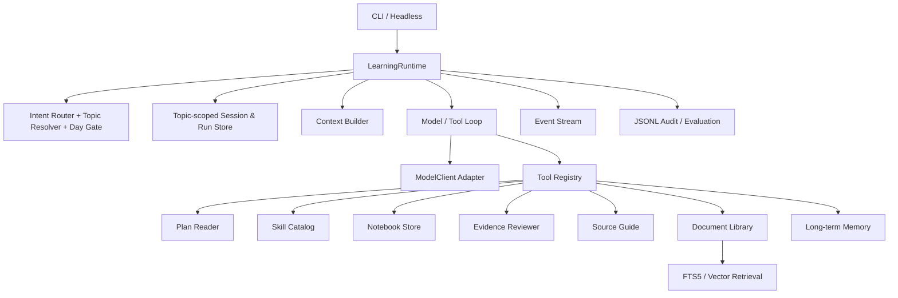
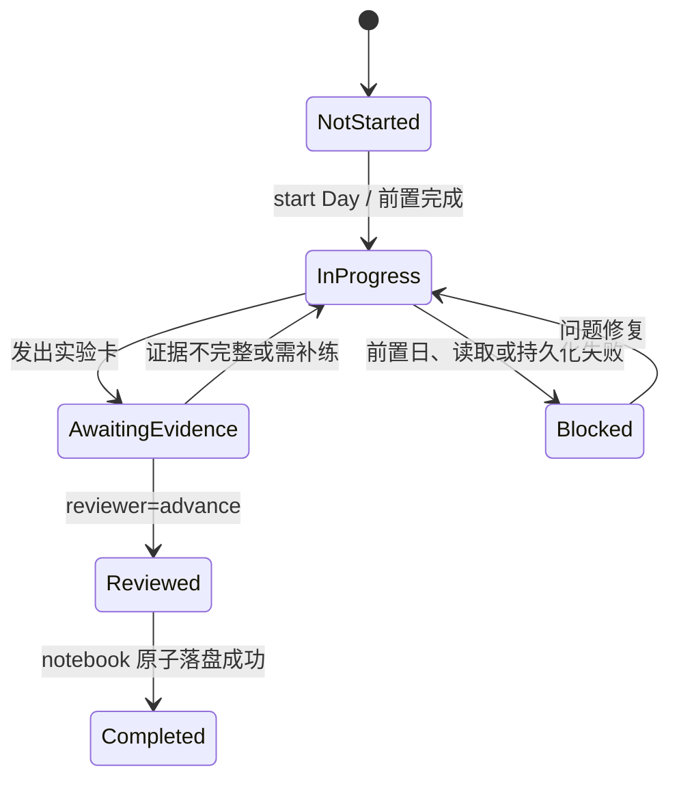

# 知行（ZhiXing） Agent 架构设计

## 1. 目标与原则

已确认的首批主题、默认纯本地模式、模型优先级、资料范围与记忆写入边界见 [已确认产品决策](decisions.md)。当前交付状态以 `TASKS.md`、`development-plan.md` 和 Evidence 为准。

知行（ZhiXing）将学习计划、skills 和 `learning-notes/` 封装成单一入口，而不是重写教学内容。当前已交付本地 CLI MVP，并提供仅 loopback 的进度/SSE 同步契约。

P3 在确定性流程之外增加每主题学习画像、待确认的个性化计划、资料概览和 Skill 草案。它们不依赖任何模型；`学习建议` 默认在本地生成，只有显式 `--允许外发` 时才调用当前 `tutor` 路由，并且只发送画像与资料名称。

设计原则：

1. **教学流程由确定性状态机约束，模型只生成讲解。** 模型不能自行跳过前置日、伪造测试或标记完成。
2. **主题是隔离边界。** 每个 run、学习日、进度、错题、session 和主题 skill 都带 `topicId`；默认不读取其他主题记录。
3. **证据优先。** 完成状态只能由计划要求的文件、命令输出和 reviewer verdict 推进。
4. **本地优先、最小写权限。** 限定读 `AGENT_DEVELOPMENT_LEARNING_PLAN.md`、`skills/`、`learning-notes/`；限定写 `learning-notes/topics/<topicId>/`、`learning-notes/profile.md`、`zhixing/data/`。
5. **单 Agent 优先。** tutor、lab、reviewer 等是受控工作流/skill，不是拥有独立写权限的并发 Agent。
6. **无模型可测。** 所有核心流程以 `MockModelClient` 覆盖；真实 provider 不属于功能正确性的前置条件。

## 2. 总体架构



CLI 只负责将输入提交给 Runtime 并渲染事件；它不读取、修改学习笔记，也不直接调用模型。Runtime 是唯一的会话状态、权限与停止条件所有者。

## 3. 分层与模块

```text
src/
  cli/                 # 参数解析、REPL、事件渲染；不含业务决策
  runtime/             # LearningRuntime、Session、Run、取消、预算、事件
  routing/             # 意图识别、主题解析、Day 映射、前置条件与状态转换
  topics/              # TopicRegistry：主题目录、计划、skill 根与依赖声明
  model.ts             # ModelClient 契约与离线 Mock
  provider-*.ts        # ProviderRegistry、健康检查、角色路由与 fallback
  deepseek-client.ts   # DeepSeek API Key adapter
  codex-client.ts      # 官方 Codex CLI adapter
  macos-keychain.ts    # macOS Keychain 的 API Key 引用
  context/             # 系统规则、全局 profile、当前主题/学习日、主题近期历史、压缩
  tools/               # Tool 契约、registry、各受限工具
  workflows/           # tutor、lab、notebook、reviewer、source-guide、roadmap
  storage/             # Markdown notebook、SQLite、原始资料与 JSON session/audit
  library/             # 导入、解析、分块、引用定位与资料元数据
  retrieval/           # FTS5 混合检索接口、grounding 和后续 vector adapter
  learning-profile.ts  # 主题学习画像与待确认计划
  generated-skill-store.ts # 主题 Skill 草案与显式启用
  security/            # 路径策略、写入审批、敏感信息脱敏与不可信资料隔离
  eval/                # 固定用例和评分报告
```

实现以 `cli`、`runtime`、资料/存储、Provider、审计和主题 Skill 模块构成；`LocalSyncServer` 只消费主题进度，不复制 Agent 逻辑。图中的 ContextBuilder/PermissionEngine 是设计概念，不是当前独立源码模块。

## 4. 核心运行闭环

```text
用户输入
  -> Router 归类意图，TopicResolver 由 TopicRegistry 解析或要求确认 topicId
  -> TopicRegistry 提供该主题计划、skill 根及跨主题前置声明
  -> TopicStore 读取该主题进度；DayGate 校验该主题内的前置学习日
  -> ContextBuilder 装配全局 profile、当前主题计划/进度/近期历史和允许的 skill 摘要
  -> ModelClient 生成下一步；必要时提出工具调用
  -> Schema 校验 -> PermissionEngine -> Tool 执行
  -> tool result 及事件回填会话
  -> Reviewer 给出结构化 verdict 或 Tutor/Lab 产出内容
  -> NotebookStore 原子写入学习记录
  -> Run 结束并写入脱敏 audit
```

停止条件：最终答复、`maxTurns=6`、重复工具调用、上下文/费用预算、取消、或权限拒绝。只读工具可并行；任何 Markdown 或 JSON 写入工具必须串行。

## 5. 关键契约

```ts
export interface ModelClient {
  stream(request: ModelRequest, signal: AbortSignal): AsyncIterable<ModelEvent>;
}

export interface ProviderConfig {
  id: string;
  kind: "openai-compatible" | "anthropic" | "official-cli" | "local" | "mock";
  secretRef?: string; // 仅 API Key 的安全存储引用，永不保存明文
  command?: "codex" | "claude"; // 仅官方 CLI adapter 使用
}

export interface ModelRouter {
  resolve(role: "tutor" | "reviewer" | "lab"): ModelClient;
}

export interface LearningTool<I, O> {
  name: string;
  inputSchema: Schema<I>;
  readOnly: boolean;
  maxResultChars: number;
  checkPermission(input: I, ctx: ToolContext): Permission;
  execute(input: I, ctx: ToolContext): Promise<ToolResult<O>>;
}

export interface TopicScope {
  topicId: string; // kebab-case，例如 "rag" 或 "tool-calling"
}

export interface ReviewVerdict extends TopicScope {
  outcome: "advance" | "reinforce" | "repair";
  scores: { conceptual: 0|1|2; contract: 0|1|2; reliability: 0|1|2; evidence: 0|1|2 };
  blockingIssue?: string;
  nextAction: string;
}
```

事件契约统一为 `text_delta`、`tool_start`、`tool_result`、`permission_request`、`status`、`error`、`done`。每个事件都有 `topicId`、`runId` 与递增 `seq`，便于 CLI、未来 SSE 和审计复用。

### 5.1 主题注册表

`TopicRegistry` 是主题隔离的配置真相源。每个主题声明 `topicId`、显示名称、计划文件、主题 skill 根、以及可选的跨主题前置条件；当前 CLI 仅接受预注册主题，未知主题不能写入目录。

```yaml
topicId: rag
title: RAG 与 Grounding
plan: topics/rag/PLAN.md
skillRoot: skills/rag
prerequisites:
  - topicId: agent-basics
    requiredDays: [D01, D02]
```

当前 Agent 学习计划注册为 `agent-development`，其 plan 指向现有 `AGENT_DEVELOPMENT_LEARNING_PLAN.md`。因此新主题有自己的计划和 Day 编号，不能错误复用或覆盖该主题的进度。

### 5.2 多 Provider 模型层与凭证边界

`ProviderRegistry` 按 `tutor`、`reviewer`、`lab` 角色选择 Provider；当前实现的类型及边界如下：

| Provider 类型 | Adapter | 认证与保存策略 |
| --- | --- | --- |
| DeepSeek API Key | `DeepSeekClient` | macOS Keychain 保存 `keychain:zhixing/deepseek-api` 引用 |
| Codex 订阅 | `CodexCliClient` | 复用已登录官方 CLI；知行不读取、保存或转发账号 token/Cookie |
| 测试 | `MockModelClient` | 无网络、无凭证 |

角色路由保存在 `zhixing/settings/model-routing.local.json`，不含凭证。DeepSeek Key 仅通过隐藏输入保存到 macOS Keychain；当前没有 Claude、本地 HTTP 模型、Windows/Linux secret store 或通用模型配置文件 adapter。

官方 CLI adapter 只允许执行白名单健康检查和模型请求，且使用受控 argv 调用；它不允许扫描浏览器、读取 Cookie、导出 CLI 凭证或把订阅权益伪装成 API 配额。CLI 协议或订阅条款不支持时，adapter 返回明确的 `provider_unsupported`，由 Router 回退至 mock 或用户配置的 API Provider。

## 6. 学习状态机



`Completed` 只能由 `reviewer=advance` 加上记录写入成功触发。`读源码` 仅在对应计划日或该日实验通过后开放。后置日请求返回最早未完成前置日与最小补救任务。

## 7. 资料库、RAG 与长期记忆

Topic Plan、SQLite 表、资料导入/分块、记忆生命周期、删除备份、质量预算和隐私模式的规范以 [数据、记忆与质量契约](data-and-quality-spec.md) 为准；本章只描述模块关系和运行边界。

### 7.1 本地资料库与导入

资料库以原始文件和 SQLite 索引分离存储：原始 PDF、Markdown 和后续 DOCX 文件保存于 `zhixing/data/library/<topicId>/<documentId>/`；文件元数据、文本页、Chunk、引用定位和检索索引保存于 `zhixing/db/zhixing.sqlite`。导入流程为：文件类型/大小/哈希校验 -> 复制到主题资料根 -> 文本提取 -> 分块 -> 事务写入 SQLite/FTS5。相同哈希在同一主题不重复导入。

普通文字 PDF 使用 `pdfjs-dist` 提取页面文本和页码。扫描 PDF 会尝试本机 Tesseract OCR；引擎不可用、失败或没有文本时返回 `ocr_required`，均值置信度低于 70 时标注 `ocr_low_confidence`。文件内容属于不可信输入：解析文本永远作为引用资料，不作为系统指令；资料中的“忽略规则”等指令不得改变 Runtime、工具权限或状态机。

### 7.2 检索与 Grounding

三天 MVP 使用 SQLite FTS5 进行关键词检索，按 `topicId` 过滤并返回文档标题、Chunk、页码或 Markdown 段落。回答组件只接收检索结果，不直接读取整个资料库；每个知识结论必须携带 `documentId#page=<n>` 或段落锚点。无结果或证据不足时返回 `insufficient_evidence`。

当前检索以 FTS5 与本地 `HashEmbeddingModel` 融合：每个 Chunk 的向量保存在 `chunk_embeddings` SQLite 兼容表，词法/余弦分数按 0.65/0.35 重排序并保持 `topicId` 过滤。当前没有 `sqlite-vec` 或 LanceDB 依赖；未来替换向量实现不得改变 SQLite 元数据、主题过滤和引用契约。

### 7.3 分层记忆

| 层级 | 内容 | 存储与读取规则 |
| --- | --- | --- |
| 工作记忆 | 当前任务、近期对话、工具结果 | session；仅当前 run 的有限窗口 |
| 主题学习记忆 | 进度、错题、实验和 reviewer 结论 | Markdown + SQLite 索引；仅当前主题按需读取 |
| 知识记忆 | 资料 Chunk、已验证概念卡、引用 | SQLite/FTS5，第二阶段增加 vector；必须有来源 |
| 长期画像 | 用户目标、时间预算、偏好、跨主题薄弱点 | `profile.md` + SQLite；少量稳定字段才注入 |
| 情节记忆 | 完成项目、关键决策、日结摘要 | SQLite；按主题和时间检索 |

模型不能自由写入长期记忆。只有用户明确要求、reviewer 已通过的结论，或带来源和置信度的知识卡，才能经 `MemoryStore` 写入；每条记忆带 `topicId`、来源、时间、置信度和可删除标记。

## 8. 主题隔离、安全、可靠性与数据

```text
learning-notes/
  profile.md                         # 唯一跨主题共享：目标、偏好、时间预算
  topics/<topicId>/
    PROGRESS.md                      # 仅该主题的 Day 状态
    MISTAKES.md                      # 仅该主题的错误认识
    daily/DNN-<topic>.md             # 该主题的学习与实验记录
zhixing/data/
  library/<topicId>/<documentId>/    # 原始 PDF/Markdown 等资料
  sessions/<topicId>/<sessionId>.json
  audit/<topicId>/<date>.jsonl
zhixing/db/
  zhixing.sqlite                     # 元数据、FTS5、长期/情节记忆
```

- `topicId` 由 TopicResolver 从主题目录选择或用户确认后生成；任何存储 API 都将它作为必填参数，不能通过调用方字符串拼接路径。
- `ContextBuilder` 默认只注入全局 `profile.md`、当前主题资料与当前主题 session；跨主题读取必须由用户明确请求，且返回来源主题。
- `SkillCatalog` 只注册 `skills/shared/` 与 `skills/<topicId>/`，禁止当前主题加载其他主题的专属 skill。
- `PathPolicy` 规范化 realpath 后检查允许根及与请求 `topicId` 一致的主题根，拒绝绝对路径逃逸、`..`、符号链接越界及非 Markdown/JSON 写入。
- `NotebookStore` 使用同目录临时文件 + rename 原子更新；失败时保留旧文件。
- 写学习笔记属于低风险自动写入，但写入前必须由 workflow 指定 `topicId`、目标 Day 与章节，禁止模型任意文件名。
- 审计日志在写前删除 API key、token、邮箱、手机号与机器绝对路径；大工具结果仅记录摘要和哈希。
- 会话默认 JSON snapshot；审计采用 JSONL。进程恢复时不会恢复未完成模型请求。
- `SecretStore` 是 API Key 唯一读写入口；配置、session、学习笔记、审计和错误日志只能保存 `secretRef`，不得保存明文 Key。
- `ModelClient` 对网络错误只做有限重试；模型不可用时，确定性 Router、Notebook、Reviewer 仍可执行，且 CLI 明确提示降级。
- API Provider 记录 token/费用估算；订阅 CLI 仅记录调用次数、耗时和状态，禁止伪造费用数据。

## 9. 对参考工程的取舍

| 来源 | 借鉴 | MVP 取舍 |
| --- | --- | --- |
| Claude Code 风格运行时 | 会话级 Runtime、事件流、工具 schema/权限、预算和取消、读并行写串行 | 不实现 Bash、Git、MCP、插件和子 Agent |
| 鹿同学 | model/loop/session/skill/evidence 分包边界；Markdown-first skill；按需加载 | 先单仓 TypeScript 模块，稳定后才拆包；不接 Electron/浏览器 |
| 现有学习 skills | 日程路由、教学、实验、笔记、复盘和源码导读规则 | 将其变成可发现的 Markdown skill，并由状态机强制前置条件 |

## 10. 后续演进（非三天范围）

后续范围包括：真实模型多 Provider 的可选 smoke、日历提醒、远程同步/冲突合并和大资料库向量后端评估。多 Agent 委派必须排在单 Agent 的评估集、恢复和审计稳定之后；验证 Agent 也只能拥有只读工具。
