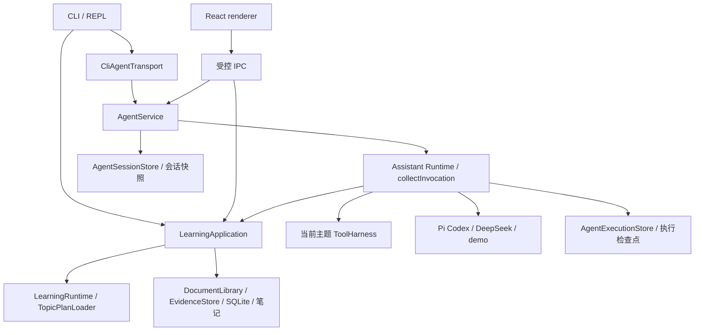

> 0.8：两个入口由 AgentService 统一执行；连续摘要、相关记忆、分段原文、会话独立教学、MCP 隔离和提醒/同步边界已更新。见 [统一记忆设计](agent-memory.md)与[修复证据](evidence/architecture-remediation.md)。

<!-- generated-by: gsd-doc-writer -->
# 知行架构（当前实现）

> 本文描述仓库当前代码，而不是目标架构。后续设想会明确标注，不能作为已交付能力。

## 系统概览与运行入口

知行保留 CLI/REPL 与 Electron 桌面两个入口，复用 AgentService、AgentSessionStore、执行检查点、LearningApplication、确定性 LearningRuntime、资料库、课程读取与证据 Store。聊天/Provider 偏好分别保存；桌面可显式选择 CLI 工作区，直接共用学习数据，不自动迁移聊天。



模型循环与状态写入保持分离：模型可查询受授权的当前主题资料；开始课程、导入、提交证据和 Review 由显式用户操作经共享应用服务执行。桌面 Pi SDK 与 DeepSeek 均支持受控应用工具续写；课程状态仍由实际证据和程序控制。

### CLI 组合根

`src/cli.ts` 是当前组合根：它初始化主题、数据库、资料库、Provider、课程、提醒和 REPL/headless 命令。`LearningRuntime` 负责确定性 Day 状态机、前置条件、进度、计划与证据 Review；模型只用于讲解、答疑、自然语言草案和资料问答，不能直接改变完成状态。

普通聊天、教学回答及工具任务先经 `CliAgentTransport` 调用共享 `AgentService`；`/agent` 与 `/answer` 提供应用任务和持久交互入口。普通对话的生成中排队、纠正和恢复由该服务处理；REPL 继续负责本地命令编排。

每轮输入先通过 `interaction-protocol.ts` 编译为四类受类型约束的控制决策：确定性命令、待执行计划确认、教学输入或自然输入。确定性命令不需要模型解释；模糊管理请求只能生成校验后的草案；教学输入再进入教学动作协议。内容模型不能直接执行写操作或改变状态。

```text
CLI / REPL
  -> ReplInput + ReplController + ReplOutput（持续输入、即时控制、串行队列与显示）
  -> ConversationSessionStore（按主题的新对话、历史与恢复）
  -> TopicRegistry + TopicStore（内置或用户创建的本地主题）
  -> LearningRuntime（Day gate、进度、Review）
  -> DocumentLibrary + ZhixingDatabase（PDF/Markdown、关键词/同义词重排、记忆）
  -> ProviderRuntime（mock / DeepSeek / Codex CLI / Pi Codex）
  -> ActionRegistry / InteractionProtocol（输入分类与命令元数据）
  -> RunManager + WorkflowLedger（取消、单前台任务、SQLite 运行/步骤账本）
  -> AuditLogger（脱敏事件轨迹）
```

## CLI 主题、状态与数据

本节的 `zhixing/...` 与 `learning-notes/...` 相对 CLI 工作根目录：它默认是仓库的父目录，可由 `ZHIXING_ROOT` 覆盖。因此仓库内的数据库通常实际位于 `db/zhixing.sqlite`，学习笔记则在仓库旁的 `learning-notes/`；不要把 `ZHIXING_ROOT` 误设为仓库本身再重复拼接一层 `zhixing`。

- 内置主题定义在 `src/topics.ts`；`创建主题` 通过 `TopicStore` 建立受控本地主题、计划、Skill 与 inbox 目录。
- 当前主题保存在 `zhixing/settings/current-topic.local.json`；用户生成主题、学习记录和本地设置均被 `.gitignore` 排除。
- Day 状态、进度和计划由主题目录中的 Markdown/JSON 文件保存；资料元数据、Chunk、FTS5、嵌入与记忆保存在 `zhixing/db/zhixing.sqlite`。
- `ChatSession.teaching` 保存当前会话的 Day、阶段、受限转录、练习和作答；旧 `TeachingSessionStore` 仅作为兼容迁移来源；`LearningContextBuilder` 组装当前主题画像、至多三条记忆、资料名称、教学检查点和至多三条相关学习观察；受主题与上下文授权约束。
- `ConversationSessionStore` 保存每主题当前对话及可显式恢复的旧对话，最近 6 轮、每轮输入与回答各最多 8,000 字符，额外持久保存最初目标；作为兼容历史投影；完整消息由 `AgentSessionStore` 存于 `zhixing/agent/conversations/`。请求前保存当前会话指针与用户输入，重启从完整快照恢复投影。强制结束可能丢失约 750 ms 内的未保存增量，恢复旧聊天时读取该会话自己的教学检查点；新对话和分支不继承作答现场，主题课程进度仍独立共享。
- `WorkflowLedger` 将运行与步骤状态写入 SQLite；启动时会把上次进程遗留的 `running` 运行标记为 `process_interrupted`，不重放任何可能含写入的操作。用户可安全地重新发起操作。
- CLI 已有手动数据库备份、预览和确认恢复：`备份数据库` 将 SQLite 保存到 `zhixing/db/backups/`；它不包含资料原文件、主题计划、学习笔记或桌面对话。当前没有全局 `profile.md`、`MISTAKES.md`、情节记忆、主题删除或定时自动备份。桌面另有完整工作区/会话备份恢复和单会话 Markdown 导出。

`LocalSyncServer` 由 CLI 的 `启动同步服务 [端口]` 显式启动，仅监听 `127.0.0.1`，提供按主题限定的 `GET /topics/<topicId>/progress` 与 `GET /topics/<topicId>/events`。后者是 SSE 事件流，CLI 操作完成后发布进度变更通知；所有请求需当前进程临时访问码，拒绝网页 Origin、非 loopback Host 与非 GET，最多 32 个 SSE 订阅；没有远程账号认证、跨设备复制或云端存储，桌面也未连接该服务。实现见 `src/sync-server.ts` 与 `src/cli.ts`。

## CLI 教学闭环

真实 tutor 的单日流程为：`开始第 N 天 → 讲解 → 答疑确认 → 练习/测验 → 实验与证据 Review`。讲解、答疑和练习的检查点在每次成功阶段转换后保存；重启可恢复，并从共享执行检查点发起后续 Provider 请求；无法恢复原网络连接。练习中的自然语言先被约束为 `start_practice`、`answer_question`、`request_solution`、`ask_question`、`skip_question` 或 `change_plan`。模型分类只提供意图建议：索要答案有确定性优先级；“作答/批改/持久化”必须有可追溯的用户原文证据，未证实的 `answer_question` 会安全降级为答疑，不能触发虚构批改。Day 由 `检查 DNN` 验证实际产物的完整性后推进；布尔参数无效。EvidenceStore 保存哈希与来源，用户测试报告标为未复跑，完整性分数不代表掌握程度。

`mock` 不调用真实模型，返回确定性学习卡；真实 Provider 默认在已配置后可用，设置 `ZHIXING_ALLOW_LIVE_PROVIDER=0` 会阻止调用。

## Provider 与外发边界

| Provider | 当前适配与入口 | 适配器超时 |
| --- | --- | --- |
| mock | CLI 本地 `MockModelClient`，也用于确定性验证 | 立即返回 |
| demo | 桌面 `DesktopDemoClient`，明确标注离线演示 | 本地分片输出 |
| deepseek-api | CLI 与桌面复用 `DeepSeekClient`；密钥来源由各入口注入 | 60 秒；SSE 单帧 64 KiB、整响应 8 MiB |
| codex-cli | 仅 CLI；`codex exec --sandbox read-only --ephemeral --json` | CLI 注入 150 秒；类构造默认值为 60 秒 |
| pi-codex | 两端使用同一个仅模型能力的 Pi SDK worker；均读取 Pi 的模型与推理偏好 | 默认 150 秒 |

CLI 与桌面会话共用目标、约束、有界历史、摘要和授权的学习快照。资料/画像/记忆/教学状态受会话学习上下文授权控制，项目和外部 MCP 分别授权；凭据、审计原文和其他主题资料不加入上下文。

`ProviderRuntime` 仅在调用允许 fallback、尚无事件外发且错误属于可回退类别时使用 mock；CLI 教学和自然交互显式关闭静默 fallback。桌面没有自动回退：失败保留状态和部分回答，用户可以点击切换到 DeepSeek 重试。

`PiCodexClient` 只读取 Pi 设置中的非敏感模型偏好，显式要求 `openai-codex`、模型名与推理强度，避免默认模型不可用时改用其他 Provider。全局设置来自 `PI_CODING_AGENT_DIR/settings.json` 或默认 Pi agent 目录，调用工作目录的 `.pi/settings.json` 可覆盖对应偏好。认证和 token 刷新由 Pi 自身处理；读到模型偏好不代表登录有效。

两端使用共享模型 SDK worker，CLI 为 Node/tsx，桌面为 Electron Node 运行时。旧 `PiCodexClient` 和 `packagedPiRunner` 保留安全启动器协议兼容用途，不再作为 CLI 对话通道。`ZHIXING_ALLOW_LIVE_PROVIDER=0` 由真实适配器统一执行。

Pi 模型 worker 输出统一文本、工具、用量与完成事件；适配器检查完整协议和成功退出后才允许执行工具。原生 Pi AgentSession、文件和 shell 工具不开放。

## CLI 控制面、事件与工具

`ActionRegistry` 为已识别命令声明稳定动作 ID、风险级别与确认要求；`InteractionProtocol` 先把每轮输入归为命令、待执行草案、教学输入或自然输入。共享的 `ConversationPolicy` 统一校验用户授权、高风险显式确认与用户原文证据：模型文本只能提出动作或事实建议，不能单独改变状态、触发批改或写入记忆。CLI 仍是组合根，尚未完全由注册表分派每一个旧命令处理器。

`ModelEvent` 包含文本、工具请求、工具结果与终止事件；工具请求带 `callId`。模型发出的 `tool_result` 不可信，只有控制面实际执行的结果会进入续写。`collectInvocation` 在单个调用内持有完整的模型/工具历史，固定 Provider 路由，并在收到整个合法工具批次后执行；显式纯只读工具最多两个并行，结果仍按请求顺序记录。工具失败作为结构化观察反馈，模型可以调整下一步；未知工具和写权限不因模型要求而开放。

PiApplicationClient 与 DeepSeekClient 均实现 ContinuableModelClient，经同一模型工厂应用预算。两个入口使用共享 ToolHarness、权限、完整工具配对和原文回读；CLI 的教学分类与业务指令位于 agent-dialogue.ts，不再自选历史或 runtime。

REPL 持续读输入，普通消息串行执行，状态与取消即时响应，显式调整可抢占文本生成。短段落定时刷新；正在编辑输入时暂存新增显示。隐藏输入独占来源，不将其缓存重放进聊天。该界面仍是行式终端，未实现完整 TUI。

默认预算为 6 个模型回合、32 次工具请求、10,000 个事件、64,000 字符总文本、128,000 字符上下文估算和 180 秒总时限。超过预算明确停止；这不是 tokenizer 精确计数，也不是费用预算。SSE 按 UTF-8 字节限制单帧 64 KiB、整响应 8 MiB，支持 CRLF 和跨块分片；`[DONE]` 立即关闭读取，断流、坏帧和截断输出不报成功。取消约束覆盖取密钥、HTTP、流读取、工具 dispatch 和下一模型轮。

教学转移由 `completeTeachingTurn` 在模型成功返回后计算。索要答案、批改和澄清不会覆盖原练习；新出题才增加轮次，仍保留原有 20 轮上限。部分回答可保留为未完成转录，但不推进阶段或写入学习者作答。转录保存前有明确截断标记；切换主题时清除旧主题的内存对话和待确认草案。

CLI 和桌面均经共享 AgentService 调用同一模型循环，历史投影只用于兼容显示；适配器时限随 Provider 不同。当前没有费用预算或通用并行调度、自动网络重试、Claude/本地 HTTP Provider、DOCX 导入或云同步；桌面界面基于 React，但没有独立部署的浏览器 Web 产品。

## 桌面对话链路

`desktop/electron/main.ts` 是桌面组合根，创建单实例窗口、`DesktopStore`、`DesktopService` 和 Provider。`desktop/renderer/index.tsx` 负责会话侧栏、搜索、消息流、输入框与设置；Markdown 使用 `react-markdown`、GFM、`remark-math` 和本地 KaTeX 渲染，包含代码/回答复制与外链操作。

一次发送按以下顺序执行：

1. renderer 通过 preload 暴露的 `window.zhixing.invoke` 发出 `send`；主进程验证窗口、主 frame、页面 URL，并用 `desktopCommandSchema` 校验参数。
2. `DesktopService` 兼容导出实际使用 `AgentService.send`，以会话租约拒绝并发生成，在异步读取会话前固定本轮客户端；组装受限历史，然后先保存用户消息和 `running` 状态的助手消息。
3. `runAssistantTask` 通过共享 `collectInvocation` 执行模型/工具回合。Pi SDK 与 DeepSeek 都支持当前主题的应用工具，资料/执行权限分别由应用控制。真实工具结果才能续写；`session`、`message_patch`、`delta`、`settled` 事件按会话隔离。
4. 收到非空文本和明确 `done`，且应用计划已完成才标记 `completed`；提前结束会有界继续或返回 `blocked`；用户停止为 `interrupted`，超时、断流或其他错误为 `failed`。部分文本保留，首字和总耗时写入消息元数据。
5. 输出增量到达且距离上次保存超过 750 ms 时保存快照，结束再保存；退出应用会停止模型/导入/本地验证并等待最终保存。强制终止仍可能丢失尚未落盘的增量，重启加载时把遗留 `running` 消息转为 `interrupted`。

桌面 IPC 包含会话、enqueue/withdraw/resume-queue/context、learning-*、workspace-select、evidence-*、diagnostics/check-updates 与原有设置/导出/复制命令。响应为 `{ ok: true, data }` 或脱敏错误，完整判别联合见 `desktop/core/contracts.ts`。文件选择由主进程原生对话框产生，renderer 不传任意路径。

### 历史、草稿与设置

- `DesktopStore` 在 `app.getPath("appData")/Zhixing` 保存 `conversations/<UUID>.json` 和 `preferences.json`；macOS 为 `~/Library/Application Support/Zhixing`。JSON 使用临时文件加重命名原子写入；坏会话文件保留，其他健康会话仍可列出。
- 会话按更新时间排序，可重命名、重新载入和导出 Markdown。导出由主进程弹出系统保存对话框，仅导出所选桌面对话，不是 CLI 学习数据备份。
- 草稿按会话保存在 renderer 的 localStorage，`last-session` 保存最后打开的会话；它们不属于会话 JSON，也不会随 Markdown 导出。设置保存串行化，renderer 用修订号避免旧响应覆盖新的选择。
- 设置包含 Provider、回答风格、显示主题和 DeepSeek 模型；源码默认依次为 `pi-codex`、`adaptive`、`system`、`deepseek-v4-flash`。本机已保存设置可覆盖默认值。
- 全应用同一时间只生成一个回答，期间可排队最多 10 条、立即调整、撤回待办或浏览历史；停止会暂停队列，重启须手动继续。停止不会清除部分文本；“继续回答”和失败重试保留原 taskId，从检查点续接；Pi 失败后点击 DeepSeek 切换按钮会保存 Provider 选择，并在原会话追加新一轮请求，旧失败记录保留。
- Enter 发送、Shift+Enter 换行，中文输入法组合输入不触发发送；只有视图处于底部时自动跟随新内容。Cmd/Ctrl+N 新对话、Cmd/Ctrl+K 搜索、Cmd/Ctrl+, 打开设置。

### 桌面资源上限

| 项目 | 当前限制 | 代码位置 |
| --- | --- | --- |
| 单次用户输入 | 20,000 字符 | `desktop/core/contracts.ts` |
| 单条回答 | 64,000 字符 | `src/agent-service.ts` |
| 单次生成 | 最多 10,000 个模型事件，服务总时限 180 秒 | `src/model-invocation.ts`、`src/agent-service.ts` |
| 适配器时限 | DeepSeek 60 秒、Pi 150 秒；可能先于服务时限结束 | `src/deepseek-client.ts`、`src/pi-client.ts` |
| 保存的会话 | 最多 20,000 条消息；完整会话合计 12,000,000 字节，旧原文按 250 条分段 | `src/agent-session-contracts.ts`、`src/agent-session-store.ts` |
| 发给模型的历史 | 最多 24 条；目标和历史片段约 40,000 字符预算；另加本次输入、约束、摘要与授权的主题上下文 | `src/agent-service.ts` |

本地完整历史不因裁剪而删除。长消息使用与问题相关的中段及首尾摘录；长期目标与约束各 4,000 字符独立保存。后台从最早未覆盖的合格消息连续分批整理，单批最多 24 条、摘要最多 4,000 字符、时限 20 秒；来源 ID 和原文哈希一致才允许省略摘要覆盖的历史。失败不扩大覆盖，后续间隔尝试，最新纠正优先，详见统一记忆设计。摘要不作为执行成功的证据。此外，`context-window.ts` 在每次请求和工具分发前约束估算 token：默认 48,000 窗口、预留 16,384 输出 token，可配置更小预算并传给实际 Provider；保留必须消息、裁剪完整旧工具轮次。该估算不是模型精确计费值；必须内容超限时停止，不截断工具配对或继续执行副作用。

## 安全与质量

- `PathPolicy` 控制主题路径、导入根以及现存父目录/中间目录/叶子文件符号链接越界；它不代替防并发路径替换的 OS 沙箱；资料和用户本地状态不得提交。
- CLI 的 DeepSeek API Key 通过 `MacOSKeychainSecretStore` 读写 macOS Keychain。CLI 模型审计记录 Provider、角色、耗时、状态及事件/回合/工具调用计数，不保存 prompt、回答或凭证；桌面模型任务写入同一 WorkflowLedger，同时保留消息状态、步骤、引用及时间元数据。
- 删除资料、写长期记忆和恢复数据库均需命令级确认；恢复会先预校验备份，并在失败时重新打开原数据库。
- 桌面新 API Key 通过主进程的 `EncryptedDesktopSecrets` 使用 Electron 异步 safeStorage 加密，保存为用户数据目录下的 `deepseek.credential`；加密不可用时拒绝保存，没有明文回退。macOS 可复用现有知行 Keychain 项，优先使用桌面加密文件。配置状态只检查文件/Keychain 元数据，实际请求才读取密钥；设置页不会回填已有密钥，密钥不进入偏好或聊天 JSON。Pi 认证仍由 Pi 独立管理。
- renderer 启用 sandbox、context isolation、禁用 Node integration，通过受限 preload 使用应用接口；本地 `zhixing://app` 协议只提供打包资源，CSP 禁止 renderer 自行联网，导航、新窗口和权限请求默认拒绝。`open-link` 仅允许不含内嵌账号密码的 HTTP(S) URL，由主进程交给系统浏览器。
- 桌面文件存储检查目标及直接父目录的符号链接，读取文件使用 `O_NOFOLLOW`；这些检查和 CLI 的 `PathPolicy` 不应描述为覆盖所有祖先目录和并发路径替换的 OS 沙箱。Electron renderer 沙箱也不意味着整个主进程或 Pi 子进程处于同一个 OS 沙箱中。
- 质量门是根目录 `npm run verify`；桌面交互另运行 `npm --prefix desktop run test:ui`，安装包还需对实际打包应用运行 UI 验证。真实 Provider smoke 为单独环境验收，不因本地协议测试通过就声称登录或联网成功。

## 关键抽象与目录职责

| 抽象 | 职责与源码 |
| --- | --- |
| `LearningApplication` / `EvidenceStore` | 两个入口共用学习边界与实际产物校验：`src/learning-application.ts`、`src/evidence-store.ts` |
| `LearningRuntime` | 确定性课程状态机与 Review 入口：`src/runtime.ts` |
| `authorizeConversationTransition` / `decideInteraction` | 授权、原文证据与输入分类：`src/conversation-policy.ts`、`src/interaction-protocol.ts` |
| `ModelClient` / `ContinuableModelClient` | 文本流及可选工具续写协议：`src/model.ts` |
| `ProviderRuntime` / `collectInvocation` | CLI 路由、回退、模型/工具回合与预算：`src/provider-runtime.ts`、`src/model-invocation.ts` |
| `ToolHarness` | 当前主题受控工具注册与执行：`src/tool-harness.ts` |
| `ZhixingDatabase` / `WorkflowLedger` | 资料检索、记忆及持久运行账本：`src/database.ts`、`src/workflow-ledger.ts` |
| `DesktopService` | 单一活动生成、流式事件、停止与导出：`src/agent-service.ts` |
| `DesktopStore` | 桌面会话与偏好存储：`desktop/core/store.ts` |
| `DesktopBridge` | renderer 到主进程的受限接口：`desktop/core/contracts.ts`、`desktop/electron/preload.ts` |
| `EncryptedDesktopSecrets` | 可注入系统加密与旧 Keychain 来源：`desktop/core/secrets.ts`、`desktop/electron/secrets.ts` |

`src/` 保存 CLI 学习域和可复用模型代码；`desktop/core/` 不依赖 Electron UI，便于使用临时存储和模型夹具验证；`desktop/electron/` 集中 OS 能力、凭据和 IPC 权限；`desktop/renderer/` 集中界面和 Markdown 展示。`topics/`、`skills/` 保存学习内容；`tests/` 包含单元、integration 和 eval 测试，`scripts/smoke-mock.mjs` 与 `desktop/scripts/smoke.mjs` 验证 CLI/桌面整体链路；`docs/` 说明行为和验收证据。用户资料与生成状态位于各自受控目录，不作为打包源码资源。

## 构建与已验证范围

`desktop/scripts/build.mjs` 用 esbuild 分别生成主进程 ESM、preload CJS、renderer 静态资源以及守卫模块。electron-builder 将内附 Pi 依赖展开到 `app.asar.unpacked/node_modules/`，并将 runtime 规则与守卫放入额外资源；桌面独立安装 SQLite/PDF 依赖；prepare-runtime 先安装项目内 Electron 并探测/重建 Electron ABI，根包 SQLite 保持 Node ABI。只将四个内置课程与运行规则打包，不收集用户主题。

`desktop/package.json` 提供 macOS arm64/x64 DMG/ZIP 和 Windows x64 NSIS 配置。0.9 的两个 Mac 架构已通过远端构建及实际包五组 UI，本机 ARM64 已安装；Windows AppContainer 原生 6 项、实际 NSIS 安装及安装后五组 UI 均已通过。Windows 流水线实际安装 NSIS 并核对安装文件后运行 UI；手动运行可选择平台，tag 发行始终检查全部平台。macOS 预览包完整 ad-hoc 签名，Developer ID 与公证条件仍缺失。0.9 未执行真实 Pi 排障；DeepSeek 真实样本、内容评分、安装与各平台结果见 [当前验收](evidence/completion-0.9.md)，早期双 Provider 记录保留为 [P1/P2 历史证据](evidence/agent-p1-p2-20260907.md)。

## 后续设计（未实现）

后续范围：所有旧 CLI 命令统一注册表分派、其他 Provider 工具适配、精确 token/费用预算、任意写操作的逐步骤幂等恢复、主题删除、定时备份、跨设备同步。完整学习备份已实现。桌面课程/资料/进度/证据与任务上下文已落地；通用 Shell、任意代码编辑、多 Agent、MCP 市场不在本轮范围。实现和验证见 [升级指南](agent-upgrade.md)、[Evidence](evidence/agent-upgrade.md)。

## 0.4 的新增结构

`ModelMessage` 保留真实角色，应用材料使用 observation；`provider_state` 仅在单次工具续写中保留，不存入可见历史。Pi 使用 `PiApplicationClient → pi-model-worker → ModelRuntime.streamSimple`，没有 Pi 原生工具或 AgentSession，工具由 ToolHarness 执行。两个入口使用同一 Pi 模型协议。

`TaskExecutionStore` 保存步骤、实际操作结果及幂等键；`assistant-interactions` 将问题、批准、产物、progress/final 类型化。后台压缩可取消，首字路径不等待压缩。SemanticIndex 为可选 loopback Ollama 索引；AssessmentStore 单独保存作答和复习。全量备份经路径/哈希/数据库预检恢复到新目录，会话版本兼容保留旧文件。详细边界见 [0.4 指南](agent-0.4.md)。

共享服务的原生工具恢复、双层租约、循环进展与备份权限规则见 [Agent 内核](agent-kernel.md)。新协议与旧版交互卡的兼容分开处理，不将摘要或模型文字作为工具结果。

## 0.5 的执行和教学扩展

- `context-window.ts` 做有界模型输入投影；`agent-efficiency.ts` 管理按需 schema 和自动思考选择。完整工具注册表继续承担授权，模型看见较少定义不会扩大权限。
- `response-quality.ts` 处理显示与持久回答的格式、重复边界和一次修复预算；执行检查点保留原始 Provider 文本。`quality-review.ts` 以报告哈希绑定评分，明确未尝试/未完成/未评分与实际模型条件。
- `ToolHarness.parallelSafe` 只允许纯只读幂等工具；循环最多两个并行，完成结果先持久化再通知消费者，检查点 v2 保存已启动范围。renderer 的 `delta-batcher.ts` 合并约 32ms 的文字增量，快照和终止事件负责清理/刷新。
- `LearningObservations` 保存真实课程作答的来源、帮助和修订；`LearningOutcomes.reviewExplanation` 保存结束后人工复核，绑定解释哈希。观察可用于获得授权的相关教学；对照会话不获得这些资料，也不接入工具。
- `McpSettings → McpConnection → ToolHarness` 限定主题、命令和工具。JSON Schema 在带资源/时限的 worker 中执行；服务不可用不阻断普通聊天。非幂等外部写入断连后保留结果未知，不能伪装成安全失败重试。详细协议范围见 [MCP](mcp-tools.md)。
- `PracticeProjects` 持有项目文件、独立裸 Git 仓库、项目选择和进程租约；`project-tools.ts` 将读写、实际测试及检查点绑定主题/项目/哈希。没有连接任意用户工作树，导入仅复制允许文本。完成计划依赖实际文件、测试和提交状态，见 [项目指南](practice-projects.md)。

该阶段聊天版本 v4 兼容读旧版并在首次保存前备份；执行检查点 v1/v2 是独立版本。完整备份新增项目文件/Git、学习观察和解释复核；恢复清除项目选择、MCP 启用状态和会话权限。验证与真实模型残余问题见 [本轮证据](evidence/agent-p1-p2-20260907.md)。

## 0.6 增量结构与数据契约

| 模块 | 实际职责与边界 |
| --- | --- |
| `TaskContinuity` / `McpRecovery` | 目标修订、累计用量、未知操作只读核对与用户观察；用户报告不伪造服务成功，也不授予重放许可。 |
| `AgentPermissions` | 三类访问独立；具体写入绑定操作目标，撤回清除尚未执行的批准，原未知副作用仍保留。 |
| `ToolHarness` / `ToolResultStore` | 原生 Zod v4 输入是本地工具契约唯一来源；返回正文约 11k 字符并保留状态，超出可归档到任务内 SQLite 后分页读取。每结果 256 KB、每任务最多 64 条/1 MB，归档失败明确显示。 |
| `ExecutionHistory` / `ModelCapabilities` | 以哈希和作用域分页读取原始转录；能力声明、显式不支持的图片、预算和真实 usage 保守校准。 |
| `TeachingPolicy` / `LearningConcepts` | 24 知识点关联实际作答，帮助/独立证据与撤回影响教学决策；不将自报理解当掌握。 |
| `EvidenceSupport` / `SourceVersion` | 原文与来源版本校验、部分可确定的主张支持检查，保持格式检查独立，不声称完整语义验证。 |
| `LazyMcp` / `SkillCatalog` | 按需目录加载，配置/schema 缓存；Skill 的内容版本、条件、评测关联及旧缓存状态可见。 |
| `PracticeProjects` / `ProjectDiff` / `PythonRunner` | 批量预校验、修改日志、快照和回执；精确差异与恢复；Python 标准库测试及明确平台限制。 |
| `AgentSessionStore` / `AgentEventCoalescer` | 正文外元数据索引、游标分页；16 ms 合并文本增量、活动增量补丁、最终事件前清空缓冲；UI 分段加载消息。 |
| `LearningOutcomeStore` / `BuildProvenance` | 独立题目和作答存储、两种试验协议；源码/安装包来源绑定，按构建和真实模型条件分组。 |

会话当前写入 v8，首次保存 v1–v7 前保留原文件；SQLite 标记 6，旧应用拒绝打开。完整恢复不继承访问、记住的写操作、MCP 启用状态或项目选择。详细配额和验证见 [0.6 指南](agent-0.6.md)与[执行证据](evidence/agent-architecture-next.md)。

0.9 的共享图片输入、模型能力及历史预算见[图片输入](image-input.md)；当前已验证和外部条件见[收口验收](evidence/completion-0.9.md)。
