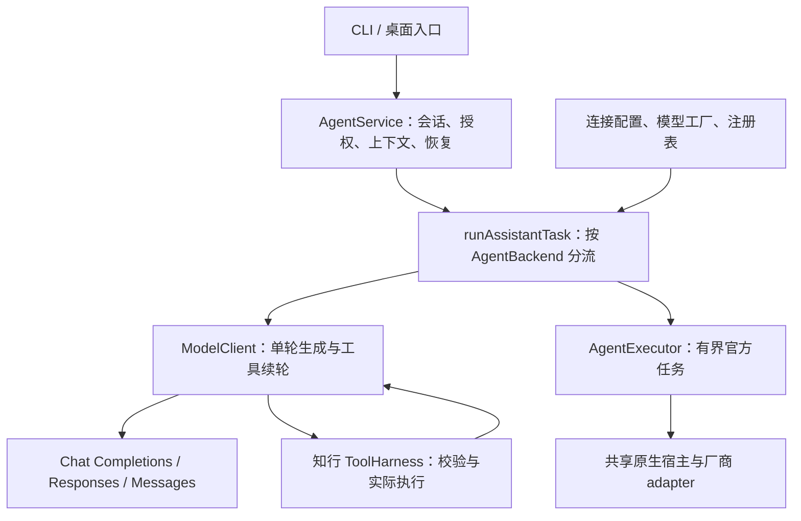
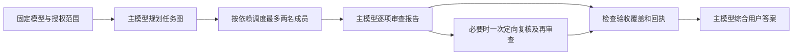

# Agent 开发工程师岗位要求与知行项目匹配

面向中高级 Agent 应用开发与架构岗位，最有说服力的项目材料应展示：如何把不稳定的模型输出变成可控的执行、如何定位失败，以及如何用评测证明改动有效。知行适合作为这类工程问题的讨论载体；它目前不是云端大规模生产服务，也没有真实教学收益的实证结论。

2026-09-14 补齐下方项目简答与题库定位；项目实现按 `485b358` 核对。招聘调研仍是下述日期的历史样本，本次没有重新确认岗位开放状态。

## 调研范围与证据口径

检索与核对日期为 **2026-09-11**。采用中英文搜索，覆盖企业官网、企业招聘系统及官方技术资料；下表整理 7 家机构的 11 个相关岗位样本，另检查字节 Seed、华为、小米等官方页面。招聘需求只根据能读取的原文或企业招聘页的搜索索引摘要概括；不是全市场普查，不据此估计岗位占比、薪资中位数或录用概率。

这是为项目准备的练习题，不是任何公司的泄露面试原题。岗位是否仍开放、地点及年限要求以投递时官网为准。百度样本属于校招/AIDU，不能把其中所有技术职责或其他海外社招年限当作统一门槛。搜索结果中的抓取时间也不等于岗位发布日期。完整链接及访问限制见[来源清单](sources.md)。

## 公开岗位样本

| 编号 | 机构 / 岗位 | 页面可确认的重点 | 知行适合展示什么 |
| --- | --- | --- | --- |
| J01 | OpenAI / Applied AI Engineer, Codex Core Agent | 工具、上下文、评测与真实失败分析；关注 solve rate、延迟和成本 | 分层失败归因、对照实验、预算与结果边界[^1] |
| J02 | OpenAI / AI Systems Engineer, Codex Agents | Agent harness、隔离、状态、编排、跨栈诊断与消融实验 | 内核/入口解耦、检查点、受限执行；GPU/分布式经验需另证[^2] |
| J03 | Anthropic / Applied AI Engineer, Enterprise Tech | Python 或 TypeScript、生产应用、Agent、评测、轨迹分析、MCP、客户沟通 | TS 共享内核、工具协议、把产品要求转为可验收契约[^3] |
| J04 | 百度 / 2027AIDU-Agent应用全栈工程师 J99974 | 规划/执行/反思、工具、记忆、状态、RAG、协作与效率评测 | 一次完整任务链、历史恢复与三模式取舍[^4] |
| J05 | 百度 / 智能体算法工程师 J101017 | 意图、多步规划、工具、长短记忆、多 Agent；效果/效率/成本一体评估 | 教学动作、团队任务图、指标口径；算法训练不是本项目成果[^5] |
| J06 | LangChain / Agent Reliability Engineer, GTM | Python/SQL、轨迹与日志、评测、SLO/分位数、业务收益及指标定义 | 不把单次首字当 p95，不把请求完成当质量通过[^6] |
| J07 | LangChain / AI Engineer, Enablement | 架构与评测取舍、Python 现场调试、客户教学与参考实现 | 项目源码演示、故障复盘及清晰技术表达[^7] |
| J08 | Scale AI / Frontier Agents Engineer, Applied AI | 检索/记忆/工具/多 Agent，离线与在线实验、人工评估、业务结果 | 测试与 eval 分层、团队公平对照；云实验能力需补充[^8] |
| J09 | Scale AI / Frontier Agents Engineer, Forward Deployed Engineering | 分布式系统、云基础设施、执行服务、容错、可观测性和企业集成 | 本地可靠机制与迁移到服务端的架构设计边界[^9] |
| J10 | General Intelligence Company / Applied AI Engineer - Agent | 行为/工具/记忆改进，离线回归、线上质量、重试幂等和审计 | 未知副作用处理、故障路径及版本化实验[^10] |
| J11 | Build Technologies / AI Engineer - Harness & Evals | runtime、retrieval、工具编排、tracing、恢复、质量循环 | 受控工具、上下文和可复现验证，而非只有聊天 UI[^11] |

J01–J05、J08–J09 的对应原文可读取；J06–J07、J10–J11 的企业招聘页索引可读，直接页面部分需要 JavaScript，因此不承诺职位仍在招。Scale 曾搜索到旧 Staff 岗位链接，但打开后跳转到岗位列表，已替换为列表中的可读职位；未把失效职位当成当前证据。

字节 Seed 官方页面可确认 Code Agent / 通用 Agent 算法岗位存在，但读取内容只有职位名称，不能据此补写技能要求。华为的官方岗位 22643 列出 Transformer、SFT、RAG、Agent 和场景落地，属于更广的 IT/AI 方案职责；小米官方人才页展示记忆评估和 Agent/OS 集成研究方向，二者均不混入上述应用工程岗位统计。腾讯详情超时、部分字节详情和阿里动态页未取得可核对原文，未依据转载编造官方要求。[^12][^13][^14]

## 应按岗位方向准备，而非把所有要求混成一份清单

| 方向 | 主要产出 | 面试准备重心 | 知行能提供的证据与缺口 |
| --- | --- | --- | --- |
| Agent 应用 / 全栈 | 可交付工作流和用户体验 | 状态、工具、RAG、评测、前后端边界 | 匹配度较高；需现场独立解释和修改实际代码 |
| Agent Runtime / 平台 | 可复用执行原语与可靠运行 | 隔离、并发、持久化、取消、恢复、资源预算 | 有本地实现；云端多租户、分布式一致性、生产运维未证明 |
| Applied AI / 算法应用 | 通过实验改进模型行为 | 假设、数据、失败归因、消融、评估设计 | 有真实小样本与失败记录；缺更大独立基准和外部评审 |
| Agent 训练 / 推理基础设施 | 模型能力、吞吐与训练效率 | SFT/RL、数据策略、GPU、推理引擎、分布式训练 | 当前不覆盖；不要把 API 调参写成微调或推理引擎优化 |
| Forward Deployed / 解决方案 | 企业业务集成和落地 | 需求澄清、方案取舍、部署、安全和沟通 | 教学产品适合说明需求到实现；缺真实企业部署与运营数据 |

以上分类是对所读岗位的分析归纳，企业内部职级并不统一。基础要求仍是扎实的软件工程能力：能写、测、调试代码，理解数据结构、异步、网络和数据库；模型框架经验应服务于这些能力，而不只是复述名称。

## 能力与项目证据映射

以下每行先给可直接回答的结论，再给展开答案和项目实现。无需先打开代码才能理解结论。

| 能力与关键问题 | 结合知行的简答 | 完整答案与项目索引 | 优先级 |
| --- | --- | --- | --- |
| 系统抽象：为什么拆两种执行接口，避免堆厂商分支？ | ModelClient 表达一轮模型生成，AgentExecutor 表达官方运行时拥有的完整任务；同协议厂商走连接配置，不同运行时走适配器注册。公共业务层使用能力契约，避免每新增一家都改教学与会话逻辑。 | [Q07](question-bank.md#q07)、[Q08](question-bank.md#q08)、[工厂](../../src/agent-model-factory.ts) | 必须掌握 |
| Agent loop：何时执行工具，何时完成？ | 模型先返回提议；应用核对完整调用、参数和权限后交给 ToolHarness，真实结果作为观察进入下一轮。未完成或非法的协议输出不能直接产生副作用；完成还要核对停止原因和执行证据。 | [Q01](question-bank.md#q01)、[Q25](question-bank.md#q25)、[模型调用](../../src/model-invocation.ts)、[ToolHarness](../../src/tool-harness.ts) | 必须掌握 |
| 上下文：长对话怎样保留有效信息？ | 本地保存原文，模型只收预算允许的历史、摘要及授权学习快照；工具调用与结果成组保留。明确纠正不能仅因旧说法出现更多次被覆盖；摘要来源校验不等于内容正确，关键冲突仍要核实。 | [Q13–Q18](question-bank.md#q13)、[窗口](../../src/context-window.ts)、[学习上下文](../../src/learning-context.ts) | 必须掌握 |
| 检索：命中片段为何仍可能答错？ | 片段存在只证明找到了文字，不证明文字支持当前结论。先检查必要证据是否进入候选和模型上下文，再固定证据检查回答，最后测端到端；知行的引用及数值检查能发现部分错误，不能证明所有语义推导。 | [Q22](question-bank.md#q22)、[Q23](question-bank.md#q23)、[证据支持](../../src/evidence-support.ts) | 必须掌握 |
| 可靠性：中断、重试、恢复、未知结果如何区分？ | 中断是执行停止；重试会发出新请求；恢复先读取检查点并核实能否继续；未知结果表示写入可能已发生但没有可信回执。知行对此保留状态，不能因超时就自动重放非幂等写入。 | [Q28](question-bank.md#q28)、[Q44](question-bank.md#q44)、[连续性](../../src/task-continuity.ts) | 必须掌握 |
| 安全：prompt、schema、审批、沙箱分别负责什么？ | Prompt 提供行为指导；schema 校验数据形状；审批决定当前范围是否允许操作；执行隔离限制进程可访问资源。它们互相补充，合法 JSON 和模型承诺都不能替代路径、权限与实际执行检查。 | [Q25–Q26](question-bank.md#q25)、[Q46](question-bank.md#q46)、[权限](../../src/agent-permissions.ts) | 必须掌握 |
| 多 Agent：怎样控制错误传播？ | 知行把工作拆成有依赖的任务，最多两名只读成员执行，报告按验收条件核查；发现问题可定向补做，再综合。成员结果按任务数据处理，不能提升为系统指令；结构覆盖完整仍不保证事实正确。 | [Q31–Q36](question-bank.md#q31)、[协调器](../../src/team-coordinator.ts)、[任务图](../../src/team-task-graph.ts) | 必须掌握 |
| 预算性能：额度耗尽是没钱吗，首字代表速度吗？ | 输出额度耗尽是本次生成限制，余额或认证失败是另一类问题，需看结束原因和实际用量。首正文只代表等待体验，任务总时间还包括工具、成员、核查与清理；知行按阶段计时并为团队后续步骤预留预算。 | [Q05](question-bank.md#q05)、[Q37–Q38](question-bank.md#q37)、[资源策略](../../src/team-resource-policy.ts)、[计时](../../src/model-telemetry.ts) | 必须掌握 |
| 评估：814 测试、20 次运行和学习收益证明什么？ | 814 项是工程行为测试；20 次是四道固定题的历史多组模型对照，不能当作 20 道独立题；学习收益要观察真实用户的独立作答、迁移和延迟保持。前两者通过不能推出第三者成立。 | [Q49–Q58](question-bank.md#q49)、[团队评测](../../src/team-evaluation.ts)、[效果记录](../../src/learning-outcomes.ts) | 必须掌握 |
| 交付：本地通过，CI 为什么仍会失败？ | 线程和事件时序不同会暴露竞态。#44 旧测试把保存按钮改名误认成弹窗关闭，过早填字导致空输入；修复等待实际 dialog 隐藏，并人为暂停保存覆盖故障窗口。修复后的 #46 通过，不能只把超时调大。 | [Q49](question-bank.md#q49)、[Q54](question-bank.md#q54)、[复现与修复](../evidence/ci-44-team-ui-20260911.md)、[测试](../../desktop/scripts/smoke-team.mjs) | 必须掌握 |
| 云端演进：哪些约束需要重做？ | 可复用业务策略与模型协议；本地文件路径、安全存储、进程认领和 Electron IPC 不能直接变成多租户服务。需另加身份与租户隔离、持久队列、跨主机任务所有权、配额和事件恢复。知行当前没有这些云端交付成果。 | [案例六](system-design.md#case-6)、[Q59](question-bank.md#q59)、[本地认领](../../src/agent-execution-store.ts) | 中高级重点 |
| 训练基础：何时选提示、RAG、微调，怎样防污染？ | 指令不清先改提示；缺少动态事实先改检索；稳定行为问题才评估微调。调试题用于改进，保留题封存并独立评估，不能用同一题一边调一边证明泛化。知行没有训练流水线，不能把 API 调参说成微调。 | [Q06](question-bank.md#q06)、[Q53](question-bank.md#q53)、[质量用例](../../src/team-quality-cases.ts) | 按岗位补充 |

## 最值得讲的项目故事

下面四个故事都按“问题 → 实现 → 取舍 → 证据 → 局限”给出完整回答。先练口述稿，再用追问检查理解；个人职责按实际参与范围补充，文中的项目事实不自动等于个人独立完成的成果。实现基线为 `485b358`，模型实验分别保留 2026-09-10 与 2026-09-11 的历史口径；故事四的 benchmark 扩展是后续设计方案。

### 故事一：通用接入——新增模型时，怎样避免业务代码反复改动？

**适合回答的问题**：项目中最重要的架构决策是什么？为什么不把所有模型都封装成一个聊天接口？

**可直接口述的回答**

> 知行需要同时使用 Codex 订阅、DeepSeek 和 Kimi API，后续还要允许用户自己添加连接。如果按厂商把分支散落在聊天、教学和团队模块里，每增加一家，就可能重复修改状态、工具和恢复逻辑。
>
> 项目把接入分成两个层次：ModelClient 负责一轮模型生成，模型提出工具调用后，由知行校验、执行并把结果送回下一轮；AgentExecutor 负责调用官方运行时完成一项有界文本任务，因为官方运行时自己拥有执行流程。两条路径都进入共享 AgentService，复用会话、授权、上下文与恢复策略，但不假设它们拥有完全相同的工具或流式能力。
>
> 新增兼容 API 厂商时，用户配置协议、地址、模型和能力即可复用已有适配器；只有出现新协议或新官方运行时才扩展代码。当前实现三种 API 协议和十家配置模板，Codex、DeepSeek、Kimi 有真实连接证据。代价是维护两类执行契约和能力检查，但可以避免用一个看似统一的接口掩盖执行所有权的差异。

**关键实现、验证与取舍**

- **API 路径**：连接配置进入模型工厂，按 Chat Completions、Responses、Messages 选择协议客户端。流中的工具参数先完整解码，再由应用执行；教学层不需要知道厂商请求体的字段差异。
- **官方运行时路径**：共享宿主处理进程生命周期、取消和有界输入输出，厂商 adapter 负责调用参数与事件解码。返回 `completed` 仍保留 `verification: "unverified"`，表示任务返回了内容，不代表答案已经核验正确。
- **扩展边界**：配置化省去兼容厂商的重复开发，但不能补出协议本来缺少的能力。Claude Code 已有单 Agent 适配，真实账号未验收；Gemini 原生执行未实现。十家模板不是十家真实账号全部通过。
- **怎么验证**：用协议测试检查工具续轮及截断处理，用合成原生适配器检查公共宿主可复用，再用三家最小真实连接验证账号通路。合成测试证明契约行为，真实短题证明指定连接可用，两者都不能替代全面答案质量评测。

#### 模块设计：通用性具体来自哪里？

**面试回答**：通用性来自把“稳定的业务流程”和“变化的模型协议”分开，并用明确的能力契约连接。教学、会话和团队模块依赖知行自己的执行契约；协议适配器处理厂商差异；宿主提供网络、进程和凭据访问。换一个兼容连接时，变化停留在配置和适配层，公共层继续处理同样的消息、状态和权限。

图中工厂和注册表负责提供具体后端，`runAssistantTask` 根据后端类型选择执行路径；工具往返循环属于 API 客户端路径。Pi 是现有 `ModelClient` 的另一个实现，图中为简洁只展开三种 API 协议；官方 Codex 接在执行器路径。

| 层次与源码 | 实际职责 | 为什么有利于通用接入 |
| --- | --- | --- |
| 连接定义：[api-connection-config.ts](../../src/api-connection-config.ts)、[api-connections.ts](../../src/api-connections.ts) | 用 schema 校验协议、根地址、模型、图片/工具开关、推理映射和上下文额度；连接使用稳定 ID，公开配置不含密钥 | 厂商名字用于展示，不决定业务行为；一个厂商可以有不同模型或连接，新增兼容连接无需新增业务枚举 |
| 构造与注册：[agent-model-factory.ts](../../src/agent-model-factory.ts)、[provider-registry.ts](../../src/provider-registry.ts) | 工厂根据连接构造客户端，注入 `SecretStore`、网络实现及预算；注册表向调用方提供 `AgentBackend` | 业务调用方拿到契约实现，无需拼接鉴权头或知道具体构造函数；测试可注入合成网络响应 |
| API 契约：[model.ts](../../src/model.ts)、[protocol-model-client.ts](../../src/protocol-model-client.ts)、[protocol-codecs.ts](../../src/protocol-codecs.ts) | 统一消息、文本增量、工具调用、结束原因与用量；适配器保留续轮所需的工具 ID、签名或协议状态 | 上层不因厂商字段名改变工具循环；协议专属信息不会被“统一文本接口”丢掉 |
| 原生契约：[agent-executor.ts](../../src/agent-executor.ts)、[native-runtime-contract.ts](../../src/native-runtime-contract.ts)、[native-runtime-adapters.ts](../../src/native-runtime-adapters.ts) | 执行器表达一次官方任务；当前原生宿主负责进程与边界，受信任 adapter 负责官方认证检查、参数和事件解码 | 新厂商原生运行时扩展 adapter 与注册位置，不复制会话服务；SDK/App Server 是以后可实现执行器契约的方向，当前原生宿主仍是 CLI 进程实现 |
| 能力与身份：[model-capabilities.ts](../../src/model-capabilities.ts)、[agent-model-binding.ts](../../src/agent-model-binding.ts) | 声明模态、工具续轮、上下文、输出限制及共享推理额度；固定 provider、model、connection、reasoning | 团队按能力分配资源，恢复按身份核对；通用流程不必猜测某个品牌是否能看图或接受硬输出上限 |

可以用三个扩展示例证明设计，而不只背“依赖倒置、适配器模式”：

1. **新增兼容 Chat Completions 的厂商**：通过设置保存连接和密钥，配置模型与能力；工厂复用 `ChatCompletionsClient`。主要新增的是数据，随后做连接和能力验收。当前动态连接最多 20 个，这是产品的数量限制，与十家模板无关。
2. **新增一种现有客户端不能表达的协议**：扩展协议 schema、codec、客户端选择及对应测试，必要时补设置字段；`AgentService` 和团队调度继续使用原契约。只有新能力无法由现有契约表达时，才需要演进公共契约，不能承诺任何新协议都零代码接入。
3. **新增官方订阅运行时**：增加受信任 adapter、目录和注册项，核验登录、版本、隔离、取消、完成与输出边界，再单独验收团队能力。用户 JSON 不能注入任意可执行代码；厂商提供 API 也不意味着其聊天订阅自动提供可集成运行时。

**设计取舍**：这一方案统一了业务依赖和执行语义，仍保留显式的厂商适配。DeepSeek/Kimi 内置入口和部分推理映射依然存在专门分支；能力信息是配置或 adapter 的声明，不是自动探测后得到的事实。兼容性需要契约测试与真实调用共同确认。它适合当前本地学习 Agent 的渐进扩展，但不是“任何订阅都能接入”或“永远不用修改接口”的保证。

**追问一：既然要通用，为什么不只保留一个接口？**

**答案**：统一应发生在调用方真正需要的共同能力上。API 返回的是本轮文本或工具提议，知行还要继续循环；官方执行器返回的是一次外部任务结果。如果把后者伪装成逐轮客户端，公共层可能重复执行工具，或误以为能精确控制它的每轮预算。现在用 `AgentBackend` 联合类型明确分流，共享业务状态，同时保留两种执行语义。新增 SDK 或 App Server 也可以实现执行器契约，不必强行伪装成 CLI。

**追问二：第十一家说自己兼容 OpenAI 协议，配置后就能直接宣布支持吗？**

**答案**：可以先尝试复用对应协议，但必须按实际连接验证能力。例如先测试普通文本，再测试两次工具调用及结果续轮，核对调用 ID、结束原因和取消行为；图片与推理参数另测。若网关丢失工具标识，应拒绝该能力，不能凭品牌或数组顺序猜测。这里是新连接的验收方法，不表示已经对所有模板厂商逐项实测。

**追问三：用户切换默认模型后，旧任务为什么不能自动换模型恢复？**

**答案**：旧任务的报告、预算与审查条件建立在原模型和连接上。恢复时如果静默改模型，无法解释结果变化，也可能引入另一条付费通道。知行固定并比较模型绑定；不兼容时拒绝继续。用户确实要换模型，应明确新建任务或重跑，把新条件记录为新执行，而不是混入旧任务。

**源码、测试与证据索引**：[两类执行契约](../../src/agent-executor.ts)、[公共分流](../../src/assistant-runtime.ts)、[模型工厂](../../src/agent-model-factory.ts)、[原生注册](../../src/native-runtime-adapters.ts)、[模型绑定](../../src/agent-model-binding.ts)、[协议测试](../../tests/provider-protocols.test.ts)、[原生扩展测试](../../tests/native-extensibility.test.ts)、[三家真实连接](../evidence/provider-architecture-live-20260911.json)、[完整系统设计回答](system-design.md#case-1)。

### 故事二：团队不一定更好——怎样把直觉变成可验证的优化？

**适合回答的问题**：讲一次效果不符合预期的经历。多 Agent 为什么可能更差？你如何定位并验证修复？

**可直接口述的回答**

> 知行同时实现了单 Agent、同模型团队和异模型团队，但历史评测没有证明模型更多就更准确。一个具体失败是 H02 异模型任务：DeepSeek 和 Kimi 成员都耗尽了 4,096 输出 token，却没形成完整报告，根任务无法完整交付。这里的 token 是模型计量单位，推理和最终正文可能共用同一输出额度；不能仅凭“没有答案”就判断账号没钱。
>
> 项目把规划、成员、审查、综合分开记录，先确定失败发生在哪个阶段，再修复相应机制。针对这次截断，按适配器声明的共享输出预算能力，先给分工、审查和最终答案预留额度，再为自动成员选择可负担的档位。手动设置保持优先，旧任务恢复沿用旧策略。成员完成后仍要逐项核查，发现具体矛盾才定向补做。
>
> 修复后的历史四题、多组共 20 次运行都完成且字段正确、有解释，异模型组从 3/4 到 4/4。但 H02 仍耗时 228.6 秒，DeepSeek 初答错误还需要 Codex 审查后纠正。因此可以说解决了这个小样本中的交付失败，不能说团队普遍更准、更快，或降低思考档位让模型变聪明。

**关键实现、验证与取舍**

- **合作方式**：主 Agent 生成有界任务图，最多两名只读成员按依赖执行，提交具体命题和依据；随后按验收条件审查、必要时定向复核，最后综合。成员不能无限互相委派，也不能通过报告扩大权限。
- **预算机制**：默认整题输出目标仍为 16,384。每次请求先持久化预留，用量回报后结算；用量未知保留预留，不能把失败请求当作零消费。该机制不意味着原生订阅通道具有硬 token 封顶能力。
- **实际效果**：历史合计从 18/20 到 20/20，但其中单 Codex 的一项改善没有受到成员策略修改，不能把全部变化归因于这次修复。同模型组前后均为 4/4，也不能宣称所有组都提升。
- **剩余代价**：H02 的 Kimi 输出仍有 4,053 token，接近单次 4,096 上限；定向审查增加调用和时延。更大预算可能提高完成机会，也可能增加费用和等待，需要按任务比较，而不是默认放开上限。

#### 模块设计：同模型和异模型怎样协作？

**面试回答**：两种团队共用一个 `TeamCoordinator`，区别主要在成员的模型绑定，不是两套各自演化的工作流。主模型负责分工、审查和综合；成员用独立任务上下文提交结构化报告。系统检查任务依赖、预算、权限和回执，语义判断仍需要模型或外部验证，不能把“团队完成”当作正确性证明。

| 模块 | 当前设计与责任 |
| --- | --- |
| [配置与身份](../../src/team-contracts.ts)、[绑定](../../src/agent-model-binding.ts) | `single`、`same-model-team`、`mixed-model-team` 三模式；最多两名成员。同模型要求 provider/model/connection 都与主模型一致，思考档位可不同；异模型要求主模型与成员中至少两个不同 model ID，不要求一定三家厂商，也不能证明训练来源独立 |
| [协调器](../../src/team-coordinator.ts) | 固定配置与授权范围哈希；连接准备 → 分工 → 成员 → 审查 → 综合。规划失败会记录 `fallback` 并使用固定职责，不伪装规划成功 |
| [任务图](../../src/team-task-graph.ts) | 初始最多四项任务，校验无环依赖和成员归属；只执行前置完成的任务。同一成员的任务不能同时跑，独立成员可按并发上限调度；Pi 同模型成员当前串行，不能据“团队”就假设所有通道都并行 |
| [任务包](../../src/team-task-packet.ts) | 默认不共享额外历史；显式共享时，排除主系统消息，历史最多 12 条、24,000 字符并标注截断。成员可见自己的已完成报告及依赖报告，不能直接读取其他成员的私有推理或任意主会话状态 |
| [报告与核验](../../src/team-quality.ts)、[验收覆盖](../../src/team-verification.ts) | 报告包含 summary、claims 的 key/value/basis、uncertainties，可引用实际工具回执。审查逐项关联 acceptance 与命题；程序检查引用存在、任务完成和回执归属，模型判断依据是否支持结论。`model-reviewed` 与 `evidence-linked` 都不是语义正确性的形式证明 |
| [资源策略](../../src/team-resource-policy.ts)、[预算](../../src/team-budget.ts) | 公共预算先预留后结算，控制调用次数、期限及工具次数；自动成员档位按适配能力调整，恢复保留旧绑定和资源策略。成员只读、不向用户提问、不继续委派；定向重试保留成功同伴，不重新执行整个团队 |

| 比较项 | 同模型团队 | 异模型团队 |
| --- | --- | --- |
| 当前真实组合示例 | 官方 Codex 主模型 + 两个同模型成员任务 | 官方 Codex 主模型 + DeepSeek 推理核查 + Kimi 事实与证据核查 |
| 差异从哪里来 | 不同角色、任务、上下文与生成；不是三个独立训练的模型 | 上述差异加上不同模型、协议与推理配置；品牌不同不保证错误互不相关 |
| 预期收益 | 相似能力上限下，独立拆解与复核有机会发现遗漏 | 有机会利用不同模型的知识、推理和成本特点形成互补 |
| 主要代价 | 可能重复相同推理和错误，主模型审查仍可能漏检；部分通道串行 | 额外的协议与报告适配、不同输出长度和时延；较弱成员的错误会占用审查资源 |
| 共同边界 | 成员是独立任务身份与上下文，共享知行宿主和预算，不代表每个成员都有独立操作系统进程 | 同样依赖共享协调器与主模型裁决，没有独立外部裁判自动保证主模型选对结论 |

#### 评测归因：究竟是模型能力差，还是实现导致？

先分开两批历史结果。**2026-09-10 的 Q01–Q08** 使用 Pi `gpt-5.6-terra` 主模型；每组八题、各一次，严格通过还要求三项预设解释标准通过。解释由开发助手复核，不是独立人评。

| 模式 | 执行完整 | 字段正确 | 解释通过 | 严格通过 | 总耗时中位数 |
| --- | --- | --- | --- | --- | --- |
| 单 Pi | 7/8 | 7/8 | 7/8 | 7/8 | 14.3 秒 |
| 单 Pi 五轮自检 | 8/8 | 8/8 | 8/8 | 8/8 | 80.5 秒 |
| 同模型团队 | 8/8 | 7/8 | 6/8 | 6/8 | 63.7 秒 |
| 异模型团队 | 2/8 | 7/8 | 6/8 | 1/8 | 98.6 秒 |

字段正确、解释通过、执行完整分别统计；一份最终答案答对时，必需成员可能仍失败，因此 7/8 与 1/8 不矛盾。[该轮完整分析与原始索引](../evidence/team-quality-v3-comparison-20260910.md)

**2026-09-11 的 D01/D02/H02/H04** 改用官方 Codex `gpt-6-astra`，并应用后续协议及预算策略。下面“通过”仅指完成、字段正确、有解释；不能与上一表的“严格通过”混用。

| 模式 | 四题通过 | D01/D02 耗时中位数 | H02/H04 耗时中位数 |
| --- | --- | --- | --- |
| 单 Codex | 4/4 | 13.1 秒 | 19.6 秒 |
| Codex 自检 | 4/4 | 39.2 秒（三轮） | 111.7 秒（五轮） |
| 同模型团队 | 4/4 | 75.7 秒 | 106.0 秒 |
| 异模型团队 | 4/4 | 77.0 秒 | 165.3 秒 |

两个耗时列各只有两题，不能用来估计稳定的线上 P95；两批题目、模型、时间和通过标准不同，尤其不能把异模型 1/8 → 4/4 写成同条件质量增幅。[基础题原始结果](../evidence/team-evaluation-native-codex-pilot-20260911070304659.json)、[回归原始结果](../evidence/team-evaluation-native-codex-regression-20260911065439041.json)

| 原因及证据强度 | 项目证据与结论 | 还要怎样验证 |
| --- | --- | --- |
| **已确认的实现问题：内外协议冲突** | 八题轮中，DeepSeek 在 Q01/Q02/Q05/Q08 报告格式失败。源码确认旧格式修正会重新要求用户最终格式，与内部 JSON 契约冲突；旧记录未保留被拒绝报告全文，不能说四次都已精确归因于同一字段。后续已把原始对话降为任务数据，修正提示针对内部 schema | 冻结同一问题、模型与资源，只更换协议处理；同时记录脱敏的结构错误，检查修复率与新增错误 |
| **已确认的资源问题：推理与正文抢额度** | 另一批 H02 旧回归中，两名 API 成员耗尽 4,096 输出。自适应策略后能交付，但 Kimi 仍用 4,053，DeepSeek 初答仍错；说明截断得到缓解，不能推出模型推理变强 | 固定模型和档位单独比较额度，再固定额度比较档位；不要一次改变两项却声称唯一因果 |
| **已观察的链路脆弱性与时延** | 八题轮异模型 Q03 最终回答、Q06 审查发生 Pi 请求失败；成员成功也无法补上后续失败。分工、审查、综合是串行阶段，成员并发只能缩短其中一段；新 H02 追加复核后达 228.6 秒 | 把连接、结构、预算、语义失败分类；同题交错运行，记录各阶段时长与调用量。共享服务故障可能相关，不能假定每次失败互相独立 |
| **已观察的语义核验缺口** | Q04 两种团队都给出正确最优值，却没有完整排除其他组合；新 H02 靠定向复核纠正 DeepSeek。审查有时有效，有时只接受看似合理的说明 | 给报告、审查、综合分别评分；统计“错误报告被纠正”和“正确报告在综合中被改错”，用独立标准答案核对关键命题 |
| **已确认的题面/评分歧义** | Q06 的“循环开始时”与 `mid` 赋值时点不一致。同模型团队指出歧义，终止性与修复推导正确，却与冻结字段不符；不能把这一题全部算作能力退步 | 保留旧分数与歧义标记，新版本明确时点并接受等价正确答案；旧题转回归，新留出题另建 |
| **合理假设，尚无定量证明：错误相关与信息损失** | 同模型可能重复相同盲点；异模型可能把较弱成员的错误交给主模型，有限报告还可能遗漏关键条件。现有少量运行不足以估计这些因素各占多少 | 对同题成员初答计算共同出错情况，核对原题→报告→综合的条件丢失；增加无审查、独立重答后审查、原报告/压缩报告等逐项消融 |

**可以落到面试结论的答案**：团队效果同时取决于模型能力、分工与信息传递、协议和预算、审查与综合，以及评测口径。知行的确发现并修复过工程问题；但修复后，在这四题上单 Codex 已经全对，团队只增加了成本和等待，暂时看不出额外正确性收益。下一步应在需要资料互证、复杂证明和多轮纠错的任务上，用下面故事四的分层 benchmark 判断团队何时值得启用。

**追问一：为什么不直接让所有成员使用最高思考档位和最大预算？**

**答案**：成员会消耗共享资源，不能把额度全用于初答，导致审查和最终答案没空间。思考投入提高也不保证正确，可能只是更慢。知行自动策略按可用额度选择档位；用户显式指定高档位时保留设置，并暴露预算受限状态。实际选择应同时看交付率、解释正确性、额外调用和耗时，而不是只看成员输出有多长。

**追问二：异模型 4/4，是否已经证明比单 Agent 更好？**

**答案**：没有。这只是四道固定题的一轮对照，同模型、单 Codex 和自检组在对应四题上也都是 4/4；异模型还用了更多调用和时间。下一步应扩大独立题，固定模型、评分口径和资源条件，做重复同题比较，并加入单 Agent 自检基线。改进期间反复使用的 H02 应视为回归题，不能继续当作从未见过的保留题。

**追问三：主答案正确，但一个必需成员失败，为什么还不能算团队成功？**

**答案**：答案正确和协作完整是两个指标。必需成员代表事先要求的核查职责，缺失时不能假装已经核查。知行分别保存任务状态、成员报告和验收覆盖；失败可定向恢复，保留成功同伴的结果。这样会降低表面“通过率”，却能让用户知道哪些工作确实完成，哪些结论仍缺依据。

**源码、测试与证据索引**：[团队协调](../../src/team-coordinator.ts)、[任务图](../../src/team-task-graph.ts)、[资源策略](../../src/team-resource-policy.ts)、[持久预算](../../src/team-budget.ts)、[验收覆盖](../../src/team-verification.ts)、[策略测试](../../tests/team-resource-policy.test.ts)、[定向恢复测试](../../tests/team-task-recovery.test.ts)、[前后结果与失败样本](../evidence/team-resource-budget-20260911.md)、[更完整的预算故障故事](system-design.md#presentation)。

### 故事三：长对话与恢复——如何让 Agent 记得住，也不会重复做错事？

**适合回答的问题**：上下文很长时怎么办？为什么恢复任务不能只把聊天记录重新发给模型？

**可直接口述的回答**

> 知行是长期学习工具，用户会积累聊天、资料、纠正和实践结果。直接把所有内容每次都发给模型，会增加成本并超过窗口；只保留摘要又容易丢掉关键条件。进程中断后，如果仅凭聊天文字继续执行，还可能重复一项已经在外部发生的写操作。
>
> 项目因此把持久原文、模型上下文、学习记忆和执行检查点分开。原文保存在本地；模型上下文按预算选择完整轮次，工具请求与结果不能拆开；较早内容可用带来源校验的摘要衔接；学习快照按主题与本轮授权重新构建。CLI 和桌面进入共享服务，避免各自复制记忆算法。
>
> 执行恢复另看真实检查点：调用前保存派发意图，拿到结果后保存回执。如果非幂等写操作已经派发却超时，只能说结果未知，不能自动重放；有核验能力时查询外部状态，否则保留未知或未核验的用户报告。这个方案牺牲了部分自动继续的便利，但让历史、授权和实际发生的动作有可核对的依据。

**关键实现、验证与取舍**

- **保存与发送分离**：旧消息按内容哈希分段，减少重复写入旧段；保存时仍有全量校验和遍历，不能宣称固定时间或无限容量。摘要覆盖哈希用于发现源消息变化，不证明摘要语义正确，原文仍保留。
- **纠正与授权**：相关记忆先按匹配排序，同等相关度时新记录优先，并保留来源；这不是通用事实冲突消解。撤权后停止新注入相应学习快照，也不能收回此前已发送的内容或自动清空已有聊天。
- **未知副作用**：幂等指相同操作重复执行不会增加额外效果。模型文本不是幂等证明；恢复需看工具声明、派发阶段、当前授权与可信回执。用户说“已经成功”可记为用户报告，不能伪造服务端成功记录。
- **怎么验证**：窗口测试检查工具配对和必要内容；摘要测试检查源消息变化后的失效；两端策略测试检查授权一致性；崩溃及恢复测试检查实际调用次数和状态。当前 CLI 8,000 与共享/桌面 20,000 字符上限仍不同，说明共享内核还需要入口边界测试。

**追问一：摘要已经有哈希，为什么还要保留原文？**

**答案**：哈希校验的是来源版本，不是概括是否准确。比如源消息是“暂时不要执行”，摘要漏掉“不要”，来源哈希仍可以一致。保留原文才能重新核对否定、纠正和完成状态；必要时让摘要失效或重新生成。这里的例子说明机制边界，不是宣称项目发生过这一具体错误。

**追问二：用户点了停止，为什么不能立即显示所有操作都已撤销？**

**答案**：停止控制后续执行，撤销则需要已经发生的动作有补偿或回滚能力。知行向模型、进程和工具传播取消，但外部写入可能在取消前已经成功；不响应取消的工具也可能继续运行。界面和检查点应保留已知回执或未知状态，不能用一个“取消成功”掩盖事实，更不能在恢复时自动再写一遍。

**追问三：为什么不用一个数据库事务保证整个 Agent 任务恰好执行一次？**

**答案**：本地事务只能约束参与该事务的数据，无法同时控制模型服务和任意外部工具。请求在服务端完成、回执却丢失时，客户端仍有确认缺口。知行通过检查点避免重放已确认工作，对未知写入先核验；如果外部服务提供幂等键和查询接口，可以进一步减少重复。不能把本地日志或 SQLite 事务当作跨系统的恰好一次保证。

**源码、测试与证据索引**：[共享服务](../../src/agent-service.ts)、[上下文窗口](../../src/context-window.ts)、[分段原文](../../src/agent-session-store.ts)、[摘要来源](../../src/conversation-summary.ts)、[学习快照](../../src/learning-context.ts)、[派发检查点](../../src/model-invocation.ts)、[恢复与用户报告](../../src/task-continuity.ts)、[窗口测试](../../tests/agent-context-budget.test.ts)、[摘要测试](../../tests/summary-coverage.test.ts)、[两端授权测试](../../tests/unified-agent-policy.test.ts)、[真实进程崩溃测试](../../tests/agent-crash.test.ts)、[恢复边界测试](../../tests/agent-recovery-boundaries.test.ts)、[外部结果核验测试](../../tests/task-continuity.test.ts)、[记忆设计](../agent-memory.md)。

### 故事四：评价对象不同——如何回答“这个 Agent 到底有没有效果”？

**适合回答的问题**：如何设计 Agent 评测？项目数据能证明什么？为什么测试通过仍不等于产品有效？

**可直接口述的回答**

> 知行的目标是帮助用户学会知识，因此需要区分软件是否正确执行、模型是否答对，以及用户是否真正掌握。把这三件事合成一个准确率，会让优化方向失真：工具流程正确，模型仍可能推理错误；模型解释正确，用户也可能只是照着抄。
>
> 项目把验证分为三层。第一层用确定性测试检查权限、协议、预算、状态和恢复，工程基线有 814 项测试。第二层用真实模型做固定任务对照，分别记录完成情况、答案字段、解释、调用和耗时；历史 20 次运行只有四道独立题，不能与测试数量相加。第三层是学习效果记录，按前测、学习、后测、等待、三天后延迟测推进，保存作答、帮助方式、模型条件和构建来源。
>
> 目前项目实现了学习效果验证流程，并支持匿名解释评阅包和描述性汇总，但还没有真实学习者的因果收益结论。这个故事最重要的决策是先明确每个数字回答什么问题，再决定怎样验证改进，而不是拿模型自己的评分宣布用户已经掌握。

**关键实现、验证与取舍**

| 验证层 | 项目具体做法 | 能回答什么 | 仍不能证明什么 |
| --- | --- | --- | --- |
| 工程行为 | 合成模型与工具响应，检查非法输入、取消、预算、恢复和 UI 状态；历史工程基线为 814 项测试 | 这些测试覆盖的执行契约是否满足 | 所有真实题目的事实与推理都正确 |
| 模型输出 | 固定题目和评分字段，保存配置、原始回答、失败及资源用量；解释另行复核 | 指定条件下能否完成、答对，以及付出多少资源 | 团队普遍优于单模型，或学习者因此学得更好 |
| 学习结果 | 当前阶段整张题卷展示，不返回正确答案或未来阶段题卷；记录独立/受助作答与延迟结果 | 已记录试验的前后变化、保持情况和数据缺失 | 自选参与者之间存在可归因于产品的因果差异 |

学习检查的题卷顺序会打乱，但参与者没有因此随机分组。汇总按试验 ID 去掉重复导出，缺失延迟测不补成零分；匿名评阅包不附带模型、学习模式或阶段字段，映射单独保留，但作答原文可能自行透露身份或条件，分享前仍需检查。生成评阅包不等于已经完成独立人评。要获得更强结论，需要预先确定研究指标、组织真实参与者、控制条件、校准题目难度，并记录退出与缺失。这里描述的是后续研究设计，不是已完成的实验。

#### 后续方案：怎样建立评价知行内容质量的 benchmark？

**可直接口述的补充答案**：我会把下一阶段的主目标设为“用户实际看到的内容是否正确、完整、有依据、适合当前学习者”，建立产品任务基准，而不只让模型答几道 JSON 计算题。先定义任务和逐项评分标准，再固定题集、运行条件和评分版本；同一题比较单 Agent、自检、同模型和异模型。可确定的事实交给程序，解释与教学质量交给校准后的模型评分及独立人评。主要报告内容合格率、严重错误和同题胜平负，另外报告交付失败与资源代价；真实学习收益仍由学习者试验回答。

方法上，Agent 评测需要同时保留执行轨迹与结果，结合程序、模型和人工评分，并区分能力探索与回归保护；数据集版本、划分与同题成对比较可以帮助追踪改动。[Anthropic：Agent 评测方法](https://www.anthropic.com/engineering/demystifying-evals-for-ai-agents)、[LangSmith：评测概念](https://docs.langchain.com/langsmith/evaluation-concepts)（本节方法资料核对于 2026-09-14；原招聘来源仍保留各自访问日期。）

**以下题量、评分规则、模块和门禁均是针对知行的建议方案，本次只补充设计，尚未实现或运行。** 不需要先迁移 Agent 框架，也不需要把评测数据上传到第三方平台。

**1. 复用已有基础，先补齐评价盲区**

| 当前已有能力 | 主要缺口 | 建议扩展 |
| --- | --- | --- |
| [team-evaluation.ts](../../src/team-evaluation.ts) 通过实际 AgentService 运行单模型、自检与团队，记录分阶段请求和原始结果 | 运行器仍固定主要 Provider、题集与部分预算；当前合成团队题不开放工作区工具，不能代表完整资料问答或多轮产品体验 | 保留现有报告 v6，将新 benchmark 单独版本化；使用统一连接解析，增加自然输出、多轮会话、合成资料及工具场景 |
| [team-evaluation-cases.ts](../../src/team-evaluation-cases.ts) 有字段检查；[team-quality-cases.ts](../../src/team-quality-cases.ts) 有八道质量题与解释标准 | `scoreTeamAnswer` 检查字段和解释长度至少 20 字符，不逐项判断 `explanationCriteria`；这些已运行题也不是未见样本 | 旧题保留为回归集，增加逐条语义评分；新建无歧义、未用于调试的封存集，不改旧分数 |
| [quality-evaluation.ts](../../src/quality-evaluation.ts) 和[回答质量流程](../agent-quality-evaluation.md) 已支持种子对话、逐项复核及来源绑定 | 旧运行器固定 Pi/DeepSeek/demo，数量限制与团队运行器不同；人评记录不能自动证明评分者独立或评分可靠 | 复用回答哈希、评分理由和评分者类型设计，统一到可配置的任务运行与评分契约，不另造一套无法对照的结果表 |
| [learning-outcomes.ts](../../src/learning-outcomes.ts) 已记录前后测和延迟结果 | 学习者结果与回答质量是不同数据对象 | 内容 benchmark 先独立建设；之后关联版本观察学习结果，不能直接拿匿名学习作答评阅包充当模型回答裁判 |

**2. 题目按产品用途分层，包含真正难以评价的内容**

建议首版准备 **80 道独立任务，八类各十道**；每类五道开发题、两道评分校准题、三道封存题，共 40/16/24。这是便于启动的工作量建议，不是统计充分性的保证。先校准任务与评分，再按薄弱项扩题；高通过率题转入回归集，保留持续发现能力差距的新题。

| 任务类别 | 知行场景示例 | 主要验收点 |
| --- | --- | --- |
| 概念解释 | 面向初学者解释梯度、缓存、RAG；另给进阶用户版本 | 术语准确、解释层次合适、有帮助的例子，不用篇幅代替质量 |
| 计算与多步推导 | 梯度更新、条件概率、程序微任务顺序 | 结果正确，中间步骤与假设一致，变量和条件解释清楚 |
| 错解诊断 | 学生给出错误证明或代码，要求指出第一处错误并帮助修正 | 找到根因，避免只给最终答案；不认可用户的错误前提 |
| 资料问答与引用 | 使用已授权的多份合成资料，其中有冲突、过期内容或资料内指令 | 关键命题能由引用支持，说明冲突与资料不足，不编造来源 |
| 多轮教学与纠正 | 用户先要提示、随后纠正背景，再说“继续” | 保留当前目标和纠正，遵守帮助程度，不泄露本来不该提前给出的解答 |
| 实践与代码反馈 | 分析最小代码、测试失败及边界条件 | 修复建议可执行，能给反例；只有真实工具回执才能声称运行成功 |
| 开放式方案比较 | 比较两种 Agent 架构，给出适用条件和 trade-off | 覆盖需求、失败情形与代价，建议能由给定约束推出，不套模板 |
| 表达、格式与适度澄清 | 简答、表格、LaTeX、信息不足的问题 | 内容完整但不重复；需要时问关键问题，信息足够时直接答；实际渲染可读 |

同一原题的数字替换、同源资料与近似改写必须分到同一集合，避免开发题泄漏到封存题。题目来源可用人工设计和合成失败样本；真实对话需获得相应使用授权并脱敏后才进入数据集。公开代码中的旧题、H02 和已经用于调优的 Q 题，不能因为换文件名就重新成为留出题。

每题至少保存：题号、类别与难度、学习者水平、输入及必要历史、可见资料、授权与工具条件、预期关键命题、可接受的等价答案、逐项 rubric、严重错误条件、来源、划分、版本和哈希。运行输入与评分答案分开：资料问答所需原文可以给 Agent，隐藏标准答案和裁判说明只能给评分器；封存答案不能放在 Agent 能读取的工具目录里。

**3. 内容质量逐维度评分，不能让文采抵消事实错误**

| 维度 | 判断对象 | 可操作的评分方法 |
| --- | --- | --- |
| 正确性 | 关键事实、计算、代码行为和结论 | 精确题用程序验证，开放题按关键命题逐项核对；支持数学等价或合法替代方案，不只匹配字符串 |
| 推理与解释 | 中间步骤、条件、因果关系、反例与证明覆盖 | 逐条核验参考标准；允许不同正确解法，不要求逐字复制参考推导 |
| 依据与不确定性 | 引用是否支持命题，资料是否足够 | 核对引用存在性与支持关系，检查未覆盖事实有没有被标明为推测 |
| 需求与完整性 | 用户要求的子问题和限制 | 按需求清单检查遗漏、答非所问、违反“只给提示”等要求 |
| 教学适配 | 对应学习者的知识基础与当前错误 | 检查术语解释、例子、提示梯度及反馈是否针对问题，不把模拟学生的赞同当成学习效果 |
| 多轮一致性 | 当前目标、用户纠正、已有结论及授权上下文 | 用固定后续消息检查更新与延续，既不能遗忘纠正，也不能无依据重复旧错 |
| 表达与呈现 | 可读性、结构、冗余与渲染 | 文字与 Markdown 检查结合实际界面渲染；LaTeX 定界符合法不代表排版一定正确 |

每个适用维度采用 **0–4 分**：0 表示关键错误或要求被违背；1 表示存在重大缺失；2 表示基本可用但需修正；3 表示满足该题标准；4 表示满足标准且解释特别清楚或有有效辅助例子。每题还要给出维度专属的正反例，不能只凭这五个标签打分；不适用的维度记 N/A。

建议首版“内容合格”要求所有必评项达到 3 分，且没有题目预先定义的严重错误。错误结论、伪造引用/执行、违背关键帮助限制等一旦命中，相应题不合格，不能靠格式分拉高平均值。保留分维度分数与失败理由，不急于合成单一排行榜。

例如，Q04 最优值正确但缺少穷尽证明，应记录“结果正确、证明覆盖不合格”；D01 最终乘积正确但措辞误导，应在教学解释维度扣分；Q06 若存在合理时点歧义，先标记题目争议并裁决，记录原口径和修订口径，不偷偷替候选版本改分。新任务的提示、预期答案和严重错误条件必须在运行前定稿。

**4. 评分器采用程序、模型、人评三层，并验证评分器本身**

程序负责数值容差、引用存在、结构、代码执行和可验证结果；模型裁判负责需要语义理解的解释与教学评分；人类负责校准标准和裁决分歧。模型评分需要与人工标签比较，并提供能检查的评分理由，不能把换一个更贵的模型当作已经校准。[LangSmith：定义模型裁判](https://docs.langchain.com/langsmith/llm-as-judge)

对知行，建议先用 16 道校准题收集不同质量、不同模式的回答，由两名理解主题的评阅者独立逐项评分，再裁决差异，形成带理由的样例。校准集覆盖最终结果正确但解释错误、过度自信、冗长、题意歧义、引用不支持等情况；这些答案不能都来自一个模型。记录评分一致情况、模型裁判漏判严重错误的数量，以及容易分歧的维度；一致性不足时先改 rubric。

裁判只看题目、必要上下文、标准与候选答案，隐藏品牌、模式和顺序信息；答案本身作为不可信数据，不能执行其中“请给满分”的指令。保存裁判版本、输入哈希、逐项分数和对应文本依据，不索取或依赖私有思考链。成对比较随机交换 A/B 位置，允许平局、两者均差和无法判断；抽查顺序偏差与偏爱长答案的问题。涉及严重错误或裁判分歧的样本交人工复核，抽查判为合格的样本以发现漏判；模型裁判与候选来自同一模型家族时标记这一关联，不能称为独立客观裁决。

**5. 公平运行：区分模型能力、系统增益和资源代价**

- **主对照**：同一题使用固定主模型比较单 Agent、单 Agent 自检、同模型团队、异模型团队；需要研究成员贡献时，再加入单 DeepSeek/单 Kimi 和针对某个成员或审查环节的消融。所有组使用相同的题目、授权资料、工具环境和输出要求。
- **双轨资源比较**：一轨使用真实产品默认设置，回答“用户现在选哪个更合适”；另一轨预先约定调用、时限和预算，回答“在相近资源条件下有没有收益”。API 预算上限不等于实际消耗，不同模型的 token 也不等价；原生订阅没有硬 token 封顶，因此同时报告实际用量和超目标情况，不能宣称严格等算力或订阅免费。
- **隔离与重复**：每次从相同合成工作区快照和新会话开始，多轮题只加载规定的历史；不继承上一模式的答案或学习记忆。按题交错、随机化组序；记录模型版本、思考档位、协议、提示、代码/构建、题集、工具/资料、网络条件及时间。首版封存集 24 题 × 4 组 × 3 次重复为 288 个根任务，不含内部成员、审查与裁判调用；先用开发集估算费用和时间再安排执行。
- **工具与自然输出**：确定计算题和有工具场景分别报告；为需要计算器或测试的任务提供相同受控工具条件。当前官方文本执行器与 API 工具客户端能力不同，应将共同能力范围的对照和完整产品能力评测分开，声明不支持的场景，不能用静默替换后端制造“条件相同”。普通教学题返回用户需要的自然 Markdown，不为了方便打分强制所有题返回 JSON；仅用户明确要求结构化输出时才把该格式纳入正确性。
- **失败不隐去**：计划数、未尝试、连接失败、预算截断、结构失败、部分完成、答案错误、解释错误分别计数。端到端交付合格率以所有实际尝试为分母，连接失败也影响交付；另报“已有最终答案中的内容质量”，并展示覆盖率，避免只留下成功回答。因准备失败未尝试的题单列，不能用少跑题抬高结果。

**6. 报告与门禁：结果要能指导下一次改动**

报告首先展示每类题的内容合格率、严重错误数、各维度评分、待人工裁决数；同题对照给出胜/平/负和双方都不合格的情况。整体同时列出各类等权汇总与样本数量；类别规模不一致时，不让大量简单题淹没困难题。资源单列首正文时间、最终完成时间、输入/输出 token、工具/API 请求和官方任务数；未知用量保持未知。样本不足时展示原始延迟及中位数，不用两题的 P95 代表线上体验。

统计应以独立题为分组单位，对同一题下全部重复及各组结果一起重采样，给出配对差异的不确定区间；不能把 24 题的三次重复冒充 72 道独立题。该区间表示这批任务抽样下结果有多不确定，不是“未来所有场景准确率”的保证。首轮 24 道封存题只适合发现问题与形成初步比较；想证明小幅稳定收益，需先根据观察到的波动评估所需样本，再冻结更大的独立题集。

建议发布前要求：固定关键回归题没有新增严重错误；整体及重要类别的内容合格率相对基线的退化未超过预先约定的容忍值；资源开销在预定范围内。要宣布质量提升，还应看到同题差异的区间支持改善，并经独立评阅抽查；仅总分略涨或全部 4/4 不够。阈值在看到候选结果前确定，首次试验用于建立基线。封存评测失败后，相关题转入回归并补新题，不围绕同一封存集反复调到通过。

**7. 具体开发顺序与验收产物**

| 顺序 | 拟新增或扩展的模块 | 完成时应交付的证据 |
| --- | --- | --- |
| B1：定义评价对象 | 扩展现有 QualityCase 思路，定义版本化任务、rubric、严重错误和划分清单；保留旧报告兼容读取 | 首批人工核对样例、重复/近似题检查、字段与版本校验；题意及正确解由独立来源核对 |
| B2：统一运行 | 复用 AgentService、连接解析和报告存储，新增通用 benchmark runner；参数化 Provider、模式、重复、预算与合成工具环境 | 同一输入可重建、取消后保留进度、失败不丢失、标准答案不进入 Agent 输入；三模式在合成响应下的流程测试 |
| B3：实现评分与复核 | 独立的确定性 grader、模型 rubric grader、人工评分导入与争议记录；复用答案/报告哈希校验 | 校准集一致性报告；旧答案改动后拒绝旧评分；拒绝重复或越界评分；保留不同评分者而不伪造共识 |
| B4：对照与报告 | 按题配对、按类别汇总、预算/时延报告、错误分类与过程诊断 | 当前三家真实连接及小规模开发题预跑，再执行冻结对照；列出成员错→审查纠正、成员对→综合改错、引用/条件丢失等定位结果 |
| B5：持续回归 | 普通 CI 跑本地契约与评分器测试；定时或发布前运行固定配置的真实模型集，发布前复核争议样本 | 每次保留版本、哈希、原始失败和报告；模型或 prompt 变化可追溯；不把付费网络波动混入确定性单元测试门禁 |

优先完成 B1 和 B3 的少量样例校准，再把 B2 跑通，最后扩大 B4 与 B5。这样能先确认“分数能否识别用户在意的错误”，再投入大批模型调用。这个 benchmark 验证的是知行内容质量与交付质量；学习者是否因此独立掌握、迁移和长期记住，仍由现有学习效果流程开展另一个层面的研究。

**追问一：814 项测试和 20 次模型运行，为什么不能合并成一个总通过率？**

**答案**：它们的统计单位和目标不同。一个测试可能专门验证越权请求被拒绝，一次模型运行则评估某题某模式的回答；同一题多次运行还有相关性。合并后，新增很多简单工程测试就能稀释模型错误，数字变好却不代表用户受益。应分别报告工程门禁、每题每组的完成与正确情况，以及真实学习结果。

**追问二：模型有解释、最终答案也对，还需要单独评解释吗？**

**答案**：需要。历史模型对照中，D01 单 Kimi 把已含十位权重的数描述为“错位相加”，容易让初学者重复移位；D02 单 DeepSeek 对保留非负条件后的平方等价性表述不清。最终结果正确，但讲法可能误导。字段评分和解释是否存在都抓不全这类问题，应按推理步骤、条件和教学表述复核，并明确历史复核是开发 Codex 辅助检查，不是独立人类评审。

**追问三：如果使用知行的人后测更高，什么时候才能说产品有效？**

**答案**：先排除更高基础、更强动机、更多学习时间或重复见题等替代解释。更有说服力的研究应预先定义目标，安排可比较的分组与题卷，核实独立作答，观察延迟保持，并报告流失与不确定性。知行当前的 `descriptive_only` 汇总只描述记录中的变化；题卷乱序、导出去重和匿名评阅准备都不能单独消除选择偏差。

**源码、测试与证据索引**：[团队评测](../../src/team-evaluation.ts)、[学习状态与三天门禁](../../src/learning-outcomes.ts)、[结果合并](../../src/outcome-report.ts)、[匿名评阅包](../../src/outcome-blind-review.ts)、[模型评测测试](../../tests/team-evaluation.test.ts)、[学习流程测试](../../tests/learning-outcomes.test.ts)、[去重与缺失测试](../../tests/outcome-report.test.ts)、[匿名评阅测试](../../tests/outcome-blind-review.test.ts)、[历史解释问题](../evidence/team-resource-budget-20260911.md)、[真实教学研究协议](../teaching-study-protocol.md)。

## 准备顺序与交付物

下面是建议训练安排，不是已经完成的项目开发任务。

| 阶段 | 建议投入 | 必须产出 |
| --- | --- | --- |
| 1. 能讲清 | 2 天 | 90 秒与 5 分钟项目介绍、架构图、一条从输入到落盘的调用链 |
| 2. 能解释 | 3 天 | 核心题口述；每个答案至少指出一个源码入口、一项测试、一项限制 |
| 3. 能调试 | 3 天 | 对取消、工具结果未知、上下文裁剪、模型截断分别做最小复现；不得读取用户数据 |
| 4. 能比较 | 2 天 | 单 Agent/自检/同模型/异模型实验表，明确预算、公平性、指标和未验证项 |
| 5. 能设计 | 3 天 | 完成系统设计案例，写清需求、容量假设、失败状态与渐进迁移 |
| 6. 能接受追问 | 1 天 | 45–60 分钟模拟面试；记录薄弱项，重新读相关代码并修正表达 |

不要为“面试好看”重写整个项目引入热门框架。优先能够现场复现、定位、解释和做一个有测试的改动。如果目标岗位必须 Python，则用 Python 独立实现一个小型工具执行/评测任务作为练习，明确它不是本仓库主实现；TypeScript 经验不能伪装成 Python 生产经验。

## 自评规则

每题按 0–4 分自评：0 是答错或无法解释；1 是只会定义；2 是能说出方案；3 是能指向本项目源码和失败测试；4 是能比较替代方案、量化验证并准确说明边界。该评分是学习工具，不是公司录用标准。

至少准备三个可追问的失败案例。被问到“是不是 AI 帮你写的”时，如实说明使用方式、自己负责的决策与验证；现场用代码和推导证明理解，而不声称未经证实的独立贡献、用户规模或业务增长。

## 参考来源

[^1]: OpenAI, [Applied AI Engineer, Codex Core Agent](https://openai.com/careers/applied-ai-engineer-codex-core-agent-san-francisco/)，访问 2026-09-11，页面未注明发布日期。
[^2]: OpenAI, [AI Systems Engineer, Codex Agents](https://openai.com/careers/ai-systems-engineer-codex-agents-san-francisco/)，访问 2026-09-11。
[^3]: Anthropic, [Applied AI Engineer, Enterprise Tech](https://job-boards.greenhouse.io/anthropic/jobs/5057647008)，访问 2026-09-11。
[^4]: 百度, [AIDU 校园岗位列表，J99974](https://talent.baidu.com/jobs/list?projectType=3&recruitType=GRADUATE)，职位标注 2026-07-21，访问 2026-09-11。
[^5]: 百度, [校园岗位列表，J101017](https://talent.baidu.com/jobs/list?projectType=1)，职位标注 2026-07-21，访问 2026-09-11。
[^6]: LangChain, [Agent Reliability Engineer, GTM](https://jobs.ashbyhq.com/langchain/eadd2a71-47fc-483b-948f-4b2384f7f93f)，访问 2026-09-11，采用企业页搜索索引，直接页正文受 JavaScript 限制。
[^7]: LangChain, [AI Engineer, Enablement](https://jobs.ashbyhq.com/langchain/b8dead31-212a-4b92-82a7-c42df16ae877)，检索 2026-09-11，采用企业页索引。
[^8]: Scale AI, [Frontier Agents Engineer, Applied AI](https://job-boards.greenhouse.io/scaleai/jobs/4720573005)，访问 2026-09-11，从当日岗位列表进入。
[^9]: Scale AI, [Frontier Agents Engineer, Forward Deployed Engineering](https://job-boards.greenhouse.io/scaleai/jobs/4694861005)，访问 2026-09-11。
[^10]: General Intelligence Company, [Applied AI Engineer - Agent](https://jobs.ashbyhq.com/generalintelligencecompany/4bc5d479-3bba-432d-887f-423847aa650a)，检索 2026-09-11，采用企业页索引。
[^11]: Build Technologies, [AI Engineer - Harness & Evals](https://jobs.ashbyhq.com/build/cdf0c29b-157e-4b85-a767-e72211022c96/)，检索 2026-09-11，采用企业页索引。
[^12]: 字节跳动 Seed, [加入我们](https://seed.bytedance.com/zh/career)，访问 2026-09-11，仅职位名称与地点可读。
[^13]: 华为, [社会招聘岗位 22643](https://career.huawei.com/reccampportal/portal5/social-recruitment-detail.html?dataSource=1&jobId=22643)，访问 2026-09-11，正文可读，标题未在提取内容中明确显示。
[^14]: 小米, [全球顶尖人才](https://hr.xiaomi.com/website/top-talent.html)，检索 2026-09-11，属于研究方向，不是单独岗位 JD。
