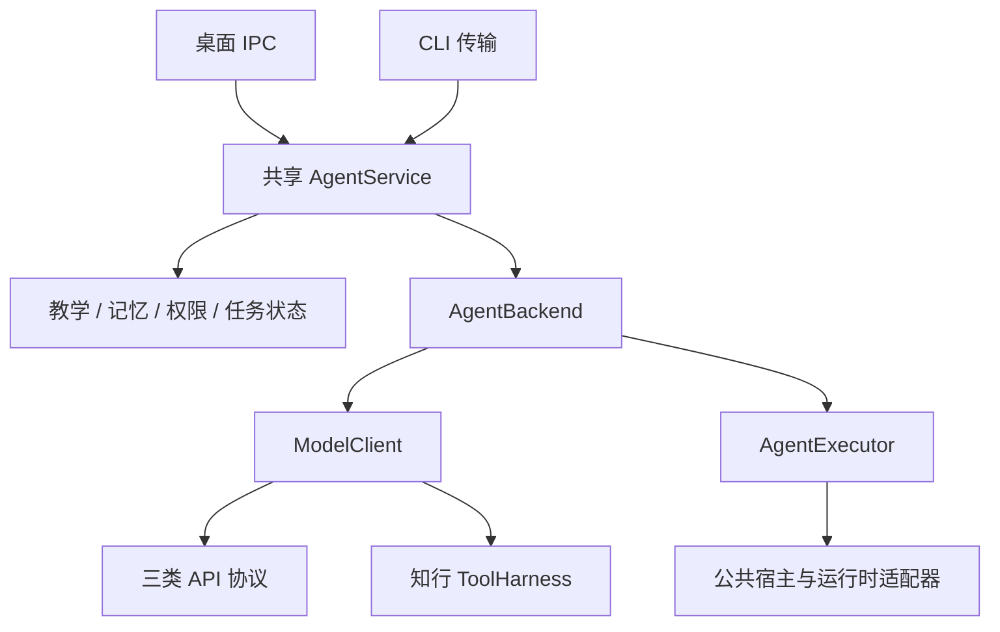
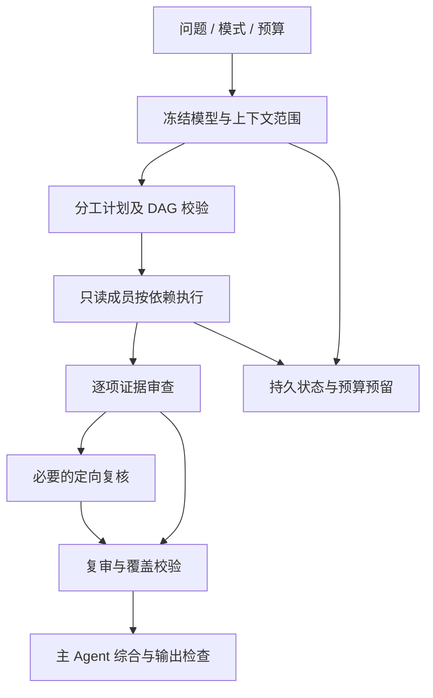

<!-- generated-by: gsd-doc-writer -->
# 知行 Agent 系统设计面试与项目表达

核对日期：2026-09-11；代码基线：60570bc。配套[60 题题库](question-bank.md)和[岗位要求](job-market.md)。这里提供六个可用于 40—60 分钟白板面试的案例；所有容量数值都明确标成面试假设，不是生产实测。

**事实边界**：知行是本地优先的教学 Agent，已有共享内核、模型与运行时适配、工具控制、记忆、团队和学习效果记录。其他厂商、新官方运行时及云化是扩展方向；没有已经运行的多租户云服务或训练平台。814 项测试和七组本地 UI 是历史验收记录；当前 CI 与入口限额差异见[项目现状](../current-status.md)，不能用历史结果覆盖新发现。

## 目录与作答方法

| 案例 | 主要考点 | 建议时长 |
| --- | --- | --- |
| [案例一：通用教学 Agent](#case-1) | 双后端抽象、配置扩展、权限、两个入口一致性 | 45 分钟 |
| [案例二：长对话与本地资料库](#case-2) | 记忆、切块、检索、版本、上下文预算 | 45 分钟 |
| [案例三：可靠的同模型 / 异模型团队](#case-3) | DAG、验收覆盖、预算、恢复、质量对照 | 60 分钟 |
| [案例四：可恢复的外部工具操作](#case-4) | 幂等、未知结果、取消、检查点、授权 | 45 分钟 |
| [案例五：回答质量与教学效果评测](#case-5) | 分层评测、统计单位、盲评、因果边界 | 60 分钟 |
| [案例六：桌面产品向服务化演进](#case-6) | IPC、密钥、事件、云化边界、容量与成本 | 60 分钟 |
| [项目口述与简历表达](#presentation) | 两分钟介绍、深入案例、可信成果 | 10 分钟 |

每题先问清用户目标、正确性要求、可接受的费用与时延，再画组件；讲完正常流程必须补一条失败流程。容量估算用于识别瓶颈，不应比真实约束更精确。最后列出验收方法与尚未实现的部分。

## 案例一：设计可接 API 与官方订阅的通用教学 Agent

### 题目与需求澄清

要求桌面与 CLI 共用教学、记忆、工具和团队策略；已有 Codex 官方订阅、DeepSeek API、Kimi API，后续按需接新厂商。用户可以切换通道，但旧任务恢复要保持原执行条件。

先确认：订阅必须有官方可用接入方式吗？是否允许资料外发？是否需要图片和写工具？切换只影响新任务还是允许中途替换？在知行中，认证与计费通道需要明确，订阅失败不静默消费 API；当前原生运行时只启用受限文本上下文任务。

**容量假设**：单机单用户，宿主同一时刻推进一个前台会话，可有有界成员并发；典型一次对话几十 KB，不要求无限长输入。窗口与输出限制应从配置和能力读取，不能把面试假设写成底层模型规格。

### 架构与关键决策

核心分界是**谁拥有执行循环**。ModelClient 返回生成与工具事件，由知行执行工具和提供续轮结果；AgentExecutor 执行外部完整任务，知行不能把它已完成的操作再执行一次。NativeRuntimeAdapter 只承担官方 CLI 的模型选择、预检与事件解码，公共宿主负责进程生命周期、取消和边界。未来 App Server 可以另实现 AgentExecutor，不强塞进 CLI 参数表。

| 选择 | 优点 | 代价 / 决策 |
| --- | --- | --- |
| 所有厂商共用一个万能客户端 | 调用点少 | 隐藏执行所有权和认证差异；不采用 |
| 每厂商复制一套 Agent | 最初开发直观 | 教学、权限、恢复容易漂移；不采用 |
| 共享内核 + 协议/运行时适配 | 业务稳定、边界清晰 | 需要契约测试；当前采用 |
| 任意用户脚本动态插件 | 扩展自由 | 引入任意代码执行与审查困难；当前不提供 |

### 正常请求时序

1. 宿主校验输入并生成 SendRequest。
2. AgentService 加载会话、权限与当前教学状态，创建当轮上下文。
3. 工厂解析连接，冻结实际模型与能力，预检所需模态和认证。
4. ModelClient 路径迭代模型与 ToolHarness；AgentExecutor 路径提交受限完整任务。
5. 统一输出检查、事件更新与持久化；UI 只展示可用公开信息。
6. 新厂商若兼容现有协议，只增配置；新协议/认证新增适配器及验证。

### 失败与恢复

认证失败保持原通道错误，不伪装切到另一模型。流截断保留部分输出并标记未完成。执行中配置改变导致模型绑定不一致时拒绝不兼容恢复。官方程序版本或隔离条件不满足时明确不可用，不能为了兼容删除安全限制。

**当前反例**：共享内核已存在，但本轮核查发现 CLI 的 8,000 字符提前拒绝与共享 20,000 字符上限不一致。这说明“抽象共用”必须由入口级测试保证；修复方向是共享输入限额与等价错误语义，再测边界前后、Unicode 和命令解析。此处为待修复问题，不是本题文档已修改代码。

### 指标、验收与演进

- 指标：任务完成率、协议错误率、绑定变化拒绝率、首正文延迟、总时间、未知用量请求数。
- 验收：目录外合成厂商通过三协议连续对话；原生假适配器通过共享执行器；空输出、流/最终不一致、取消和工具拒绝均有反例。
- 真实验收：以已有三家做固定合成探针；新厂商的契约测试不能替代真实账号验证。
- 演进：先消除入口重复政策，再按需求新增适配器；SDK/App Server 需验证会话所有权、取消和计费语义后启用。

**已实现依据**：[AgentBackend](../../src/agent-executor.ts)、[ModelClient](../../src/model.ts)、[运行时契约](../../src/native-runtime-contract.ts)、[接入架构](../provider-architecture.md)、[原生扩展测试](../../tests/native-extensibility.test.ts)、[协议测试](../../tests/provider-protocols.test.ts)。

**面试追问**：若某代理声称兼容 OpenAI 协议，但丢弃 tool_call_id，你会怎样发现？应说明真实续轮契约测试、禁止猜测工具映射，以及按连接标识能力，不按品牌推断。

## 案例二：支持长对话、资料引用与撤权的本地学习记忆系统

### 题目与规模假设

用户学习数月，有 PDF、Markdown、长对话与作答记录，希望记得旧纠正、资料可溯源，并可撤回共享权限。

**面试假设**：单主题 1,000—5,000 个资料片段，累计数千条消息；资料大小受导入政策限制。现有可选语义实现最多处理 5,000 个索引片段，采用本地向量遍历；这是当前实现边界，不是百万级向量方案。

先澄清：必须离线吗？是否允许外部嵌入？资料变化多频繁？“记住”指保留原文、检索事实还是学员画像？撤回权限要影响后续请求，还是还要删除已存数据？不能把这几项混为一谈。

### 数据与读取层次

| 层 | 保存内容 | 使用方式 | 失效 / 风险 |
| --- | --- | --- | --- |
| 原始会话 | 用户与助手消息、状态、附件关系 | 回看、恢复、摘要来源 | 大小上限、分段完整性 |
| 会话摘要 | 较早对话的衔接信息及来源范围 | 降低当轮上下文成本 | 来源变化失效；哈希不证明语义 |
| 长期记忆 | 来源明确的用户事实与纠正 | 按主题和问题检索 | 旧事实冲突、撤回 |
| 学习状态 | 画像、实际作答、教学检查点 | 给当前教学建议 | 不可把模型提议写成掌握 |
| 资料索引 | 原文片段、页码/锚点、内容/模型版本 | 词法与可选语义检索 | 更新、OCR 误差、注入 |
| 模型窗口 | 当次选中的消息、工具、证据 | 一次生成使用 | 可丢弃，不覆盖原文 |

### 读取时序与可信边界

1. 每轮读取最新权限和主题，撤权立即影响本轮上下文构建。
2. 检索相关记忆；保留来源与用户纠正顺序，只做有界摘录。
3. 词法召回与可选本地语义召回融合，限制候选数量。
4. 将原始材料与工具结果作为低于系统政策的任务数据。
5. 构建预算内窗口，保留完整工具调用/结果与当前输入；不够时明确失败。
6. 生成后检查引用定位、数值、长引语和过强结论；需要时修正或说明证据不足。

### 切块、检索与重排的取舍

小块利于精确定位，却容易缺条件；大块上下文充分，但噪声与费用更高。知行现有方案保留页码/锚点，HashEmbedding 不应描述成训练过的语义模型；词法匹配与可选 Ollama 是不同层。后续引入结构化切块或交叉编码器重排，要先用独立标注的问题集证明召回和端到端收益。

| 方案 | 适用条件 | 风险 |
| --- | --- | --- |
| 词法检索 | 本地资源有限、术语清楚 | 同义与隐式问法漏召回 |
| 本地嵌入 + 排名融合 | 需要语义召回且有本地模型 | 模型资源、版本和运行依赖 |
| 远端嵌入 / 重排（建议扩展） | 明确外发授权、收益已验证 | 资料外传、费用与可用性 |
| 全量材料塞进窗口 | 小文档临时任务 | 长文成本、噪声、窗口上限 |

### 故障与恢复

摘要任务失败时保留旧原文，不让摘要失败阻塞主对话。段文件损坏或哈希不符时报告存储错误，不猜测补回消息。嵌入模型摘要变化后不混用旧向量。资料删除后旧引用必须重新核实，不继续显示为有效依据。撤权后的新请求不复用旧 Prompt 缓存。

### 指标与渐进方案

检索单独记录必需证据召回、候选噪声和无答案拒答；生成单独记录引用支持与推导错误；长对话记录输入 token、遗漏消息、摘要覆盖、保存耗时和 UI 内存。每种数据的指标有各自分母，不能用“引用数”替代准确率。

第一步保留当前词法与有界本地语义方案，补失败集；第二步调整切块和候选预算；第三步仅在规模或质量证据要求时考虑专门索引与重排。主题规模超过当前限制时先重新评估，不取消上限直接全量扫描。

**项目依据**：[资料库](../../src/library.ts)、[语义索引](../../src/semantic-retrieval.ts)、[学习上下文](../../src/learning-context.ts)、[摘要](../../src/conversation-summary.ts)、[窗口](../../src/context-window.ts)、[分段会话测试](../../tests/segmented-conversation.test.ts)、[记忆质量测试](../../tests/memory-recall-quality.test.ts)。

**面试追问**：用户纠正“我学的是 Java，不是 JavaScript”，旧记录更多时怎么办？应优先识别来源与明确纠正，不以出现频次投票；当无法消除冲突时保留两条来源并确认，而非创造新事实。

## 案例三：让同模型与异模型团队可控、可恢复、可比较

### 题目与约束

为复杂教学问题设计可选团队：同模型多个核查成员，或 Codex 主 Agent 加 DeepSeek/Kimi 成员。目标是提高特定复杂任务的正确性，并让额外成本和延迟可见；不预设团队优于单模型。

**面试假设**：主 Agent 加两名成员，初始任务图最多四项；整题输出目标沿用当前 16,384，可由用户选择更大预算。数字是当前本地策略/场景，原生 CLI 不支持服务商硬 token 封顶，必须如实记录观察性质。

先澄清：需要快答还是交叉核验？成员是否有不同资料权限？是否允许写入？何时可以少成员交付？缺少必需成员、验收未覆盖时不能伪装全团队成功。

### 正常流程

- 任务包只传必要问题和授权资料，成员不继承全部私有历史。
- 规划包含目标、依赖、负责人和可检查验收条件；内部 JSON 格式要求不能被错误分派成用户任务。
- 成员报告声明结论、依据和不确定性，应用校验结构；成员不能声称替别人完成验收。
- 审查逐项核对，发现具体冲突再发起有界复核，不依据票数或品牌。
- 验收状态分模型审查与工具证据关联；最终答案另作完整性、引用和格式检查。

### 资源分配与失败边界

TeamBudget 在请求前持久预留额度，给审查与最终输出保留份额。对于推理/正文共享输出预算的协议，成员策略按可用预算选择自动档位；用户显式档位优先。未知消费不计零，存储失败停止新派发。

单成员失败不会抹掉其他产物；依赖失败的任务标 blocked。重启后 running 转 interrupted，恢复时检查原模型绑定、范围与配置；重试使用新 executionId，保留旧产物与尝试次数。不能每次恢复都重置整题预算。

### 方案取舍

| 方案 | 优点 | 代价 / 何时选择 |
| --- | --- | --- |
| 单模型一次回答 | 延迟与成本低 | 简单题优先基线 |
| 单模型多轮自检 | 少通信格式，易控变量 | 可能重复原偏差；作为计算投入对照 |
| 同模型分工 | 独立上下文、协议一致 | 相关错误和额外综合成本 |
| 异模型分工 | 潜在能力互补 | 档位/用量不等价，慢成员与综合冲突 |
| 任意成员互聊 | 探索灵活 | 上下文污染、循环和成本难控；当前不采用 |

### 如何证明收益

同一冻结任务分别跑单次、自检、同模型和异模型，保留失败、真实档位、token、调用数、耗时和所有阶段结果。评测分任务类型；短算术、资料核查、复杂推理不能简单汇总。加入相近预算对照，并明确跨模型 token 并非等价算力。

**现有证据**：历史四道冻结题的多组对照，异模型完成且字段正确/有解释由 3/4 到 4/4，整体从 18/20 到 20/20；不是 20 道独立题。H02 异模型约 228.6 秒，Kimi 仍接近单次上限，DeepSeek 初报错误经 Codex 定向复核纠正。这支持特定失败修复，不能支持普遍质量或速度优势，亦不能视为本轮重跑。

### 验收与后续

确定性门禁覆盖循环依赖、伪造证据、重复验收项、预算竞争、成员取消和崩溃恢复；真实评测覆盖自动档位、成员截断和复核耗时。后续优先扩大独立题与人工复核，再考虑任务难度驱动的团队启用；自动路由若上线，还需记录路由错误与降级体验。

**项目依据**：[协调器](../../src/team-coordinator.ts)、[DAG](../../src/team-task-graph.ts)、[预算](../../src/team-budget.ts)、[资源策略](../../src/team-resource-policy.ts)、[验收](../../src/team-verification.ts)、[历史实验](../evidence/team-resource-budget-20260911.md)、[团队崩溃测试](../../tests/team-crash-recovery.test.ts)。

**面试追问**：主答案正确但必需成员失败，算成功吗？分别报告最终答案正确与团队执行完整；不能把两个指标混成一个“通过”。

## 案例四：设计能在崩溃、超时后安全恢复的外部工具操作

### 题目与边界

Agent 可能调用项目工具或 MCP 外部写操作。要求中断后恢复，不重复副作用，用户能检查实际发生了什么。

**面试假设**：单任务至多几十次有界工具调用，网络可能丢失响应，进程可能在任意持久化边界退出。演示可用“创建外部工单”作为假想 MCP 工具；知行没有内置此具体业务。工具名称仅用于设计，不表示项目已接某个工单平台。

先问服务端是否支持幂等键和结果查询，以及是否可以撤销操作。没有这两个条件，客户端不应承诺 exactly-once。

### 状态与执行协议

| 状态 | 已知事实 | 后续动作 |
| --- | --- | --- |
| planned | 有合法提议，未授权或未派发 | 展示预览并校验权限 |
| ready | 输入与授权有效，可以开始 | 写入执行意图 |
| executing | 派发已开始，结果可能未知 | 等待、取消或恢复核验 |
| succeeded / failed-known | 有可信结果 | 保存回执，再交给模型续轮 |
| unknown | 可能发生了副作用 | 核实外部状态或等待明确决策 |

这是一张设计说明表，不能直接冒充代码全部状态枚举；知行检查点使用 pending.phase、next、executingUntil 和任务状态表达这些事实。

请求顺序是：校验输入 → 校验主题与风险 → 生成可审阅预览 → 获得所需授权 → 持久化派发意图 → 调用外部工具 → 持久化回执 → 推进检查点 → 模型续轮。授权与输入哈希/版本需要绑定，不能批准 A 却执行被替换的 B。

### 最危险的失败窗口

1. **派发前崩溃**：确定没有开始的调用可以重新校验后执行。
2. **请求已到服务端，客户端未收到响应**：不能判断没执行；转未知结果。
3. **已收到成功，回执未落盘即崩溃**：仍需要外部查询或幂等能力，不能凭内存推测。
4. **用户取消时写入已发生**：终止后续操作，保留真实回执，取消不是回滚。
5. **用户自报完成**：记录为 user_report、未核验；不把它标成服务端成功。
6. **恢复中权限已变**：重新绑定权限，旧授权不得扩大到新操作。

### 幂等与事务取舍

| 方案 | 可保证什么 | 不能保证什么 |
| --- | --- | --- |
| 仅本地调用 ID 去重 | 同一日志内不重复提交已确认结果 | 外部收到但日志丢失的情况 |
| 服务端幂等键 + 查询 | 相同操作重复请求可合并，能核实结果 | 服务端实现错误或过期规则需另验 |
| 自动重试所有超时 | 某些读请求更易成功 | 非幂等写可能重复副作用 |
| 人工核实未知结果 | 在无外部保证时保持诚实 | 自动化程度与响应时间 |
| 跨系统分布式事务 | 某些受控系统可增强原子性 | 任意第三方工具通常不参与 |

### 指标与验证

关注未知结果率、重复副作用数、授权与实际输入不一致数、恢复成功率、取消后新增调用数、回执保存失败数。测试应注入每个状态边界并验证外部调用次数，不只验证最终异常文字。

当前有 ToolOutcomeUnknown、TaskContinuity、MCP 恢复、执行检查点和本地认领。后续若做云端队列，必须新增带 fencing 的任务所有权、数据库事务与 outbox 等设计；这些是建议，不能称为当前实现。即使增加队列，也不能取消未知结果状态。

**项目依据**：[ToolHarness](../../src/tool-harness.ts)、[TaskContinuity](../../src/task-continuity.ts)、[执行存储](../../src/agent-execution-store.ts)、[MCP 恢复](../../src/mcp-recovery.ts)、[恢复测试](../../tests/agent-recovery-boundaries.test.ts)、[崩溃测试](../../tests/agent-crash.test.ts)。

**面试追问**：两个执行进程都认为对方死了会怎样？本地 PID 机制不适用于跨主机；需要服务端权威租约与写操作 fencing，或者明确保持单机部署边界。

## 案例五：设计能证明“回答更好”和“学得更好”的评测体系

### 题目与假设

要判断新版本、团队模式和教学方式是否值得上线。必须同时覆盖软件可靠性、模型答案质量和真实学习收益，不能用一张大表掩盖不同证据等级。

**面试设计假设**：先构建 100 道独立任务的开发评测与另行封存的保留集；每类样本数量根据实际失败分布调整。这个数是试验起点，不是统计充分性的承诺。学习者试验样本数需要由目标效应、基线方差、分组与流失率另做设计，不能凭经验写“30 人就够”。

### 三层证据体系

| 层 | 回答的问题 | 例子 | 不可推出的结论 |
| --- | --- | --- | --- |
| 工程门禁 | 系统是否遵守契约 | schema、权限、恢复、UI、预算 | 模型事实一定正确 |
| 真实模型评测 | 在指定任务与配置上输出怎样 | 完成、答案、解释、证据、时延 | 学习者真正掌握 |
| 学习效果试验 | 用户是否理解、迁移、保持 | 前测、后测、三天延迟测、人工解释复核 | 未控制条件下的因果效果 |

现有工程记录是 153 文件 / 814 项测试通过与七组本地 UI 通过。新发现 CI 团队 UI 失败仍需复现，不能被历史绿色覆盖。现有 20 次模型实验来自更早候选包，按题和组拆分统计，不与工程计数相加。

### 样本与评分设计

每条记录保存：题目 ID/版本、资料版本、模型与连接身份、档位、代码/包来源、预算、运行时间、原始轨迹、失败原因、评分器版本。敏感内容按授权范围保留，公开报告不放凭据或私人学习材料。

评分层次如下：

1. 完成性：是否完整结束，有无必需成员缺失或截断。
2. 确定答案：可执行测试、精确字段或参考解检查。
3. 推理与解释：步骤是否成立、边界条件是否遗漏。
4. 证据：定位、支持关系、资料版本和引用。
5. 体验：是否遵守用户希望直接回答或只给提示。
6. 资源：总时间、首正文、调用数、输入/输出及未知消费。

### 公平性与统计单位

单 Agent 一次、自检多轮、同模型团队、异模型团队都应保留，并至少提供默认体验与资源相近的对照。无法把所有条件都等价时报告差异，不宣称绝对公平。

同题多次运行用于观察随机波动，不能把它当成多个独立知识问题。对多种模式的比较应保留同题配对关系；若计算区间或重采样，优先以题目为单位，避免把相关运行当作独立样本。不要因发现某组失败而从分母中移除；报告无响应与评分失败的不同原因。

### 学习试验与失败处理

知行已提供前测 → 学习 → 后测 → 等待 → 延迟测，且区分 prompt_only 与 full_product。真实因果试验仍应另行设计参与者分配、题卷等价性、学习时长、独立作答验证、退出规则和隐私说明。

重复学习、辅助作答、模型条件变化和构建来源不明的数据要保留并标明纳入规则；延迟测未回来是流失，不能当零分或自动排除而不报告。多个导出文件合并需去重，不把备份算新参与者。

### 方案取舍与上线门槛

确定性评分便于复现但覆盖解释有限；LLM 评审可扩展但有偏差；人类盲评可信度也依赖 rubric 与校准。先用可核验字段作硬门槛，再用解释复核识别灰区；模型不能评审自己后就宣布教学有效。

上线门槛应预先定义：不可接受的权限/副作用错误为零容忍；质量与时延阈值根据产品目标确定，不在看到结果后修改。扩大真实样本和独立人工复核是下一步；不需要为做评测先搭建复杂云平台。

**项目依据**：[团队评测](../../src/team-evaluation.ts)、[质量用例](../../src/team-quality-cases.ts)、[学习效果](../../src/learning-outcomes.ts)、[导出合并](../../src/outcome-report.ts)、[盲评](../../src/outcome-blind-review.ts)、[效果协议](../teaching-study-protocol.md)、[历史实验](../evidence/team-resource-budget-20260911.md)。

**面试追问**：为什么“有解释”不能作唯一质量门槛？历史 20 次均有解释，但仍存在两处教学措辞问题；应能展示具体例子并说明评分如何补充。

## 案例六：把可靠桌面 Agent 演进为可运营服务

### 题目与现状

面试官要求“支持一万名用户”，先确认是一万次安装、一万日活还是一万同时执行的任务。当前知行是本地优先桌面与 CLI 产品，不能按远端服务已有规模回答。

**容量假设，仅用于面试**：1,000 日活用户，每人每日 30 个任务，共 30,000 任务/日；平均约 0.35 任务/秒，假设峰值是全天均值的 20 倍，约 7 任务/秒；若平均占用 30 秒，约需 210 个同时在途任务。这里是粗略在途量估计，不代表 GPU 并发、供应商额度或知行已测吞吐；团队内部多次调用还会放大请求量。真实预算应依据目标市场流量和单任务测量修订。

### 先分清两条演进路线

| 路线 | 优势 | 代价 |
| --- | --- | --- |
| 继续本地执行，改进发布与诊断 | 资料少外发、复用本地授权、服务器成本低 | 平台差异、升级和现场诊断难 |
| 云端任务服务 | 集中调度、统一观测、可跨设备 | 多租户隔离、认证、费用、数据治理与运维 |
| 混合模式 | 保留本地文件/工具，云端处理授权任务 | 双端协议、断线恢复和权限同步更复杂 |

用户主要需求若仍是本机学习，应先做好签名、更新、备份和诊断。云化不能仅把 Electron 主进程搬到服务器；官方个人订阅的接入与服务端多用户转售不是同一个授权场景，必须依据实际官方条款和产品需求另行确认，不在此文档作兼容承诺。

### 桌面当前设计与必须守住的边界

渲染端无 Node 权限，通过受限 preload 调主进程；主进程验证发送方和 schema，密钥只在安全存储与调用边界使用。UI 用事件增量更新，不靠每 token 全量拉会话。跨平台安全存储和正式发布需各自验收，不能从一台 macOS 开发机推论所有安装环境。

当前 CI 团队 UI 发送按钮 disabled 超时，是本轮发现的待复现失败。正确排查先保存 UI 状态、日志、运行环境与构建信息，再定位初始化、设置状态、事件顺序或测试等待是否异常；不能先把 timeout 增大就宣布解决。

### 若确实服务化，建议的新增组件

以下为**未来方案**，不是当前目录的既有实现：

- 身份与租户边界：服务端认证、租户 ID、授权的资料/工具范围与审计。
- 任务提交与持久状态：幂等提交、任务 ID、状态版本、可恢复事件流。
- 工作队列与执行 worker：租约、fencing、有界重试、取消与资源隔离。
- 配额和成本控制：用户、租户、服务商三级额度；未知费用保守处理。
- 数据层：适合多租户访问的持久库和对象存储；资料与证据版本保持一致。
- 可观测性：脱敏 trace、队列等待、模型调用、工具耗时、失败与质量反馈。
- 发布与恢复：灰度版本、迁移兼容、回滚和备份恢复演练。

不得直接让远程 worker 复用用户本机路径或本机 PID 租约。API Key 若由用户提供，需要重新设计服务端存储、删除、权限及日志政策；若本地代执行，则清楚定义不在线时任务怎样等待。

### 失败与恢复

浏览器/桌面断线只影响订阅，任务是否继续由显式产品策略决定。事件带任务 ID 和序号，重连可读取快照并恢复增量；重复事件去重，旧快照不能覆盖新文本。服务商限流采用预算内排队与有界重试；写工具未知结果仍保留，不因 worker 换机自动重放。

迁移分阶段：先抽清宿主依赖并补两端输入一致性测试；再做单租户远程执行原型与合成负载；最后在真实用户需求成立后加入多租户、队列与云端数据治理。每一步都应有回退到现有本地模式的路径。

### 指标与验收

- 桌面：启动可用时间、首次可发送时间、长会话内存、IPC 错误、取消响应、升级与恢复成功率。
- 服务化：峰值任务排队时间、同时在途数、端到端 p95/p99、服务商限流、每任务成本、租户隔离故障、未知外部结果率。
- 质量：版本和流量变化后相同任务集的完成与正确性，不能只看服务器吞吐。
- 发布：真实安装包测试与 CI 测试分别保留；打包成功不代表运行成功，历史测试通过不替代当前失败修复。

**项目依据**：[Electron 主进程](../../desktop/electron/main.ts)、[IPC 契约](../../desktop/core/contracts.ts)、[密钥存储](../../desktop/electron/secrets.ts)、[delta 批处理](../../desktop/renderer/delta-batcher.ts)、[本地执行认领](../../src/agent-execution-store.ts)、[桌面说明](../../desktop/README.md)、[当前状态](../current-status.md)。

**面试追问**：哪些模块能直接复用？业务政策、模型协议和相当部分评测可以；本地文件、密钥、PID 认领、Electron IPC、任务配额和安全隔离需要重新设计或替换宿主实现。

## 项目口述、深入案例与可信简历表达

### 两分钟介绍模板

> 知行是一个本地优先的教学 Agent，目标是帮助用户基于资料理解知识、完成实践，并记录能否独立作答和延迟保持。桌面与 CLI 通过共享 AgentService 使用同一套教学、记忆、权限和执行策略；当前也发现了输入限额的宿主差异，需要补齐边界测试。
>
> 架构上把逐轮模型调用和完整官方 Agent 运行时分为 ModelClient、AgentExecutor 两类，API 兼容厂商通过连接配置扩展，新协议或认证通过独立适配器扩展。工具执行有 schema、权限、预算、取消和持久检查点；团队使用有界分工、依赖图与逐项证据审查。
>
> 一个代表性问题是异模型成员把输出额度耗在推理上，报告未完成。我会解释如何从结束原因、真实用量和阶段轨迹定位，再用自动资源策略与审查回路处理。历史有限回归改善了该失败，但更慢的复杂任务和个别解释问题仍保留，不能说团队普遍优于单模型。
>
> 当前已经有工程门禁、实际包验证和三家真实接入记录；教学效果仍需要真实学习者和独立评审。我的贡献应按本人实际参与填写，重点是能解释这些决策、验证和边界。

本模板是叙述结构，使用前应删去自己未参与或不能解释的部分。不要把“我会解释”机械背成“我独立完成全部模块”。

### 八分钟深入案例：预算截断修复

| 段落 | 应讲内容 | 可展示依据 |
| --- | --- | --- |
| 问题 | 成员没有完整报告，主任务不能验收 | 旧失败记录和结束原因 |
| 诊断 | 推理/正文共享预算；网络拒绝是另一类故障 | 用量、实际档位、代理失败分开 |
| 方案 | 按能力决定自动档位与上限，预留审查和最终额度 | team-resource-policy / team-budget |
| 保持不变量 | 默认整题目标未暗增，显式设置优先，恢复固定旧策略 | 策略与迁移测试 |
| 结果 | 有限冻结对照改善，复杂题约 228.6 秒且需复核纠错 | 真实记录与解释复核 |
| 反思 | 不是“降档更聪明”，更多独立题与人工评审仍需要 | 实验限制与后续设计 |

这一案例可同时回答模型调用、错误诊断、预算并发、团队架构、实验公平性和结果表达。

### 可以使用的简历表述

以下均是可编辑模板，**“设计/实现/负责”应替换为本人真实职责**：

- “参与构建 TypeScript / Electron 本地教学 Agent，将模型逐轮调用与官方 Agent 执行分层，统一桌面和 CLI 的业务内核，支持三类 API 协议及按需运行时扩展。”
- “围绕工具调用设计/验证输入契约、最小权限、取消、检查点和未知外部结果恢复，覆盖崩溃及重复执行边界。”
- “实现/审查同模型与异模型团队的任务依赖、资源预留和逐项证据核查；在有限冻结回归中修复成员预算截断，保留失败样本与阶段轨迹。”
- “建立分层验证：工程门禁、实际包 UI、真实模型对照与学习前后测/延迟测；明确软件正确性、答案质量和学习因果效果的区别。”

若写数字，附口径：“2026-09-11 本地工程验收记录为 814 项测试；历史模型对照为四道题、多组共 20 次运行。”当前 CI 仍有团队 UI 失败，应说明待复现，不能写“全部自动化持续稳定通过”。

### 不应使用的表述

| 不准确说法 | 更诚实的替代 |
| --- | --- |
| 已接入十家真实订阅与 API | 调研十家并提供通用扩展，实际验证 Codex、DeepSeek、Kimi |
| 准确率提升 10%，团队超过最强单模型 | 有限冻结回归改善特定失败，未证明总体优势 |
| 实现全场景 exactly-once | 持久化执行边界并保留未知结果，依赖外部幂等与核验 |
| 已证明学习效果更好 | 已具备前测、后测和延迟测流程，真实因果验证仍需开展 |
| 生产级分布式多租户平台 | 当前本地优先；云化是设计演进题 |
| API Key 全部只在钥匙串 | 桌面加密安全存储及旧钥匙串兼容路径，按实际连接与平台说明 |
| 两个入口所有行为已完全一致 | 共享政策核心，但已发现 8,000/20,000 输入上限差异待修 |

### 自测评分卡

每项按 0—2 分自评：能否说明真实用户问题；能否画出执行所有权；能否定位关键源码；能否讲一个真实失败；能否解释取消和未知结果；能否定义评测分母；能否比较替代方案；能否诚实列出未完成项。满分只是准备完整度，不是能力认证。低分项回到对应题库与测试，实际跑读代码后再练口述。
