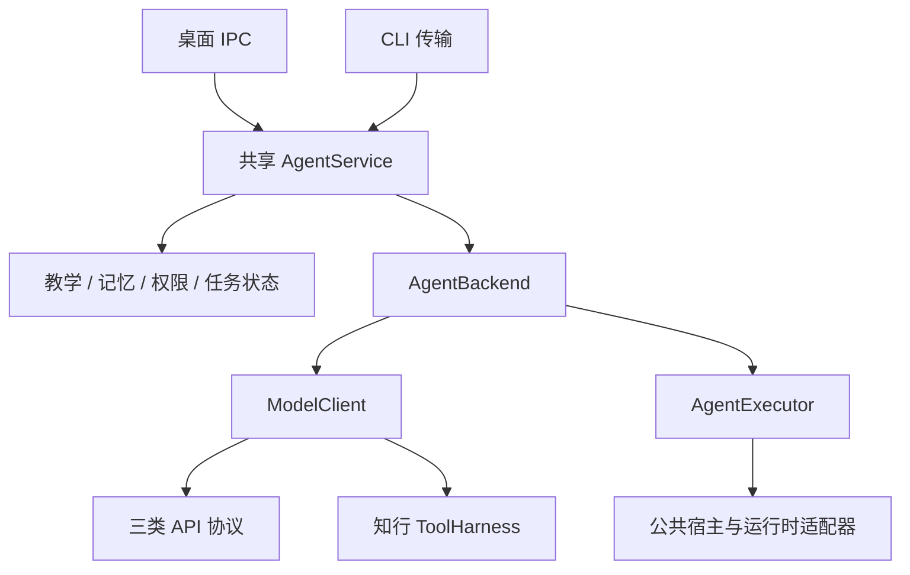
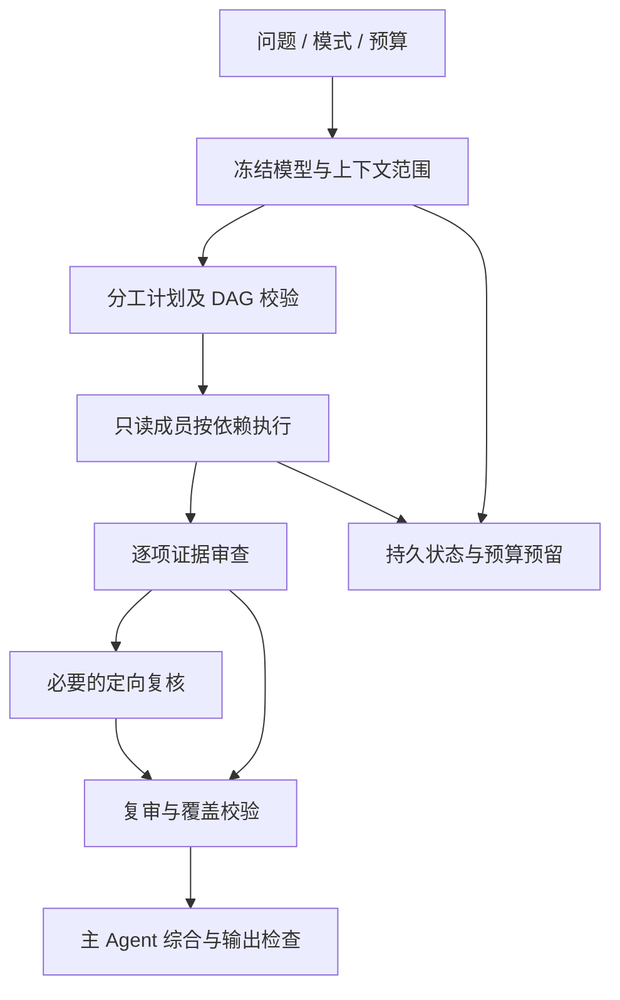

<!-- generated-by: gsd-doc-writer -->
# 知行 Agent 系统设计面试与项目表达

核对日期：2026-09-14；仓库基线：`485b358`，应用架构基线：`60570bc`。配套[60 题题库](question-bank.md)和[岗位要求](job-market.md)。这里提供六个可用于 40—60 分钟白板面试的案例；所有容量数值都明确标成面试假设，不是生产实测。

**事实边界**：知行是本地优先的教学 Agent，已有共享内核、模型与运行时适配、工具控制、记忆、团队和学习效果记录。其他厂商、新官方运行时及云化是扩展方向；没有已经运行的多租户云服务或训练平台。`485b358` 修复了 #44 团队 UI 的按钮名称等待竞态，远端 verify #46 已通过；814 项测试和七组 UI 的记录各有验收日期，见[项目现状](../current-status.md)与[修复证据](../evidence/ci-44-team-ui-20260911.md)。本次仅核对文档，没有重跑 UI、真实模型或安装新 App；独立 userData 与凭据边界未变，CLI/桌面输入限额差异仍待修复。

## 目录与作答方法

| 案例 | 主要考点 | 建议时长 |
| --- | --- | --- |
| [案例一：通用教学 Agent](#case-1) | 双后端抽象、配置扩展、权限、两个入口一致性 | 45 分钟 |
| [案例二：长对话与本地资料库](#case-2) | 记忆、切块、检索、版本、上下文预算 | 45 分钟 |
| [案例三：可靠的同模型 / 异模型团队](#case-3) | DAG、验收覆盖、预算、恢复、质量对照 | 60 分钟 |
| [案例四：可恢复的外部工具操作](#case-4) | 幂等、未知结果、取消、检查点、授权 | 45 分钟 |
| [案例五：回答质量与教学效果评测](#case-5) | 分层评测、统计单位、盲评、因果边界 | 60 分钟 |
| [案例六：桌面产品向服务化演进](#case-6) | IPC、密钥、事件、云化边界、容量与成本 | 60 分钟 |
| [项目口述与简历表达](#presentation) | 两分钟介绍、深入案例、可信成果 | 10 分钟 |

每题先问清用户目标、正确性要求、可接受的费用与时延，再画组件；讲完正常流程必须补一条失败流程。容量估算用于识别瓶颈，不应比真实约束更精确。最后列出验收方法与尚未实现的部分。

## 案例一：设计可接 API 与官方订阅的通用教学 Agent

### 60—90 秒口述回答

> 我会先区分谁负责执行循环：API 模型返回文本或工具提议，知行负责校验、执行工具和续轮；官方 Agent 则通过独立执行器处理有界任务。桌面和 CLI 都进入共享 AgentService，教学、记忆和权限在这里统一，接新厂商优先配置已有协议，新运行时才增加适配器。每个任务保存实际模型与连接身份，恢复时重新核对，避免旧任务悄悄换模型或把订阅失败转成付费 API。工具参数错误应作为明确结果返回模型，截断或空结果不能算成功。这个设计增加了契约测试成本，但避免复制业务策略。知行已采用这套分层，不过原生任务目前只开放受限文本能力，CLI 还提前拒绝超过 8,000 字符的输入，而共享及桌面上限为 20,000；所以我会分别验证架构共用和入口行为一致。

### 题目与需求澄清

要求桌面与 CLI 共用教学、记忆、工具和团队策略；已有 Codex 官方订阅、DeepSeek API、Kimi API，后续按需接新厂商。用户可以切换通道，但旧任务恢复要保持原执行条件。

先确认：订阅必须有官方可用接入方式吗？是否允许资料外发？是否需要图片和写工具？切换只影响新任务还是允许中途替换？在知行中，认证与计费通道需要明确，订阅失败不静默消费 API；当前原生运行时只启用受限文本上下文任务。

**容量假设**：单机单用户，宿主同一时刻推进一个前台会话，可有有界成员并发；典型一次对话几十 KB，不要求无限长输入。窗口与输出限制应从配置和能力读取，不能把面试假设写成底层模型规格。

### 架构与关键决策

核心分界是**谁拥有执行循环**。ModelClient 返回生成与工具事件，由知行执行工具和提供续轮结果；AgentExecutor 执行外部完整任务，知行不能把它已完成的操作再执行一次。NativeRuntimeAdapter 只承担官方 CLI 的模型选择、预检与事件解码，公共宿主负责进程生命周期、取消和边界。未来 App Server 可以另实现 AgentExecutor，不强塞进 CLI 参数表。

| 选择 | 优点 | 代价 / 决策 |
| --- | --- | --- |
| 所有厂商共用一个万能客户端 | 调用点少 | 隐藏执行所有权和认证差异；不采用 |
| 每厂商复制一套 Agent | 最初开发直观 | 教学、权限、恢复容易漂移；不采用 |
| 共享内核 + 协议/运行时适配 | 业务稳定、边界清晰 | 需要契约测试；当前采用 |
| 任意用户脚本动态插件 | 扩展自由 | 引入任意代码执行与审查困难；当前不提供 |

### 正常请求时序

1. 宿主校验输入并生成 SendRequest。
2. AgentService 加载会话、权限与当前教学状态，创建当轮上下文。
3. 工厂解析连接，冻结实际模型与能力，预检所需模态和认证。
4. ModelClient 路径迭代模型与 ToolHarness；AgentExecutor 路径提交受限完整任务。
5. 统一输出检查、事件更新与持久化；UI 只展示可用公开信息。
6. 新厂商若兼容现有协议，只增配置；新协议/认证新增适配器及验证。

### 失败与恢复

认证失败保持原通道错误，不伪装切到另一模型。流截断保留部分输出并标记未完成。执行中配置改变导致模型绑定不一致时拒绝不兼容恢复。官方程序版本或隔离条件不满足时明确不可用，不能为了兼容删除安全限制。

**当前反例**：共享内核已存在，但 CLI 的 8,000 字符提前拒绝与共享 20,000 字符上限仍不一致。这说明“抽象共用”必须由入口级测试保证；修复方向是共享输入限额与等价错误语义，再测边界前后、Unicode 和命令解析。此处为待修复问题，不是本题文档已修改代码。

### 指标、验收与演进

- 指标：任务完成率、协议错误率、绑定变化拒绝率、首正文延迟、总时间、未知用量请求数。
- 验收：目录外合成厂商通过三协议连续对话；原生假适配器通过共享执行器；空输出、流/最终不一致、取消和工具拒绝均有反例。
- 真实验收：以已有三家做固定合成探针；新厂商的契约测试不能替代真实账号验证。
- 演进：先消除入口重复政策，再按需求新增适配器；SDK/App Server 需验证会话所有权、取消和计费语义后启用。

**知行当前如何实现**

`AgentBackend` 是 `ModelClient | AgentExecutor` 的联合类型，即调用方必须识别自己拿到哪一种能力。`runAssistantTask()` 在共享 Runtime 中分流：可续轮客户端使用 ToolHarness，原生执行器走 `executeAgent()`，后者要求非空、未超长的完成结果，并保留 `verification: "unverified"`。这使“程序执行完了”和“答案已验证”保持不同含义。原生 adapter 接在公共宿主下，不能通过配置任意脚本来扩展执行权限。

`bindAgentModel()` 尽可能冻结客户端，并核对 provider、model、connection 与 reasoning；团队恢复沿用保存的绑定。三协议测试验证工具标识和必要的协议上下文，合成新原生 adapter 测试验证公共执行器可复用。它们证明接入契约，不证明所有模板厂商都有真实账号验收。入口层仍保留上述长度差异，需要另行修复。

**源码与测试索引**：[执行器与结果契约](../../src/agent-executor.ts)、[共享任务分流](../../src/assistant-runtime.ts)、[模型绑定](../../src/agent-model-binding.ts)、[运行时契约](../../src/native-runtime-contract.ts)、[接入架构](../provider-architecture.md)、[原生扩展测试](../../tests/native-extensibility.test.ts)、[协议测试](../../tests/provider-protocols.test.ts)、[工具续轮测试](../../tests/provider-tool-contract.test.ts)。

**面试追问**

1. 代理声称兼容 OpenAI 协议，却丢弃 `tool_call_id`，如何发现和处理？

   **追问答案**：用同一真实连接完成“提出两个工具调用 → 返回不同结果 → 再次生成”的续轮探针，检查每个结果是否对应原调用，而不是只测一句聊天。缺失、重复或错配标识应报协议错误，不能按数组位置猜测后继续执行。知行已有三协议及截断工具批次的合成反例；接新代理仍需真实连接验证。代价是部分宣称兼容的连接会被拒绝，但可避免把查到的资料或写入结果归给错误操作。索引：[协议编解码](../../src/protocol-codecs.ts)、[工具续轮测试](../../tests/provider-tool-contract.test.ts)。

2. 用户换了默认模型，旧任务恢复是否也该换？

   **追问答案**：默认设置可以影响新任务；旧任务要保持已保存的具体模型、连接和档位，否则既有报告、消费和审查条件就变了。知行恢复时对比绑定，不兼容便拒绝继续，不静默改通道。用户确实想换模型时应明确开始新的任务或重跑，而不是把不同条件拼成一次实验。这个选择牺牲一些自动恢复便利，换取可追溯性。索引：[绑定比较](../../src/agent-model-binding.ts)、[恢复策略测试](../../tests/team-resource-policy.test.ts)。

3. 都调用 AgentService，为什么两个入口仍可能不同？

   **追问答案**：共享内核只能统一到达它的请求，宿主提前拦截仍会造成差异。例如一条 9,000 字符消息在 CLI 的 `execute()` 被拒绝，却未超过共享 schema 的 20,000 上限；这不是内核截断。修复应去掉重复政策、共享限额，并测试同一输入在两端的接受与错误语义。架构依赖测试能防止前端自建 prompt，不能替代输入边界测试。索引：[CLI 提前检查](../../src/cli.ts)、[共享限额](../../src/input-limits.ts)、[入口架构测试](../../tests/agent-architecture-boundary.test.ts)。

## 案例二：支持长对话、资料引用与撤权的本地学习记忆系统

### 60—90 秒口述回答

> 我会把原始消息、会话摘要、长期记忆、学习状态和资料索引分开保存，模型窗口只是本轮可丢弃的读取视图。每轮先核对授权，再按主题检索并保留来源；窗口不足就移除完整旧轮次，不能拆掉工具调用与结果，也不能删除本地原文。知行采用词法检索加可选本地语义检索，语义索引用模型版本和片段哈希防止旧向量误用，规模上限是 5,000 个片段。用户撤权后，新请求停止注入这些学习资料，但这不等于删除数据或收回已发出的内容。旧纠正不能按出现次数投票，摘要也不能因为哈希一致就视为准确。我的验证会分别检查撤权、召回、引用支持和窗口遗漏，再决定是否值得增加重排模型；目前不需要把单机系统描述成百万级向量平台。

### 题目与规模假设

用户学习数月，有 PDF、Markdown、长对话与作答记录，希望记得旧纠正、资料可溯源，并可撤回共享权限。

**面试假设**：单主题 1,000—5,000 个资料片段，累计数千条消息；资料大小受导入政策限制。现有可选语义实现最多处理 5,000 个索引片段，采用本地向量遍历；这是当前实现边界，不是百万级向量方案。

先澄清：必须离线吗？是否允许外部嵌入？资料变化多频繁？“记住”指保留原文、检索事实还是学员画像？撤回权限要影响后续请求，还是还要删除已存数据？不能把这几项混为一谈。

### 数据与读取层次

| 层 | 保存内容 | 使用方式 | 失效 / 风险 |
| --- | --- | --- | --- |
| 原始会话 | 用户与助手消息、状态、附件关系 | 回看、恢复、摘要来源 | 大小上限、分段完整性 |
| 会话摘要 | 较早对话的衔接信息及来源范围 | 降低当轮上下文成本 | 来源变化失效；哈希不证明语义 |
| 长期记忆 | 来源明确的用户事实与纠正 | 按主题和问题检索 | 旧事实冲突、撤回 |
| 学习状态 | 画像、实际作答、教学检查点 | 给当前教学建议 | 不可把模型提议写成掌握 |
| 资料索引 | 原文片段、页码/锚点、内容/模型版本 | 词法与可选语义检索 | 更新、OCR 误差、注入 |
| 模型窗口 | 当次选中的消息、工具、证据 | 一次生成使用 | 可丢弃，不覆盖原文 |

### 读取时序与可信边界

1. 每轮读取最新权限和主题，撤权立即影响本轮上下文构建。
2. 检索相关记忆；保留来源与用户纠正顺序，只做有界摘录。
3. 词法召回与可选本地语义召回融合，限制候选数量。
4. 将原始材料与工具结果作为低于系统政策的任务数据。
5. 构建预算内窗口，保留完整工具调用/结果与当前输入；不够时明确失败。
6. 生成后检查引用定位、数值、长引语和过强结论；需要时修正或说明证据不足。

### 切块、检索与重排的取舍

小块利于精确定位，却容易缺条件；大块上下文充分，但噪声与费用更高。知行现有方案保留页码/锚点，HashEmbedding 不应描述成训练过的语义模型；词法匹配与可选 Ollama 是不同层。后续引入结构化切块或交叉编码器重排，要先用独立标注的问题集证明召回和端到端收益。

| 方案 | 适用条件 | 风险 |
| --- | --- | --- |
| 词法检索 | 本地资源有限、术语清楚 | 同义与隐式问法漏召回 |
| 本地嵌入 + 排名融合 | 需要语义召回且有本地模型 | 模型资源、版本和运行依赖 |
| 远端嵌入 / 重排（建议扩展） | 明确外发授权、收益已验证 | 资料外传、费用与可用性 |
| 全量材料塞进窗口 | 小文档临时任务 | 长文成本、噪声、窗口上限 |

### 故障与恢复

摘要任务失败时保留旧原文，不让摘要失败阻塞主对话。段文件损坏或哈希不符时报告存储错误，不猜测补回消息。嵌入模型摘要变化后不混用旧向量。资料删除后旧引用必须重新核实，不继续显示为有效依据。撤权后的新请求不复用旧 Prompt 缓存。

### 指标与渐进方案

检索单独记录必需证据召回、候选噪声和无答案拒答；生成单独记录引用支持与推导错误；长对话记录输入 token、遗漏消息、摘要覆盖、保存耗时和 UI 内存。每种数据的指标有各自分母，不能用“引用数”替代准确率。

第一步保留当前词法与有界本地语义方案，补失败集；第二步调整切块和候选预算；第三步仅在规模或质量证据要求时考虑专门索引与重排。主题规模超过当前限制时先重新评估，不取消上限直接全量扫描。

**知行当前如何实现**

共享任务通过 `LearningApplication.context()` 按本轮授权读取上下文。`LearningContextBuilder.snapshot()` 重新加载画像和教学检查点，优先查相关记忆，无匹配时使用近期回退，最多选三条并保留 `sourceRef`。资料有词法召回和可选 Ollama 语义召回；`SemanticIndex` 只使用主题、嵌入模型身份和当前内容哈希都匹配的向量，再由 `fuseEvidence()` 按候选排名融合。排名融合指合并两个检索列表的位次，不是训练一个新的评分模型。

`modelContextWindow()` 保留系统信息、首末用户消息、最近助手消息和未完成工具调用，按完整旧轮次缩减模型视图，保留不了必要内容时明确报限额错误。分段会话仍存原文；摘要覆盖范围用来源哈希校验，源消息编辑后失效。这套实现可追溯且有界，但 token 只是规划估计，哈希仅验证内容未变；撤权也不能抹掉此前模型已收到的信息或自动清空会话历史。

**源码与测试索引**：[共享上下文入口](../../src/learning-application.ts)、[资料库](../../src/library.ts)、[语义索引](../../src/semantic-retrieval.ts)、[学习上下文](../../src/learning-context.ts)、[摘要](../../src/conversation-summary.ts)、[窗口](../../src/context-window.ts)、[分段会话测试](../../tests/segmented-conversation.test.ts)、[记忆质量测试](../../tests/memory-recall-quality.test.ts)、[撤权测试](../../tests/unified-learning-context.test.ts)、[检索版本测试](../../tests/retrieval-quality.test.ts)。

**面试追问**

1. 用户纠正“我学的是 Java，不是 JavaScript”，旧记录更多时怎么办？

   **追问答案**：优先考虑明确的用户纠正、来源和时间，不让重复旧记录通过数量获胜。知行已有测试证明同等相关度的冲突纠正按新记录优先且保留来源；这不等于实现了任意自然语言冲突消解。若两条记录语境不同，应说明歧义并确认，例如区分“工作使用 JavaScript”和“本次课程学习 Java”。保留来源有解释成本，却比自动覆盖或编造统一事实可靠。索引：[记忆召回测试](../../tests/memory-recall-quality.test.ts)、[上下文选择](../../src/learning-context.ts)。

2. 摘要来源哈希一致，是否可以放心丢掉原文？

   **追问答案**：不可以。哈希像内容指纹，只能说明摘要对应的源消息没有被修改，不能证明摘要没漏掉否定词或纠正条件。知行保留分段原文，来源变化使摘要覆盖失效，后续摘要失败也保留此前有效覆盖。这样恢复和复核仍有原始依据；代价是存储管理更复杂，不能靠摘要无限缩小持久数据。索引：[来源校验](../../src/conversation-summary.ts)、[摘要覆盖测试](../../tests/summary-coverage.test.ts)、[分段原文测试](../../tests/segmented-conversation.test.ts)。

3. 撤权与删除有什么区别，语义服务停了会怎样？

   **追问答案**：撤权改变后续可注入的学习上下文，删除改变本地存储，二者必须由不同操作表达。知行每轮重读学习上下文，撤权测试要求资料证据为空；既有聊天文本仍可能含先前引用，不能承诺外发内容已被收回。语义服务不可用或没有有效向量时可退回词法检索，并显示回退原因，准确性仍需单独评测。收益是本地学习可继续，代价是同义问法可能漏召回。索引：[上下文与回退](../../src/learning-application.ts)、[撤权测试](../../tests/unified-learning-context.test.ts)、[检索测试](../../tests/retrieval-quality.test.ts)。

## 案例三：让同模型与异模型团队可控、可恢复、可比较

### 60—90 秒口述回答

> 我会先把单 Agent 设为基线，只在任务确实需要独立核查时启用团队。知行先固定成员模型和授权范围，再生成最多四项的依赖图；依赖图就是哪些任务必须等哪些结果，必须无循环。成员只读、只拿有界任务包，审查者逐项核对验收条件，发现具体矛盾再定向复核，主 Agent 最后综合。每次模型请求先持久预留预算，留出审查和最终回答份额；崩溃后保留已完成报告与未知消费，不自动重跑全部成员。必需成员失败，即使主答案碰巧正确也要报告团队未完整完成。历史异模型截断经过资源策略和复核回路修复，四道冻结题的相关组从 3/4 到 4/4，但复杂题耗时 228.6 秒，仍有初答错误。因此我能证明特定故障改善，不能承诺团队普遍更准或更快。

### 题目与约束

为复杂教学问题设计可选团队：同模型多个核查成员，或 Codex 主 Agent 加 DeepSeek/Kimi 成员。目标是提高特定复杂任务的正确性，并让额外成本和延迟可见；不预设团队优于单模型。

**面试假设**：主 Agent 加两名成员，初始任务图最多四项；整题输出目标沿用当前 16,384，可由用户选择更大预算。数字是当前本地策略/场景，原生 CLI 不支持服务商硬 token 封顶，必须如实记录观察性质。

先澄清：需要快答还是交叉核验？成员是否有不同资料权限？是否允许写入？何时可以少成员交付？缺少必需成员、验收未覆盖时不能伪装全团队成功。

### 正常流程

- 任务包只传必要问题和授权资料，成员不继承全部私有历史。
- 规划包含目标、依赖、负责人和可检查验收条件；内部 JSON 格式要求不能被错误分派成用户任务。
- 成员报告声明结论、依据和不确定性，应用校验结构；成员不能声称替别人完成验收。
- 审查逐项核对，发现具体冲突再发起有界复核，不依据票数或品牌。
- 验收状态分模型审查与工具证据关联；最终答案另作完整性、引用和格式检查。

### 资源分配与失败边界

TeamBudget 在请求前持久预留额度，给审查与最终输出保留份额。对于推理/正文共享输出预算的协议，成员策略按可用预算选择自动档位；用户显式档位优先。未知消费不计零，存储失败停止新派发。

单成员失败不会抹掉其他产物；依赖失败的任务标 blocked。重启后 running 转 interrupted，恢复时检查原模型绑定、范围与配置；重试使用新 executionId，保留旧产物与尝试次数。不能每次恢复都重置整题预算。

### 方案取舍

| 方案 | 优点 | 代价 / 何时选择 |
| --- | --- | --- |
| 单模型一次回答 | 延迟与成本低 | 简单题优先基线 |
| 单模型多轮自检 | 少通信格式，易控变量 | 可能重复原偏差；作为计算投入对照 |
| 同模型分工 | 独立上下文、协议一致 | 相关错误和额外综合成本 |
| 异模型分工 | 潜在能力互补 | 档位/用量不等价，慢成员与综合冲突 |
| 任意成员互聊 | 探索灵活 | 上下文污染、循环和成本难控；当前不采用 |

### 如何证明收益

同一冻结任务分别跑单次、自检、同模型和异模型，保留失败、真实档位、token、调用数、耗时和所有阶段结果。评测分任务类型；短算术、资料核查、复杂推理不能简单汇总。加入相近预算对照，并明确跨模型 token 并非等价算力。

**现有证据**：历史四道冻结题的多组对照，异模型完成且字段正确/有解释由 3/4 到 4/4，整体从 18/20 到 20/20；不是 20 道独立题。H02 异模型约 228.6 秒，Kimi 仍接近单次上限，DeepSeek 初报错误经 Codex 定向复核纠正。这支持特定失败修复，不能支持普遍质量或速度优势，亦不能视为本轮重跑。

### 验收与后续

确定性门禁覆盖循环依赖、伪造证据、重复验收项、预算竞争、成员取消和崩溃恢复；真实评测覆盖自动档位、成员截断和复核耗时。后续优先扩大独立题与人工复核，再考虑任务难度驱动的团队启用；自动路由若上线，还需记录路由错误与降级体验。

**知行当前如何实现**

`TeamCoordinator.create()` 冻结实际模型、配置和上下文范围，新任务才计算成员资源策略，恢复任务复用已存策略。`parseTaskPlan()` 校验不超过四项、成员覆盖和无环依赖；调度器先保存 `running` 与新的 `executionId` 再派发，仅将已完成依赖提供给后续任务。成员只读工具由 Runtime 限制，不能靠模型自行承诺；失败依赖会阻塞下游，无关任务仍可推进。

`TeamBudget` 串行持久化预留和结算，防止并发成员都看到同一份剩余额度；存储失败后停止新调用，缺失用量保留预留。`verifyTeam()` 逐项检查命题、验收条件和当前任务真实回执，区分 `unresolved`、`model-reviewed`、`evidence-linked`，分别表示未解决、模型已审查和已关联工具证据；最后一种也不等于所有推论正确。指定失败任务补做会保留同伴成功结果与累计消费，未知运行不被自动当成免费重试。

**源码与测试索引**：[协调器](../../src/team-coordinator.ts)、[DAG 调度](../../src/team-task-graph.ts)、[预算](../../src/team-budget.ts)、[资源策略](../../src/team-resource-policy.ts)、[验收](../../src/team-verification.ts)、[历史实验](../evidence/team-resource-budget-20260911.md)、[预算测试](../../tests/team-budget.test.ts)、[验收测试](../../tests/team-verification.test.ts)、[定向恢复测试](../../tests/team-task-recovery.test.ts)、[团队崩溃测试](../../tests/team-crash-recovery.test.ts)。

**面试追问**

1. 主答案正确但必需成员失败，算成功吗？

   **追问答案**：最终字段正确可以记一项，团队完整成功不能记一项。知行会把成员或审查未完成反映为 `partial`，必需工作缺失还会阻止把任务当成完整交付。例如主 Agent 算出 4，但指定资料核查成员超时，只能报告数值答对、核查未完成。用户看到部分产物仍有价值，但评测分母必须保留这次失败。索引：[最终状态判定](../../src/team-coordinator.ts)、[逐项覆盖测试](../../tests/team-verification.test.ts)、[评测分母测试](../../tests/team-evaluation.test.ts)。

2. 两个成员并发申请预算，或请求失败没有返回用量，如何防止超用？

   **追问答案**：请求前把预留写入同一持久状态，串行更新，成功记录后才发送；权威用量到达再结算，未知用量不释放成零。知行这样避免两个成员重复花同一份余额，存储失败也不会继续付费请求。API 的输出上限能随请求发送，但原生 CLI 没有硬 token 封顶，代码只能限制可见输出、次数和期限，观察到超额后阻止后续调用，不能追溯阻止已发生的消费。索引：[预算机制](../../src/team-budget.ts)、[未知用量与持久化测试](../../tests/team-budget.test.ts)。

3. 为什么不让成员投票，或者崩溃后全部重跑？

   **追问答案**：多数成员可能复制同一错误，投票不能证明验收条件成立；全部重跑又会浪费已有结果、改变模型随机输出并重付费用。知行按验收项审查，保存原报告，冲突时增加定向复核；恢复只补用户明确选择的失败任务及可推进的未派发依赖。历史 H02 中 DeepSeek 初报错误由 Codex 审查后定向纠正，说明复核有用，也说明它增加时延，不能因此对简单题默认启用团队。索引：[定向恢复测试](../../tests/team-task-recovery.test.ts)、[历史 H02 轨迹](../evidence/team-resource-budget-20260911.md)。

## 案例四：设计能在崩溃、超时后安全恢复的外部工具操作

### 60—90 秒口述回答

> 我会先问外部服务是否支持幂等键和结果查询。幂等是同一操作重复请求也只产生一次效果；仅靠客户端日志，不能保证跨系统恰好执行一次。知行先校验工具参数、主题范围和授权，把执行检查点落盘再派发，返回结果后保存回执再续轮。最危险的情况是外部写入已经发生，响应却丢了：此时必须保留未知结果，不能把超时当成没执行而自动重试。恢复时可以按已配置的只读查询核对同一个操作身份；用户自报完成只能记为未核验观察。取消停止后续工作，不能撤销已经发生的外部副作用。当前知行使用单机 SQLite 与进程认领；如果要跨机器执行，还需权威租约和拒绝旧执行者写入的机制，这是新增设计，不能当成已有能力。

### 题目与边界

Agent 可能调用项目工具或 MCP 外部写操作。要求中断后恢复，不重复副作用，用户能检查实际发生了什么。

**面试假设**：单任务至多几十次有界工具调用，网络可能丢失响应，进程可能在任意持久化边界退出。演示可用“创建外部工单”作为假想 MCP 工具；知行没有内置此具体业务。工具名称仅用于设计，不表示项目已接某个工单平台。

先问服务端是否支持幂等键和结果查询，以及是否可以撤销操作。幂等键是同一业务操作重复提交时保持不变的标识，用于服务端合并重复请求；没有服务端配合，客户端不应承诺 exactly-once（副作用恰好发生一次）。

### 状态与执行协议

| 状态 | 已知事实 | 后续动作 |
| --- | --- | --- |
| planned | 有合法提议，未授权或未派发 | 展示预览并校验权限 |
| ready | 输入与授权有效，可以开始 | 写入执行意图 |
| executing | 派发已开始，结果可能未知 | 等待、取消或恢复核验 |
| succeeded / failed-known | 有可信结果 | 保存回执，再交给模型续轮 |
| unknown | 可能发生了副作用 | 核实外部状态或等待明确决策 |

这是一张设计说明表，不能直接冒充代码全部状态枚举；知行检查点使用 pending.phase、next、executingUntil 和任务状态表达这些事实。

请求顺序是：校验输入 → 校验主题与风险 → 生成可审阅预览 → 获得所需授权 → 持久化派发意图 → 调用外部工具 → 持久化回执 → 推进检查点 → 模型续轮。授权与输入哈希/版本需要绑定，不能批准 A 却执行被替换的 B。

### 最危险的失败窗口

1. **派发前崩溃**：确定没有开始的调用可以重新校验后执行。
2. **请求已到服务端，客户端未收到响应**：不能判断没执行；转未知结果。
3. **已收到成功，回执未落盘即崩溃**：仍需要外部查询或幂等能力，不能凭内存推测。
4. **用户取消时写入已发生**：终止后续操作，保留真实回执，取消不是回滚。
5. **用户自报完成**：记录为 user_report、未核验；不把它标成服务端成功。
6. **恢复中权限已变**：重新绑定权限，旧授权不得扩大到新操作。

### 幂等与事务取舍

| 方案 | 可保证什么 | 不能保证什么 |
| --- | --- | --- |
| 仅本地调用 ID 去重 | 同一日志内不重复提交已确认结果 | 外部收到但日志丢失的情况 |
| 服务端幂等键 + 查询 | 相同操作重复请求可合并，能核实结果 | 服务端实现错误或过期规则需另验 |
| 自动重试所有超时 | 某些读请求更易成功 | 非幂等写可能重复副作用 |
| 人工核实未知结果 | 在无外部保证时保持诚实 | 自动化程度与响应时间 |
| 跨系统分布式事务 | 某些受控系统可增强原子性 | 任意第三方工具通常不参与 |

### 指标与验证

关注未知结果率、重复副作用数、授权与实际输入不一致数、恢复成功率、取消后新增调用数、回执保存失败数。测试应注入每个状态边界并验证外部调用次数，不只验证最终异常文字。

当前有 ToolOutcomeUnknown、TaskContinuity、MCP 恢复、执行检查点和本地认领。后续若做云端队列，必须新增带 fencing 的任务所有权、数据库事务与 outbox 等设计；fencing 指资源端拒绝已过期执行者的写入，outbox 指把待发送事件与业务状态在同一事务中保存。这些是建议，不能称为当前实现。即使增加队列，也不能取消未知结果状态。

**知行当前如何实现**

`ToolHarness.validatedPreview()` 校验输入与可审阅内容，实际执行还检查风险和当前上下文。共享执行存储用 `pending.phase`、`next`、`executingUntil` 记录本轮工具派发进度，用任务、会话与主题身份限制恢复范围。非幂等写已派发且取消或超时使结果不明时，Harness 抛 `ToolOutcomeUnknown`；检查点保留待核验操作，不把失败文字当成“未执行”的证明。

`verifyMcpRecovery()` 只使用事先配置的只读、可安全重放查询工具，校验原工具 schema 对应的别名、查询结果的操作身份与配置版本。查询确认成功或未执行后，写入 `source: "external_query"`、`verified: true` 的恢复回执，但原始响应仍标为不可得。`TaskContinuity.report()` 则将用户报告写为 `user_report`、`verified: false`，不伪造工具成功；后续写入还需重新逐项授权。认领机制依赖本地 SQLite 与 PID 存活检查，保证范围仍是单机。

**源码与测试索引**：[ToolHarness](../../src/tool-harness.ts)、[TaskContinuity](../../src/task-continuity.ts)、[执行存储](../../src/agent-execution-store.ts)、[MCP 恢复](../../src/mcp-recovery.ts)、[恢复边界测试](../../tests/agent-recovery-boundaries.test.ts)、[外部身份与用户报告测试](../../tests/task-continuity.test.ts)、[MCP 超时测试](../../tests/mcp-tools.test.ts)、[崩溃测试](../../tests/agent-crash.test.ts)。

**面试追问**

1. 两个执行进程都认为对方死了会怎样？

   **追问答案**：同机进程由 SQLite 事务认领，并检查原 PID 是否存活；活进程存在就拒绝竞争，释放时也比较认领 token，防止误释放别人的任务。这个机制不能跨主机解释 PID。未来分布式方案需要权威租约及资源端 fencing，例如旧 worker 恢复后携带过期版本的写入被拒绝；只让新 worker 开始并不能阻止旧 worker。知行当前应保持单机边界，不把本地认领说成分布式锁。索引：[认领与释放](../../src/agent-execution-store.ts)、[同时认领与会话归属测试](../../tests/agent-checkpoint.test.ts)。

2. 外部写入超时，查到“未执行”后能否无条件重放？

   **追问答案**：超时本身不能重放；必须先由已配置服务查询返回匹配原操作身份的明确状态，再重新检查权限及当前配置。知行在身份不匹配、状态仍未知或权限撤回时保留阻塞，确认未执行则记录核验观察，不偷偷自动重放写入。即使之后允许重新提交，服务端也必须保证查询语义可靠，否则迟到的原请求仍可能产生副作用。这牺牲自动化速度，却避免把不确定性变成重复操作。索引：[恢复核验](../../src/mcp-recovery.ts)、[六类恢复场景测试](../../tests/task-continuity.test.ts)。

3. 用户点了取消，随后说“我看见操作成功了”，系统应怎么显示？

   **追问答案**：保留“已取消后续执行”和“该写操作结果待核验”两个事实，再记录用户的观察，不能为了界面整洁合成“取消成功、没有副作用”。知行用户报告带 `verified: false`，不会增加一次实际工具调用；若未来取得匹配身份的服务查询回执，才可表达已核验结果。取消不是补偿操作，撤销若可用也应是独立、可审阅的新动作。索引：[未知结果处理](../../src/tool-harness.ts)、[用户报告无重放测试](../../tests/task-continuity.test.ts)。

## 案例五：设计能证明“回答更好”和“学得更好”的评测体系

### 60—90 秒口述回答

> 我会把工程可靠性、模型答案质量和学习效果分成三层验收。测试通过只能说明契约、权限和恢复等行为符合预期；真实模型评测要固定题目、配置和评分，分别记完成、答案、解释、证据、耗时与消费；学习效果则要看真实用户的独立前测、后测和延迟作答。知行已经有这些记录流程，以及导出去重和隐藏模式信息的盲评包，但还不能据此宣布教学因果收益。历史 20 次运行实际只有四道冻结题，不能当成 20 个独立问题，更不能把工程测试数加进去。#44 的 UI 等待竞态已修复，#46 通过，证明的是修复后的工程验证。若要证明团队更好，我会加入相近资源的单模型自检对照、更多独立题和人工解释复核，同时保留失败与流失，避免只挑成功结果。

### 题目与假设

要判断新版本、团队模式和教学方式是否值得上线。必须同时覆盖软件可靠性、模型答案质量和真实学习收益，不能用一张大表掩盖不同证据等级。

**面试设计假设**：先构建 100 道独立任务的开发评测与另行封存的保留集；每类样本数量根据实际失败分布调整。这个数是试验起点，不是统计充分性的承诺。学习者试验样本数需要由目标效应、基线方差、分组与流失率另做设计，不能凭经验写“30 人就够”。

### 三层证据体系

| 层 | 回答的问题 | 例子 | 不可推出的结论 |
| --- | --- | --- | --- |
| 工程门禁 | 系统是否遵守契约 | schema、权限、恢复、UI、预算 | 模型事实一定正确 |
| 真实模型评测 | 在指定任务与配置上输出怎样 | 完成、答案、解释、证据、时延 | 学习者真正掌握 |
| 学习效果试验 | 用户是否理解、迁移、保持 | 前测、后测、三天延迟测、人工解释复核 | 未控制条件下的因果效果 |

工程记录中的 153 文件 / 814 项测试与七组 UI 各有验收范围。#44 团队 UI 失败已定位为按钮改名造成的等待竞态，`485b358` 修复后本地门禁及七组 UI 通过，远端 verify #46 也通过；原失败和修复前 #45 偶然通过均保留为历史。现有 20 次模型实验来自更早候选包，按题和组拆分统计，不与工程计数相加，也不称为本次文档更新重跑。范围见[当前状态](../current-status.md)与[CI 修复证据](../evidence/ci-44-team-ui-20260911.md)。

### 样本与评分设计

每条记录保存：题目 ID/版本、资料版本、模型与连接身份、档位、代码/包来源、预算、运行时间、原始轨迹、失败原因、评分器版本。敏感内容按授权范围保留，公开报告不放凭据或私人学习材料。

评分层次如下：

1. 完成性：是否完整结束，有无必需成员缺失或截断。
2. 确定答案：可执行测试、精确字段或参考解检查。
3. 推理与解释：步骤是否成立、边界条件是否遗漏。
4. 证据：定位、支持关系、资料版本和引用。
5. 体验：是否遵守用户希望直接回答或只给提示。
6. 资源：总时间、首正文、调用数、输入/输出及未知消费。

### 公平性与统计单位

单 Agent 一次、自检多轮、同模型团队、异模型团队都应保留，并至少提供默认体验与资源相近的对照。无法把所有条件都等价时报告差异，不宣称绝对公平。

同题多次运行用于观察随机波动，不能把它当成多个独立知识问题。对多种模式的比较应保留同题配对关系；若计算区间或重采样，优先以题目为单位，避免把相关运行当作独立样本。不要因发现某组失败而从分母中移除；报告无响应与评分失败的不同原因。

### 学习试验与失败处理

知行已提供前测 → 学习 → 后测 → 等待 → 延迟测，且区分 prompt_only 与 full_product。真实因果试验仍应另行设计参与者分配、题卷等价性、学习时长、独立作答验证、退出规则和隐私说明。

重复学习、辅助作答、模型条件变化和构建来源不明的数据要保留并标明纳入规则；延迟测未回来是流失，不能当零分或自动排除而不报告。多个导出文件合并需去重，不把备份算新参与者。

### 方案取舍与上线门槛

确定性评分便于复现但覆盖解释有限；LLM 评审可扩展但有偏差；人类盲评可信度也依赖 rubric（逐项评分标准）与评分者校准。先用可核验字段作硬门槛，再用解释复核识别灰区；模型不能评审自己后就宣布教学有效。

上线门槛应预先定义：不可接受的权限/副作用错误为零容忍；质量与时延阈值根据产品目标确定，不在看到结果后修改。扩大真实样本和独立人工复核是下一步；不需要为做评测先搭建复杂云平台。

**知行当前如何实现**

`evaluateTeams()` 跑固定题集与模式，保留失败行、每次请求和团队阶段；`summarizeTeamEvaluation()` 的 `fullySuccessful` 只检查完整结束、确定答案正确和解释存在。实际成员档位来自保存的成员绑定，避免把主 Agent 的档位错填给自动降档的成员。这个可执行口径便于复现，但不能覆盖全部解释质量，更不能用四题多组运行估计稳定总体胜率。

`LearningOutcomeStore` 管理学前、学习、学后及延迟检查，记录独立/受助作答、题卷和构建来源；`summarizeOutcomes()` 将 demo、条件变化等排除原因单独报告，保留缺失延迟数据，结论固定为 `descriptive_only`，即只描述观察数据。`mergeOutcomeExports()` 去重并拒绝冲突记录；盲评包把评分内容与模式、阶段、身份映射分开，解释复核按来源哈希与修订号追加。这些机制提高证据可审核性，但不会自动验证“用户声称独立作答”或建立随机对照试验。

**源码与测试索引**：[团队评测](../../src/team-evaluation.ts)、[质量用例](../../src/team-quality-cases.ts)、[学习效果](../../src/learning-outcomes.ts)、[导出合并](../../src/outcome-report.ts)、[盲评](../../src/outcome-blind-review.ts)、[评测分母与档位测试](../../tests/team-evaluation.test.ts)、[学习阶段与排除规则测试](../../tests/learning-outcomes.test.ts)、[导出去重测试](../../tests/outcome-report.test.ts)、[盲评隔离测试](../../tests/outcome-blind-review.test.ts)、[效果协议](../teaching-study-protocol.md)、[历史实验](../evidence/team-resource-budget-20260911.md)。

**面试追问**

1. 为什么“有解释”不能作唯一质量门槛？

   **追问答案**：解释存在只代表有文字，不代表条件、推导或教学措辞正确。历史 D01 单 Kimi 把已含十位权重的 170 与 153 称为“错位相加”，可能让初学者再移一位；正确说法是竖式第二行的 17 左移后代表 170，170 与 153 按数位对齐相加。因此字段判分后还要核查解释是否支持答案、有无误导。那次复核由开发 Codex 完成，不能改称独立人类盲评。索引：[历史解释复核](../evidence/team-resource-budget-20260911.md)、[评分口径](../../src/team-evaluation.ts)。

2. 四道题共 20 次运行全通过，能说准确率提升了 10% 吗？

   **追问答案**：可以如实报告相同四题、多组运行的通过计数从 18/20 到 20/20，不能把它概括为总体准确率提升。通过包含完成、字段正确及解释存在，同一题的多组结果又相关；其中单 Codex 的改善并非成员策略改动，网络路径、随机性与调用数也变了。下一步应按题保留配对，扩大独立题，重复运行并给出分组结果，不能把所有改善都归因于降档。索引：[前后对照限制](../evidence/team-resource-budget-20260911.md)、[分母测试](../../tests/team-evaluation.test.ts)。

3. 学后分数上升，为什么还不能证明知行让人学得更好？

   **追问答案**：练习效应、题卷难度、辅助作答和参与者自选模式都可能造成分数变化；只保留回来参加延迟测的人还会产生选择偏差。知行记录这些条件、未完成和排除原因，导出去重，汇总仅作描述。要作因果判断还需真实参与者、合理分配对照、难度校准、独立作答核验与流失报告；已有盲评工具并不等于已取得这些数据。索引：[效果汇总](../../src/learning-outcomes.ts)、[缺失与评分分歧测试](../../tests/outcome-quality-report.test.ts)、[效果协议](../teaching-study-protocol.md)。

## 案例六：把可靠桌面 Agent 演进为可运营服务

### 60—90 秒口述回答

> 我会先澄清一万用户指安装、日活还是同时执行任务。知行当前是本地桌面与 CLI，没有云端多租户实测；本机学习需求应先做好发布、备份和诊断。桌面把界面与权限分开：renderer 没有 Node 权限，只经受限 preload 发命令，主进程验证来源和参数，用户数据在独立系统目录，密钥通过主进程加密存取。流式文本按会话和消息批量更新，减少渲染压力。如果用户确实需要跨设备后台运行，业务政策和模型协议可复用，但必须新增租户认证、服务端存储、队列、配额和可恢复事件协议，本地路径、密钥与 PID 不能直接搬过去。容量上从峰值任务率和单任务耗时估算在途量，再测供应商限流与团队调用放大。这个取舍是按实际需求逐步云化，而不是把桌面代码上传就承诺高可用。

### 题目与现状

面试官要求“支持一万名用户”，先确认是一万次安装、一万日活还是一万同时执行的任务。当前知行是本地优先桌面与 CLI 产品，不能按远端服务已有规模回答。

**容量假设，仅用于面试**：1,000 日活用户，每人每日 30 个任务，共 30,000 任务/日；平均约 0.35 任务/秒，假设峰值是全天均值的 20 倍，约 7 任务/秒；若平均占用 30 秒，约需 210 个同时在途任务。这里是粗略在途量估计，不代表 GPU 并发、供应商额度或知行已测吞吐；团队内部多次调用还会放大请求量。真实预算应依据目标市场流量和单任务测量修订。

### 先分清两条演进路线

| 路线 | 优势 | 代价 |
| --- | --- | --- |
| 继续本地执行，改进发布与诊断 | 资料少外发、复用本地授权、服务器成本低 | 平台差异、升级和现场诊断难 |
| 云端任务服务 | 集中调度、统一观测、可跨设备 | 多租户隔离、认证、费用、数据治理与运维 |
| 混合模式 | 保留本地文件/工具，云端处理授权任务 | 双端协议、断线恢复和权限同步更复杂 |

用户主要需求若仍是本机学习，应先做好签名、更新、备份和诊断。云化不能仅把 Electron 主进程搬到服务器；官方个人订阅的接入与服务端多用户转售不是同一个授权场景，必须依据实际官方条款和产品需求另行确认，不在此文档作兼容承诺。

### 桌面当前设计与必须守住的边界

渲染端无 Node 权限，通过受限 preload 调主进程；主进程验证发送方和 schema，密钥只在安全存储与调用边界使用。UI 用事件增量更新，不靠每 token 全量拉会话。跨平台安全存储和正式发布需各自验收，不能从一台 macOS 开发机推论所有安装环境。

CI #44 的发送按钮 disabled 超时已有明确根因：保存过程中按钮从“保存团队配置”改名为“保存中…”，旧脚本误以为按钮隐藏就等于弹窗关闭，背景输入框实际没有收到文字，发送按钮正确保持禁用。`485b358` 将等待条件改为“团队配置”dialog 真正隐藏，再断言输入值；测试用受控 Promise 闸门暂停设置读取，稳定覆盖该时序，没有增大原 8 秒超时。修复后远端 #46 通过。它证明等待条件修正，不是模型调度性能改善，也不表示本次重新安装了 App。见[修复脚本](../../desktop/scripts/smoke-team.mjs)、[根因回执](../evidence/ci-44-team-ui-20260911.md)和[当前状态](../current-status.md)。

### 若确实服务化，建议的新增组件

以下为**未来方案**，不是当前目录的既有实现：

- 身份与租户边界：服务端认证、租户 ID、授权的资料/工具范围与审计。
- 任务提交与持久状态：幂等提交、任务 ID、状态版本、可恢复事件流。
- 工作队列与执行 worker：租约、fencing、有界重试、取消与资源隔离。
- 配额和成本控制：用户、租户、服务商三级额度；未知费用保守处理。
- 数据层：适合多租户访问的持久库和对象存储；资料与证据版本保持一致。
- 可观测性：脱敏 trace、队列等待、模型调用、工具耗时、失败与质量反馈。
- 发布与恢复：灰度版本、迁移兼容、回滚和备份恢复演练。

不得直接让远程 worker 复用用户本机路径或本机 PID 租约。API Key 若由用户提供，需要重新设计服务端存储、删除、权限及日志政策；若本地代执行，则清楚定义不在线时任务怎样等待。

### 失败与恢复

浏览器/桌面断线只影响订阅，任务是否继续由显式产品策略决定。事件带任务 ID 和序号，重连可读取快照并恢复增量；重复事件去重，旧快照不能覆盖新文本。服务商限流采用预算内排队与有界重试；写工具未知结果仍保留，不因 worker 换机自动重放。

迁移分阶段：先抽清宿主依赖并补两端输入一致性测试；再做单租户远程执行原型与合成负载；最后在真实用户需求成立后加入多租户、队列与云端数据治理。每一步都应有回退到现有本地模式的路径。

### 指标与验收

- 桌面：启动可用时间、首次可发送时间、长会话内存、IPC 错误、取消响应、升级与恢复成功率。
- 服务化：峰值任务排队时间、同时在途数、端到端 p95/p99、服务商限流、每任务成本、租户隔离故障、未知外部结果率。
- 质量：版本和流量变化后相同任务集的完成与正确性，不能只看服务器吞吐。
- 发布：真实安装包测试与 CI 测试分别保留；打包成功不代表运行成功，历史通过不替代目标版本的实际验收。

**知行当前如何实现**

Electron 主进程开启 `contextIsolation`、`sandbox`，关闭 `nodeIntegration`，并校验 IPC 的窗口、主 frame、页面来源与 `desktopCommandSchema`。IPC 是界面进程向主进程请求受控能力的通信边界，不是允许网页任意访问系统。主进程将 userData 指向系统 appData 下的 `Zhixing`；桌面 API 凭据由 `EncryptedDesktopSecrets` 配合系统加密接口使用，macOS 内置连接保留旧钥匙串兼容路径，不能说所有密钥都只在钥匙串。

`DeltaBatcher` 按会话和消息合并增量，接收包含相同文本的快照时丢弃旧缓冲、结束时刷新尾部，测试覆盖千次增量与定时器清理。共享服务负责持久化和中断恢复，本地执行认领依赖 SQLite 与 PID。这个边界适合本机产品；云端租约、租户额度、断线事件重放和跨主机安全存储是新增需求。当前开发包、历史签名候选包、远端 CI 和已安装 App 是不同验收对象，本次文档没有改用户数据或安装状态。

**源码与测试索引**：[Electron 主进程](../../desktop/electron/main.ts)、[preload](../../desktop/electron/preload.ts)、[IPC 契约](../../desktop/core/contracts.ts)、[密钥适配](../../desktop/electron/secrets.ts)、[加密存储实现](../../desktop/core/secrets.ts)、[增量批处理](../../desktop/renderer/delta-batcher.ts)、[批处理测试](../../tests/stream-batcher.test.ts)、[桌面会话测试](../../tests/desktop-service.test.ts)、[本地执行认领](../../src/agent-execution-store.ts)、[团队 UI 修复脚本](../../desktop/scripts/smoke-team.mjs)、[当前状态](../current-status.md)。

**面试追问**

1. 云化时哪些模块能复用，哪些必须替换？

   **追问答案**：教学政策、模型协议、团队验收规则和合成评测可作为共享核心复用，但宿主能力不能原样照搬：Electron IPC 要变成认证接口，本地路径要变成带租户权限的数据引用，PID 认领要变成跨主机任务所有权，密钥存储也需新设计。复用前仍须审查模块中的本地依赖。知行目前没有这些云组件；若主要用户仍在本机学习，先完善本地交付比承担双端同步成本更合适。索引：[共享任务核心](../../src/assistant-runtime.ts)、[主进程边界](../../desktop/electron/main.ts)、[本地认领](../../src/agent-execution-store.ts)。

2. 为什么 #44 不能靠增加超时时间修复？

   **追问答案**：脚本等待的是错误事实，时间再长也可能在按钮改名时立即继续。真实保存尚未完成，弹窗挡住输入，空输入让发送按钮一直禁用。修复等待 dialog 关闭并检查输入值，再用闸门主动拉长保存过程，验证按钮改名期间弹窗仍在。原 8 秒超时不变，#46 已通过；这把一次偶发失败变成可重复覆盖的时序边界，但不能推导所有 UI 永远无竞态。索引：[回归脚本](../../desktop/scripts/smoke-team.mjs)、[修复证据](../evidence/ci-44-team-ui-20260911.md)、[远端结果范围](../current-status.md)。

3. 估算 210 个在途任务，是否意味着要 210 个模型 worker？

   **追问答案**：不是一一对应。在途任务包含排队、网络等待、工具运行和模型生成；一个异步 worker 可能等待多项请求，团队又可能为一个任务发多次模型调用。这里的 210 来自题设的峰值约 7 任务/秒、平均占用 30 秒，只能帮助初步估算系统负载。下一步应测各阶段时间、请求放大与服务商配额，再确定并发和排队策略；知行没有该规模实测或服务等级承诺。索引：[现有团队并发与预算](../../src/team-budget.ts)、[阶段与调用测量](../../src/team-evaluation.ts)、[实际规模边界](../current-status.md)。

## 项目口述、深入案例与可信简历表达

### 两分钟介绍模板

> 知行是一个本地优先的教学 Agent，目标是帮助用户基于资料理解知识、完成实践，并记录能否独立作答和延迟保持。桌面与 CLI 通过共享 AgentService 使用同一套教学、记忆、权限和执行策略；当前也发现了输入限额的宿主差异，需要补齐边界测试。
>
> 架构上把逐轮模型调用和完整官方 Agent 运行时分为 ModelClient、AgentExecutor 两类，API 兼容厂商通过连接配置扩展，新协议或认证通过独立适配器扩展。工具执行有 schema、权限、预算、取消和持久检查点；团队使用有界分工、依赖图与逐项证据审查。
>
> 一个代表性问题是异模型成员把输出额度耗在推理上，报告未完成。实现根据已声明的共享输出预算能力，在预留分工、审查和最终回答份额后为自动成员选择可负担的档位，并保留手动设置与旧任务策略。历史 H02 从成员截断变为完整交付，但仍需定向复核纠正初答错误，耗时 228.6 秒；这是特定失败改善，不能说团队普遍优于单模型。
>
> 当前已经有工程门禁、实际包验证和三家真实接入记录；教学效果仍需要真实学习者和独立评审。我的贡献应按本人实际参与填写，重点是能解释这些决策、验证和边界。

本模板是叙述结构，使用前应删去自己未参与或不能解释的部分，并按实际职责说明参与范围。

### 八分钟深入案例：预算截断修复

**1. 问题：成员没有可验收报告，最终任务不能冒充完整成功。**

历史 H02 异模型任务中，DeepSeek 与 Kimi 成员耗尽 4,096 输出 token，没有形成完整报告。token 是模型计量文本的单位；这里关键是推理和正文使用同一输出额度，模型可能仍在推理时额度就用完。必需报告缺失使根任务无法完整交付，主 Agent 即使能单独答题也不能抹去成员失败。首先要恢复可交付性，再谈答案质量。

索引：[成员策略与状态处理](../../src/team-coordinator.ts)、[显式档位截断保留测试](../../tests/team-resource-policy.test.ts)、[旧 8 次回归原始证据](../evidence/team-evaluation-native-codex-regression-20260910161943543.json)。

**2. 诊断：用发生阶段、结束原因和实际用量区分故障。**

预算耗尽发生在模型生成期间，必须结合结束原因、推理/正文用量和实际成员档位判断。另一轮八次失败则是 Codex 在生成前遇到 connection refused：当次代理端口拒绝连接，不能归类为思考预算或余额不足。后续同一候选包改用直连完成回归，失败记录继续保留；网络路径变化本身也是前后实验的差异。评测器从成员绑定取真实档位，避免把主 Agent 的 balanced 错写成成员实际执行条件。

索引：[请求与阶段测量](../../src/team-evaluation.ts)、[实际成员档位测试](../../tests/team-evaluation.test.ts)、[连接故障与直连回归记录](../evidence/team-resource-budget-20260911.md)。

**3. 方案：先保住整题必要阶段，再选择成员可负担的自动档位。**

资源策略只处理声明 `shared-output` 能力的适配器，不按品牌名称猜测。在默认整题 16,384 目标、两名成员的配置下，先为分工、审查和最终回答预留份额，再计算成员上限；自动成员选择 quick、单次目标 4,096。用户选择整题 24,576 后，自动 balanced 成员可获得 8,192。4,096/8,192/16,384 是本地调度建议，不是供应商保证；更大预算可能增加费用与时延。每次实际调用仍通过 TeamBudget 预留和结算，单次份额不能变成无限重试许可。

索引：[档位选择](../../src/team-resource-policy.ts)、[持久预算](../../src/team-budget.ts)、[实际适配器合成 HTTP 测试](../../tests/team-resource-policy.test.ts)、[策略与验收记录](../evidence/team-resource-budget-20260911.md)。

**4. 保持不变量：不暗增默认预算、不覆盖手动设置、不改旧任务条件。**

用户显式指定 deep 时保留 deep；如果总预算只能给该成员 4,608，就显示预算受限，不能悄悄降档后声称按用户要求执行。新任务保存资源策略及来源，v13 会话迁移保留旧文件备份，旧任务恢复继续使用原绑定和原有策略。TeamBudget 也延续已消耗与未知用量，存储失败停止新派发。这样恢复结果和前后对照可解释，代价是旧任务不会自动享受新策略，需要显式新开任务才能改变实验条件。

索引：[恢复绑定与策略](../../src/team-coordinator.ts)、[会话格式与备份](../../src/agent-session-store.ts)、[手动设置、v13 与恢复测试](../../tests/team-resource-policy.test.ts)、[历史不变量说明](../evidence/team-resource-budget-20260911.md)。

**5. 结果：完成情况改善，同时保留慢任务和初答错误。**

同一四道冻结题、多组共 20 次运行的“完成且字段正确、有解释”从 18/20 变为 20/20；异模型组从 3/4 到 4/4。H02 最终正确但耗时 228.6 秒，接近 240 秒总时限；Kimi 用了 4,053 输出，其中推理 3,506，仍靠近单次上限。DeepSeek 初报错误由 Codex 审查后定向复核纠正。因此结果同时说明成员能交付、审查能纠错，以及延迟和截断风险仍存在。它不证明普遍提速或教学质量全部通过，且不是本次文档更新重跑。

索引：[汇总口径](../../src/team-evaluation.ts)、[保留失败分母测试](../../tests/team-evaluation.test.ts)、[最终 8 次回归](../evidence/team-evaluation-native-codex-regression-20260911065439041.json)、[最终 12 次基础对照](../evidence/team-evaluation-native-codex-pilot-20260911070304659.json)、[解释复核](../evidence/team-resource-budget-review-20260911.json)。

**6. 反思：降低资源投入可能让报告完成，但不保证模型更聪明。**

本次策略解决的是有限输出额度分配，正确性还依赖任务难度和审查回路。单 Codex 的一项改善并没有受到成员策略修改，不能把全部计数变化归因于同一个修复；四题各一轮也不足以估计稳定胜率。下一步应扩大独立题、保留失败、重复配对运行，并用资源相近的自检基线和独立解释评审比较。历史 24,576/48,000 配置只验证过合成请求与恢复，不应说已经证明更大预算带来真实质量提升。

索引：[对照组与评测执行](../../src/team-evaluation.ts)、[自检五轮对照测试](../../tests/team-evaluation.test.ts)、[实验限制与更大预算验证范围](../evidence/team-resource-budget-20260911.md)。

这一案例可同时回答模型调用、错误诊断、预算并发、团队架构、实验公平性和结果表达。

### 可以使用的简历表述

以下均是可编辑模板，**“设计/实现/负责”应替换为本人真实职责**：

- “参与构建 TypeScript / Electron 本地教学 Agent，将模型逐轮调用与官方 Agent 执行分层，统一桌面和 CLI 的业务内核，支持三类 API 协议及按需运行时扩展。”
- “围绕工具调用设计/验证输入契约、最小权限、取消、检查点和未知外部结果恢复，覆盖崩溃及重复执行边界。”
- “实现/审查同模型与异模型团队的任务依赖、资源预留和逐项证据核查；在有限冻结回归中修复成员预算截断，保留失败样本与阶段轨迹。”
- “建立分层验证：工程门禁、实际包 UI、真实模型对照与学习前后测/延迟测；明确软件正确性、答案质量和学习因果效果的区别。”

若写数字，附口径：“2026-09-11 工程验收记录为 814 项测试；历史模型对照为四道题、多组共 20 次运行。团队 UI 的 #44 等待竞态由 `485b358` 修复，修复后远端 verify #46 通过。”单次通过仍不能写成“全部自动化持续稳定通过”，也不能写成本次重跑了 UI、真实模型或安装。验收范围见[当前状态](../current-status.md)和[CI 修复证据](../evidence/ci-44-team-ui-20260911.md)。

### 不应使用的表述

| 不准确说法 | 更诚实的替代 |
| --- | --- |
| 已接入十家真实订阅与 API | 调研十家并提供通用扩展，实际验证 Codex、DeepSeek、Kimi |
| 准确率提升 10%，团队超过最强单模型 | 有限冻结回归改善特定失败，未证明总体优势 |
| 实现全场景 exactly-once | 持久化执行边界并保留未知结果，依赖外部幂等与核验 |
| 已证明学习效果更好 | 已具备前测、后测和延迟测流程，真实因果验证仍需开展 |
| 生产级分布式多租户平台 | 当前本地优先；云化是设计演进题 |
| API Key 全部只在钥匙串 | 桌面加密安全存储及旧钥匙串兼容路径，按实际连接与平台说明 |
| 两个入口所有行为已完全一致 | 共享政策核心，但已发现 8,000/20,000 输入上限差异待修 |

### 自测评分卡

每项按 0—2 分自评：0 分是不能回答，1 分是能说明机制，2 分是能结合项目例子与限制回答。下表给出可直接练习的答案要点，满分只是准备完整度，不是能力认证。

| 自测问题 | 直接回答要点 | 继续核对 |
| --- | --- | --- |
| 真实用户问题是什么？ | 用户希望基于自己的资料长期学习、保留纠正，并检查能否独立作答；因此要同时管理授权资料、历史与学习证据，不能只保存聊天文本。 | [学习上下文](../../src/learning-context.ts)、[案例二](#case-2) |
| 谁拥有执行循环？ | API 路径由知行解释工具提议并执行，原生路径委托 AgentExecutor 完成有界文本任务；不能重做官方运行时已完成的操作，也不能把完成标志当成验证结论。 | [共享分流](../../src/assistant-runtime.ts)、[案例一](#case-1) |
| 如何从现象定位关键源码？ | 未授权写入先看 ToolHarness/审批与执行检查点；成员截断看资源策略及预算；引用失效看内容版本与索引。按责任和调用链定位，而非只背文件名。 | [工具边界](../../src/tool-harness.ts)、[团队预算](../../src/team-budget.ts)、[语义索引](../../src/semantic-retrieval.ts) |
| 能讲一个可复现的真实失败吗？ | #44 在保存按钮改名后过早填背景输入框；修复等待 dialog 真正关闭并断言输入值，用受控闸门覆盖保存过程，原超时不变，#46 通过。 | [CI 根因证据](../evidence/ci-44-team-ui-20260911.md)、[案例六](#case-6) |
| 取消和未知结果有何区别？ | 取消描述后续执行停止，未知描述此前写入可能已发生；应核对服务端操作身份，用户报告只记未核验，不能自动重放或宣称回滚。 | [恢复实现](../../src/mcp-recovery.ts)、[案例四](#case-4) |
| 评测分母怎么定义？ | 工程测试、模型运行、独立题目、学习者配对分别计数；历史 20 次运行只有四道题，失败保留，延迟流失单列，不能合并成一个准确率。 | [评测分母测试](../../tests/team-evaluation.test.ts)、[案例五](#case-5) |
| 如何比较替代方案？ | 简单任务以单次回答为基线，复杂题再比较自检、同模型和异模型；看具体错误、完整性、额外调用和耗时，历史 H02 的定向纠错有价值但没有提速。 | [历史实验](../evidence/team-resource-budget-20260911.md)、[案例三](#case-3) |
| 哪些限制仍应主动说明？ | CLI 8,000 与共享/桌面 20,000 限额仍不同；需要更多独立题与真实学习者；最新候选包未替换已安装 App，没有云端多租户或生产吞吐实测。 | [当前状态](../current-status.md) |
