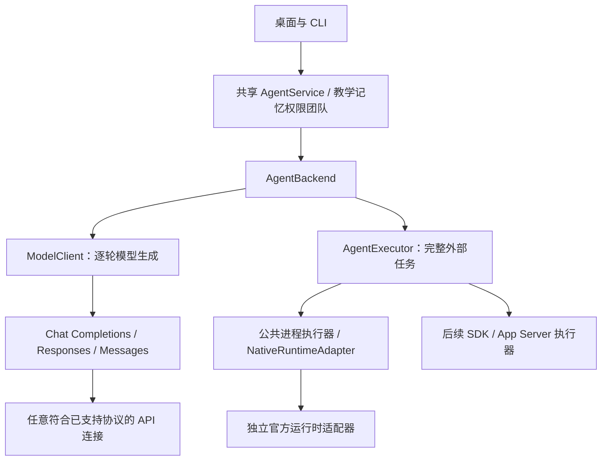

<!-- generated-by: gsd-doc-writer -->
# 可扩展模型接入架构

2026-09-11 用户确认：本轮目标是通用架构，并以 Codex 订阅、DeepSeek API、Kimi API 验证实际落地。其他七家保留目录、协议配置和适配扩展位置，不要求本轮逐家开通账号。十家调研是选型依据，不是框架允许接入的厂商白名单。

## 扩展边界

| 场景 | 扩展工作 | 保持稳定的部分 |
| --- | --- | --- |
| 新厂商使用已有 API 协议 | 设置中添加连接，填写地址、模型、Key 和能力；模板可选 | 会话、记忆、教学、工具、团队和预算 |
| 已有连接换用另一个模型 | 新建连接并声明实际能力，保留旧任务绑定 | 任务恢复和历史语义 |
| 出现新的模型请求协议 | 增加实现 ModelClient 的协议适配器、配置选项和协议测试 | AgentService、学习流程及团队编排 |
| 新官方 CLI / 订阅登录机制 | 增加 NativeRuntimeAdapter，在公共目录与适配器注册表注册，完成版本、认证、隔离和事件验收 | 公共进程取消、临时目录、输入输出边界、会话和团队 |
| SDK / App Server 的生命周期不同于 CLI | 实现 AgentExecutor，通过宿主的依赖注入及注册接入 | 共享 AgentBackend 与业务内核；不强行套用 CLI 参数 |

“通用”指业务内核与接入方式解耦，不能解释为任意网站会员都能免开发转换成 API。新增认证机制仍需要有官方依据的适配器及验证。接口声明兼容也不意味着某家全部模型、工具与套餐已经可用。

## 当前实现

- `src/agent-executor.ts` 定义 AgentBackend、AgentExecutor；`src/model.ts` 定义 ModelClient。主模型与成员通过共享身份绑定、上下文和预算调用，不为每家复制教学流程。
- `src/provider-catalog.ts` 只提供十家 API 连接模板和说明。自由连接 ID 来自公开配置，不要求厂商出现在目录中。API Key 继续通过 SecretStore 管理；公开配置不含密钥。
- `src/native-runtime-catalog.ts` 提供两端共用的原生目录、Provider 校验、名称和团队选择项。新增受支持厂商不需要在 CLI、桌面各维护一份名单。
- `src/native-runtime-contract.ts` 定义受信任进程内适配器契约，厂商负责模型身份、能力预检、官方认证与事件解码。`src/native-runtime-adapters.ts` 是集中注册位置；未实现条目明确不可用，不回退到其他厂商。
- `src/native-codex.ts`、`src/native-claude.ts` 封装厂商协议。`src/native-agent.ts` 只负责公共进程生命周期、环境白名单、临时指令文件、取消、输入输出上限及最终结果一致性，不再按厂商选择执行分支。
- 当前原生执行范围仍是提供上下文的文本任务。Codex 型号固定并支持团队；Claude 的既有单 Agent 适配保留；Gemini 是未启用扩展位置。原生工具、图片与其他生命周期能力需要独立扩展验收。
- 旧 DeepSeek、Kimi、Pi 和 codex-cli 标识、凭据引用与配置字段保留，避免重建用户连接。厂商专用设置页可随适配器能力扩展；本轮没有引入任意可执行插件加载或通用订阅凭证输入框。

## 不变约束

教学、记忆、权限和工具执行继续由知行管理。API 请求经 ToolHarness 执行获授权工具，外部 Agent 已执行的操作不得重复执行。官方订阅由官方运行时管理认证；订阅失败不静默消费 API。

能力来自显式配置与适配器声明，不能按品牌猜测。团队冻结具体模型及资源策略；已有任务恢复保留原绑定。用量未知不能计零，原生 token 预算不能冒充服务商硬限。

新适配器是经过代码审查的应用代码，不从用户 JSON、模型输出或远程任意地址加载执行。接入目录不是安全认证；每个官方协议仍负责其自身版本和隔离边界。厂商升级后须复验，不能删除已有边界以获得“兼容”。

## 本轮验收口径

1. 未在十家目录中的合成厂商，分别通过三种现有协议完成共享服务的连续对话及历史传递。
2. 注入新的合成原生适配器，公共执行器及 AgentService 无需新增厂商分支即可完成会话；输出越界、空答案、输出不一致、离线禁用和未实现适配器保持拒绝。
3. Codex / Claude 既有协议回归、实际进程取消、原生团队与 API 团队回归通过，已配置三家做适度真实复验。
4. 全量门禁、桌面实际包 UI 通过，命令和限制记录在[本轮验收](evidence/provider-architecture-20260911.md)。此前 20 次真实质量对照属于前一个构建，不自动视为本次重跑。

其他七家逐一接入、Claude 真实订阅、Gemini 执行器及 App Server 属于按需求启动的后续扩展，不再作为本轮交付阻塞。未来启用某项能力时仍须如实验证，不能把本次通用契约测试称为对应真实服务已打通。
