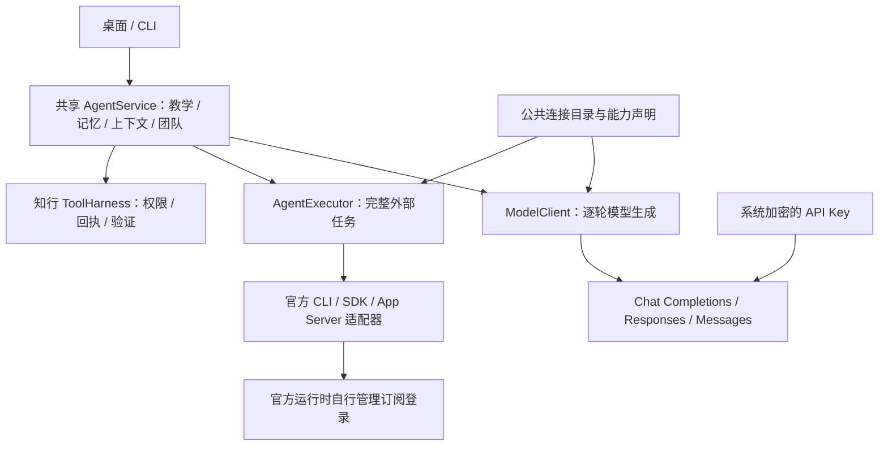

# 十家模型接入：调研与实施方案

> 2026-09-11 范围更新：用户明确要求通用架构，其他厂商保留后续扩展。本轮交付以公共接口、配置化接入、适配器隔离及 Codex / DeepSeek / Kimi 验证为准；Claude 实账号、Gemini 执行器和其余厂商实测不再是本轮阻塞。下文保留调研与历史实现边界；当前契约见[通用架构](provider-architecture.md)。

日期：2026-09-10。目标：知行的教学内核、记忆、工具权限和团队策略不依赖某一家模型；连接方式可替换，账号与计费边界明确。范围是文本、图片、工具续接及本机官方 Agent 接入，不包含语音、视频或训练服务。

## 官方接入调查

以下为按知行用户场景选取的十家服务商，不是市场份额排名。模型 ID、地域、套餐和接口成熟度会变化，以用户控制台及链接文档为准。

| 服务商 | 通用模型接口 | 订阅账号 / 套餐 | 知行的接入决定与官方依据 |
| --- | --- | --- | --- |
| OpenAI | API Key；Responses、Chat Completions | ChatGPT 登录用于官方 Codex；API 单独计费 | API 使用 Responses；订阅通过官方运行时，知行不读取 OAuth 凭证。[认证](https://learn.chatgpt.com/docs/auth)、[App Server](https://learn.chatgpt.com/docs/app-server)、[非交互 CLI](https://learn.chatgpt.com/docs/non-interactive-mode) |
| Anthropic | API Key；Messages | Claude Code 可由用户登录其订阅；不是普通 API Key | 实现原生 Messages。第三方产品可运行未修改的官方二进制，不代收订阅凭证；SDK 与订阅登录不能简单等同。[平台流式协议](https://platform.claude.com/docs/en/build-with-claude/streaming)、[集成条款](https://code.claude.com/docs/en/legal-and-compliance)、[CLI](https://code.claude.com/docs/en/cli-reference) |
| Google | Gemini API Key；原生 API、官方 OpenAI 兼容接口；另有 Vertex | Gemini CLI 支持 Google 登录及适用的 Google AI 订阅 | 先用官方兼容接口，保留工具思考签名。CLI 是独立 Agent 路由。[兼容接口](https://ai.google.dev/gemini-api/docs/openai)、[CLI 认证](https://geminicli.com/docs/get-started/authentication/) |
| DeepSeek | API Key；OpenAI / Anthropic 兼容接口 | 未找到向自建应用开放消费订阅登录的官方通用接口 | 普通 API；保留现有配置，不更换用户模型。[官方 API](https://api-docs.deepseek.com/) |
| 阿里 Qwen | 百炼 API Key；OpenAI 兼容接口，地域/工作空间决定地址 | Coding Plan 的 Key、端点和使用范围独立 | 普通 API 可用；Coding 套餐不默认用于知行教学后台/批量团队。[模型与地址](https://help.aliyun.com/zh/model-studio/models)、[套餐工具说明](https://help.aliyun.com/zh/model-studio/more-tools) |
| Moonshot Kimi | Moonshot 平台 Key；OpenAI 兼容接口 | Kimi Code 会员有独立 Coding Key / 端点；不是 Moonshot 按量 Key | 普通 API 作为预设；Coding 场景须按官方支持范围配置，不能伪装客户端绕过限制。[平台文档](https://platform.moonshot.cn/docs)、[Kimi Code](https://www.kimi.com/code/docs/en/) |
| 智谱 GLM | API Key；OpenAI 兼容接口 | Coding Plan 限定官方支持工具，非通用自建应用 API | 普通 API 可用；不将 Coding 套餐标为知行通用授权。[API](https://docs.bigmodel.cn/cn/api/introduction)、[订阅协议](https://docs.bigmodel.cn/cn/terms/subscription-agreement) |
| MiniMax | API Key；Anthropic / OpenAI 兼容接口 | Token Plan 使用独立 Subscription Key；官方提供直接调用示例 | 优先 Messages；套餐 Key 与按量 Key 各建连接，不自动互换。[Token Plan](https://platform.minimax.io/docs/token-plan/quickstart) |
| 字节豆包 | 火山方舟 API Key；Chat Completions、Responses | Coding Plan 有专用端点和模型范围 | 普通方舟 API；套餐须核对适用范围，不能认为豆包 App 会员即 API 权益。[方舟 API](https://www.volcengine.com/docs/82379/1494384) |
| 腾讯混元 | TokenHub API Key；Chat Completions 等 | 未确认消费端会员可供通用 API 使用 | 新连接使用 TokenHub，旧混元平台处于迁移期；不自动替换旧地址或 Key。[迁移指南](https://cloud.tencent.com/document/product/1823/131382) |

未找到某种官方授权方式，仅表示本次未确认，不能据此断言厂商永远不支持。浏览器 Cookie、逆向订阅端点、复制 Pi/OAuth token 均不作为产品接入方案。

## 长期架构

两种接口不能混用：外部 Agent 的工具事件可能已经执行，不能再交给 ToolHarness 执行一次。原生运行时有自己的循环、上下文及计量能力，必须单独描述。知行保留主记忆，原生线程仅为一次委派的工作上下文；未返回的用量不记作零，取消请求不冒充远端确认。订阅失败不得静默转为付费 API。

CLI 是多家官方本地 Agent 的可选集成基础，SDK 是实现便利层，App Server 是特定厂商的富交互传输；十家厂商并没有共同的订阅登录协议。Codex 官方文档同时描述了稳定 API 子集、需要显式开启的实验字段，以及 App Server 命令和 WebSocket 的实验性提示。因此应锁定已验收版本与方法，优先本机 stdio，不把整个协议视为跨厂商稳定承诺，也不能据此否定其桌面集成价值。[官方 App Server 文档](https://learn.chatgpt.com/docs/app-server)

知行选择长期稳定的**内部契约**，允许外部传输升级。新增同协议服务商走数据配置；新增协议或账号登录机制需要版本化适配器。API 和官方 Agent 都先经过同一个 AgentService 获取教学、记忆及有界历史；权限、回复格式检查与显示事件也由共享层处理。

## 接入配置与产品流程

以下根地址是模板默认值，应用自动追加最后一段方法路径。Qwen 的地域/工作空间、MiniMax 的站点，以及各平台开通的模型范围需由控制台确认。

| 模板 ID | 默认 API 根地址 | 应用追加的方法 |
| --- | --- | --- |
| `openai` | `https://api.openai.com/v1` | `/responses` |
| `anthropic` | `https://api.anthropic.com/v1` | `/messages` |
| `google` | `https://generativelanguage.googleapis.com/v1beta/openai` | `/chat/completions` |
| `deepseek` | `https://api.deepseek.com` | `/chat/completions` |
| `qwen` | 留空，从控制台复制 | `/chat/completions` |
| `kimi` | `https://api.moonshot.cn/v1` | `/chat/completions` |
| `glm` | `https://open.bigmodel.cn/api/paas/v4` | `/chat/completions` |
| `minimax` | `https://api.minimax.io/anthropic/v1` | `/messages` |
| `doubao` | `https://ark.cn-beijing.volces.com/api/v3` | `/chat/completions` |
| `hunyuan` | `https://tokenhub.tencentmaas.com/v1` | `/chat/completions` |

1. API 用户在设置中选择模板，填写控制台的模型 ID 和 Key，核对图片、工具及思考参数后保存。模型 ID 不预填，避免将不同型号的能力和价格混为一谈。可切换协议、修改新连接地址；已保存连接更换模型或协议时新建连接，保留旧任务身份。
2. Key 继续通过主进程的现有 SecretStore / 系统加密保存；设置返回的公开连接配置不含 Key。测试连接仅发送固定合成提示，不携带历史、画像或学习资料。成功表示这次文本请求连通，不自动认证图片、工具、套餐权益或回答质量。
3. 官方订阅由用户在相应官方客户端登录；知行只指定可执行程序并调用官方状态接口，不读取账号文件。桌面先检查程序能力，再选择已支持的单 Agent 通道。订阅失败显示具体原因，不自动消费另一条 API 连接。
4. CLI 使用同一目录和配置工厂：`模型服务商` → `模型连接模板 <id>` → `模型连接添加 <公开 JSON>`。Key 由已有隐藏输入保存；不要把 Key 放进命令参数或 JSON。原生通道状态用 `官方Agent状态` 查询。

SDK 可以替换适配器内部的 HTTP 实现，但本次没有为十家服务商分别引入 SDK 依赖：知行需要受控的请求取消、流式解析、工具续接和用量处理，三个协议适配器直接覆盖这些共同需求。厂商 SDK 的重试策略、私有错误对象和默认日志不能直接成为知行的产品策略。

## 核心模块与正确性约束

| 模块 | 本次实现 | 验收要求 |
| --- | --- | --- |
| 公共连接目录 | `src/provider-catalog.ts` | 十家模板、套餐说明、可编辑地址与模型；不含凭证 |
| API 工厂 | `src/agent-model-factory.ts` | 按协议选择 ModelClient；两端同一工厂，旧 ID/hash 不变 |
| 流式传输 | `src/provider-http.ts` | 取消等待中的读取；限制整段响应和单个 SSE 帧；拒绝截断和非法 JSON |
| 协议编解码 | `src/protocol-codecs.ts` | Responses 回传 encrypted reasoning 与 call_id；Messages 回传签名思考和 tool_use_id |
| 兼容接口 | `src/chat-completions-client.ts` | 保留 Gemini thought signature 和已返回的 reasoning_content；不转发任意扩展字段 |
| 独立 Agent 契约 | `src/agent-executor.ts` | 完整任务与逐轮模型调用分离；未知用量不能计零 |
| 官方进程 | `src/native-agent.ts` | 固定 argv、无 shell、环境白名单、进程组取消、订阅检查、禁止静默付费回退 |
| 共享会话 | `src/agent-service.ts`、`src/assistant-runtime.ts` | 相同历史与教学入口；回答检查最多一次修正，仍失败则阻断完成状态 |

工具只有在完整响应和整批调用校验成功后才进入知行 ToolHarness。重复 ID、缺失工具结果、跨连接或跨模型的续接状态均拒绝；提供商已经执行的原生工具不能再执行一次。传输失败不自动重试，避免不确定请求重复计费；已有团队重试仍走统一预算和任务身份规则。已知失败用量保留，未知用量保持未知。

单次 API 请求默认上限 150 秒；新协议响应限制为 8 MiB、单帧 256 KiB、可显示文本 64,000 字符。原生执行还有独立进程退出确认：停止请求发出后，确认本机进程退出才报告已取消；远端计费结束不能仅靠本机退出推断。原生上下文预算是输入裁剪策略，不是厂商内部多轮 Token 用量的硬上限。

## 原生订阅通道的实施边界

| 通道 | 本次状态 | 后续启用条件 |
| --- | --- | --- |
| Claude Code | 已实现共享单 Agent 执行、状态查询、程序位置设置和订阅检查；进程夹具与两端流程已验证 | 本机官方订阅登录、真实回答、真实运行时文件/工具限制及取消验收 |
| Codex | 已实现官方 CLI 订阅执行与固定模型；0.153.4 的真实订阅和隔离探针通过 | 新版本须复验权限与空工具请求；图片、原生工具及 App Server 流式生命周期仍是后续能力 |
| Gemini CLI | 已调查官方登录，保留不可用状态及原因；执行适配未实现 | 实现版本探测、政策/工具隔离和结构化事件适配，再做本机登录及真实验收 |
| 原生 Agent 团队 | 已按 AgentBackend 原生分支接入共享团队，固定模型、任务预算与 API 请求预算分别记账 | 本轮以 Codex / DeepSeek / Kimi 做真实对照，其他原生厂商按各自登录与模型固定能力验收 |

前一轮仅检查 `SandboxPolicy` 后，过早判断 Codex 0.153/0.154 无法限制读取。进一步检查确认官方另有 `default_permissions` 与 `permissions.<name>.filesystem` 权限配置。本机 0.153.4 的真实探针已通过限定目录读取、越界读取拒绝、符号链接绕过拒绝及禁止写入，实际模型请求也验证教学规则存在、工具列表为空。这里纠正先前结论，不把缺少某一旧字段当作缺少能力。[官方权限配置](https://learn.chatgpt.com/docs/permissions)

Codex 使用 `exec --ignore-user-config --ignore-rules --strict-config --ephemeral --json`，明确 `forced_login_method=chatgpt`，只允许官方 OpenAI 连接；禁用工具、MCP、插件、skills 搜索、hooks、浏览器、图片工具与原生多 Agent。权限配置仅允许平台最小读取和本次临时目录，禁止写入及工具网络。知行管理教学记忆与团队上下文。旧 `codex-cli` 仅作为此执行器的兼容路由，不再注册历史 ModelClient。

CLI 当前按完整消息输出，真实探针分别记录首次显示与进程收尾时间，不称为逐 token 流式延迟。外部任务必须固定模型才能进团队；统一预算分别计数 API 请求和官方任务。原生 token 上限是核算目标，不能替代硬性任务数、时限和可见字符限制。API 硬输出限制保持原有语义，未知用量不退还预留。新原生团队记录使用会话 v12，阻止旧客户端降级覆盖。

Claude 本次核对的官方版本为 2.1.267。只使用上下文回答：禁用内置工具、MCP、用户配置来源和插件扩展，系统指令放入权限受限的临时文件；认证交给官方客户端。官方运行时仍有自身政策和生命周期，因此过程结束和格式检查通过不构成回答正确性认证。当前未修改全局客户端或重新安装知行 App。

## 实际服务和质量验收方案

工程测试通过后，每条用户实际连接分别记录模型 ID、日期、成功率、首字耗时、总耗时、服务商用量、文本/图片/工具结果，敏感字段不进入证据。没有凭证的服务商标为未测；不能用一个兼容服务商的成功结果替其他九家背书。

真实质量验收复用既有单/同/异模型评测协议：同一组固定留出教学任务，同一输入和工具授权，记录模型及提示版本，采用独立盲评与可执行验证。比较完整且正确率、无依据陈述、任务完成率、延迟和用量；每个任务保留失败结果，不能仅统计成功回答。接入工程质量与教学效果分开验收，本轮连接和真实对照数据集中记录在[三家验收](evidence/provider-three-20260910.md)，小样本对照不能替代教学效果验证。

豆包文档在本次检索中发生官方域名跳转，正文抓取失败；根地址有官方搜索结果支持，仍须在真实接入时对照控制台再次核对。其余来源以本次打开的官方文档为依据；订阅套餐适用范围不外推到未列出的产品用途。

## 实施切片与验收

1. **公共目录与协议**：十家预设、自由模型 ID/地域地址，区分 API 与套餐；保留旧连接 ID、Key 引用、历史任务。新增 Messages、Responses 流式协议和正确工具续接，修复 Gemini 签名丢失。验收完整/截断/错误/取消/重复工具/上下文隔离/凭证重定向边界。
2. **桌面与 CLI**：同一目录、同一工厂。设置可选择服务商与协议，API Key 继续使用现有系统加密。CLI 能查询模板。预设不代表已登录或真实可用，不硬编码“最新最佳”模型；不更改已有模型和 Pi 默认值。
3. **原生 Agent 边界**：独立执行契约、受控官方进程适配、能力与状态；必须证明权限隔离后才暴露自动执行。不能用一个假 ModelClient 掩盖外部 Agent 循环。官方未提供可靠隔离或缺少本机运行时/登录时，明确显示不可用及原因，保留 API 路径。
4. **验证与交付**：定向协议/共享入口测试、完整 `npm run verify`、七组桌面 UI；新增真实调用仅发送固定合成提示，通过应用凭证接口，不读账号文件。按“工程验证 / 本机登录 / 真实服务 / 质量评测”分开记录。10 家真实通过必须有 10 家有效凭证，不能以协议夹具替代。

实施状态与命令结果另记 `docs/evidence/provider-integration-20260910.md`。该文档是方案，不是已完成声明。
